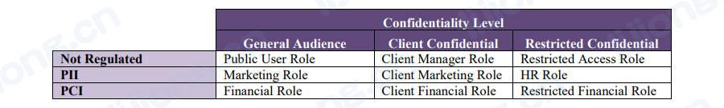
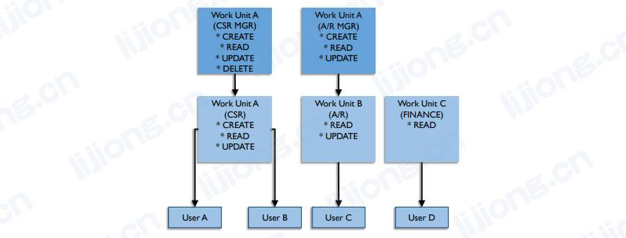

# **数据安全活动**

## 识别数据安全要求

### 业务要求（Business Requirements）

- 在企业内实施数据安全始于对业务需求的全面了解，企业的业务需求、使命、战略和规模，以及所属行业，决定了数据安全要求的严格程度（degree of rigidity）
- 通过分析业务规则和流程以确定安全触点，业务工作流中的每个事件都可能有自己的安全要求，数据到流程和数据到角色的关系矩阵是映射这些需求并指导数据安全角色组、参数和权限定义的有用工具，有计划地处理短期和长期目标，以实现均衡有效地数据安全功能

### 监管要求（Regulatory Requirements）

- 创建所有相关数据法规和受每项法规影响的数据主题域的中央清单（central inventory），添加为遵守这些法规而制定的相应安全策略的链接以及实施的控制，法规、政策、必要的行动和受影响的数据会随事件改变，因此该清单应采用易于管理和维护的格式

- 遵守公司策略或监管限制通常需要调整业务流程

## 确定数据安全策略（Define Data Security Policy)

- 组织应根据业务和监管要求制定数据安全策略，策略是对选定的行动方案的成熟和对实现一组目标所需行动的高级描述，数据安全策略描述了被确定为符合希望保护其数据的组织的最大利益的行为，为了使策略产生可衡量的影响，其必须是可审计和经过审计的
- 公司政策通常具有法律含义，法院可能会将为支持法律监管要求而制定的政策视为组织为遵守该法律要求所做努力的内在组成部分，不遵守公司政策可能会在数据泄露后产生法律后果

### 安全策略内容（Security Policy Contents）

- 需要不同级别的策略来管理与企业安全相关的行为
  - 企业安全策略（Enterprise Security Policy）
    - 员工访问设施和其他资产的全局策略、电子邮件标准和策略、基于职位或职务的安全访问级别、安全漏洞报告策略
  - IT安全策略（IT Security Policy）
    - 目录结构标准、密码策略、身份管理框架
  - 数据安全策略（Data Security Policy）
    - 单个应用程序、数据库角色、用户组和信息敏感度的类别

## 确定数据安全标准（Define Data Security Standards）

- 策略为行为提供指导，但其没有概述所有可能的意外情况，标准补充策略并提供有关如何满足策略意图的更多详细信息
  - 如策略可能规定密码必须符合强密码，强密码的标准将单独详细说明，如果密码不符合强密码，该策略将防止创建密码

### 确定数据机密级别（Define Data Confidentiality Levels）

- 机密性分类是一个重要的元数据特征，其指导用户如何被授予访问权限，每个组织都应创建或采用满足其业务需求的分类方案

### 确定数据监管类别（Define Data Regulatory Categories）

- 处理特定于数据的法规的以一种有效方法是分析类似法规并将其分组
- 分类工作的结果是一套正式批准的安全类别和监管类别，以及一个在中央清单中捕获此元数据的过程，以便业务和技术人员了解他们正在处理、传输和授权的信息的敏感性

### 确定安全角色（Define Security Roles）

- 可以根据需要在个人或组级别组织数据访问控制，角色组使安全管理员能够按角色定义权限，并通过在适当的角色组中注册用户来授予这些权限，进来将每个用户分配给一个角色组，否则可能会难以理解授予特定用户的权限
- 有两种定义和组织角色的方法：网格（从数据开始）和层级结构（从用户开始）

#### 角色分配网格（Role Assignment Grid）

- 网格可用于根据数据机密性、法规和用户功能映射数据访问角色，公共用户角色看访问针对一般受众的所有数据并且不受任何法规的约束，市场营销角色可以访问某些PII信息以开展活动，但不能访问任何受限数据或客户机密数据

#### 角色分配层级结构（Role Assignment Hierarchy）

- 在工作组或业务单位级别构建组定义，将这些角色组织成层级结构，以使子角色进一步限制父角色的权限，层级结构的持续维护是一项复杂的操作，需要深入到单个用户权限

### 评估当前安全风险（Assess Current Security Risks）

- 安全风险包括可能危害网络或数据库的元素，识别风险的第一步是识别敏感数据的存储位置，以及该数据需要哪些保护措施
- 对每个系统的评估内容
  - 存储和传输的数据的敏感性
  - 保护该数据的要求
  - 当前的安全保护措施
- 记录调查结果，其为未来的评估创建了基线，此文档也可能是隐私合规性的要求
- 较大的组织可能雇佣白帽黑客来评估漏洞，以此作为组织不可渗透的证明，可用于市场声誉的宣传

### 实施控制和程序（Implement Controls and Procedures）

- 组织必须实施适当的控制以满足安全策略要求，控制和程序应至少包括
  - 用户如何获得和市区对系统或应用程序的访问权限
  - 如何为用户分配角色和从角色中删除用户
  - 如何监控权限级别
  - 如何处理和监控访问更改请求
  - 如何根据机密性和适用法规对数据进行分类
  - 一旦检测到数据泄露如何处理

#### 分配机密级别（Assign Confidentiality Levels）

- 数据管理员负责根据组织的分类方案评估和确定适当的数据机密级别
- 文件和报告的分类应基于文件中发现的任何信息的最高机密级别，在页眉或页脚用分类标记每个页面或屏幕，分类为最不机密的信息产品不需要标签，假设任何未贴标签的产品都是面向普通受众的
- 文档作者和信息产品设计者负责评估、正确分类和标记每个文档以及每个数据库（包括关系表、列和视图）的适当机密级别
- 较大的组织中大部分安全分类和保护工作由专门的信息安全组织负责，数据库管理员通常负责执行和对网络进行物理保护

#### 分配监管类型（Assign Regulatory Categories）

- 组织应创建或采用分类方法以确保其能够满足法规遵从性的要求，这个分类方案为响应内部和外部审计提供了基础

#### 管理和维护数据安全（ Manage and Maintain Data Security）

- 对系统的持续监控和对安全程序执行的审查对于保护数据安全至关重要
- 控制数据可用性 / 以数据为中心的安全性（Control Data Availability / Data-centric Security）
  - 控制数据可用性需要管理用户权限和结构（数据屏蔽、视图创建等），这些结构在技术上基于权限控制访问
  - 安全合规经理可能直接负责设计用户授权配置文件，以确保业务顺利允许，同时遵守相关限制
  - 定义权限（defining entitlements）和授予权限（granting authorizations）需要数据清单、仔细分析数据需求以及记录每个用户权限中公开的数据，高度敏感的西悉尼通常与非敏感信息混合在一起，企业数据模型对于识别和定位敏感数据至关重要
  - 数据屏蔽可以保护数据，即使数据被无意中暴露，某些数据法规要求加密，即落地屏蔽的极端版，对解密密钥的授权可以是用户授权过程的一部分
  - 关系数据库视图可用于实施数据安全级别，视图可以根据数据值限制对某些行的访问或限制对某些列的访问，从而限制对机密或受监管字段的访问
- 监控用户身份验证和访问行为（Monitor User Authentication and Access Behavior）
  - 访问报告是合规审计的基本要求，监控身份验证和访问行为可提供有关谁在连接和访问信息资产的信息，监控还有助于检测需要调查的不寻常、不可预见或可疑的事务，通过这种方式弥补了数据安全规划、设计和实施方面的缺陷
  - 监控可以自动执行、手动执行或以自动化和监督组合的方式执行
  - 敏感和异常数据库事务的自动记录应该是任何数据库部署的一部分，缺乏自动监控会带来严重的风险：
    - 监管风险（Regulatory risk）
      - 数据库审计机制薄弱的组织会越来越多地发现其与政府监管要求的不一致
    - 检测和恢复风险（Detection and recovery risk）
      - 审计机制是最后一道防线，如果攻击者绕过其他防御措施，审计数据可以在事后识别违规行为的存在，审计数据还可用于将违规行为与特定用户联系起来，或作为修复系统的指南
    - 管理和审计职责风险（Administrative and audit duties risk）
      - 对数据库服务器具有管理访问权限的用户都可以关闭审计以隐藏欺诈活动（fraudulent activity），审计职责最好与数据库管理员和数据库服务器平台支持人员分开
    - 依赖不足的本机审计工具的风险（Risk of reliance on inadequate native audit tools）
      - 数据库软件平台通常会尝试集成基本的审计功能，但其往往存在多个限制或阻碍部署的弱点，当用户通过Web应用程序访问数据库时，本机审计机制无法识别特定用户身份，并且所有用户活动都与Web应用程序账号名称相关联，因此当本机审计日志显示欺诈性数据库事务时，指向不到责任用户
  - 为了降低风险可实施基于网络的审计设备，其可解决与本地审计工具相关的大部分弱点，但不会取代受过培训的审计员的定期审计，基于网络的审计设备的优点
    - 高性能（High performance）
      - 可以在线运行，对数据库性能的影响很小
    - 职责分离（Separation of duties）
      - 可以独立于数据库管理员运行，从而适当地将审计职责与管理职责分离
    - 精细事务跟踪支持高级欺诈检测、取证和恢复（Granular transaction tracking supports advanced fraud detection, forensics, and recovery）
      - 日志包括源应用程序名称、完整查询文本、查询响应属性、源操作系统、时间和源名称等详细信息

#### 管理安全策略合规性（Manage Security Policy Compliance）

- 管理监管合规性（Manage Regulatory Compliance）
  - 管理监管合规性的内容
    - 衡量授权标准和程序的合规性
    - 确保所有数据要求是可衡量、可审计的（如be careful则不可衡量）
    - 确保使用标准工具和流程保护存储和移动中的受监管数据
    - 在发现潜在的不合规问题以及违反法规时使用升级程序和通知机制
  - 合规控制需要审计跟踪，没有审计跟踪就没有合规性证据（如用户都接受了培训的证据），控制措施的设计应确保其时可审计的
- 审计数据安全和合规活动（Audit Data Security and Compliance Activities）
  - 应定期和一致地对活动进行内部审计以确保遵守数据安全和监管合规性政策，当新地数据法规颁布或现有法规发生变化时必须定期重新审视合规控制以确保效用，审计可以由内部或外部审计员执行，审计员必须独立于审计中涉及的数据或流程，以便面任何利益冲突并确保审计活动和结果的完整性
  - 审计的目标是为管理层和数据治理委员会提供客观公正的评估和合理实用的建议
  - 数据安全政策声明、标准文件、实施指南、变更请求、访问监控日志、报告输出和其他记录构成了审计的输入
  - 除了检查现有证据，审计还包括执行测试和检查
    - 分析政策和标准以确保合规控制得到明确定义并满足监管要求
    - 分析实施程序和用户授权做法以确保符合监管目标、政策、标准和预期结果
    - 评估授权标准和程序是否充足够并符合技术要求
    - 评估在发现潜在不合规问题或违法法规时执行的升级程序和通知机制
    - 审查外包和外部供应商的合同、数据共享协议和合规义务，以确保业务合作伙伴履行其业务，并确保组织履行其保护受监管数据的法律义务
    - 评估组内安全实践的成熟度，并向高级管理层和其他利益相关者报告监管合规性状态
    - 建议监管合规性政策变更和运营合规性改进
  - 审计数据安全不能代替数据安全管理，这是一个客观评估管理是否达到目标的支持过程