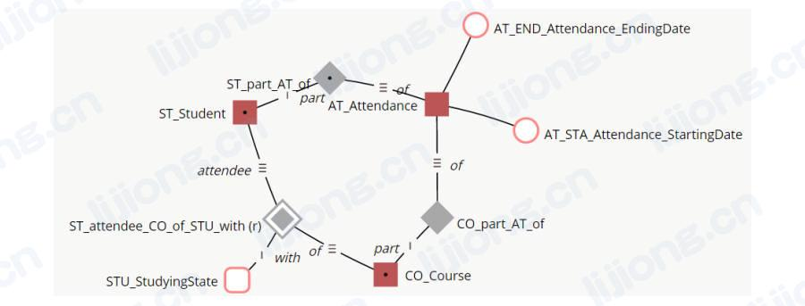

# **数据建模方案**

Data Modeling Schemes

## 建模方案与数据库

- 方案的使用取决于正在构建的数据库，因为某些方案适用于特定技术
  - 关系型方案或基于事实方案可以为RDBMS构建所有三个层次的模型，但只能为其他类型的数据库构建概念和逻辑模型
  - 维度方案可以为RDBMS和MDBMS构建所有三个层次的模型
  - 面向对象方案可以为RDBMS和对象数据库构建所有三个层次的模型
  - 基于时间方案是一种物理数据建模技术，主要用于RDBMS环境中的数据仓库
  - 非关系型方案严重依赖底层数据库结构（文档、列、图或键值），是一种物理数据建模技术
- 即时使用非传统数据库（如基于文档的数据库）也可以构建关系概念模型和逻辑模型，然后构建文档物理模型

## 关系型（Relational）

- 关系理论由Edward Codd于1970年提出，其观点是可以根据二维关系最有效地管理数据，提供了一种系统的方法来组织数据，以便体现其意义，这种方法有减少数据存储冗余（redundancy）的额外效果
- 关系模型的设计目标是对业务数据有一个准确的表达，并且在一个位置有一个事实（去除冗余）
- 关系模型适合操作性系统的设计，其需要快速输入信息并准确存储信息
- 关系型方案表示法
  - 信息工程（Information Engineering (IE)）
  - 信息建模集成定义（Integration Definition for Information Modeling (IDEF1X)）
  - 巴克表示法（Barker Notation）
  - 陈氏表示法（Chen）
- 最常用的是IE表示法，使用三叉戟（tridents）来表示基数

## 维度（Dimensional）

- 维度建模概念始于General Mills和Dartmouth College在20世纪60年代开展的一项联合研究项目
- 在维度模型中，数据被结构化以优化大量数据的查询和分析，相对的，支持事物处理的操作型系统优化了针对单个事务的快速处理
- 维度数据模型捕获专注于特定业务过程的业务问题，如使用维度模型分析录取（admission）情况，可以通过学生所在区域、学校名称、学期以及学生是否正在接受经济援助来查看录取情况，导航可以从区域到地区到国家，从学期到年，从学校名称到学校级别

- 轴表示法（axis notation）是一种无需阅读传统数据建模表示法的非常有效的交流工具
- 关系模型和维度模型都可基于同样的业务流程，不同之处在于关系的含义，关系模型中关系线捕获业务规则，维度模型中关系线捕获回答业务问题所需的导航路径（navigation paths）

### 事实表（Fact Tables）

- 事实表的行对应特定的测量值，测量值可能是算法（algorithms）的结果，此时元数据对于正确理解和使用至关重要
- 事实表在数据库占最多的空间（90%左右），并且有大量的行

### 维度表（Dimension Tables）

- 维度表表示业务的重要对象，主要是文本描述，通过作为事实表的入库点或链接（），维度作为查询依据或报告依据的主要来源
- 维度通常高度非规范化（denormalized），占总数据的10%左右
- 维度的每一行都必须有位移标识，识别维表键的两种主要方法是代理键和自然键
- 维度还有以不同速率变化的属性，缓慢变化维（slowly changing dimensions (SCDs)）根据变化的速率和类型来管理变化
- 三种主要的变化类型（ORC）
  - 覆盖（Overwrite）：新值覆盖旧值
  - 新行（New Row）：新值写入新行，旧行被标记为非当前行
  - 新列（New Column）：一个值的多个实例列在同一行的不同列中，而一个新值意味着将系列中的值向下一点写入，以便在前面为新值留出空间，最后一个值被丢弃

### 雪花模型（Snowflaking）

- 雪花模型是将星形模型中的平面、单表、维度结构规范化为相应组件的层次结构或网络结构（hierarchical or network structures）

### 粒度（Grain）

- 粒度表示事实表中单行数据的含义或描述，是行的最详细信息，确定事实表的粒度是维度设计的关键步骤之一，如分析学生注册过程的维度模型的粒度可能是学生、天数和班级

### 一致性维度（Conformed Dimensions）

- 一致性维度基于整个组织构建，而不是特定的项目，这些维度具有一致的术语和值，可以跨维度模型共享
- 如Calendar是一致性维度，则为按学期计算学生申请人数而构建的维度模型将包含与为计算毕业生人数而构建的维度模型相同的学期（Semester）的值和定义

### 一致性事实（Conformed Facts）

- 一致性事实使用跨各个集市（marts）的标准化数据定义，不同业务用户可能以不同的方式使用相同的术语
- 开发人员需要敏锐地察觉命名相同但实际表示不同概念的事物，或命名不同但实际表示相同概念的事物

## 面向对象（Object-Oriented）

- 统一建模语言（Unified Modeling Language (UML)）是一种用于建模软件的图形语言，UML有多种表示法，其中类模型（the class model）涉及数据库，UML类模型指定类（实体类型）及其关系类型
- UML类模型的特征
  - 类图类似ER图，ER图中没有操作或方法（Operations or Methods）
  - 在ER图中，最接近操作的是存储过程（Stored Procedures）
  - 属性类型（如Data、Minutes）以应用程序代码语言表示，而不是物理数据库术语
  - 默认值可以选择性地（optionally）显示在符号中
  - 通过类的公开接口（exposed interface）访问数据 ，类及其维护的实例通过操作公开

- 类有操作或方法（也被称为行为），类行为只是松散地（loosely）连接到业务逻辑，因为其需要排序和定时（sequenced and timed），在ER术语中，表有存储过程/触发器（stored procedures/triggers.）
- 类操作的分类
  - 公开（Public）：外部可见
  - 内部可见（Internally Visible）：对子对象可见
  - 私有（Private）：隐藏
- ER物理模型只提供公共访问，所有数据同样公开于过程、查询或操作

## 基于事实建模（FBM，Fact-Based Modeling）

- 基于事实建模属于概念建模语言，起源于20世纪70年代后期，这些语言基于对业务领域中可能出现的自然语言表达（natural verbalization）的分析
- 基于事实语言根据对象、与对象相关或表示对象特征的事实以及每个对象在每个事实中扮演的每个角色看待世界，一个广泛而强大的（extensive and powerful）约束系统依赖于流畅的自动语言表达和对具体示例的自动检查
- 基于事实的模型不适用属性，通过表达对象（实体和值）之间的确切关系减少对直觉或专家判断（intuitive or expert judgment）的需要
- 使用最广泛的基于事实建模的变体（variant）是对象角色建模（ORM，Object Role Modeling），在1989年由Terry Halpin形式化为一阶逻辑（first-order logic）

### 对象角色建模（Object Role Modeling (ORM or ORM2)）

- 对象角色建模是一种模型驱动的工程方法，以用户熟悉的任何外部表达方法（formulation）呈现的所需信息或查询的典型示例开始，然后在概念层面上用受控自然语言（controlled natural language）表达的简单事实来描述这些示例，受控自然语言是自然语言的限制版本（restricted version），没有歧义（unambiguous）所以语义容易被掌握，形式化（formal）所以可用于自动将结构映射到较低层级以供实施

### 完全面向沟通建模（Fully Communication Oriented Modeling (FCO-IM)）

- 完全面向沟通建模在符号和方法上与对象角色建模相似
- 如数字是对事实的语言表达，2可能指多种语言表达（”学生1234的名字是Aang“）

## 基于时间（Time-Based）

- 基于时间模式可用于必须按时间顺序（chronological order）或与特定时间值相关联时

### 数据保险库（Data Vault）

- Data vault modeling is a database modeling method that is designed to provide long-term historical storage of data coming in from multiple operational systems.

- 数据保险库是一组面向细节、基于时间、唯一链接的规范化表，支持一个或多个业务功能域，是一种混合方法（hybrid approach），综合了第三范式和星形模型的优点，专为满足企业数据仓库的需求而设计
- 数据保险库包括三种类型的实体：枢纽（hubs）、连接（links）和卫星（satellites），模型的设计侧重于业务的功能区域，枢纽表示主键，链路提供了枢纽之间的事物集成，卫星提供了枢纽主键的上下文
- 如学生和课程是枢纽，代表一个主题中的主要概念，考勤是一个连接，将两个枢纽联系起来，学生联系方式、学生特征和课程描述是卫星，提供有关枢纽概念的描述性信息，并且支持不同类型的历史记录

### 锚建模（Anchor Modeling）

- 锚建模适用于信息的结构和内容随时间变化的情况，其提供了类似于传统数据建模中概念建模的图形符号，并扩展了处理时间相关数据（temporal data）的功能
- 锚建模的四个基本建模概念：锚（anchors）、属性（attributes）、锚链（ties）、结（knots），锚表示实体和事件，属性表示锚的特性，锚链表示锚之间的关系，结表示共享的特性（如状态）
- 如学生、课程和考试是锚，灰色菱形表示锚链，圆圈表示属性

## 非关系型（NoSQL）

- 非关系型不是关于如何查询数据库，而是更多关于如何存储数据

### 文档（Document）

- 文档数据库不是采用业务主题并将其分解为多个关系结构，而是将业务主题存储在一个称为文档的结构中
- 如不是将学生、课程和注册信息存储在三个不同的关系结构中，而是将这个三个的属性存储在一个名为Registration的文档中

### 键值（Key-value）

- 键值数据库允许应用程序仅将数据存储在两列（key和value），特点是value可以存储简单信息（如日期、数字、编码）和复杂信息（未格式化的文本、视频、音乐、文档、照片）

### 面向列（Column-oriented）

- 面向列数据库和RDBMS都以类似的方式将数据视为行和值，RDBMS使用预定义的结构和简单的数据类型（如金额和日期），而面向列数据库（如Cassandra）可以使用复杂的数据类型（如未格式化的文本和图像），面向列数据库将每一列存储在其自身的结构中

### 图（Graph）

- 图数据库是为关系被很好地表示为一组节点的数据而设计的，并且节点间的连接数量是不确定的
- 图数据库最适合的示例是社会关系（节点是人）、公共交通路线（节点是公共汽车站或火车站）或路线图（节点是路口或高速出口），需求通常是最短路线、最近节点等
- 图数据库包括Neo4j、Allegro和Virtuoso