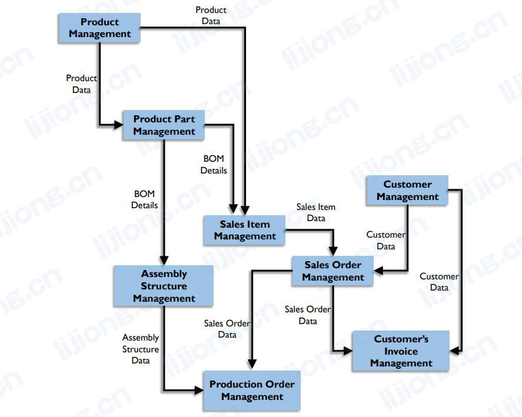

# **数据架构活动**

- 数据和企业架构处理问题的角度
  - 面向质量（Quality-oriented）
    - 专注于在业务和IT开发周期内对架构的改进
    - 如果架构未得到管理，架构质量将下降，系统将逐渐变得更加复杂和难以更改（complex and inflexible），从而为组织带来风险
  - 面向创新（Innovation-oriented）
    - 专注于业务和IT转型，以解决新的期望和机遇（address new expectations and opportunities）

## 建立数据架构实践（Establish Data Architecture Practice）

- 框架帮助阐明数据架构的目标和驱动元素，驱动元素将影响路线图上的方法、范围和优先级，框架中的观点和分类（views and taxonomy）必须有助于与各个利益相关者沟通，因为涉及业务和系统术语
- 企业数据架构实践的工作
  - 战略（Strategy）
    - 选择框架、说明方法、制定路线图
  - 接受和文化（Acceptance and culture）
    - 告知和激励行为改变
  - 组织（Organization）
    - 通过分配责任和职责（accountabilities and responsibilities）来组织数据架构工作
  - 工作方法（Working methods）
    - 与企业架构协调，确定最佳实践并在开发项目中进行数据架构工作
  - 结果（Results）
    - 在总体路线图中生成数据架构工件
- 企业数据架构对项目和系统发布（projects and system releases）范围边界（scope boundaries）的影响
  - 确定项目数据需求（Defining project data requirements）
    - 数据架构师为各个项目提供企业数据需求
  - 审查项目数据设计（Reviewing project data designs）
    - 设计审查确保概念、逻辑和物理数据模型与架构保持一致并支持组织的长期战略
  - 确定数据血缘影响（Determining data lineage impact）
    - 确保数据流中的业务规则一致和可追溯（consistent and traceable）
  - 数据复制控制（Data replication control）
    - 复制可能造成数据不一致，数据架构治理确保有足够的复制控制（方法和机制）以满足所需的一致性
  - 执行数据架构标准（Enforcing Data Architecture standards）
    - 为企业数据架构生命周期制定和执行标准，标准可以表示为原则和流程、指南、满足合规期望的蓝图
  - 指导数据技术和更新决策（Guide data technology and renewal decisions）
    - 数据架构师与企业叫故事合作，管理每个应用程序使用的数据技术版本、补丁和策略（versions, patches, and policies），作为数据技术的路线图

### 评估现有数据架构规范（Evaluate Existing Data Architecture Specifications）

- 识别现有系统的文档并评估其准确性、完整性和详细程度（accuracy, completeness, and level of detail），如有必须需进行更新以翻译当前状态

### 制定路线图（Develop a Roadmap）

- 企业数据架构路线图描述了3-5年的架构发展路线
- 路线图可以帮助组织权衡取舍（trade-offs）并制定务实的计划，使之与业务需求和计划、外部要求和可用资源保持一致
- 连同业务需求、实际情况的考虑和技术评估，路线图描述了目标架构将如何变为现实
- 企业数据架构路线图必须整合到整体企业架构路线图中，包括高级里程碑、所需资源和成本估算，并划分为业务能力工作流（business capability work streams），路线图应以数据管理成熟度评估为指导
- 大多数业务能力（business capabilities）需要数据作为输入，可以通过解决（resolve）业务能力依赖链中的数据流，连贯地（coherently）形成企业架构和企业数据架构
- 业务数据驱动的路线图从最独立的业务能力开始（即对其他活动的依赖性最低），并以最依赖其他活动的业务能力结束，按顺序处理每个业务能力将遵循一个整体业务数据来源顺序（即从上到下逐步解决每个依赖）
  - 依赖少的位于顶部
  - 没有依赖的构成主数据
  - 依赖多的位于底部

### 管理项目中的企业需求（ Manage Enterprise Requirements within Projects）

- 描述组织数据架构的数据模型和其他规范必须足够灵活（flexible）以容纳（accommodate）未来的需求，架构级别的数据模型应具有企业的全局视图以及整个组织都可以理解的清晰定义
- 开发项目根据企业数据架构建立的业务需求和标准来实施数据获取、存储和分发的解决方案，这个过程是逐步完成的
  - Development projects implement solutions for capturing, storing, and distributing data based on business requirements and the standards established by the Enterprise Data Architecture.
- 项目级别上，通过数据模型指定需求的过程从审查业务需求开始，通常这些需求特定于项目目标并且不会对企业产生影响，该过程仍应包括确定术语定义和支持数据使用的其他活动
- 数据架构师在项目规范完成时负责确认的内容
  - 规范中的企业级标准是否符合商定的标准
  - 需求规范中的哪些实体应包括在整体企业数据架构中
  - 本规范中的实体和定义是否需要推广（generalize）或改进以应对未来的趋势
  - 是否指出了新的数据交付架构或是否为开发人员指出了重用的方向（direction of reuse）
- 企业数据架构项目相关的活动
  - 定义范围（Define scope）
    - 确保范围和接口与企业数据模型保持一致，了解项目对整体企业数据架构的潜在贡献，包括将建模和设计的内容以及应该或可以重用的现有组件
      - 对应设计的内容，项目需确定与项目范围之外的利益相关者的依赖关系，如下游过程
      - 对可共享或可重用的（shareable or reusable）数据工件，应合并到企业逻辑数据模型和指定的存储库
  - 理解业务需求（Understand business requirements）
    - 捕获与数据相关的需求，如实体、来源、可用性、质量和痛点，并评估满足这些需求的业务价值
  - 设计（Design）
    - 形成详细的目标规范，包括生命周期角度的业务规则
    - 验证结果，并在需要时解决对扩展和改进标准化模型的需求
    - 项目数据架构师可通过企业逻辑数据模型和企业架构存储库查看和重用可共享的构造（constructs）
    - 审查和使用数据技术标准
  - 实施（Implement）
    - 购买时，对购买的应用程序（商业现货，COTS，Commercial Off the Shelf）进行逆向工程并对数据结构进行映射，识别并记录结构、定义和规则中的差距和差异，理想情况下供应商将为他们的产品提供数据模型
    - 重用数据时，将应用程序数据模型映射到通用数据结构以及现有的和新的流程以了解CRUD操作，强制使用记录系统或其他权威数据，识别并记录差距
    - 构建时，根据数据结构实现数据存储，根据标准规范或设计规范（standardized or designed specifications）进行集成
- 不同开发方法中将架构活动构建到项目中的过程
  - 瀑布型（Waterfall）
    - 作为整体企业设计的一部分，了解需求并按顺序阶段构建系统，这种方法包括控制变革的关卡（tollgates），需确保包含企业视角
  - 增量型（Incremental）
    - 逐步学习和构建，这种方法根据模糊的（vague）总体需求创建原型（prototype），启动阶段至关重要，最好在早期迭代中创建全面的数据设计
  - 敏捷型、迭代型（Agile, Iterative）
    - 通过离散的交付包（discrete delivery packages，即sprints）进行学习、构建和测试，按照数据模型、数据捕获、数据存储和数据分发的规范来完成

## 整合企业架构（Integrate with Enterprise Architecture）

- 数据架构可能影响项目的范围，因此最好将企业数据架构问题与项目组合管理（project portfolio management）相结合，以便实施路线图并取得更好地项目成果
- 企业数据架构师需要参与企业应用程序开发和集成规划，将数据架构视图应用于目标应用程序场景（landscape）和该场景的路线图

