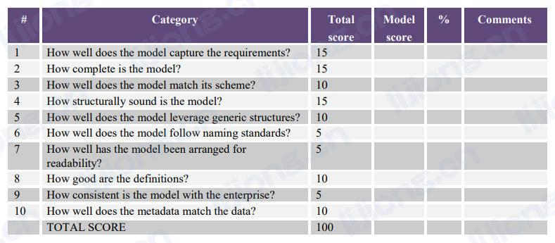

# 数据模型治理

## 数据模型和设计质量管理（Data Model and Design Quality Management）

- 数据分析师和设计人员是信息消费者（对数据有业务需求的人）和以可用形式捕获数据的数据生产者之间的中间人（intermediaries），数据专业人员必须平衡信息消费者的数据需求和数据生成者的应用程序需求
- 数据模型和数据库设计还必须在企业的短期需求和长期需求之间进行合理的平衡，
  - 信息消费者需要及时的数据来利用当前的业务机会，系统开发项目团队必须满足时间和预算限制
  - 同时需要确保组织的数据处于（reside）安全、可恢复、可共享、可重用（secure, recoverable, sharable, reusable）的数据结构中，并确保该数据尽可能正确、及时、相关、可用（correct, timely, relevant, usable），以满足所有利益相关者的长期利益

### 制定数据建模和设计标准（Develop Data Modeling and Design Standards）

- 数据建模和数据库设计标准的内容
  - 标准数据建模和数据库设计可交付成果的列表和描述
  - 适用于所有数据模型对象的标准名称列表、可接受的缩写和不常用词的缩写规则
  - 所有数据模型对象的标准命名格式列表，包括属性和列类词（attribute and column class words）
  - 用于创建和维护这些可交付成果的标准方法的列表和描述
  - 进行数据建模和数据库设计的角色及职责的列表和描述
  - 在数据建模和数据库设计中捕获的所有元数据属性的列表和描述，包括业务元数据和技术元数据，如指南中可以设置数据模型捕获每个属性的血缘的期望
  - 元数据质量的期望和要求
  - 关于如何使用数据建模工具的指南
  - 准备和领导设计评审的指南
  - 数据模型版本控制的指南
  - 不鼓励的做法

### 评审数据模型和数据库设计质量（Review Data Model and Database Design Quality）

- 项目团队应对概念数据模型、逻辑数据模型和物理数据库设计进行需求评审和设计评审
- 评审会议的议程（agenda）应包括评审起始模型（如果有）、对模型所做的更改以及考虑和拒绝的任何其他选项、新模型与任何现有建模或架构标准的符合程度
- 与代表不同背景、技能、期望和意见的一组主题专家一起进行设计评审，参与者的共同目标是推广最实用、最佳性能和最可用的设计，必须能够讨论不同的观点并在没有个人冲突的情况下达成共识，主持者创建并遵循议程，确保所需文件可用并分发，征求（solicit）所有参与者的意见，总结（summarize）小组的共识结果（consensus findings），有时还安排抄写员（scribe）来捕获讨论要点
- 若评审未通过，建模人员必须进行修改以解决问题，如果建模人员无法靠自身解决问题，应由模型所反映的系统拥有者决定

### 管理数据模型版本控制和整合（Manage Data Model Versioning and Integration）

- 数据模型需要谨慎的变更控制，记录对数据模型的每次更改，以保留随时间变化的血缘，如果更改影响逻辑数据模型，如新的或更改的业务数据需求，数据分析师或架构师必须审查并批准对模型的更改
- 每个更改需要记录的内容
  - Why：为什么项目或情况需要更改
  - What：对象更改了什么以及如何更改的，包括哪个表对列进行了添加、修改或删除等
  - When：何时批准更改以及何时对模型进行更改（不一定是何时在系统中实施更改）
  - Who：谁进行的更改
  - Where：在何处进行了更改（在哪些模型中）
- 一些数据建模工具包括提供数据模型版本控制和整合的存储库，否则将数据模型保存至DDL导出或XML文件中，通过源代码管理系统进行管理

## 数据建模指标（Data Modeling Metrics）

- 通过数据模型记分卡衡量数据模型质量

### 模型捕获需求的效果如何（How well does the model capture the requirements?）

- 确保模型代表需求
  - 如果由捕获订单信息的需求，则检查模型以确保其捕获订单信息
  - 如果需要按学期和专业查看学生人数，则检查模型以确保其支持此查询

### 模型的完整性如何（How complete is the model? ）

- 完整性指需求的完整性和元数据的完整性
  - 需求的完整性：已请求的每个需求都出现在模型中，数据模型只包含请求的内容，没有任何额外内容
  - 元数据的完整性：包括围绕模型的所有描述性信息，如物理数据模型的格式和可空性

### 模型和其模式的匹配程度如何（How well does the model match its scheme?）

- 确保模型的详细级别（概念、逻辑或物理）和模式（如关系型、维度、非关系型）与此类型模型的定义相匹配

### 模型在结构上的合理性如何（How structurally sound is the model?）

- 验证用于构建模型的设计做法，以确保最终可以根据数据模型构建数据库，包括避免设计问题，如同一实体中有两个同名属性或在主键中有空属性

### 模型可被利用于通用结构的程度如何（How well does the model leverage generic structures?）

- 确认抽象的适当使用（confirm an appropriate use of abstraction），如从客户位置到更通用的位置，可让设计更容易地处理其他类型的位置（如仓库和配送中心）

### 模型遵循命名标准的程度如何（How well does the model follow naming standards?）

- 确保正确且一致的命名标准已应用于数据模型，关注命名标准的结构、术语和样式
  - 结构：正确的构建块被用于实体、关系和属性，如属性的构建块是属性的主题，如Customer或Product
  - 术语：属性和实体被赋予了正确的（proper）名称，包括正确的拼写和缩写
  - 样式：外观与标准做法一致，如大写或驼峰式

### 模型排列的可读性如何（How well has the model been arranged for readability?）

- 确保数据模型易于阅读，此问题不重要但可能导致无法准确解决记分卡上更重要的问题，将父实体置于其子实体之上、将相关实体显示在一起并最小化关系线长度等可以提供模型的可读性

### 定义有多好（How good are the definitions?）

- 确保定义清晰、完整和准确

### 模型与企业的一致性如何（How consistent is the model with the enterprise?）

- 确保出现在数据模型中的结构在术语和用法上与出现在相关数据模型中的结构一致，最好与企业数据模型一致

### 元数据与数据的匹配程度如何（How well does the Metadata match the data?）

- 确认模型和将存储在结果结构中的实际数据是一致的，如Customer_Last_Name列是否针对包含客户姓氏，数据类型（data category）旨在减少这些以外并帮助确保模型上的结构与这些结构将包含的数据相匹配