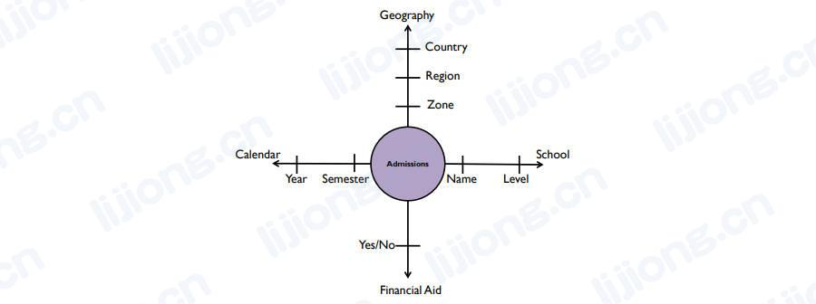
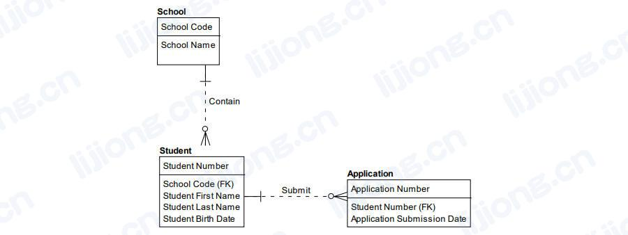
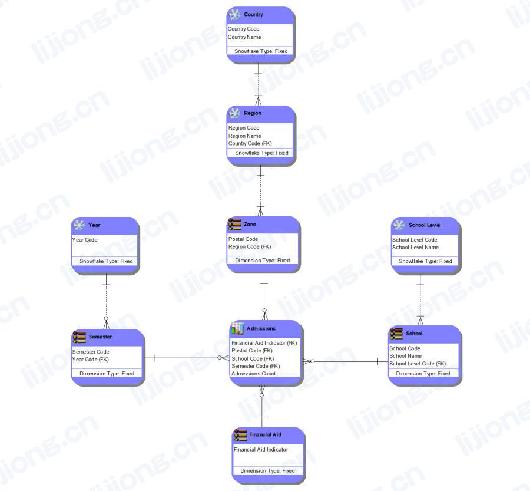
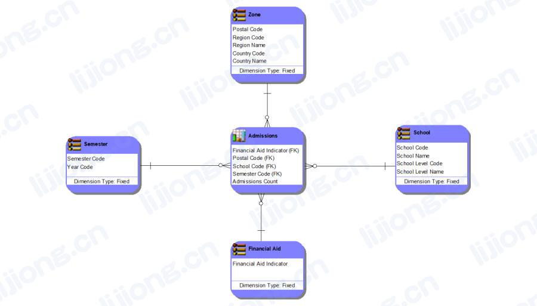

# **数据模型详细级别**

Data Model Levels of Detail

- 概念数据建模和逻辑数据建模是需求规划和分析活动，物理数据建模是设计活动

## 概念数据模型

- 概念数据模型（conceptual data model）将高层级数据需求捕获为相关概念的集合，其仅包括给定领域和功能内基本的、关键的业务实体，以及每个实体的描述及实体间的关系
- 基于IE表示法的关系概念模型
  - 每个学校可包含一个或多个学校，每个学生必须来自一所学校
  - 每个学生可提交一份或多份申请，每个申请必须来自一个学生
  - 关系线捕获关系数据模型上的业务规则，如学生申请特定大学时不能同时就读其他学校，申请必须由一个学生提交，而不是两个或零个

- 基于轴表示法的维度概念模型

## 逻辑数据模型

- 逻辑数据模型（logical data model）是数据需求的详细表示，通常支持具体用法环境（usage context），如应用程序需求，逻辑数据模型仍独立于任何技术或具体的实现约束，逻辑数据模型通常由概念数据模型扩展而来
- 在关系逻辑模型中，通过添加属性来扩展概念数据模型，通过应用规范化技术将属性分配给实体，每个属性与其所在实体的主键存在非常紧密的关系
  - 如学校名称与学校代码有紧密关系，每个学校代码最多对应一个学校名称

- 维度数据模型是维度概念模型的全属性透视（fully-attributed perspective），逻辑关系模型捕获业务过程的业务规则，逻辑维度模型捕获业务问题以确定业务过程的健康和性能
  - 如录取数量回答与录取相关的业务问题，录取周围的实体提供了查看不同粒度级别的录取数量的视角，如按学期和年

## 物理数据模型

- 物理数据模型（physical data model）表示详细的技术解决方案，通常以逻辑数据模型为起点进行调整，以在一组硬件、软件和网络工具中工作
- 物理数据模型是为特定技术构建的，如RDBMS在设计是应考虑到数据管理系统的特定能力
  - 如学校已被非规范化到学生实体以适应特定技术，当访问学生时其学校信息也被同时访问，将学校信息与学生一起存储比使用两个单独的结构更高效

- 由于物理数据模型容纳（accommodate）技术限制（technology limitations），其结构经常组合（反规范化）以提高检索性能（retrieval performance）
  - 维度物理模型通常是星型模式，意味着每个维度都有一个结构（维度被折叠），与关系物理模型类似，此结构已从其逻辑对应物（counterpart）调整为适应特定技术，以确保业务问题得到简单、快速地回答

### 典范（Canonical）

- 典范模型是物理模型的一个变体，用于在系统之间移动的数据，该模型描述了在系统间作为数据包或消息传递的数据结构
- 通过Web服务、企业服务总线（ESB，Enterprise Service Bus）或企业应用程序集成（EAI，Enterprise Application Integration）发送数据时，典范模型描述了发送服务和任何接收服务应使用的数据结构，这些结构应设计得尽可能通用以实现重用和简化接口需求
- 此结构只能在中间消息系统（intermediary messaging system）即中间件（middleware）上实例化为缓冲区或队列结构以临时保存消息内容

### 视图（Views）

- 视图是一个虚拟表，视图提供了一种方法来查看来自一个或多个包含或引用实际属性的表的数据
- 标准视图运行SQL以在请求视图中的属性时检索数据，实例化（instantiated）即物化（materialized）视图在预定（predetermined）时间运行
- 视图用于简单查询、控制数据访问和重命名列，而不会因非规范化而导致冗余（redundancy）和参照完整性（referential integrity）丢失

### 分区（Partitioning）

- 分区是拆分表的过程，其目的是促进归档和提高检索性能，分区可以是垂直的或水平的
- 垂直拆分（Vertically split）
  - 创建包含列子集的子表来减少查询集，如根据字段一般是静态的还是易变的（为了提高加载/索引性能）或根据字段是否经常被包含在查询中（以提高表扫描性能）将客户表一分为二
- 水平拆分（Horizontally split）
  - 以列值作为区分符号（differentiator）创建子表来减少查询集，如创建仅包含特定区域客户的区域客户表

### 反规范化（Denormalization）

- 反规范化是将规范化的逻辑数据模型实体转换为有冗余或重复数据结构的物理表，即反规范化是有意将一个属性置于多个位置
- 反规范化可用于提升性能
  - 预先组合来自多个其他表的数据以避免高代价的运行时连接
  - 创建较小的、预过滤的数据副本以减少高代价的运行时计算和/或大型表的扫描
  - 预先计算和存储高代价的数据计算以避免运行时系统资源竞争
- 反规范化还可用于根据需要将数据隔离（segregate）到多个视图或副本中以加强用户安全
- 反规范化会引入因重复而导致数据错误的风险，因此经常在视图和分区等结构在产生有效的物理设计方面存在不足时被选择，比较好的做法是进行数据质量检查以确保属性的副本已被正确存储，通常反规范化只是为了提高数据库查询性能或促进用户安全的实现
- 反规范化不仅适用于关系数据模型，如可以在文档数据库中进行反规范化，此时名称不同，比如嵌入（embedding），在维度数据模型中，反规范化被称为折叠（collapsing）或组合（combining），如果每个维度都折叠为一个结构，则生成的数据模型称为星型模式（Star Schema），如果维度未被折叠，则生成的数据模型称为雪花（Snowflake）