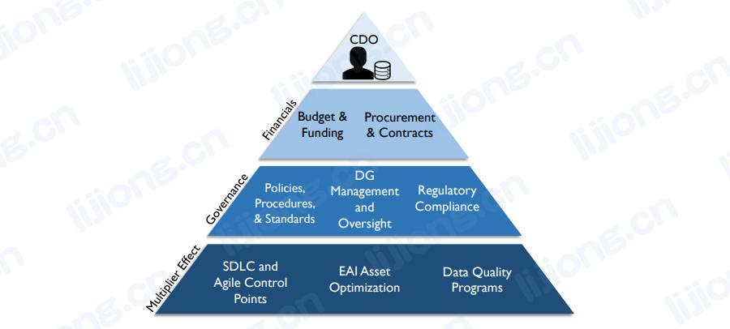
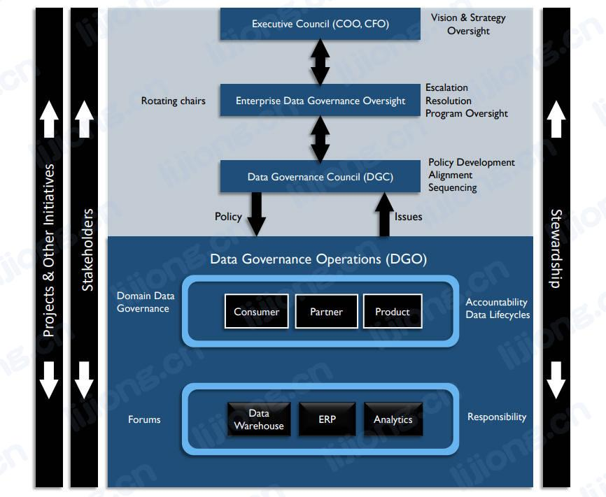
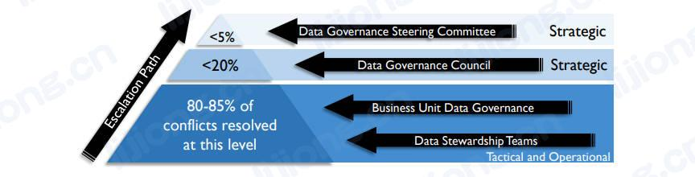

# **数据治理活动**

## 为组织定义数据治理（Define Data Governance for the Organization）

- 数据治理工作必须支持业务战略和目标，组织的业务战略和目标为企业数据策略以及数据治理、数据管理活动如何在组织中运作提供信息。
- 数据治理支持对数据相关决策的共同责任，数据治理活动跨越组织和系统边界以支持一个整体的数据视图，成功的数据治理需要清楚治理什么、谁在被治理以及谁在治理。
- 当数据治理是一项企业工作而不是孤立于特定功能领域时，其是最有效的。

## 进行准备情况评估（Perform Readiness Assessment）

- 描述当前组织信息管理能力、成熟度和有效性的评估对规划数据治理方案至关重要，同时因为评估可用于衡量方案的有效性，所以其对管理和维持数据治理方案也很有价值。
- **典型评估**（Typical assessments）
  - 数据管理成熟度（Data management maturity）
    - 了解组织如何处理数据，衡量其当前的数据管理能力和容量。
    - 重点是业务人员对公司管理数据和利用数据的优势的印象，以及工具的使用、报告水平等客观标准。
  - 变革能力（Capacity to change）
    - 数据治理需要行为改变，因此衡量组织为了适应数据治理而改变行为的能力很重要，这项活动也将有助于识别潜在阻力点。
    - 数据治理通常需要正式的组织变革管理，在评估变革能力时，变革管理流程将评估现有的组织结构、文化观念和变革管理流程本身。
  - 协作准备（Collaborative readiness）
    - 该评估描述组织在数据管理和使用方面的协作能力。
    - 如果一个组织不知道如何协作，文化将成为管理的障碍，当与变革能力一起完成评估时，该评估可以深入了解实施数据治理的文化能力。
  - 业务一致性（Business alignment）
    - 有时被包含在变革能力评估中，检查组织的数据使用和业务策略保持一致的程度。

## 进行发现和业务对齐（Perform Discovery and Business Alignment）

- 数据治理计划必须通过识别和交付特定利益（如减少支付给监管机构的罚款）来为组织做出贡献，发现活动将识别和评估制度和指南的有效性（解决了哪些风险、鼓励了哪些行为、实施情况），发现活动还可以识别数据治理提高数据和内容实用性的机会。业务对齐将业务利益附加到数据治理计划元素。
- 数据质量分析是发现活动的一部分，数据质量评估将深入了解存在的问题和障碍，以及低质量数据相关的影响和风险。数据质量评估可以识别如果使用低质量数据执行时存在风险的业务流程，以及作为数据治理工作的组成部分创建的数据质量计划带来的的财务和其他收益。
- 数据管理实践的评估是数据治理发现过程的另一个关键部分，例如可能识别高级用户，为正在进行的数据治理活动创建初期的潜在代理列表。
- 通过发现活动和对齐活动得到数据治理要求列表，例如若监管风险对业务产生财务问题，则指定支持风险管理的数据治理活动。

## 制定组织触点（Develop Organizational Touchpoints）

- 对齐活动包括为数据治理工作指定组织触点，如图为在CDO直接权限之外的领域支持企业数据治理和数据管理方法的一致性和凝聚力（cohesiveness）的触点示例。

- 采购和合同（Procurement and Contracts）
  - CDO与供应商/合作伙伴管理或采购部门合作，制定和执行与数据管理合同相关的标准合同语言。包括数据即服务（Daas）和云相关采购、其他外包安排、第三放开发工作或内容收购/许可交易、以数据为中心的IT工具收购和升级（Data-as-a-Service and cloud-related procurements, other outsourcing arrangements, third-party development efforts, or content acquisition/ licensing deals, and possibly data-centric IT tools acquisitions and upgrades）。
- 预算和资金（Budget and Funding）
  - 如果CDO不直接控制所有与数据采购相关的预算，则办公室可以成为防止重复工作和确保优化采购数据资产的焦点。
- 合规性（Regulatory Compliance）
  - CDO了解所需的地方、国家和国际监管环境并在其中工作，进行持续监控以识别和跟踪新的和潜在的影响和要求。
- 系统开发生命周期 / 开发框架（SDLC / development framework）
  - 数据治理计划确定可以在系统或应用程序开发生命周期中开发企业策略、流程和标准的控制点。

## 制定数据治理策略（Develop Data Governance Strategy）

- 数据治理策略定义了治理工作的范围和方法，其应随着各个部分的开发和批准而迭代实施。
- **数据治理策略的内容**
  - 章程（Charter）
    - 确定数据治理的业务驱动元素、愿景、使命和原则，包括准备情况评估、内部流程发现，以及当前问题或成功标准。
  - 运营框架和责任（Operating framework and accountabilities）
    - 定义数据治理活动的结构和责任。
  - 实施路线图（Implementation roadmap）
    - 推出制度和指示、业务术语表、架构、资产价值评估、标准和流程、业务和技术过程的预期变化以及支持审计活动和监管合规的可交付成果的时间表（policies and directives, business glossary, architecture, asset valuation, standards and procedures, expected changes to business and technology processes, and deliverables to support auditing activities and regulatory compliance）。
  - 运营成功计划（Plan for operational success）
    - 描述可持续数据治理活动的目标状态。

## 确定数据治理运营框架（Define the Data Governance Operating Framework）

- **构建数据治理运营框架需考虑的方面**
  - 数据对组织的价值（Value of data to the organization）
    - 将数据作为重要商品（a crucial commodity）的组织（Facebook, Amazon）需要一种能反映数据作用的运营模型，将数据作为运营润滑剂（lubricant）的组织，数据治理的形式则不那么严肃（less intense）。
  - 业务模式（Business model）
    - 分散式与集中式（decentralized vs. centralized）、本地与国际等是影响业务发生方式的因素，因此也影响数据治理运营模型的定义方式，与特定IT策略、数据架构、应用程序集成功能的链接应放映在目标运营框架的设计中。
  - 文化因素（Cultural factors）
    - 如对纪律的接受和对变化的适应（acceptance of discipline and adaptability to change），一些组织会抵制按制度和原则实施治理
    - 治理策略需要主张一种在推进变革的同时适应组织文化的运营模式。
  - 监管的影响（Impact of regulation）
    - 监管程度影响数据治理的思维方式（mindset）和运营模式，可能需要指向风险管理组或法务部的链接。
- 数据治理运营框架示例

## 制定目标、原则和制度（Develop Goals, Principles, and Policies）

- 目标、原则和制度通常由数据管理专业人员、业务制度人员或两者共同起草。由数据专员和管理层审查并提炼。由数据治理委员会（或类似机构）进行最终审查、修订和采用。
- **制度的示例**
  - 数据治理办公室将对供组织使用的数据进行认证。
  - 业务所有者将得到数据治理办公室的批准。
  - 业务所有者将从其业务能力领域指派数据专员，数据专员负责协调数据治理活动。
  - 尽可能提供满足大多数业务需求的标准化报告或仪表盘/记分卡。
  - 认证用户将被授予访问认证数据的权限以进行临时/非标准报告（ad hoc /non-standard reporting）。
  - 所有认证数据将被定期评估，评估内容包括准确性、完整性、一致性、可访问性、唯一性、合规性和效率（accuracy, completeness, consistency, accessibility, uniqueness, compliance, and efficiency）。
- 数据制度必须被有效地传达、监控、执行和定期重新评估，数据治理委员会可将此权力委托给数据管理指导委员会（Data Stewardship Steering Committee）。

## 承保数据管理项目（Underwrite Data Management Projects）

- 提高数据管理能力的举措通常需要DGC的跨职能支持，提高数据管理能力的举措可能被视为完成工作的障碍，推动的关键是阐明其提高效率和降低风险的方式，希望从数据中获得更多价值的组织需要优先开发或改进数据管理功能。
- DGC帮助定义业务案例并监督数据管理改进项目的状态和进度，DGC与现有PMO协调其工作，数据管理项目可被视为整个IT项目组合（project portfolio）的一部分。
- DGC还可与企业范围内的大型项目协调其数据管理改进工作，企业资源规划（ERP，Enterprise Resource Planning）、客户或公民关系管理（CRM，Customer or Citizen Relationship Management）、全球零件清单（global parts lists）等主数据管理项目是此类协调的理想选择（good candidates）。
- 其他项目中的数据管理活动必须由内部SDLC、服务交付管理、其他信息技术基础设施库（ITIL，Information Technology Infrastructure Library）组件和PMO流程来适应。
  - Data management activity in other projects must be accommodated by the internal SDLC, service delivery management, other Information Technology Infrastructure Library (ITIL) components, and PMO processes. 
- 每个具有重要数据组件（a significant data component）的项目（几乎每个项目都要）都应该在SDLC的早期阶段捕获数据管理需求，包括架构、监管合规、记录系统识别和分析以及数据治理检查和修复（architecture, regulatory compliance, system-of-record identification and analysis, and data quality inspection and remediation），也可能有数据管理支持活动，包括使用标准测试平台的需求测试验证。

## 参与变革管理（Engage Change Management）

- 组织变革管理（OCM，Organizational Change Management）是为组织的系统和流程带来变革的工具。
- 对于许多组织而言，数据治理固有的形式和纪律（formality and discipline）与现有实践不同，需要人们改变行动和互动方式来适应数据治理，正式的OCM项目需要执行发起者来推动维持适应数据治理所需的行为改变。
- **执行发起者的职责**
  - 规划（Planning）
    - 规划变革管理，包括进行利益相关方分析、获得支持和建立用于克服变革阻力的沟通方法。
  - 培训（Training）
    - 创建和执行数据治理方案的培训计划。
  - 影响系统开发（Influencing systems development）
    - 与PMO合作以将数据治理步骤添加道SDLC。
  - 制度实施（Policy implementation）
    - 传达数据制度和组织对数据管理活动的承诺。
  - 沟通（Communications）
    - 提高数据专员和其他数据治理专业人士对自身角色和责任的认识，以及对数据管理项目的目标和期望的认识。
- **沟通重点**
  - 提升数据资产的价值（Promoting the value of data assets）
    - 教导并告知员工数据在实现组织目标中所扮演的角色。
  - 监控数据治理活动的反馈并根据反馈采取行动（Monitoring and acting on feedback about data governance activities）
    - 除了共享信息，沟通计划还应获得反馈，以指导DG计划和变更管理流程，积极寻求和使用利益相关方的意见可以建立对方案目标的承诺，同时还可以确定是否成功以及改进的机会。
  - 实施数据管理培训（Implementing data management training）
    - 对组织各级的培训提高了对数据管理最佳实践和流程的认识。
  - 通过5个关键领域衡量变革管理的效果（Measuring the effects of change management on in five key areas）
    - 认识到需要改变（Awareness of the need to change）
    - 参与和支持变革的意愿（Desire to participate and support the change）
    - 关于如何改变的知识（Knowledge about how to change）
    - 实施新技术和行为的能力（Ability to implement new skills and behaviors）
    - 加强以保持改变到位（Reinforcement to keep the change in place）
  - 实施新指标和KPI（Implementing new metrics and KPIs）
    - 应重新调整员工激励措施以支持与数据管理最佳实践相关的行为，企业数据治理需要跨职能合作，因此激励措施应鼓励跨部门的活动和合作。

## 参与问题管理（Engage in Issue Management）

- 问题管理是识别、量化、优先排序和解决（identifying, quantifying, prioritizing, and resolving）数据治理相关问题的过程。问题管理可以为数据治理团队建立信誉，对数据消费者产生直接、积极的影响，并减轻生产支持团队的负担，解决问题还证明了可以管理数据并提高其质量。
- **问题管理的内容**
  - 权威（Authority）
    - 关于决策权和流程的问题。
  - 变更管理上报（Change management escalations）
    - 变更管理流程产生的问题。
  - 合规性（Compliance）
    - 满足合规性要求的问题。
  - 冲突（Conflicts）
    - 冲突的制度、流程、业务规则、名称、定义、标准、架构、数据所有权以及利益相关者在数据和信息中的利益冲突。
  - 一致性（Conformance）
    - 有关制度、标准、架构和流程的一致性的问题。
  - 合同（Contracts）
    - 数据共享协议、买卖数据以及云存储的谈判和审查（negotiation and review）。
  - 数据安全和身份（Data security and identity）
    - 隐私和保密（privacy and confidentiality）问题，包括违规调查（breach investigations）。
  - 数据质量（Data quality）
    - 监测和解决（detection and resolution）数据质量问题，包括灾难或安全漏洞（disasters or security breaches）。
- 数据问题上报路径

- **数据治理需要控制机制和流程（control mechanisms and procedures）的方面**
  - 识别、捕获、记录、跟踪和升级问题（Identifying, capturing, logging, tracking, and updating issues）
  - 行动项的分配和跟踪（Assignment and tracking of action items）
  - 记录利益相关者的观点和可选解决方案（Documenting stakeholder viewpoints and resolution alternatives）
  - 决定、记录和沟通问题解决方案（Determining, documenting, and communicating issue resolutions）
  - 促进客观、中立的讨论，听取所有观点（Facilitating objective, neutral discussions where all viewpoints are heard）
  - 将问题上报给更高权力级别（Escalating issues to higher levels of authority）

## 评估监管合规要求（Assess Regulatory Compliance Requirements）

- 数据治理指导实施适当的控制措施，以监控和记录对数据相关法规的遵守情况。
- 对数据管理实践有重大影响的全球性法规
  - 会计准则（Accounting Standards）
    - GASB（Government Accounting Standards Board，政府会计准则委员会）和FASB（Financial Accounting Standards Board，财务会计准则委员会）的会计准则。
    - 在美国如何管理信息资产。
  - BCBS 239（Basel Committee on Banking Supervision，巴塞尔银行监管委员会）和Basel II 
    - 有效风险数据汇总和风险报告原则，范围广泛的银行法规。
    - 在欧盟国家开展业务的金融机构。
  - CPG 235
    - APRA（Australian Prudential Regulation Authority，澳大利亚审慎监管局）监督银行和保险实体。
    - 管理数据风险的标准，侧重于解决数据风险的来源并在整个生命周期中管理数据。
  - PCI-DSS
    - Payment Card Industry Data Security Standards，支付卡行业数据安全标准。
  - Solvency II
    - 类似保险业的Basel II，欧盟法规。
  - 隐私法（Privacy laws）
    - 各地方、主权（sovereign）和国际的法律。
- **法规评估的内容**
  - 法规在哪些方面与组织有关？
  - 合规由什么组成？达到合规需要哪些制度和流程？
  - 何时需要合规？如何以及何时监控合规性？
  - 组织能否采用行业标准来实现合规？
  - 如何证明（demonstrate）合规性？
  - 不合规的风险和处罚（penalty）是什么？
  - 如何识别和报告不合规情况？如何管理和纠正不合规情况？

## 实施数据治理（Implement Data Governance）

- **数据治理早期阶段的优先活动**（Prioritized activities in the early stages）
  - 确定满足高优先级目标所需的数据治理流程。
  - 建立业务术语表并记录术语和标准。
  - 与企业架构和数据架构协调以支持更好地理解数据和系统。
  - 为数据资产分配财务价值，以便做出更好的决策并加深对数据在组织成功中所扮演的角色的理解。

## 实施数据标准和流程（Sponsor Data Standards and Procedures）

- 标准提供了一种有助于定义质量的比较方法，还提供了简化流程的潜力，不需要为每个项目做出相同的决定。
- 数据标准根据描述的内容采用不同的形式：关于如何添加字段的要求、管理字段之间关系的规则、可接受和不可接受值的详细文档、格式等。
- 记录数据标准提供了一个捕获细节和知识的机会，否则这些细节和知识可能丢失，与预先记录相比，重新创建或逆向工程（Recreating or reverse engineering）以获取这些知识的成本非常高。
- 数据标准必须被有效地传达、监控，并定期审查和更新，在执行中DGC或数据标准指导委员会可以按确定的时间表（defined schedule ）或作为SDLC批准过程（approval processes）的一部分，对数据管理活动的标准合规性进行审计。
- 数据管理流程是为了完成产生特定结果（certain outcomes）和支持工件（supporting artifacts）的特定活动而记录并遵循的方法、技术和步骤。
  - Data management procedures are the documented methods, techniques, and steps followed to accomplish specific activities that produce certain outcomes and supporting artifacts.
- **可以在数据管理知识领域内标准化的概念示例**
  - 数据架构
    - 企业数据模型、工具标准、系统命名约定。
  - 数据建模和设计
    - 数据模型管理程序、数据建模的命名约定、定义标准、标准域（ standard domains）、标准缩写。
  - 数据存储和操作
    - 工具标准、数据库恢复和业务连续性标准、数据库性能标准、数据库保留标准、外部数据获取标准。
  - 数据安全
    - 数据访问安全标准、监控和审计程序、存储安全标准、培训要求。
  - 数据集成
    - 用于数据集成和互操作性的标准方法和工具。
  - 文档和内容
    - 内容管理标准和程序，包括企业分类法的使用（use of enterprise taxonomies）、法律发现支持（ support for legal discovery）、文档和邮件保留期、电子签名、报告分发方法（report distribution approaches）。
  - 参考数据和主数据
    - 参考数据管理控制程序、数据记录系统、建立和强制使用的断言（assertions establishing and mandating use）、实体解析标准（standards for entity resolution）。
  - 数据仓库和商业智能
    - 工具标准、处理标准和流程、报告和可视化格式化标准（report and visualization formatting standards）、大数据处理标准（standards for Big Data handling）。
  - 元数据
    - 要获取的标准业务和技术元数据、元数据集成流程和使用。
  - 数据质量
    - 数据质量规则、标准测量方法（standard measurement methodologies）、数据纠正标准和流程（data remediation standards and procedures）。
  - 大数据和数据科学
    - 数据源识别、权限、获取、记录系统、共享和刷新。

## 制定业务术语表（Develop a Business Glossary）

- 制定和记录标准数据定义可以减少歧义并改善沟通，定义必须清晰、措辞严谨（rigorous in wording,），并解释任何例外情况、同义词或变体（exceptions, synonyms or variants）。
- 每个术语将与其他有价值的元数据相关联，包括同义词、指标、血缘、业务规则、负责该术语的专员。
- 业务术语表的目标
  - 对核心业务概念和术语的共同理解。
  - 减少音对业务概念的理解不一致而导致的数据滥用风险。
  - 改进技术资产（基于技术命名约定）与业务组织之间的一致性（alignment）。
  - 最大限度地提供搜索能力并允许访问已记录的机构知识（institutional knowledge）。

## 与架构组进行协调（Co-ordinate with Architecture Groups）

- DGC发起并批准数据架构工作，如面向业务的企业数据模型，DGC可以任命数据架构指导委员会（Enterprise Data Architecture Steering Committee）或架构审查委员会（Architecture Review Board）以监督计划及其迭代项目。
- 企业数据模型应由数据架构师、数据专员和主题领域团队（subject area teams）共同开发和维护，根据组织情况，该项工作可以由企业数据架构师或专员来协调。
- 随着业务需求的发展，数据管理团队应提出更改并开发企业数据模型的扩展（extension）。
- 企业数据模型应由DGC审查、批准和正式采用。

## 实施数据资产价值评估（Sponsor Data Asset Valuation）

- 首先估计由于信息不足而造成的业务损失的价值，信息差距是所需信息和可用信息之间的差异，弥补或防止差距的成本可用于估计缺失数据的业务价值。

## 嵌入数据治理（Embed Data Governance）

- 数据治理的持续进行需要规划，运营规划包括实施和操作数据治理活动所需的事件列表，其概述了维持成功所必须的活动、时间安排和技术。
