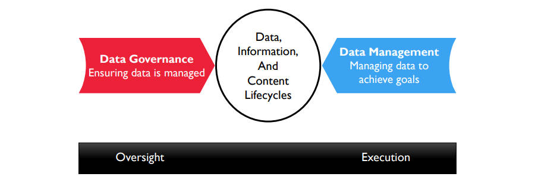

## **数据治理的基本概念**

- Just as an auditor controls financial processes but does not actually execute financial management, data governance ensures data is properly managed without directly executing data management

### 数据治理的驱动因素

- 降低风险（Reducing Risk）
  - 一般风险管理（General risk management）
    - 监督数据为财务和声誉（finances or reputation）带来的风险，包括对法律和合规问题的响应
  - 数据安全（Data security）
    - 通过控制数据的可用性、易用性、完整性、一致性、可审计性和安全性（availability, usability, integrity, consistency, auditability and security）来保护数据资产
  - 隐私（Privacy）
    - 通过制度和合规监控控制私人/机密/个人身份信息
- 改进流程（Improving Processes）
  - 监管合规（Regulatory compliance）
    - 能够高效、持续地响应监管要求
  - 数据质量提升（Data quality improvement）
    - 通过数据可靠性的提升提高业务绩效
  - 元数据管理（Metadata Management）
    - 建立业务术语表来定义和定位组织中的数据，确保广泛的元数据得到管理并可供使用
  - 项目开发效率（Efficiency in development projects）
    - 通过改进数据生命周期定位组织数据管理中的问题和机会，包括通过对数据生命周期的治理来管理特定数据的技术债
  - 供应商管理（Vendor management）
    - 控制关于数据处理的合同，如云存储（cloud storage）、外部数据购买（external data purchase）、数据作为产品销售（sales of data as a product）以及外包数据操作（outsourcing data operations）

### 数据治理的目标

数据治理的目标是使组织能够将数据作为资产进行管理

- 可持续性（Sustainable）
- 嵌入式（Embedded）
- 可衡量（Measured）

### 数据治理的原则

- 领导力和策略（Leadership and strategy）
  - 成功的数据治理始于有远见和坚定的（visionary and committed）领导力，数据管理活动由数据策略指导，数据策略由业务策略驱动
- 业务驱动（Business-driven）
  - 数据治理是一个业务程序（a business program），因此其必须管理数据相关的IT决策，就像管理数据相关的业务活动一样
- 共担责任（Shared responsibility）
  - 在所有数据管理知识领域，数据治理由业务数据管理员和数据管理专业人员共担责任
- 多层次（Multi-layered)
  - 数据治理发生在企业层面和地方层面（enterprise and local levels），但更多是在两者之间
- 基于框架（Framework-based）
  - 数据治理需要进行跨职能领域的协调，因此数据治理必须建立一个确定职责和交互方式（accountabilities and interactions）的操作框架

- 基于原则（Principle-based）
  - 通常组织制定原则时没有正式的原则，只是为了试图解决特定的问题制定的制度，有时可用根据制度逆向设计原则，但最好将阐明一套核心原则和最佳实践作为制度工作的一部分，原则可用减轻潜在的阻力（mitigate potential resistance）

### 数据制度（Data Policies）

- 数据制度根据原则和管理目的制定的，用于管理数据创建、获得、完整性、安全、质量和使用（creation, acquisition, integrity, security, quality, and use）的基本规则

- 数据制度描述什么是数据治理（what，做什么和不做什么），标准和流程描述如何进行数据治理（how），数据制度相对较少并采用简明直接的表述

