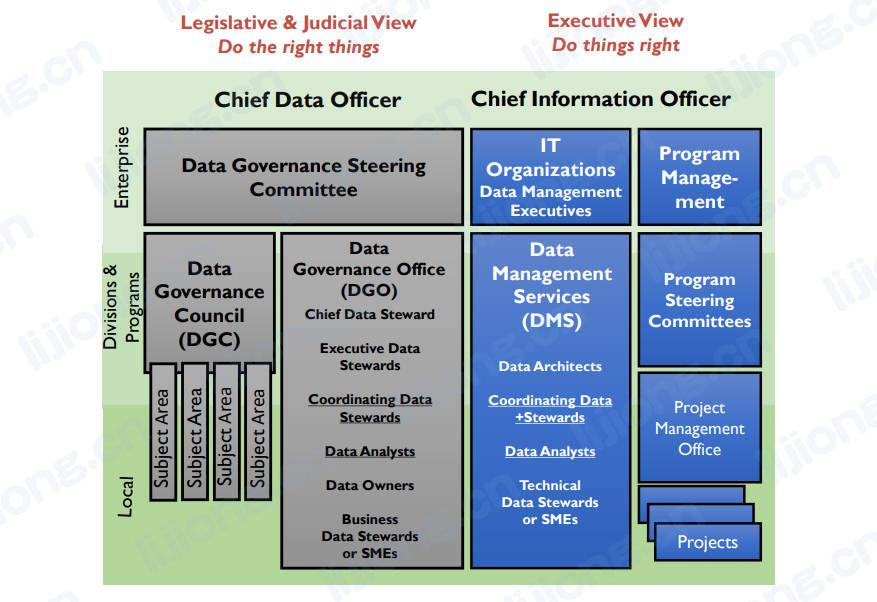
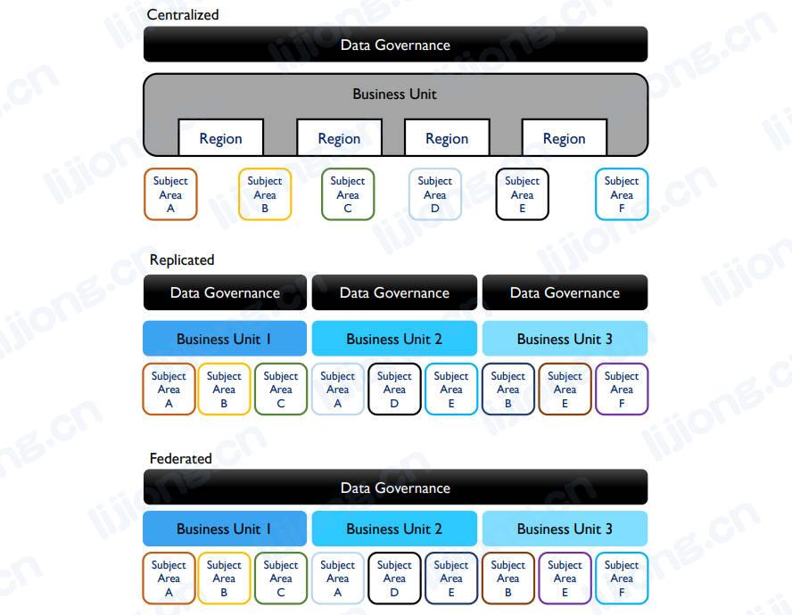

# **数据治理组织和运营模型**

## 数据治理组织的组成（Data Governance Organization Parts）

- 一个通用的数据治理模型（ a generic data governance model），纵轴为组织中的不同级别，横轴为组织职能上的分离以及技术和业务之间治理职责的分离

## 典型的数据治理委员会（Typical Data Governance Committees / Bodies）

- 数据治理指导委员会（Data Governance Steering Committee）
  - 组织中数据治理的主要和最高权力机构，负责监督、支持和资助数据治理活动，由跨职能的高级管理人员组成
- 数据治理委员会（DGC, Data Governance Council）
  - 管理数据治理相关的倡议、问题和上报（initiatives, issues, and escalations），根据所使用的运营模式由执行人员组成
- 数据治理办公室（DGO, Data Governance  Office）
  - 持续关注所有数据管理知识领域中的企业级数据定义和数据管理标准，由数据专员（data stewards）或数据保管人（custodians），以及数据所有者（data owners）组成
- 数据管理团队（Data Stewardship Teams）
  - 专注于一个或多个特定的主题领域或项目，与项目团队就重点的数据定义和数据管理标准进行协作或商议（collaborate or consulte），由业务数据管理员、技术数据管理员和数据分析师组成
- 地方数据治理委员会（Local Data Governance Committee）
  - 大型组织可能有治理委员会的分部或部门级的治理委员会（divisional or departmental data governance councils）

## 数据治理运营模型类型（Data Governance Operating Model Types）

- 集中模型（centralized model）
  - 一个数据治理组织监督（oversee）所有主题领域的所有活动
- 复制模型（replicated model）
  - 每个业务部门采用同样的数据治理运营模型和标准（model and standards）
- 联合模型（replicated model）
  - 一个数据组织与多个业务部门协调以维护一致的定义和标准（definitions and standards）

