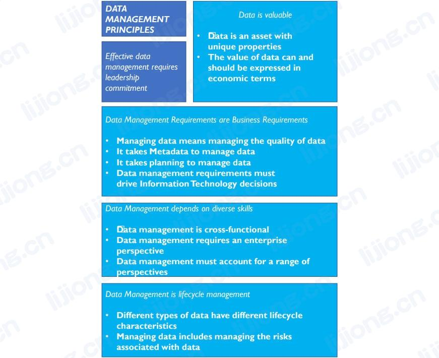
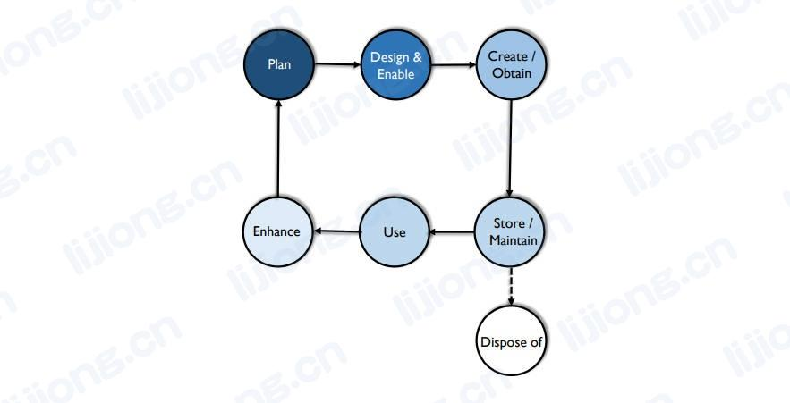

# **数据管理基本概念**

## 数据管理的目标（Data Management Goals）

- 了解并支撑企业和利益相关者（stakeholders，客户、员工、业务合作伙伴）的信息需求
- 获取、储存数据，并保护和确保数据资产的完整性
- 确保数据和信息的质量
- 确保利益相关者数据的隐私和机密
- 防止对数据的未经授权或不当的访问、操作和使用
- 确保数据可以有效地为企业创造价值

## 数据管理原则（Data Management Principles）

- 数据是一种有特殊属性的资产
  - 在使用时不会被消耗
- 数据的价值可以而且应该用经济术语来表达
  - 应开发一套连续的方法来量化数据的价值，同时应衡量低质量数据的成本和高质量数据的收益
- 管理数据的意思是管理数据的质量
  - 数据管理的主要目标是确保数据符合目的，为了管理数据质量，必须确保了解利益相关者对质量的要求
- 通过元数据来管理数据
  - 管理任何资产都需要关于该资产的数据，比如员工人数、会计代码等，**用于管理和使用数据的数据称为元数据**
  - **元数据源自与数据产生、处理和使用相关的一系列流程**，包括架构（architecture）、建模（modeling）、管理（stewardship）、治理（governance）、数据质量管理（Data Quality management）、系统开发（systems development,）、IT和业务运营（ IT and business operations）以及分析（ analytics）
- 通过规划来管理数据
  - 为了协调工作，并使最终结果保持一致，需要从架构和流程方面（architectural and process perspective）进行规划
- 数据管理需求必须驱动信息技术决策
  - 管理数据需要一种途径来确保技术服务而不是驱动组织的数据战略需求
- 数据管理是跨职能的，需要一系列的技术和专业知识
  - 数据管理需要技术和非技术技能，以及协作能力
- 数据管理需要企业视角（an enterprise perspective）
  - 有效的数据管理不局限于局部应用，必须能应用于整个企业，这是数据管理和数据治理紧密联系的原因之一
- 数据管理必须对多方面负责（Data management must account for a range of perspectives）
  - 数据管理必须不断发展，来和数据的产生和使用方式以及用户的需求保持同步
- 数据管理就是生命周期管理
  - 数据会产生更多数据，所以数据的生命周期可能非常复杂，数据管理需要为数据生命周期负责
- 不同的数据有不同的生命周期特征
  - 数据管理实践要足够灵活来满足不同的数据生命周期要求
- 管理数据包括管理数据相关的风险
  - 数据可能会丢失、被盗或被滥用，数据使用可能带来道德影响，数据相关风险必须作为数据据生命周期的一部分进行管理

## 数据管理的挑战（Data Management Challenges）

### 数据和其他资产的不同（Data Differs from Other Assets）

- 数据是无形的（not tangible）、耐用的（durable），数据的价值通常随着时间的推移而变化
- 数据易于复制和传输，但一旦遗失或损坏则不易重现（reproduce），数据被盗也不会消失
- 数据是动态的（dynamic），可用于多种用途，数据的多种用途会产生更多的数据

### 数据价值评估（Data Valuation）

- 赋予数据价值是赋予数据管理活动价值的基础
- **数据的成本和收益类别**（cost and benefit categories）
  - 获取和存储（obtaining and storing）数据的成本
  - 数据丢失时更换（replacing ）数据的成本
  - 数据丢失对组织的影响（impact）
  - 数据相关的风险缓解成本（cost of risk mitigation）和潜在风险成本（potential cost of risks）
  - 改进（improving）数据的成本
  - 更高质量数据的好处
  - 竞争对手会为数据支付什么费用
  - 数据可以卖什么
  - 数据创新用途（innovative uses）的预期收入（expected revenue）
- 数据价值评估的主要挑战在于对一个组织有价值的数据可能对另一个组织没价值，而且数据价值会随着时间变化

### 数据质量（Data Quality）

- 确保数据的高质量是数据管理的核心，为了满足业务需求（business needs），在与数据用户合作来定义这些需求时必须包括数据高质量的特征
- 数据通常用于学习以创造价值，如了解客户习惯以改进产品或服务、评估组织绩效（organizational performance）或市场趋势（market trends）以制定更好的业务战略（business strategy），低质量的数据将使决策产生负面影响
- **低质量数据的成本**
  - 废弃（scrap）和返工（rework）
  - 临时避免但不解决特定问题的工作（work-arounds）和隐含的纠正处理（hidden correction processes）
    - wordaround：a way of working, especially with a piece of software, that avoids a particular problem but does not actually solve the problem
  - 组织效率低下（organizational inefficiencies）或生产效率低下（low productivity）
  - 组织冲突（organizational conflict）
  - 工作满意度低（low job satisfaction）
  - 客户不满意（dissatisfaction）
  - 机会成本（opportunity costs），包括无法创新（inability to innovate）
  - 合规成本或罚款（compliance costs or fines）
  - 声誉（reputational）成本
- **高数据质量的益处**
  - 改善客户体验
  - 更高的生产效率（productivity）
  - 降低风险
  - 把握机会（act on opportunities）的能力
  - 增加收入（revenue）
  - 从对客户、产品、流程和机会的洞察中获得竞争优势（competitive advantage）
- 管理数据质量不是一次性工作，获得高质量的数据需要规划、投入和使质量管理成为流程和系统的一部分的观念，**所有的数据管理功能都会或好或坏地影响数据质量**

### 数据优化的规划（Planning for Better Data）

- 将数据视为生产的产品，在整个生命周期中进行更好的决策
- **数据优化相关的决策**
  - 数据是否被视为独立于业务流程
  - 业务流程和支持业务流程的技术之间的关系
  - 系统的流程和架构及其产生和存储的数据
  - 数据可用于推荐组织战略的方式
- 挑战在于通常存在组织压力以及长期的时间和金钱压力，在执行时需要平衡长期和短期目标，进行权衡以做出更好的决策

### 元数据和数据管理（Metadata and Data Management）

- 组织需要元数据来管理数据资产，在这个意义上，元数据不仅包括业务、技术和操作元数据，还包括嵌入在数据架构、数据模型、数据安全要求、数据集成标准（data integration standards）和数据操作过程的元数据
- **元数据描述了组织拥有什么数据、这些数据代表什么、如何分类、来自哪里、如何在组织内转移、如何通过使用而演变（evolve）、谁可以使用以及谁不可以使用、是否高质量，使数据、数据生命周期和包含数据的复杂系统易于理解**
- 元数据管理的挑战在于元数据以数据形式存在和被管理，**不能很好地管理元数据的组织通常根本不管理元数据**，元数据管理通常为整体的数据管理改进提供了一个起点

### 跨职能的数据管理（Data Management is Cross-functional）

- 数据生命周期的不同阶段由组织中的不同团队负责，数据管理需要规划系统的设计技能、管理硬件和构造软件的技术技能、理解问题和解释数据的分析技能、在定义和模型方面达成共识的语言技能、发现服务客户和达成目标的机会的战略思维
- 挑战在于让具备这些技能的人认识到各个部分是如何结合在一起的，以便能够更好地协作

### 建立企业视角（Establishing an Enterprise Perspective）

- 管理数据需要了解组织中数据的范围，数据在组织中是跨领域的，但数据通常被简单地视为操作流程或副产品（a by-product），只被用于即时的需求（the immediate need）
- 同样的概念在不同的部门可能有不同的表达方式，数据管理的目标之一是使数据连贯（coherent），向数据用户提供广泛的数据
- 数据治理越来越重要的原因之一是帮助组织做出基于跨领域的决策
  - One reason data governance has become increasingly important is to help organizations make decisions about data  across verticals

### 需要考虑的其他方面（Accounting for Other Perspectives）

- 考虑国家和行业的法律和合规要求（legal and compliance requirements）
- 考虑数据的潜在用途（the potential uses，如产生数据的人需考虑数据可能被其他人用到），可以帮助更好地规划数据生命周期，提高数据质量
- 考虑数据被滥用（misuse）的风险

### 数据生命周期（The Data Lifecycle）

- 为了有效地管理数据资产，需要了解和规划数据生命周期，除了定义数据内容要求，还要定义数据管理要求，包括关于数据使用、质量、控制、安全的政策和期望；企业视角的架构和设计；可持续（sustainable）的基础设施和软件开发方法
- 数据生命周期基于产品生命周期，不应与系统开发生命周期混淆
- 数据生命周期包括产生和获取数据；移动、转换和存储数据使其得以维护（maintained）和共享；使用数据；销毁（dispose of, disposal）数据。在生命周期中，数据被清洗（cleansed）、转换（transformed）、合并（merged）、增强（enhanced）或聚合（aggregated），随着数据被使用和增强，通常会产生新的数据，因此数据生命周期具有图中未显示的内部迭代（internal iterations）

- 数据不仅具有生命周期，还具有数据血缘，即数据从产生到使用的路径（lineage , a pathway along which it moves from its point of origin to its point of usage, sometimes called the data chain），了解数据血缘需要记录数据的来源，以及数据在访问和使用它们的系统中的移动和转换
- **数据生命周期管理的重点**
  - 创建和使用数据是数据生命周期中的关键点
    - 产生或获取数据需要成本，数据只有被使用才有价值
  - 数据质量管理必须贯穿整个数据生命周期
    - 数据质量管理是数据管理的核心，数据通常作为操作流程的副产品创建，缺乏明确的质量标准，数据质量会受到一系列生命周期事件的影响
  - 元数据管理必须贯穿整个数据生命周期
    - 元数据是数据形式，并且被依赖于管理其他数据
  - 数据安全管理必须贯穿整个数据生命周期
    - 需要保护的数据必须在整个生命周期受到保护
  - 数据管理工作应专注于关键数据
    - 组织产生大量数据，并且很大一部分从未被使用，不可能试图管理所有数据
    - 生命周期管理应专注于关键数据并尽可能减少（minimize）冗余（redundant）、过时（obsolete）和不重要（trivial）的数据（ROT数据）

### 数据的不同类型（Different Types of Data）

- 数据分类方式
  - 数据类型
    - 交易数据、参考数据、主数据、元数据（transactional data, Reference Data, Master Data, Metadata）
    - 类别数据、资源数据、事件数据、详细交易数据（category data, resource data, event data, detailed transaction data）
  - 内容
    - 数据域、主题域（data domains, subject areas）
  - 格式
  - 所需的保护级别
  - 存储和访问的方式和位置
- 不同的数据有不同的要求，关联不同的风险，发挥不同的作用，因此许多数据管理工具侧重于分类和控制

### 数据和风险（Data and Risk）

- 数据的风险：不正确（inaccurate, incomplete, or out-of-date）、被误解（misunderstood）、被滥用（misused）

### 数据管理和技术（Data Management and Technology）

- 组织需要了解技术对数据的影响，与业务战略一致的数据需求应驱动关于数据的决策

### 有效的数据管理需要领导力和投入（Effective Data Management Requires Leadership and Commitment）

- 很多组织将数据视为一种资产，但远非数据驱动（data-driven，通过事件触发和应用分析来替代直觉进行决策，通过业务领导和技术专长，以专业的纪律管理数据）
  - 不知道拥有哪些数据及哪些数据对业务最重要
  - 混淆了数据和信息技术，对两者管理不善
  - 低估数据管理所涉及的工作

## 数据管理战略（Data Management Strategy）

- 数据管理战略必须来自对业务战略中数据需求的理解
  - 组织需要什么数据
  - 如何获取数据
  - 如何管理数据并确保数据可靠性（reliability）
  - 如何利用（utilize）数据

### 数据管理战略的组成（Components）

  - 令人信服的数据管理愿景（a compelling vision）
  - 数据管理业务案例摘要（a summary business case），包括精选案例（selected examples）
  - 指导原则（guiding principles）、价值观（values）和管理观点（management perspectives）
  - 数据管理的使命（mission）和长期的方向性目标（long-term directional goals）
  - 数据管理成功的建议衡量标准（proposed measures）
  - SMART（具体specific，可衡量measurable，可达到actionable，实际realistic，有时限timebound）的短期（12-24个月）数据管理计划目标（Data Management program objectives）
  - 数据管理角色和组织的描述，以及其责任和决策权的总结（a summary of their responsibilities and decision rights）
  - 数据管理计划的组成部分（components）和（initiatives）的描述
  - 具有范围边界（scope boundaries）的优先工作计划（a prioritized program）
  - 包含计划和行动项（projects and action items）的实施路线图草案（a draft implementation roadmap）

### 数据管理战略的可交付成果（Deliverables）

  - 数据管理章程（charter）
    - 总体愿景（overall vision）
    - 业务案例（business case）
    - 目标（goals）
    - 指导原则（guiding principles）
    - 成果衡量标准（measures of success）
    - 关键成功因素（critical success factors）
    - 公认风险（recognized risks）
    - 运营模式（operating model）
  - 数据管理范围声明（scope statement）
    - 某个规划范围（通常3年）内的目标（goals and objectives，希望达到的目标和尝试达到的目标）
    - 负责实现这些目标（objectives）的角色、组织和领导
  - 数据管理实施路线图（implementation roadmap）
    - 具体的计划、项目、任务分配和交付里程碑（specific programs, projects, task assignments, and delivery milestones）