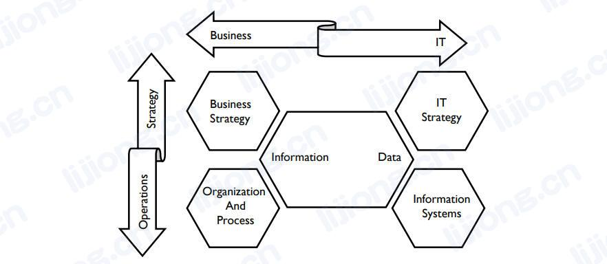
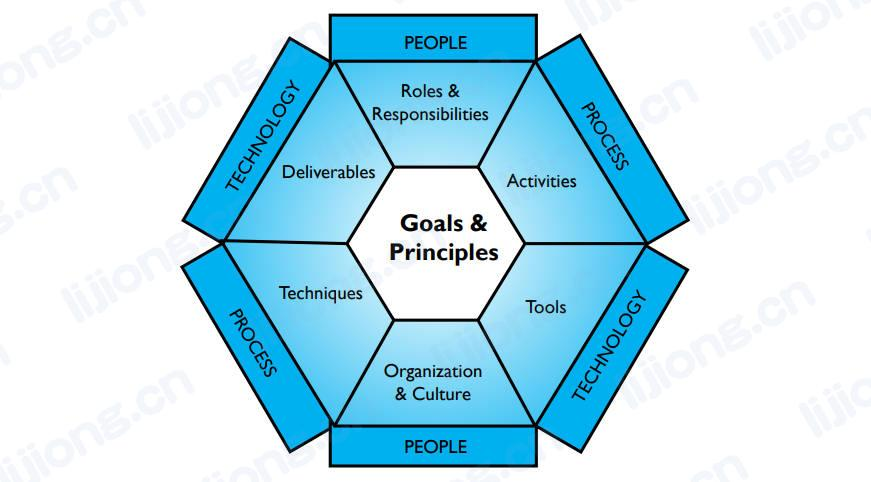
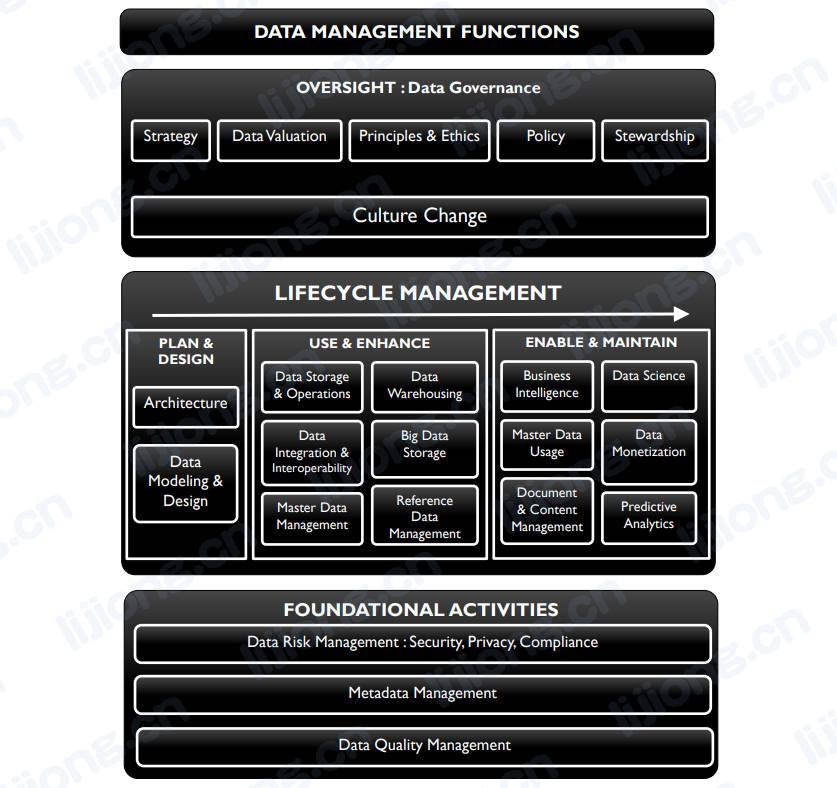
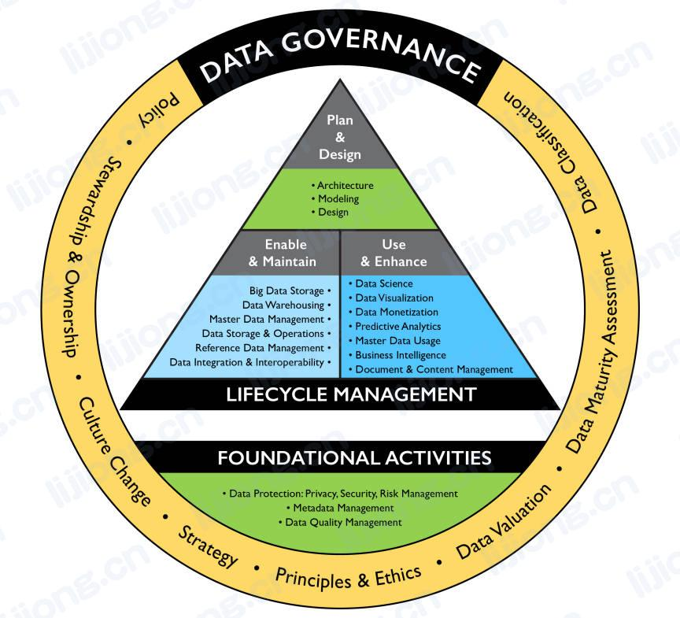

# **数据管理框架**

## 战略一致性模型（Strategic Alignment Model）

- Henderson and Venkatraman, 1999
- 抽象了各种数据管理方法的基本驱动元素
  - 以数据和信息的关系为中心
    - 信息通常与业务战略和对数据的操作使用相关联
    - 数据与为数据提供物理支持的信息技术和流程相关联
  - 围绕这一概念的是战略选择的四个基本领域：业务战略、信息技术战略、组织基础设施和流程、信息技术基础设施和流程

## 阿姆斯特丹信息模型（The Amsterdam Information Model）

- Abcouwer, Maes, and Truijens, 1997
- 抽象出一个关于结构和战略（structure and tactics）的中间层，包括规划和架构
- 认识到信息沟通的必要性，图中表现为信息治理和数据质量支柱

## DAMA-DMBOK框架（The DAMA-DMBOK Framework）

- 描述了DAMA定义的数据管理知识领域，并解释了其在DMBOK中的可视化表示方式

### DAMA轮（The DAMA Wheel）

- **进行知识领域的高层次展示**
- 以数据治理为中心，因为需要治理来实现功能内部的一致性和功能间的平衡
- 其他知识领域围绕中心进行平衡，各知识领域都是成熟数据管理功能的必要组成部分，但可能根据组织需求在不同时间实施

### 环境因素六边形（The Environmental Factors Hexagon）

- **识别知识领域结构的组成部分**，展示了人、过程和技术之间的关系，并提供了阅读上下文图的关键
- 以目标和原则为中心，因为其指导如何执行活动和有效使用数据管理所需的工具

### 知识领域关系图（The Knowledge Area Context Diagram）

- **描述了知识领域的细节**（人员、流程和技术相关的细节）
  - 以活动为中心，因为其产生满足利益相关者需求的产品
  - 以知识领域的定义和目标开始
  - 活动分为四个阶段：计划、开发、运营、控制，左侧是输入和供应商，右侧是交付物和消费者，下方是参与者（高级角色列表仅包括最重要的角色）
  - 底部是技术、工具和衡量指标
- 组成部分
  - 定义：简要定义知识领域
  - 目标：描述知识领域的目的和指导活动绩效的基本原则
  - 活动：实现目标所需的行动或任务，活动分为四类
    - 规划活动：设定为了满足目标的战略和战术路线（the strategic and tactical course），规划活动定期进行
    - 开发活动：围绕系统开发生命周期（SDLC, the system development lifecycle, analysis, design, build, test, preparation, and deployment）进行组织
    - 控制活动：确保数据质量，以及用于访问和使用数据的系统的完整性、可靠性和安全性
    - 运营活动：为用于访问和使用数据的系统和流程的使用、维护和增强提供支持
  - 输入：知识领域启动活动所需的有形事物（the tangible things）
  - 交付：知识领域活动的输出，有形事物
  - 角色和职责：描述个人和团队如何为活动做出贡献
  - 提供者：负责提供或允许访问活动输入的人员
  - 消费者：直接受益于活动交付物的人员
  - 参与者：执行活动、管理绩效、批准活动的人员
  - 工具：用于实现目标的应用程序或其他技术
  - 技术：用于执行活动和生产交付物的方法和程序
    - 共同约定（common conventions）
    - 最佳实践建议（best practice recommendations）
    - 标准（standards）
    - 协议（protocols）
    - 新出现的替代方法（emerging alternative approaches）
  - 指标：衡量绩效、进度、质量、效率或其他效果的标准（performance, progress, quality, efficiency, or other effect），也可用于衡量更抽象的特征，如改进和价值

## DMBOK金字塔（DMBOK Pyramid）

- **通过DMBOK功能领域来描述组织所处的情况**
  - 阶段一
    - 具有包含数据库功能的应用程序，意味着在数据建模/设计、数据存储和数据安全方面的起点
    - 为了让系统在其数据环境中运行，需要进行数据集成和互操作性工作
  - 阶段二
    - 使用应用程序过程中发现数据质量方面的挑战，更高的数据质量依赖于可靠的元数据和一致的数据结构，用于清晰说明来自不同系统的数据如何协同工作
  - 阶段三
    - 管理数据质量、元数据和架构需要数据治理来提供支持
    - 数据治理同时支持战略计划的执行，如文档和内容管理、参考数据管理、主数据管理、数据仓库和商业智能
  - 阶段四
    - 充分利用管理良好的数据优势，并提高数据分析能力

## DAMA数据管理框架的演变（DAMA Data Management Framework Evolved）

- 以DAMA轮为起点重新排列各部分，以便更好地描述和理解各部分之间的关系

### DAMA功能领域依赖关系

- 商业智能和分析功能依赖于所有其他数据管理功能，并直接依赖于主数据和数据仓库解决方案
- 元数据和数据仓库依赖于系统和应用程序
- 可靠系统和应用程序的基础是数据质量、数据设计和数据互操作性实践
- 数据治理为所有其他功能提供依赖的基础，其包括元数据管理、数据安全、数据架构和参考数据管理

### DAMA数据管理功能框架

- **提供了某些知识领域的更详细信息以阐明关系**
- 以数据生命周期管理为中心，数据管理的指导目的是从数据资产冲获取价值，获取价值需要数据生命周期管理
  - 为可靠、高质量的数据进行规划和设计。为使用和维护数据建立流程和功能。在各种类型的分析中使用数据，同时提升数据价值。
  - 传统数据使用（traditional uses of data，商业智能、文档和内容管理）通过数据管理和设计功能（建模、架构、存储和操作）支持。新兴数据使用（emerging uses of data，数据科学、预测分析）通过新兴数据功能（大数据存储）支持。数字货币化（data monetization）将数据出售给其他组织获得直接价值。
- 数据风险管理、元数据管理、数据质量管理作为基础活动贯穿数据生命周期，有助于做出更好的决策、使数据更易于使用、降低维护成本
- 数据治理以组织成为数据驱动为目的，通过制定战略（strategy）和支持原则（supporting principles）、政策（policies）和管理实践（stewardship practices）来确保组织抓住机会以从数据中获得价值。必要的文化变革贯穿数据治理的各项职责，因为数据治理应加入到组织变革管理活动，来培训并鼓励对数据的战略性使用（strategic uses of data）。
- 演变的DAMA轮，数据治理围绕生命周期管理和基础活动

