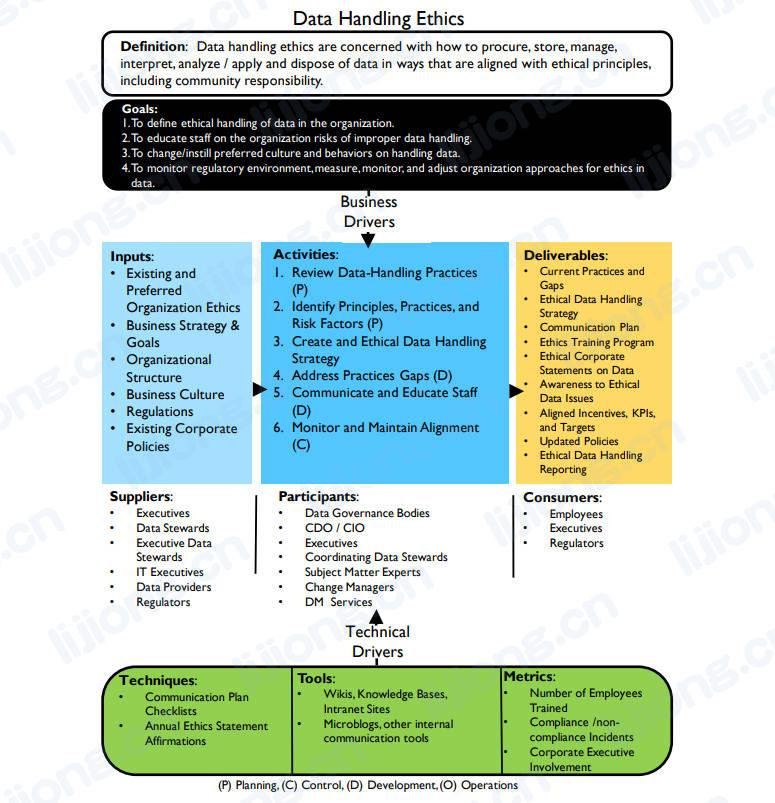
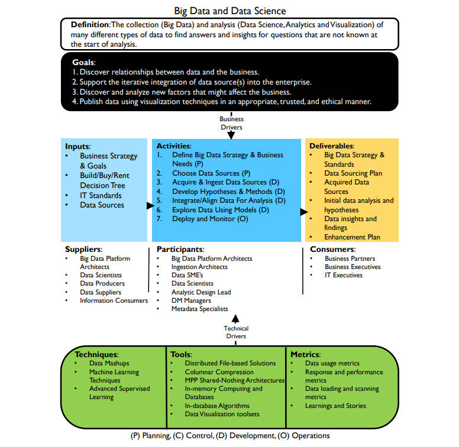
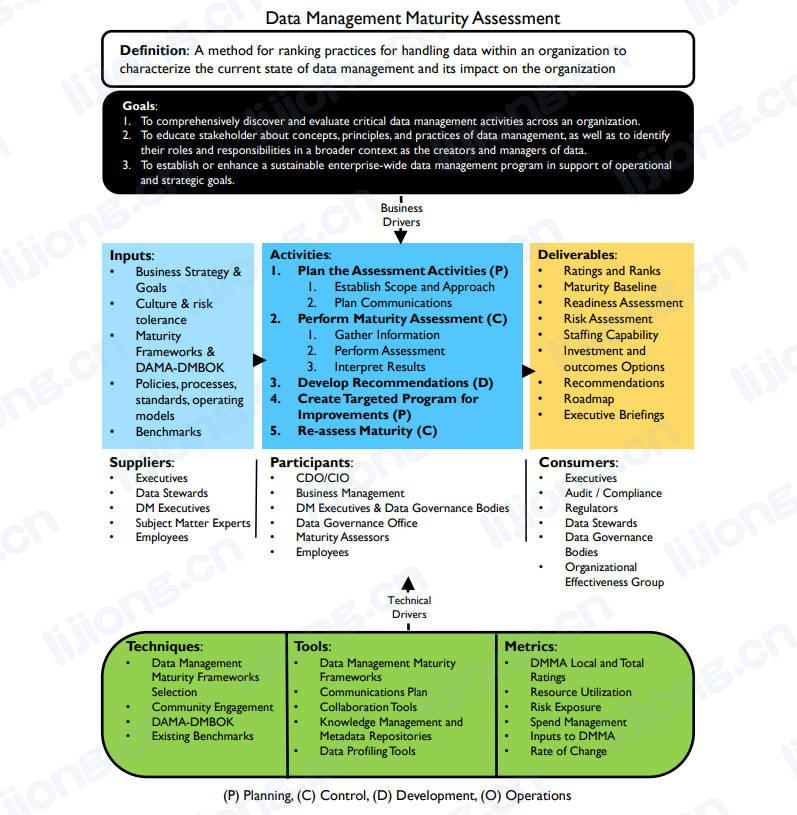

# 数据管理的其他主题

## 数据处理道德（Data Handling Ethics）

- 数据处理道德描述了数据道德原则在制定明智的、合乎道德的数据相关决策方面所发挥的核心作用，数据收集、分析和使用的道德意识应指导所有数据管理专业人员
- Data Handling Ethics describes the central role that data ethics plays in making informed, socially responsible decisions about data and its uses. Awareness of the ethics of data collection, analysis, and use should guide all data management professionals.

## 大数据和数据科学（Big Data and Data Science）

- 大数据和数据科学描述了随着对大量的、种类繁多的数据集收集和分析能力的提高而出现的技术和业务流程
- Big Data and Data Science describes the technologies and business processes that emerge as our ability to collect and analyze large and diverse data sets increases.

## 数据管理成熟度评估（Data Management Maturity Assessment）

- 数据管理成熟度评估概述了一种评估和提高组织的数据管理能力的方法
- Data Management Maturity Assessment outlines an approach to evaluating and improving an organization’s data management capabilities.

## 数据管理组织和角色期望（Data Management Organization and Role Expectations）

- 数据管理组织和角色期望为数据管理团队的组织和成功数据管理实践的实现提供了最佳实践和注意事项
- Data Management Organization and Role Expectations provide best practices and considerations for organizing data management teams and enabling successful data management practices.

## 数据管理和组织变革管理（Data Management and Organizational Change Management）

- 数据管理和组织变革管理描述了如何规划和成功完成在组织中嵌入有效数据管理实践所必须的文化变革
- Data Management and Organizational Change Management describes how to plan for and successfully move through the cultural changes that are necessary to embed effective data management practices within an organization.