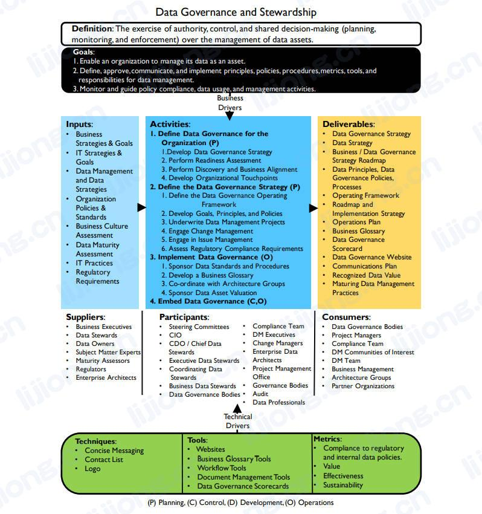
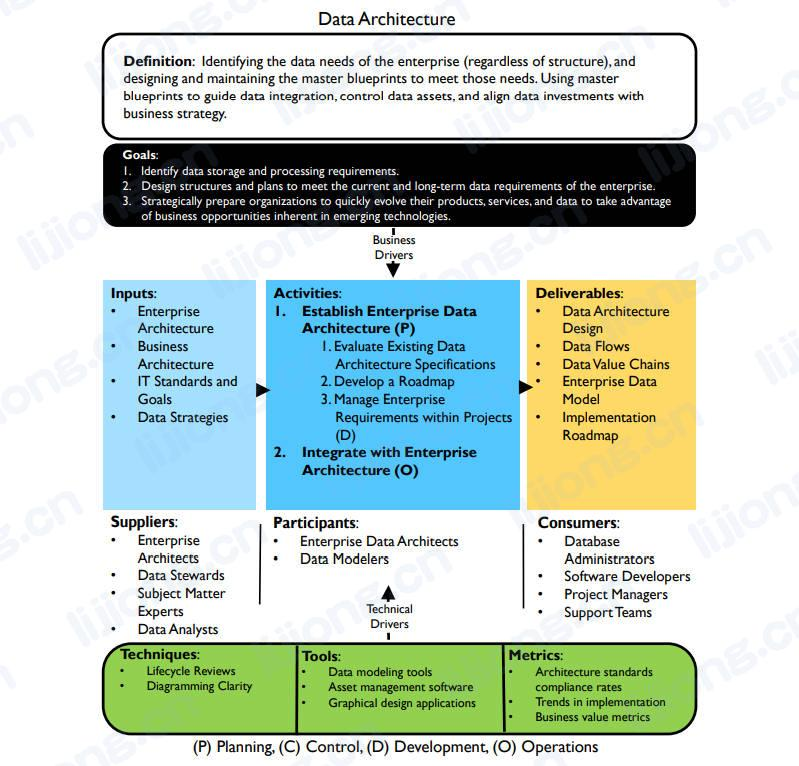
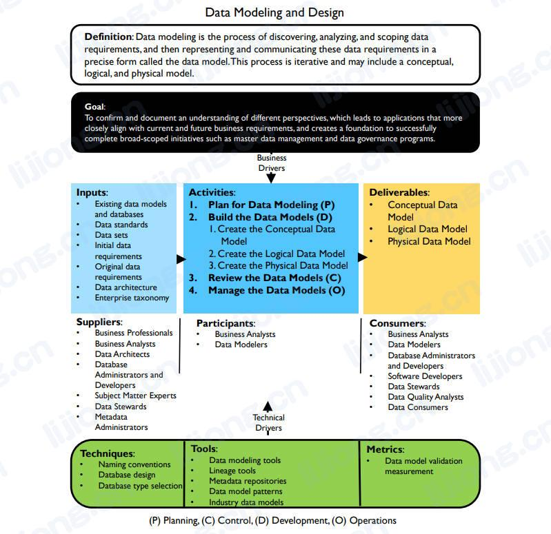
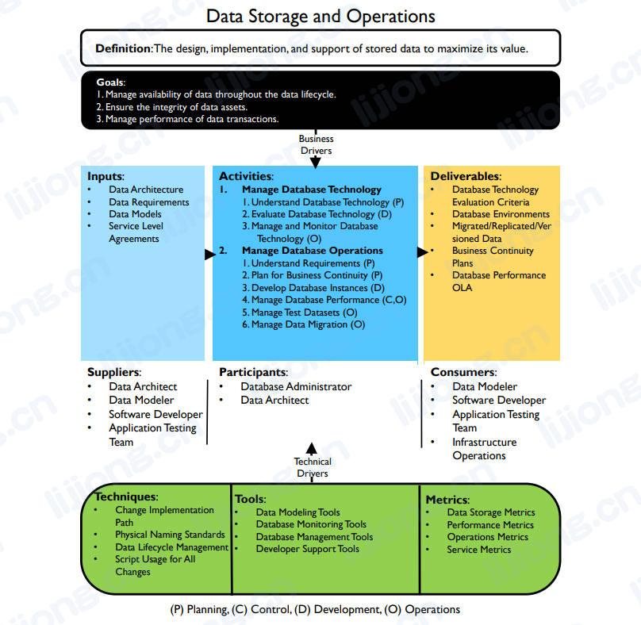
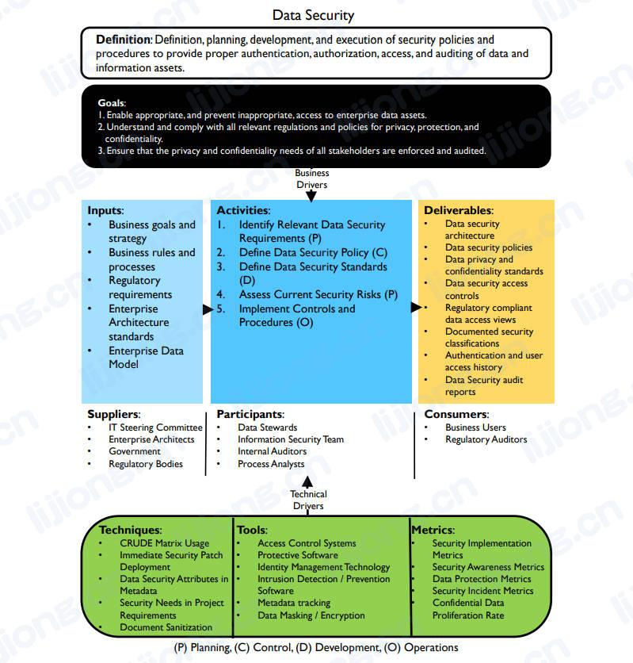
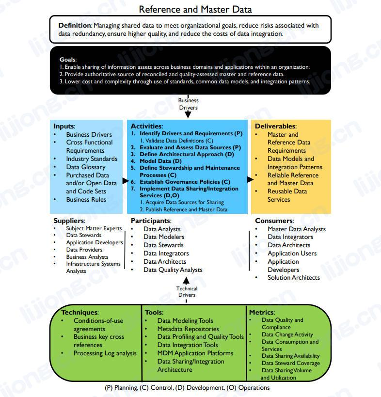
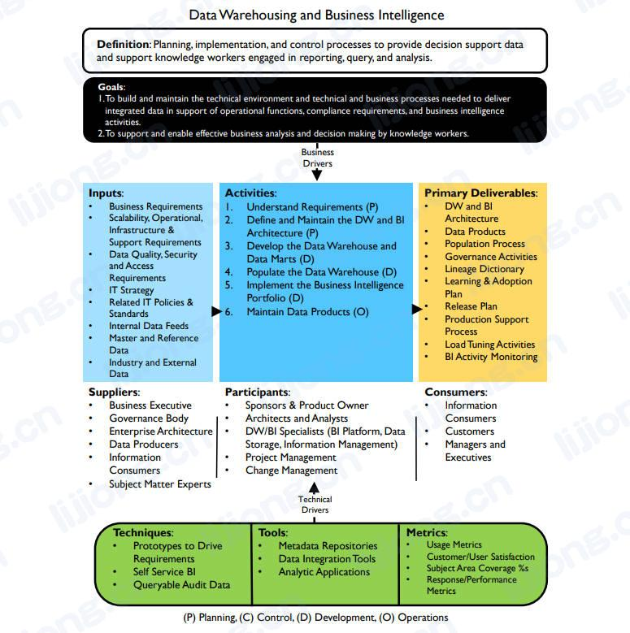
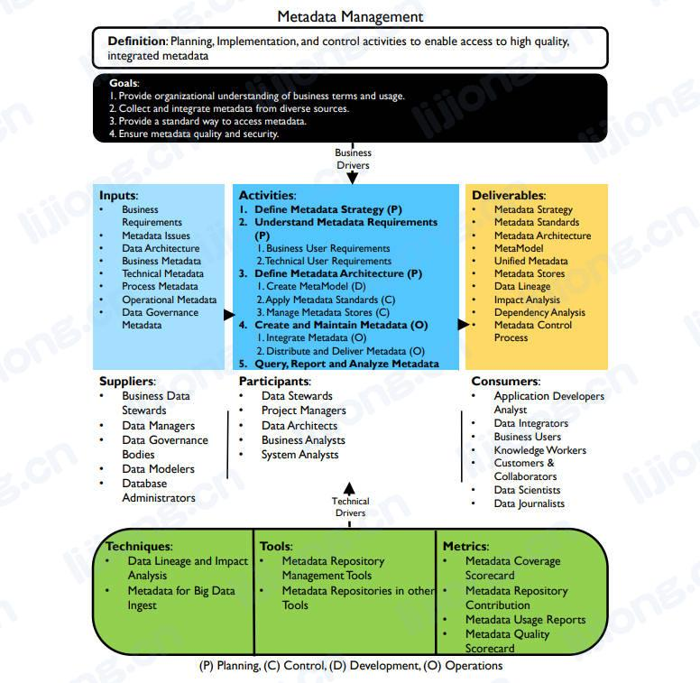
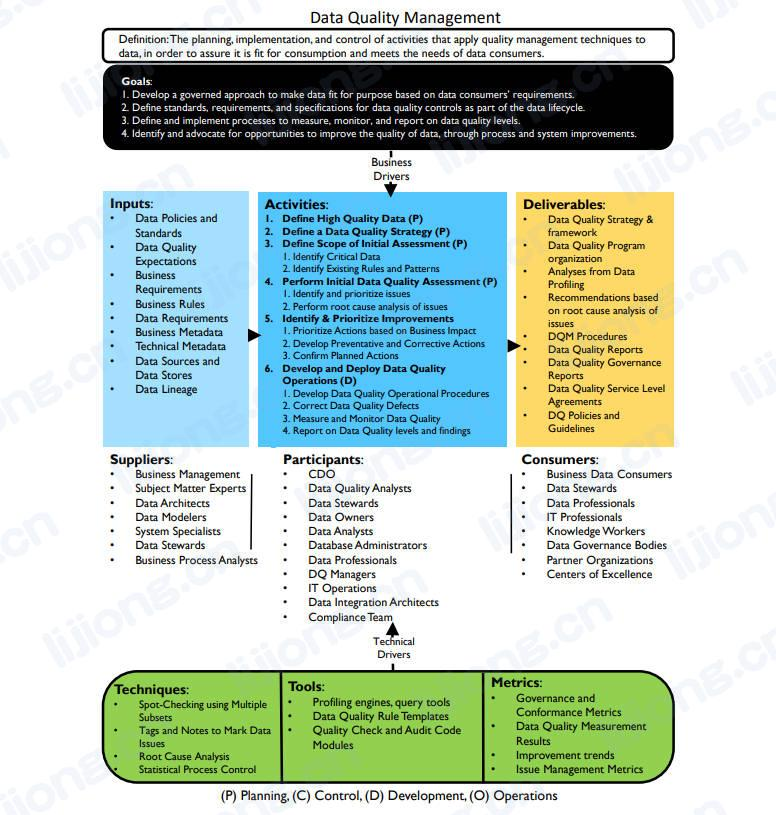

# **数据管理知识领域**

- 知识领域描述数据管理活动集的范围和前后关系，因为数据在组织内横向移动，知识领域活动相互交叉并与其他组织的职能交叉。

## 数据治理（Data Governance）

- 数据治理通过建立一个为企业需求负责的数据决策系统，为数据管理提供指导和监督。
- Data Governance provides direction and oversight for data management by establishing a system of decision rights over data that accounts for the needs of the enterprise

## 数据架构（Data Architecture）

- 数据架构定义与组织战略一致的管理数据资产蓝图，以建立战略数据需求和满足这些需求的设计。
- Data Architecture defines the blueprint for managing data assets by aligning with organizational strategy to establish strategic data requirements and designs to meet these requirements.

## 数据建模和设计（Data Modeling and Design）

- 数据建模和设计是通过一种被称为数据模型的精确形式来发现、分析、表示和沟通数据需求的过程。
- Data Modeling and Design is the process of discovering, analyzing, representing, and communicating data requirements in a precise form called the data model.

## 数据存储和操作（Data Storage and Operations）

- 数据存储和操作包括存储数据的设计、实施和支持，以最大化其价值，操作为从数据的规划到销毁的整个生命周期提供支持。
- Data Storage and Operations includes the design, implementation, and support of stored data to maximize its value. Operations provide support throughout the data lifecycle from planning for to disposal of data.

## 数据安全（Data Security）

- 数据安全确保数据的隐私和保密、不被泄露以及被正确地访问。
- Data Security ensures that data privacy and confidentiality are maintained, that data is not breached, and that data is accessed appropriately.

## 数据集成和互操作性（Data Integration and Interoperability）

- 数据集成和互操作性包括与数据存储、应用程序和组织内部或其之间数据移动和整合相关的过程。
- Data Integration and Interoperability includes processes related to the movement and consolidation of data within and between data stores, applications, and organizations.

## 文档和内容管理（Document and Content Management）

- 文档和内容管理包括规划、实施和控制活动，用于管理在一系列非结构化媒体中发现的数据和信息的生命周期，特别是支持法律和监管的合规需求所需的文档。
- Document and Content Management includes planning, implementation, and control activities used to manage the lifecycle of data and information found in a range of unstructured media, especially documents needed to support legal and regulatory compliance requirements.

## 参考数据和主数据（Reference and Master Data）

- 参考数据和主数据包括核心关键共享数据的持续协调和维护，以实现各系统一致使用基本业务实体最准确、及时和相关联的真实版本。
- Reference and Master Data includes ongoing reconciliation and maintenance of core critical shared data to enable consistent use across systems of the most accurate, timely, and relevant version of truth about essential business entities.

## 数据仓库和商业智能（Data Warehousing and Business Intelligence）

- 数据仓库和商业智能包括规划、实施和控制流程，用于管理决策支持数据，并使知识工作者能够通过数据分析和报告获得价值。
- Data Warehousing and Business Intelligence includes the planning, implementation, and control processes to manage decision support data and to enable knowledge workers to get value from data via analysis and reporting.

## 元数据（Metadata ）

- 元数据包括规划、实施和控制活动，以便能够访问高质量的、集成的元数据，包括定义、模型、数据流，以及其他对理解数据和用于创造、维护和访问数据的系统非常重要的信息。
- Metadata includes planning, implementation, and control activities to enable access to high quality, integrated Metadata, including definitions, models, data flows, and other information critical to understanding data and the systems through which it is created, maintained, and accessed.

## 数据质量（Data Quality）

- 数据质量包括质量管理技术的规划和实施，用于衡量、评估和提升数据在组织内使用的适用性。
  - fitness：the state of being suitable or good enough for something
- Data Quality includes the planning and implementation of quality management techniques to measure, assess, and improve the fitness of data for use within an organization.

