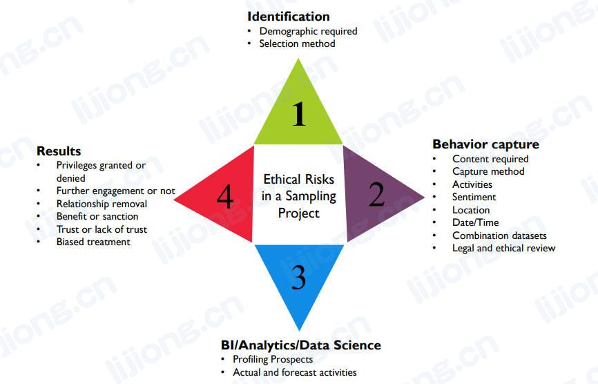

## **数据道德文化的建立**

Establishing an Ethical Data Culture

### 审查数据处理实践的当前状态（Review Current State Data Handling Practices）

- 了解当前数据处理实践与道德和合规驱动因素相关的程度
- 了解员工对现有做法在建立和维护客户、合作伙伴以及其他利益相关方信任方面的道德影响的理解程度

### 确定原则、实践和风险因素（Identify Principles, Practices, and Risk Factors）

- 原则应与风险和实践保持一致，并得到控制的支持
  - 原则：人们对某信息享有隐私权，因此划定授权范围
  - 风险：该信息被广泛访问的风险
  - 实践：规定可访问该信息的人员和目的
  - 控制：对可访问信息系统的所有用户进行周期性审查

### 制定合乎道德的数据处理策略和路线图（Create an Ethical Data Handling Strategy and Roadmap）

- 价值观陈述（Values statements）
  - 数据处理和决策制定的道德框架
- 合乎道德的数据处理原则（Ethical data handling principles）
  - 描述组织如何应对数据带来的挑战，原则和预期行为（expected behaviors）可以总结为道德准则（a code of ethics），并包括到培训和沟通计划中
- 合规框架（Compliance framework）
  - 驱动组织义务的因素，与地理和行业有关
- 风险评估（Risk assessments）
  - 确定组织内出现特定问题的可能性和影响（the likelihood and the implications）
- 培训和交流（Training and communications）
  - 培训包括对道德准则的审查，员工必须签字证明其熟悉道德准则及不道德数据处理的影响，培训应持续进行，沟通应覆盖所有员工
- 路线图（Roadmap）
  - 经过管理层批准的活动时间表，包括培训和沟通计划、识别和弥补现有实践的差距、缓解风险和健康的计划
- 审计和监控方法（Approach to auditing and monitoring）
  - 监控特定的活动以确保其符合道德原则

### 采用对社会负责的道德风险模型（Adopt a Socially Responsible Ethical Risk Model ）

- 公平地执行商业智能、分析和数据科学活动需要超越所在组织界限的道德观念，并考虑到对更广泛社会的影响（implications to the wider community）
  - 如果一个组织为客户设定标准（criterion）并停止为某些客户服务，一旦该组织垄断了特定区域的基本服务（essential service），一些人可能无法获得基本服务
- 通过风险模型来确定是否执行项目以及如何执行项目
- 道德风险模型
  1. 如何选择研究人群
     - 识别
       - 所需人口统计
       - 选择的方法
  2. 如何获取数据
     - 行为获取
       - 所需内容
       - 获取方法
       - 活动
       - 情绪
       - 地点
       - 日期/实践
       - 组合数据集
       - 法律和道德审查
  3. 分析将关注哪些活动
     - 商业智能/分析/数据科学
       - 描述前景（Profiling Prospects）
       - 实际和预测的活动
  4. 结果将如何公开
     - 结果
       - 授予或拒绝的权限
       - 是否进一步参与
       - 解除关系
       - 利益或制裁
       - 信任或不信任
       - 偏见对待

