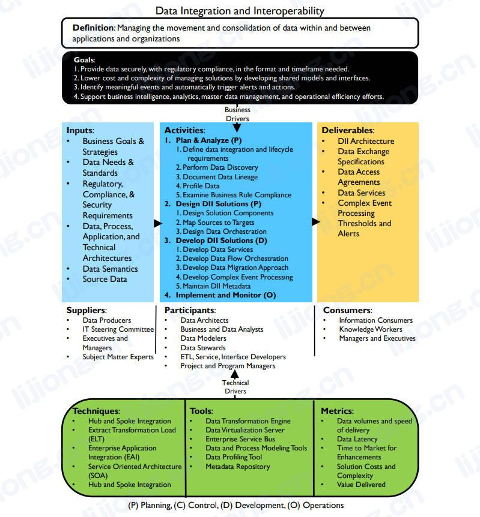

# **数据集成和互操作性框架**

## 定义

- 管理应用程序和组织内部及其之间的数据移动和整合（Managing the movement and consolidation of data within and between applications and organizations.）

## 目标

1. 以所需的格式和时间范围安全地提供数据，并遵守法规（Provide data securely, with regulatory compliance, in the format and timeframe needed.）
2. 通过开发共享模型和接口来降低管理解决方案的成本和复杂性（Lower cost and complexity of managing solutions by developing shared models and interfaces.）
3. 识别有意义的事件并自动触发警报和操作（Identify meaningful events and automatically trigger alerts and actions.）
4. 支持商业智能、分析、主数据管理和运营效率工作（Support business intelligence, analytics, master data management, and operational efficiency efforts.）

## 输入

- 业务目标和策略（Business Goals & Strategies）
- 数据需求和标准（Data Needs & Standards）
- 监管、合规和安全要求（Regulatory, Compliance, & Security Requirements）
- 数据、过程、应用和技术架构（Data, Process, Application, and Technical Architectures）
- 数据语义（Data Semantics）
- 源数据（Source Data）

## 提供者

- 数据生产者（Data Producers）
- 信息技术指导委员会（IT Steering Committee）
- 高管和经理（Executives and Managers）
- 主题专家（Subject Matter Experts）

## 活动

1. 【规划】计划和分析（Plan & Analyze）
   1. 确定数据集成和生命周期要求（Define data integration and lifecycle requirements ）
   2. 执行数据发现（Perform Data Discovery）
   3. 文档数据血缘（Document Data Lineage）
   4. 数据概要分析（Profile Data）
   5. 检查业务规则合规性（Examine Business Rule Compliance）
2. 【规划】设计DII解决方案（Design DII Solutions）
   1. 设计解决方案组件（Design Solution Components）
   2. 将源映射到目标（Map Sources to Targets）
   3. 设计数据编排（Design Data Orchestration）
3. 【开发】开发DII解决方案（Develop DII Solutions）
   1. 开发数据服务（Develop Data Services）
   2. 开发数据流编排（Develop Data Flow Orchestration）
   3. 制定数据迁移方法（Develop Data Migration Approach）
   4. 开发复杂事件处理（Develop Complex Event Processing）
   5. 维护DII元数据（Maintain DII Metadata）
4. 【运营】实施和监控（Implement and Monitor）

## 参与者

- 数据架构师（Data Architects）
- 业务和数据分析师（Business and Data Analysts）
- 数据建模师（Data Modelers）
- 数据专员（Data Stewards）
- ETL、服务、接口开发人员（ETL, Service, Interface Developers）
- 项目和项目集经理（Project and Program Managers）

## 交付

- DII架构（DII Architecture）
- 数据交换规范（Data Exchange Specifications）
- 数据访问协议（Data Access Agreements）
- 数据服务（Data Services）
- 复杂事件处理阈值和警报（Complex Event Processing Thresholds and Alerts）

## 消费者

- 信息消费组（Information Consumers）
- 知识工作中（Knowledge Workers）
- 经理和高管（Managers and Executives）

## 技术

- 中心辐射式集成（Hub and Spoke Integration）
- 抽取、转换、加载（Extract Transformation Load (ELT)）
- 企业应用集成（Enterprise Application Integration (EAI)）
- 面向服务架构（Service Oriented Architecture (SOA)）

## 工具

- 数据转换引擎（Data Transformation Engine）
- 数据虚拟化服务器（Data Virtualization Server）
- 企业服务总线（Enterprise Service Bus）
- 数据和过程建模工具（Data and Process Modeling Tools）
- 数据概要分析工具（Data Profiling Tool）
- 元数据存储库（Metadata Repository）

## 指标

- 数据量和传输速度（Data volumes and speed of delivery）
- 数据延迟（Data Latency）
- 增强功能的上线时间（Time to Market for Enhancements）
- 解决方案成本和复杂性（Solution Costs and Complexity）
- 已交付价值（Value Delivered）