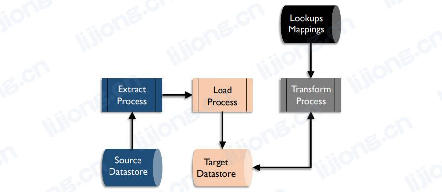

## **数据集成和互操作性的抽取、转换和加载**

- 数据集成和互操作性所有领域的核心是抽取、转换和加载
- 如果目标系统比源系统或中间系统具有更多的转换能力，则处理顺序可以变换为ELT，ELT允许在加载到目标系统后进行转换，ELT允许源数据在目标系统上实例化为原始数据，这对其他过程很有用，在ELT加载数据湖的大数据环境中很常见
- ETL流程

- ELT流程

### 抽取（Extract）

- 选择所需的数据并将其从源系统抽取

### 转换（Transform）

- 使所需数据与目标数据存储的结构兼容，转换包括数据移动到目标时从源系统删除、数据复制到多个目标以及数据用于触发事件但不持久化
- 转换样例
  - 格式变化（Format changes）
    - 数据技术格式的转换，如从EBCDIC格式到ASCII格式
  - 结构变化（Structure changes）
    - 数据结构的变化，如从非规范化记录到规范化记录
  - 语义转换（Semantic conversion）
    - 转换数据值以保持一致的语义表示，如将0、1、2、3转换为UNKNOWN、FEMALE、MALE、NOT PROVIDED
  - 删除重复数据（De-duping）
    - 确保规则需要的唯一键值或记录，包括扫描目标以及检测和删除重复行
  - 重新排序（Re-ordering）
    - 更改数据元素或记录的顺序以适应已定义的模式

### 加载（Load）

- 在目标系统中物理存储或呈现转换结果

### 映射（Mapping）

- 转换的同义词，既是开发从原结构到目标结构的查找矩阵（lookup matrix）的过程，也是该过程的结果
- 映射定义要抽取的源系统、用于识别要抽取数据的规则、要加载的目标系统、用于识别要更新的目标行的规则（如果有）以及要应用的任何转换或计算规则