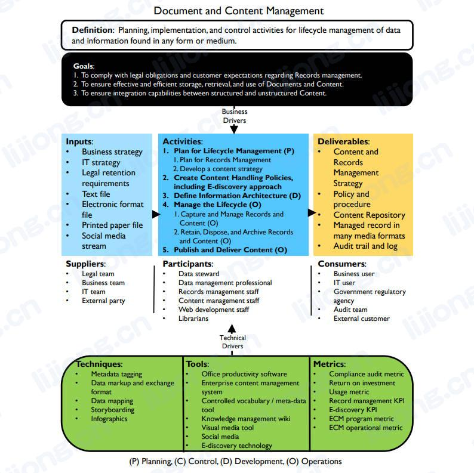

# **文档和内容管理框架**

## 定义

- 对任何形式或介质中的数据和信息进行生命周期管理的规划、实施和控制活动（Planning, implementation, and control activities for lifecycle management of data and information found in any form or medium.）

## 目标

1. 遵守有关记录管理的法律义务和客户期望（To comply with legal obligations and customer expectations regarding Records management.）
2. 确保有效且高效地存储、检索、使用文档和内容（To ensure effective and efficient storage, retrieval, and use of Documents and Content.）
3. 确保结构化和非结构化内容之间的集成能力（To ensure integration capabilities between structured and unstructured Content.）

## 输入

- 业务战略（Business strategy）
- IT战略（IT strategy）
- 法定保留要求（Legal retention requirements）
- 文本文件（Text file）
- 电子格式文件（Electronic format file）
- 打印的纸质文件（Printed paper file）
- 社会媒体流（Social media stream）

## 提供者

- 法律团队（Legal team）
- 业务团队（Business team）
- IT团队（IT team）
- 外部团队（External party）

## 活动

1. 【规划】生命周期管理规划（Plan for Lifecycle Management）
   1. 记录管理规划（Plan for Records Management）
   2. 制定内容策略（Develop a content strategy）
2. 【规划】制定内容处理策略，包括电子发现方法（Create Content Handling Policies, including E-discovery approach）
3. 【开发】定义信息架构（Define Information Architecture）
4. 【运营】管理生命周期（Manage the Lifecycle）
   1. 捕获和管理记录和内容（Capture and Manage Records and Content）
   2. 保留、处置和归档记录和内容（Retain, Dispose, and Archive Records and Content）
5. 【运营】发布和传递内容（Publish and Deliver Content ）

## 参与者

- 数据专员（Data steward）
- 数据管理专家（Data management professional）
- 记录管理员（Records management staff）
- 内容管理员（Content management staff）
- 网页开发人员（Web development staff）
- 图书馆员（Librarians）

## 交付

- 内容和记录管理策略（Content and Records Management Strategy）
- 政策和程序（Policy and procedure ）
- 内容库（Content Repository）
- 管理中的多种媒体格式中的记录（Managed record in many media formats）
- 审计跟踪和日志（Audit trail and log）

## 消费者

- 业务用户（Business user）
- IT用户（IT user）
- 政府监管机构（Government regulatory agency）
- 审计团队（Audit team）
- 外部客户（External customer）

## 技术

- 元数据标签（Metadata tagging）
- 数据标记和交换格式（Data markup and exchange format）
- 数据映射（Data mapping）
- 故事板（Storyboarding）
- 信息图表（Infographics）

## 工具

- 办公生产力软件（Office productivity software）
- 企业内容管理系统（Enterprise content management system）
- 受控词汇 / 元数据工具（Controlled vocabulary / meta-data tool）
- 知识管理维基（Knowledge management wiki）
- 视觉媒体工具（Visual media tool）
- 社交媒体（Social media）
- 电子发现技术（E-discovery technology）

## 指标

- 合规审计指标（Compliance audit metric）
- 投资回报（Return on investment）
- 使用指标（Usage metric）
- 记录管理KPI（Record management KPI）
- 电子发现KPI（E-discovery KPI）
- 企业内容管理程序指标（ECM program metric）
- 企业内容管理运营指标（ECM operational metric）