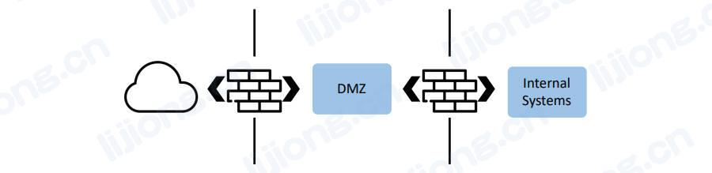

# **网络安全术语**

### 后门（Backdoor）

- 被忽视或隐藏的进入计算机系统或应用程序的入口，其允许未经授权的用户绕过密码要求获得访问权限，通常由开发人员出于维护目的而创建，其他后门是由商业软件包的创建者设置的
- 任何后门都是有风险的，安装任何系统或网页包时不更改默认密码都是后面，毫无疑问会被黑客知道

### 机器人或僵尸（Bot or Zombie）

- 已经被恶意黑客使用特洛伊木马、病毒、网络钓鱼或对受感染文件的下载而接管的工作站，被远程控制的机器人用于执行恶意任务，如发送大量垃圾邮件、使用阻塞网络的数据包攻击合法企业、执行非法汇款以及托管欺诈网站等，Bot-Net是机器人计算机的网络

### Cookie

- 网站安装在计算机硬盘驱动器上的小数据文件，用于识别回访者并记录其偏好，可能被间谍软件（spyware）使用

### 防火墙（Firewall）

- 过滤网络流量（network traffic）以保护单个计算机或整个网络免受未经授权的访问或对系统的攻击的软件或硬件，防火墙可以扫描传入和传出通信中的受限或受监管信息，并防止其未经许可通过，即数据丢失防护（Data Loss Prevention），一些防火墙还限制对特定外部网站的访问

### 边界（Perimeter）

- 组织环境和外部系统之间的边界（boundary），通常所有内部和外部环境之间都会有防火墙

### DMZ

- 非军事区（de-militarized zone）的简称，在组织边缘的区域，在其与组织之间和其与互联网之间有防火墙，DMZ环境用于传递或临时存储在组织之间移动的数据

### 超级用户账号（Super User Account）

- 对系统有管理员或根访问权限的账号，仅在紧急情况下使用，这些账号的凭据（credentials）是高度安全的，只在紧急情况下通过适当的文件和批准才能发放，并在短时间内过期，如分配到生产控制的员工可能需要多个大型系统的访问授权，这些授权严格控制时间、用户ID、位置或其他要求以防止滥用

### 键盘记录器（Key Logger）

- 一种攻击软件，记录在键盘上的所有按键，然后发送到网络上的其他地方

### 渗透测试（Penetration Testing）

- 来自组织本身或从外部安全公司雇用的有道德黑客尝试从外部闯入系统，以识别系统漏洞，通过渗透测试发现的漏洞可以在应用程序发布前得到解决，

### 虚拟专用网络（VPN，Virtual Private Network）

- 使用不安全的互联网创建进入组织环境的安全路径，其通过使用多个身份验证元素与组织环境外围的防火墙连接，允许用户与内部网络之间进行通信，其对所有传输的数据进行高度加密