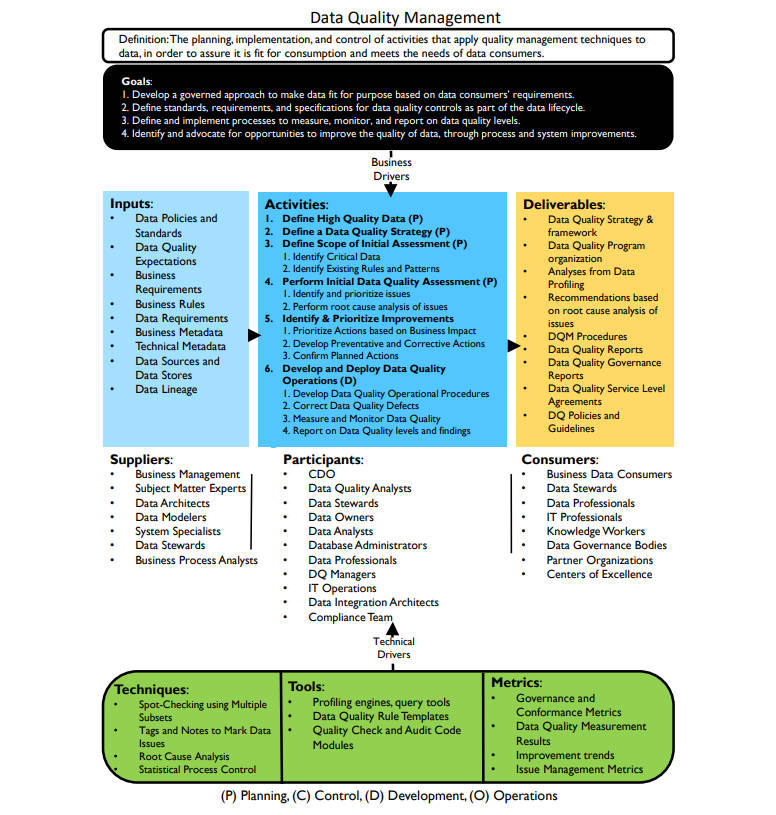

# **数据质量框架**

## 定义

- 对将质量管理技术应用于数据的活动进行规划、实施和控制，以确保数据适合消费并满足数据消费者的需求（The planning, implementation, and control of activities that apply quality management techniques to data, in order to assure it is fit for consumption and meets the needs of data consumers.）

## 目标

1. 根据数据消费者的需求制定一种管理方法，以使数据符合目的（Develop a governed approach to make data fit for purpose based on data consumers’ requirements.）
2. 确定数据生命周期中数据质量控制的标准、要求和规范（Define standards, requirements, and specifications for data quality controls as part of the data lifecycle.）
3. 确定并实施衡量、监控和报告数据质量水平的流程（Define and implement processes to measure, monitor, and report on data quality levels.）
4. 通过流程和系统改进，识别并倡导提高数据质量的机会（Identify and advocate for opportunities to improve the quality of data, through process and system improvements.）

## 输入

- 数据政策和标准（Data Policies and Standards）
- 数据质量期望（Data Quality Expectations）
- 业务需求（Business Requirements）
- 业务规则（Business Rules）
- 数据要求（Data Requirements）
- 业务元数据（Business Metadata）
- 技术元数据（Technical Metadata）
- 数据源和数据存储（Data Sources and Data Stores）
- 数据血缘（Data Lineage）

## 提供者

- 业务管理人员（Business Management）
- 主题专家（Subject Matter Experts）
- 数据架构师（Data Architects）
- 数据建模师（Data Modelers）
- 系统专家（System Specialists）
- 数据专员（Data Stewards）
- 业务流程分析师（Business Process Analysts）

## 活动

1. 【规划】定义高质量数据（Define High Quality Data）
2. 【规划】确定数据质量策略（Define a Data Quality Strategy）
3. 【规划】确定初步评估范围（Define Scope of Initial Assessment）
   1. 识别关键数据（Identify Critical Data）
   2. 识别现有规则和模式（Identify Existing Rules and Patterns）
4. 【规划】进行初始数据质量评估（Perform Initial Data Quality Assessment）
   1. 识别问题并确定优先级（Identify and prioritize issues）
   2. 对问题进行根本原因分析（Perform root cause analysis of issues）
5. 【规划】确定改进措施并确定优先级（Identify & Prioritize Improvements）
   1. 根据业务影响确定行动优先级（Prioritize Actions based on Business Impact）
   2. 制定预防和纠正措施（Develop Preventative and Corrective Actions）
   3. 确认规划的行动（Confirm Planned Actions）
6. 【开发】开发和部署数据质量操作（Develop and Deploy Data Quality Operations）
   1. 开发数据质量操作程序（Develop Data Quality Operational Procedures）
   2. 修正数据质量缺陷（Correct Data Quality Defects）
   3. 度量和监控数据质量（Measure and Monitor Data Quality）
   4. 报告数据质量水平和调查结果（Report on Data Quality levels and findings）

## 参与者

- 首席数据官（CDO）
- 数据质量分析师（Data Quality Analysts）
- 数据专员（Data Stewards）
- 数据所有者（Data Owners）
- 数据分析师（Data Analysts）
- 数据库管理员（Database Administrators）
- 数据专业人士（Data Professionals）
- 数据质量经理（DQ Managers）
- IT操作人员（IT Operations）
- 数据集成架构师（Data Integration Architects）
- 合规团队（Compliance Team）

## 交付

- 数据质量策略和框架（Data Quality Strategy & framework）
- 数据质量方案组织（Data Quality Program organization）
- 数据概况分析（Analyses from Data Profiling）
- 基于问题根本原因分析的建议（Recommendations based on root cause analysis of issues）
- 数据质量管理程序（DQM Procedures）
- 数据质量报告（Data Quality Reports）
- 数据质量治理报告（Data Quality Governance Reports）
- 数据质量服务水平协议（Data Quality Service Level Agreements）
- 数据政策和指南（DQ Policies and Guidelines）

## 消费者

- 业务数据消费者（Business Data Consumers）
- 数据专员（Data Stewards）
- 数据专业人士（Data Professionals）
- IT专业人士（IT Professionals）
- 知识工作者（Knowledge Workers）
- 数据治理机构（Data Governance Bodies）
- 合作组织（Partner Organizations）
- 卓越中心（Centers of Excellence）

## 技术

- 使用多个子集进行抽查（Spot-Checking using Multiple Subsets）
- 标记和注释数据问题（Tags and Notes to Mark Data Issues）
- 根本原因分析（Root Cause Analysis）
- 统计过程控制（Statistical Process Control）

## 工具

- 分析引擎、查询工具（Profiling engines, query tools）
- 数据质量规则模板（Data Quality Rule Templates）
- 质量检查和审核代码模块（Quality Check and Audit Code Modules）

## 指标

- 治理和一致性指标（Governance and Conformance Metrics）
- 数据质量测量结果（Data Quality Measurement Results）
- 改进趋势（Improvement trends）
- 问题管理指标（Issue Management Metrics）