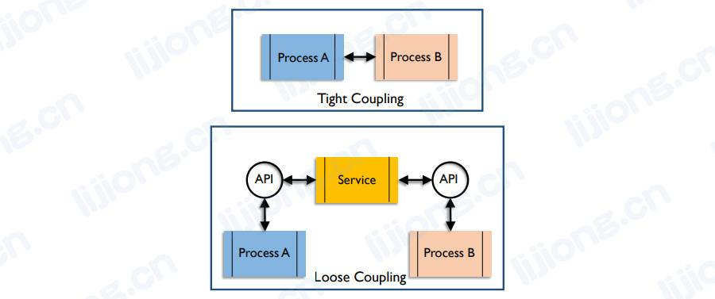
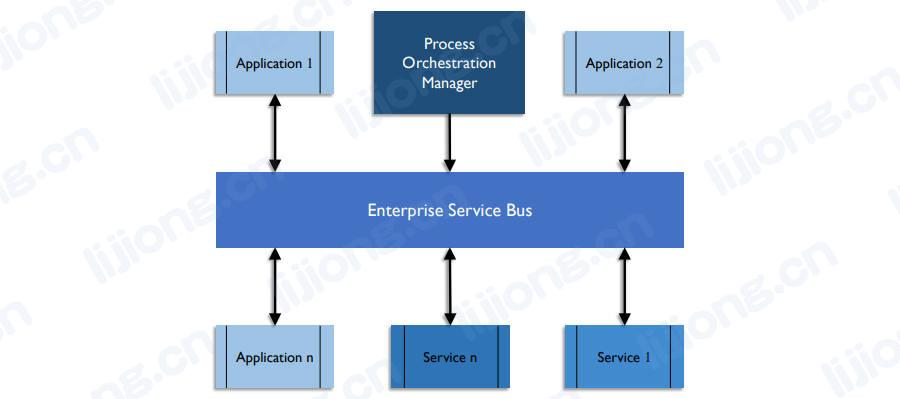

## **数据集成和互操作性的架构概念**

### 应用耦合（Application Coupling）

- 耦合描述了两个系统交织的程度，紧耦合（Tight Coupling）的两个系统通常具有同步接口，其中一个系统等待另一个系统的响应。紧耦合的风险更高：如果一个系统不可用，那么另一个系统也不可用，并且两个系统的业务连续性计划必须相同。
- 松耦合（Loose Coupling）是首选的接口设计，其中数据在系统间传递而无需等待响应，并且一个系统不可用不会导致另一个系统不可用。松耦合可以通过服务、API或消息队列等技术来实现。

- 使用企业服务总线的面向服务架构是松耦合数据交互设计模式的一个示例。

### 编排和流程控制（Orchestration and Process Controls）

- 编排是描述如何在系统中组织和执行多个进程的术语。所有处理消息或数据包的系统都必须能够管理这些流程的执行顺序，以保持一致性和连续性。
- 流程控制是确保数据的传输、交付、抽取和加载的准确性和完整性的组件，是基本数据移动架构中经常被忽视的一个方面。
- 流程控制的内容
  - 数据库活动日志
  - 批处理作业日志
  - 警报
  - 异常日志
  - 带有补救选项、标准响应的工作依赖图表
  - 作业时钟信息，如依赖作业的定时、作业的预期时长、计算（可用）窗口时间

### 企业应用集成（EAI，Enterprise Application Integration）

- 在企业应用集成模型中，软件模块仅通过明确定义的接口调用（API）进行交互。数据存储仅由其自己的软件模块更新，其他软件无法访问应用程序中的数据，只能通过API进行访问。EAI建立在面向对象的概念上，强调重用以及替换任何模块而不影响其他模块的能力。

### 企业服务总线（ESB，Enterprise Service Bus）

- 企业服务总线是一个充当系统之间中介的系统，其在系统之间传递消息。应用程序可以使用ESB发送和接收消息或文件，并与ESB上存在的其他进程封装在一起。作为松耦合的一个示例，ESB充当应用程序之间的服务。

### 面向服务架构（Service-Oriented Architecture）

- 面向服务架构中提供数据或更新数据（或其他数据服务）的功能通过应用程序间明确定义（well-defined: easy to see or understand）的服务调用来提供，应用程序不必与其他应用程序直接交互或了解其他应用程序的内部工作原理。SOA使应用程序独立，并使组织能够更换系统，而无需对与其交互的系统进行重大更改。
- 面向服务架构的目标是在独立的软件模块间具有明确定义的交互。面向服务的架构可以通过Web服务、消息传递、RESTful API等技术实现。服务通常被是实现为可供应用系统（或人类消费者）调用的API。

### 复杂事件处理（CEP，Complex Event Processing）

- 事件处理是一种跟踪和分析（处理）关于发生的事件的信息（数据）流并从中得出结论的方法。复杂事件处理结合来自多个来源的数据来识别有意义的事件（如机会或威胁），以预测行为或活动并自动触发实时响应，如建议消费者购买产品。
- 在很多情况下事情发生的速度使得在事件发生时检索解释事件所需的附加数据是不切实际的，高效的处理通常需要在CEP引擎的内存中预存一些数据。
- 支持复杂事件处理需要一个能够集成大量各种类型数据的环境。由于预测通常涉及数据的数量和种类，复杂事件处理通常与大数据联系在一起，其通常需要使用支持超低延迟的技术，如处理实时流数据和内存数据库。

### 数据联邦和虚拟化（Data Federation and Virtualization）

- 当数据存在于不同的数据存储中时，可以通过物理集成以外的方式将其聚集在一起。数据联邦提供对各个数据存储的组合的访问，无论其结构如何。数据虚拟化使分布式数据库以及多个异构数据存储（heterogeneous data stores）能够作为一个数据库来进行访问和查看。

### 数据即服务（DaaS，Data-as-a-Service）

- 软件即服务是一种交付和许可模式。应用程序被许可提供服务，但软件和数据位于软件供应商控制的数据中心，而不是许可组织的数据中心。提供不同层次的基础设施即服务（IT即服务、平台即服务、数据库即服务）的概念与此类似。
- 数据即服务是从供应商获得许可并按需提供数据，而不是在许可组织的数据中心进行存储和维护。如通过证券交易算出售的证券及相关价格的信息。

### 基于云的集成（Cloud-based Integration）

- 基于云的集成，也被称为集成平台即服务（IPaas，integration platform-as-a-service），是一种作为云服务提供的数据集成形式。
- 在云计算出现前，集成可以分为内部集成和企业对企业（B2B）。内部集成通过内部中间件提供服务，并通过企业服务总线（ESB）来管理系统之间的数据交换。企业间集成是通过电子数据交换（EDI，electronic data interchange）网关或增值网络（VAN，value-added networks）或市场（market places）来提供服务。
- 基于云的集成解决方案通常作为SaaS应用程序在供应商的数据中心运行，而不是在拥有被集成数据的组织中运行。基于云的集成使用SOA交互服务于要集成的SaaS应用程序数据进行交互。