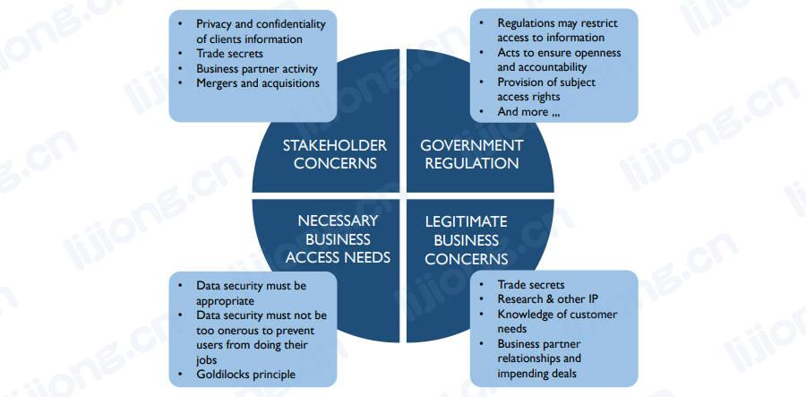

# **数据安全要求的来源**

- 数据安全要求的来源
  - 利益相关者（Stakeholders）
    - 组织必须认识到利益相关者（包括客户、患者、学生、公民、供应商或业务合作伙伴）的隐私和保密需求，组织中每个人都必须是有关利益相关者数据的负责的受托人（responsible trustee）
  - 政府法规（Government regulations）
    - 法规的出台时为了保护一些利益相关者的利益，有些法规限制对信息的访问，而另一些则确保公开、透明和问责制（openness, transparency, and accountability）
  - 专有业务顾虑（Proprietary business concerns）
    - 每个组织都有要保护的专有数据，一个组织的数据提供了对其客户的洞察力，如果机密数据被盗或泄露（is stolen or breached），组织可能会失去竞争优势
  - 合法访问需求（Legitimate access needs）
    - 在保护数据时，组织还必须使合法访问能够进行，业务过程要求特定角色能够访问、使用和维护数据
  - 合同义务（Contractual obligations）
    - 合同和保密协议也会影响数据安全要求，如PCI标准（信用卡公司和个体企业之间的协议）要求以定义等方式保护某些类型的数据，例如对用户密码进行强制加密（mandatory encryption）
- 有效的数据安全策略和流程确保正确的人能够以正确的方式使用和更新数据，并且限制所有不当访问和更新
  - 利益相关方顾虑
    - 客户信息的隐私和机密
    - 商业机密
    - 业务伙伴活动
    - 兼并和收购
  - 政府法规
    - 法规可能限制对信息的访问
    - 确保公开和问责制的行动
    - 提供主题访问权限
    - 和更多...
  - 必要业务访问需求
    - 数据安全必须适当
    - 数据安全不能过于繁重，以免妨碍用户开展工作
    - 金发姑娘原则
  - 合法业务顾虑
    - 商业机密
    - 研究和其他知识产权
    - 了解客户需求
    - 业务伙伴关系和即将进行的交易

