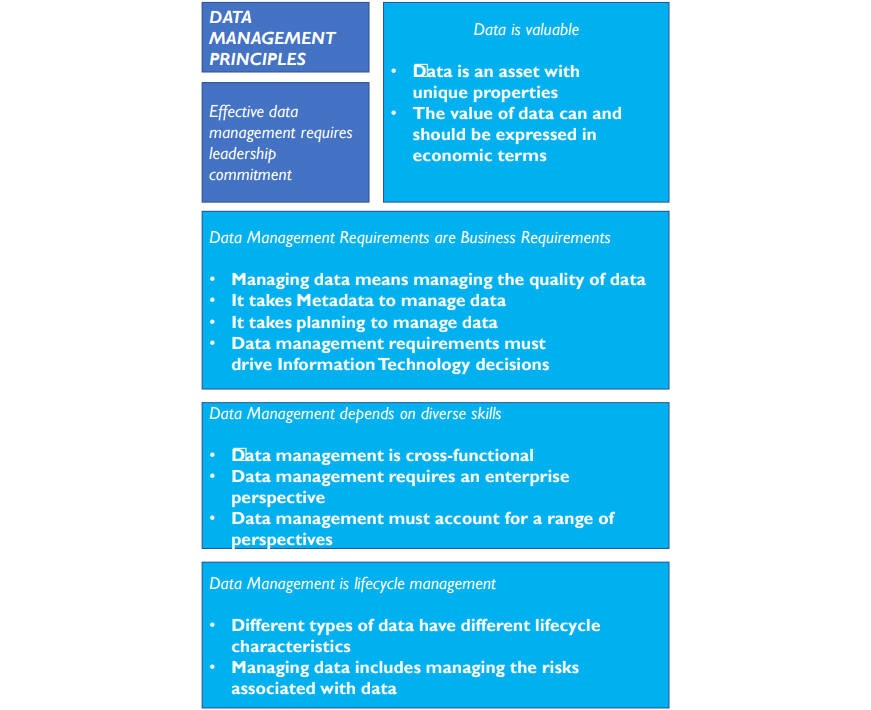

# **数据管理的目标和原则**

## 数据管理的目标（Data Management Goals）

- 了解并支撑企业和利益相关者（stakeholders，客户、员工、业务合作伙伴）的**信息需求**。
- 获取、储存数据，并保护和确保数据资产的**完整性**。
- 确保数据和信息的**质量**。
- 确保利益相关者数据的**隐私和机密**。
- **防止**对数据的未经授权或不当的访问、操作和使用。
- 确保数据可以有效地为企业**创造价值。**

## 数据管理原则（Data Management Principles）

- **数据是一种有特殊属性的资产**
  - 在使用时不会被消耗。
- **数据的价值可以而且应该用经济术语来表达**
  - 应开发一套连续的方法来量化数据的价值，同时应衡量低质量数据的成本和高质量数据的收益。
- **管理数据的意思是管理数据的质量**
  - 数据管理的主要目标是确保数据符合目的，为了管理数据质量，必须确保了解利益相关者对质量的要求。
- **通过元数据来管理数据**
  - 管理任何资产都需要关于该资产的数据，比如员工人数、会计代码等，**用于管理和使用数据的数据称为元数据**。
  - 元数据源自与数据产生、处理和使用相关的一系列流程，包括架构、建模、管理、治理、数据质量管理、系统开发、IT和业务运营以及分析。
- **通过规划来管理数据**
  - 为了协调工作，并使最终结果保持一致，需要从架构和流程方面进行规划。
- **数据管理需求必须驱动信息技术决策**
  - 管理数据需要一种途径来确保技术服务而不是驱动组织的数据战略需求。
- **数据管理是跨职能的，需要一系列的技术和专业知识**
  - 数据管理需要技术和非技术技能，以及协作能力。
- **数据管理需要企业视角**（an enterprise perspective）
  - 有效的数据管理不局限于局部应用，必须能应用于整个企业，这是数据管理和数据治理紧密联系的原因之一。
- **数据管理必须对多方面负责**（Data management must account for a range of perspectives）
  - 数据管理必须不断发展，来和数据的产生和使用方式以及用户的需求保持同步。
- **数据管理就是生命周期管理**
  - 数据会产生更多数据，所以数据的生命周期可能非常复杂，数据管理需要为数据生命周期负责。
- **不同的数据有不同的生命周期特征**
  - 数据管理实践要足够灵活来满足不同的数据生命周期要求。
- **管理数据包括管理数据相关的风险**
  - 数据可能会丢失、被盗或被滥用，数据使用可能带来道德影响，数据相关风险必须作为数据据生命周期的一部分进行管理。