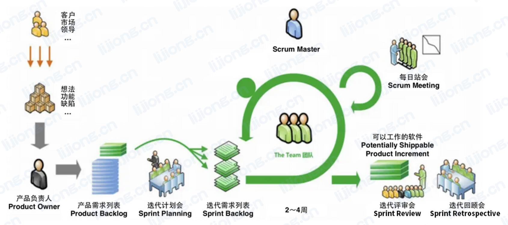
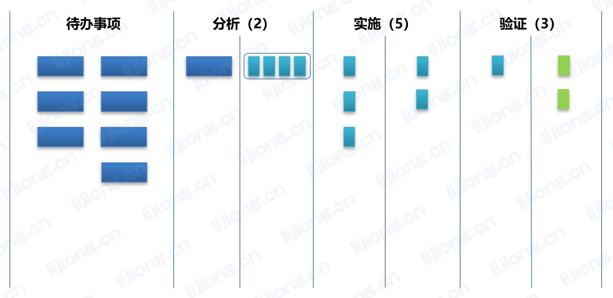

# **敏捷开发管理**

- 敏捷是一种通过创造变化和响应变化在不确定和混乱的环境中取得成功的能力

## 四个核心价值观

- Individuals and interactions over processes and tools

  个体互动胜过流程和工具

- Working software over comprehensive documentation

  可用的软件胜过详尽的文档

- Customer collaboration over contract negotiation

  客户合作胜过合同谈判

- Responding to change over following a plan

  响应变化胜过遵循计划

## 十二个原则

1. Our highest priority is to satisfy the customer through early and continuous delivery of valuable software

   最高优先级的是通过及早和持续不断地交付有价值的软件是客户满意

2. Welcome changing requirements, even late in development. Agile processes harness change for the customer’s competitive advantage

   欣然面对需求变化，即使是在开发后期，通过变化为客户获得竞争优势

3. Deliver working software frequently, from a couple of weeks to a couple of months, with a preference to the shorter timescale

   经常地交付可用软件，从数周到数月，交付周期越短越好

4. Business people and developers must work together daily throughout the project

   在项目中业务人员和开发人员每天都在一起工作

5. Build projects around motivated individuals. Give them the environment and support they need, and trust them to get the job done

   以受到激励的个体为核心构建项目，为他们提供所需的环境和支持，信任他们可以把工作做好

6. The most efficient and effective method of conveying information to and within a development team is face-to-face conversation

   向开发团队或在开发团队内部，传递信息最有效的方式是面对面的交谈

7. Working software is the primary measure of progress

   可用的软件是衡量进度的首要标准

8. Agile processes promote sustainable development. The sponsors, developers, and users should be able to maintain a constant pace indefinitely

   敏捷倡导可持续开发，责任人、开发人员和用户要共同维持其步调稳定延续

9. Continuous attention to technical excellence and good design enhances agility

   持续最求卓业的技术和良好的设计来增强敏捷的能力

10. Simplicity–the art of maximizing the amount of work not done–is essential

    简洁是敏捷的根本，尽可能减少不必要的工作

11. The best architectures, requirements, and designs emerge from self-organizing teams

    最好的架构、需求和设计来自自组织的团队

12. At regular intervals, the team reflects on how to become more effective, then tunes and adjusts its behavior accordingly

    团队定期反思如何提高效率，并依次调整工作方式

## Scrum框架

- 三个角色：产品负责人、开发团队、Scrum Master
- 三个工件：产品待办事项列表、迭代待办事项列表、产品增量
- 五个事件：迭代、迭代规划会议、每日Scrum站会、迭代评审会议、迭代回顾会议
- 五个价值观：承诺、专注、开放、尊重、勇气

### 三个角色

- 产品责任人PO
  - 管理产品待办事项列表的唯一责任人
- 开发团队
  - 跨职能的，拥有创造产品增量所需要的全部技能
  - 不认可开发团队成员的头衔，无论承担哪种工作都是开发者
  - 团队成员是T型人才，敏捷中一般采用交叉培训，敏捷项目经理不会确定团队成员的培训
- Scrum Master
  - 服务型领导

### 三个工件

- 产品待办事项列表（Product Backlog）
  - 产品需求变动的唯一来源
  - 排在顶部的产品待办事项列表条目需要立即进行开发
  - 优先级越低，细节信息越少
- 迭代待办事项列表（Sprint Backlog）
  - 按照优先级选择用户故事直到团队认为足够为止
- 产品增量（Product Increment）
  - 增量必须可用

### 五个事件

- 迭代
  - Sprint
  - 迭代的长度通常保持已知
  - 迭代期间不能做出有害于Sprint目标的改变
- 迭代规划会议
  - 由开发团队确定迭代待办事项列表
  - 故事点（Story Point）：一个度量单位，用于表示完成一个产品待办项所需的工作量的估算结果
  - 探针（Spike）：通常在不能有效估计用户故事时采用，为了获取背景知识以知道某需求在技术上是否可行
  - 速率（Velocity）：衡量团队在单个迭代中可解决的工作量的指标
- 每日Scrum站会
  - 开发团队自己负责召开，以15分钟为限
  - 会上只记录问题不讨论问题，但站会的目的是为了沟通问题，以便会后团队可以集体尝试解决，或由敏捷教练提供支持
  - 任何成员都可以主持会议
- 迭代评审会议
  - 在迭代快结束时举行
  - 演示增量获取反馈并促进合作
  - 结果是一份修订后的产品待办事项列表，阐明很可能进入下个Sprint待办事项列表的内容
- 迭代回顾会议
  - 在迭代评审会议后，下个迭代规划会议前举行
  - 改进开发过程和实践

### 五个价值观

- 承诺：愿意对目标做出承诺
- 专注：将心思和能力都用到承诺的工作上
- 开放：将项目中的一切开放给每个人
- 尊重：每个人都有独特的背景和经验
- 勇气：有勇气做出承诺、履行承诺

## 看板墙

- 可视化管控，消除瓶颈
- WIP（Work In Progress）限制：在制品限制，限制每个步骤允许放置的记录卡数，限制混乱

