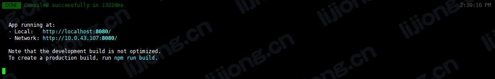
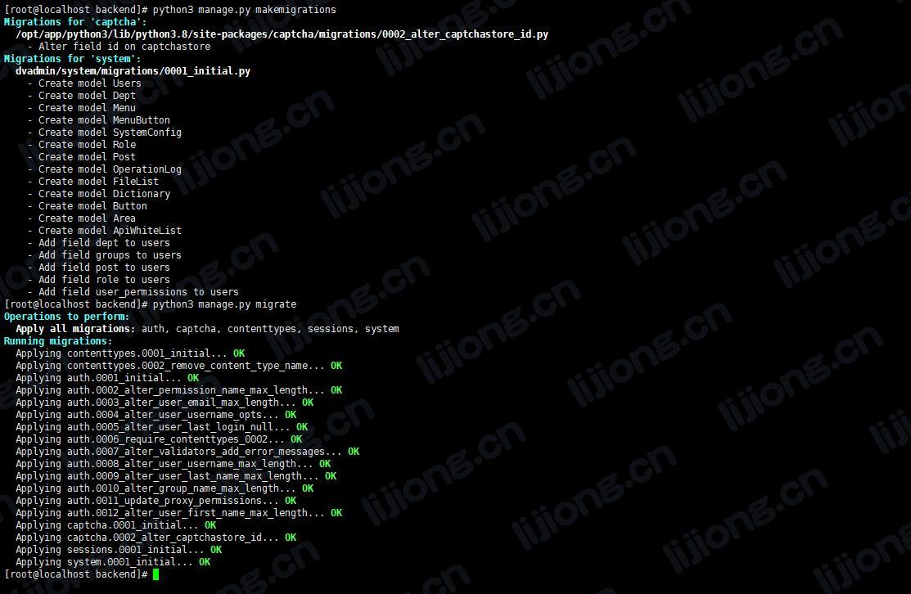
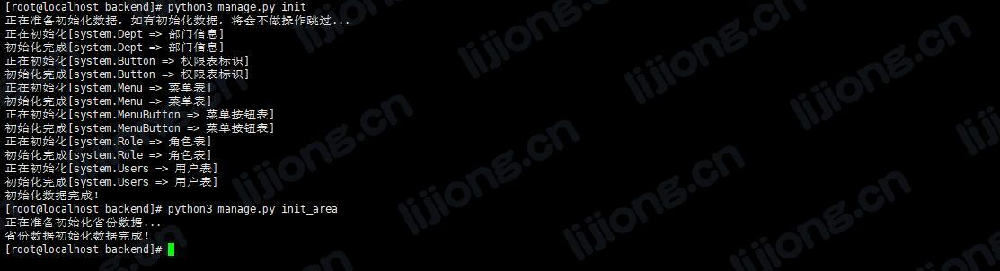
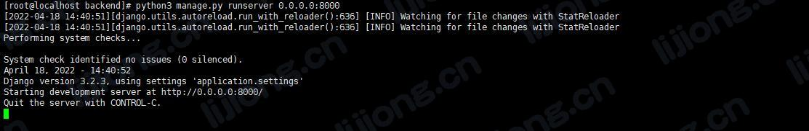
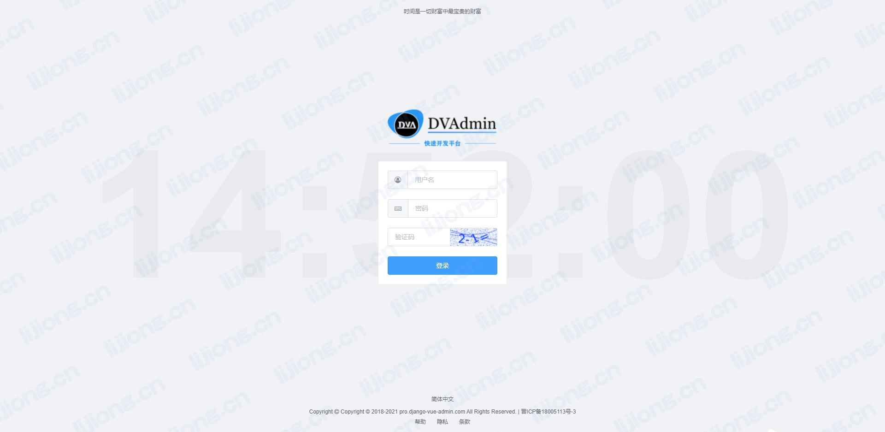

## **Django-Vue-Admin安装记录**

### 准备工作

- Git
- Python-3.8.3
- node-v16.14.2
- mysql-5.7.30
- redis-5.0.8

### 克隆项目

> git clone https://gitee.com/liqianglog/django-vue-admin.git

### 前端安装

#### 进入目录

> cd django-vue-admin/web

#### 安装依赖

> npm install

#### 配置修改

- vi .env.development

```
# 后端接口地址及端口(域名)
VUE_APP_API = "http://10.0.43.107:8000"
```

#### 启动服务

> npm run dev




### 后端安装

#### 进入目录

> cd django-vue-admin/backend

#### 配置数据库信息

> cp conf/env.example.py conf/env.py

- vi conf/env.py

```python
import os

from application.settings import BASE_DIR

# ================================================= #
# ************** 数据库 配置  ************** #
# ================================================= #
#
# 数据库 ENGINE ，默认演示使用 sqlite3 数据库，正式环境建议使用 mysql 数据库
DATABASE_ENGINE = 'django.db.backends.mysql'
# 数据库名
DATABASE_NAME = 'dvadmin'
# 数据库地址 改为自己数据库地址
DATABASE_HOST = '10.0.43.107'
# 数据库端口
DATABASE_PORT = 3306
# 数据库用户名
DATABASE_USER = 'root'
# 数据库密码
DATABASE_PASSWORD = 'Unidata107.'
# ================================================= #
# ************** redis配置，无redis 可不进行配置  ************** #
# ================================================= #
REDIS_PASSWORD = 'Unidata107.'
REDIS_HOST = '10.0.43.107'
REDIS_URL = f'redis://:{REDIS_PASSWORD or ""}@{REDIS_HOST}:6379'
# ================================================= #
# ************** 其他 配置  ************** #
# ================================================= #
DEBUG = True  # 线上环境请设置为True
ALLOWED_HOSTS = ["*"]
LOGIN_NO_CAPTCHA_AUTH = True  # 登录接口 /api/token/ 是否需要验证码认证，用于测试，正式环境建议取消
```

#### 指定MySQL引擎

- 安装pymysql

> pip3 install pymysql

- vi application/\__init__.py

```python
import pymysql
pymysql.install_as_MySQLdb()
```

#### 安装依赖

> pip3 install -r requirements.txt

- 报错及处理
  1. ModuleNotFoundError: No module named '_ctypes'
     - pip3 install --upgrade pip
  2. Can not execute \`setup.py` since setuptools is not available in the build environment.
     - pip3 install --upgrade setuptools

#### 迁移数据库

> python3 manage.py makemigrations

> python3 manage.py migrate




#### 初始化数据

> python3 manage.py init

#### 初始化省市县数据

> python3 manage.py init_area




#### 启动项目

> python3 manage.py runserver 0.0.0.0:8000




### 访问项目

- 10.0.43.107:8080
  - 用户名：superadmin
  - 密码：admin123456




