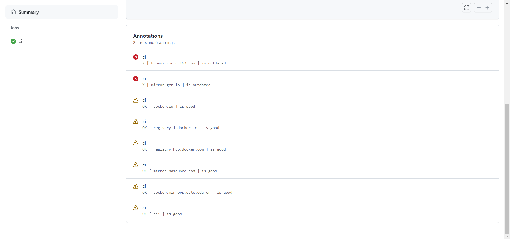

## **Docker的镜像加速设置**

### 查看可用镜像站

https://github.com/docker-practice/docker-registry-cn-mirror-test/actions




### 查看是否在docker.service文件中配置过镜像地址

```
systemctl cat docker | grep '\-\-registry\-mirror'
```

若有输出，则执行`systemctl cat docker`查看`ExecStart`出现位置，修改对应文件去掉`--registry-mirror`参数及其值，再执行接下来的步骤

### 编辑/etc/docker/daemon.json文件

```
[root@avatar ~]# cd /etc/docker/
[root@avatar docker]# ll
总用量 4
-rw-------. 1 root root 244 11月 17 16:54 key.json
[root@avatar docker]# ll
总用量 4
-rw-------. 1 root root 244 11月 17 16:54 key.json
[root@avatar docker]# cd /etc/docker/
[root@avatar docker]# ll
总用量 4
-rw-------. 1 root root 244 11月 17 16:54 key.json
[root@avatar docker]# vi daemon.json
```

```json
{
    "registry-mirrors": [
    "https://mirror.baidubce.com",
    "https://docker.mirrors.ustc.edu.cn/"
    ]
}
```

### 重新加载配置文件

```
sudo systemctl daemon-reload
```

### 重启Docker

```
sudo systemctl restart docker
```

### 查看加速是否生效

```
docker info
```

输出显示

```
 Registry Mirrors:
  https://mirror.baidubce.com/
  https://docker.mirrors.ustc.edu.cn/
```