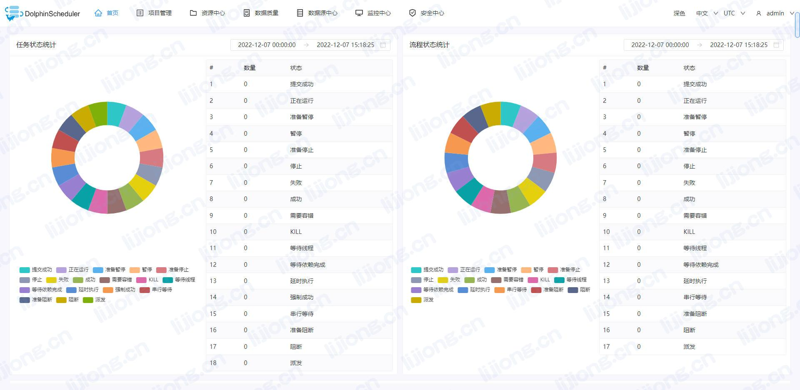

### 下载解压安装包

> tar -zxvf apache-dolphinscheduler-3.0.1-bin.tar.gz

### 依赖准备

- JDK1.8+

- MySQL5.7+

- ZooKeeper3.4.6+

- SSH免密登录

### 修改配置文件

#### install_env.sh

> vi bin/env/install_env.sh

- 集群部署

```shell
# ---------------------------------------------------------
# INSTALL MACHINE
# ---------------------------------------------------------
# Due to the master, worker, and API server being deployed on a single node, the IP of the server is the machine IP or localhost
ips="10.0.43.101,10.0.43.102,10.0.43.103"
sshPort="22"
masters="10.0.43.101"
workers="10.0.43.101:default,10.0.43.102:default,10.0.43.103:default"
alertServer="10.0.43.102"
apiServers="10.0.43.101"

# DolphinScheduler installation path, it will auto-create if not exists
installPath="/opt/app/dolphinscheduler"

# Deploy user, use the user you create in section **Configure machine SSH password-free login**
deployUser="root"

# The root of zookeeper, for now DolphinScheduler default registry server is zookeeper.
zkRoot="/dolphinscheduler"
```

- 伪集群部署

```shell
ips="localhost"
sshPort="22"
masters="localhost"
workers="localhost:default"
alertServer="localhost"
apiServers="localhost"
```

#### dolphinscheduler_env.sh

> vi bin/env/dolphinscheduler_env.sh

```shell
# JAVA_HOME, will use it to start DolphinScheduler server
export JAVA_HOME=/opt/app/jdk1.8.0_202

# Database related configuration, set database type, username and password
export DATABASE=mysql
export SPRING_PROFILES_ACTIVE=${DATABASE}
export SPRING_DATASOURCE_URL="jdbc:mysql://10.0.43.101:3306/dolphinscheduler?useUnicode=true&characterEncoding=UTF-8&useSSL=false"
export SPRING_DATASOURCE_USERNAME=root
export SPRING_DATASOURCE_PASSWORD=********

# DolphinScheduler server related configuration
export SPRING_CACHE_TYPE=${SPRING_CACHE_TYPE:-none}
export SPRING_JACKSON_TIME_ZONE=${SPRING_JACKSON_TIME_ZONE:-UTC}
export MASTER_FETCH_COMMAND_NUM=${MASTER_FETCH_COMMAND_NUM:-10}

# Registry center configuration, determines the type and link of the registry center
export REGISTRY_TYPE=zookeeper
export REGISTRY_ZOOKEEPER_CONNECT_STRING=localhost:2181

# Tasks related configurations, need to change the configuration if you use the related tasks.
export HADOOP_HOME=${HADOOP_HOME:-/opt/soft/hadoop}
export HADOOP_CONF_DIR=${HADOOP_CONF_DIR:-/opt/soft/hadoop/etc/hadoop}
export SPARK_HOME1=${SPARK_HOME1:-/opt/soft/spark1}
export SPARK_HOME2=${SPARK_HOME2:-/opt/soft/spark2}
export PYTHON_HOME=${PYTHON_HOME:-/opt/soft/python}
export HIVE_HOME=${HIVE_HOME:-/opt/soft/hive}
export FLINK_HOME=${FLINK_HOME:-/opt/soft/flink}
export DATAX_HOME=${DATAX_HOME:-/opt/soft/datax}

export PATH=$HADOOP_HOME/bin:$SPARK_HOME1/bin:$SPARK_HOME2/bin:$PYTHON_HOME/bin:$JAVA_HOME/bin:$HIVE_HOME/bin:$FLINK_HOME/bin:$DATAX_HOME/bin:$PATH
```


### 数据源配置

#### 下载驱动

- 下载mysql-connector-java驱动（8.0.16，https://downloads.mysql.com/archives/c-j/）并移动到每个模块的libs目录下

  - tools/libs

  - api-server/libs
  - alert-server/libs
  - master-server/libs
  - worker-server/libs


#### 创建数据库

```sql
CREATE DATABASE dolphinscheduler DEFAULT CHARACTER SET utf8 DEFAULT COLLATE utf8_general_ci;
```

#### 初始化数据库

> bash tools/bin/upgrade-schema.sh

### 启动DolphinScheduler

> bash bin/install.sh


### 访问DolphinScheduler

-  http://10.0.43.101:12345/dolphinscheduler/ui
  - admin/dolphinscheduler123



### 启停服务

- 启停集群所有服务

  > bash ./bin/stop-all.sh
  >
  > bash ./bin/start-all.sh

- 启停Master

  > bash ./bin/dolphinscheduler-daemon.sh stop master-server
  >
  > bash ./bin/dolphinscheduler-daemon.sh start master-server

- 启停Worker

  > bash ./bin/dolphinscheduler-daemon.sh start worker-server
  >
  > bash ./bin/dolphinscheduler-daemon.sh stop worker-server

- 启停Api

  > bash ./bin/dolphinscheduler-daemon.sh start api-server
  >
  > bash ./bin/dolphinscheduler-daemon.sh stop api-server

- 启停Alert

  > bash ./bin/dolphinscheduler-daemon.sh start alert-server
  >
  > bash ./bin/dolphinscheduler-daemon.sh stop alert-server

