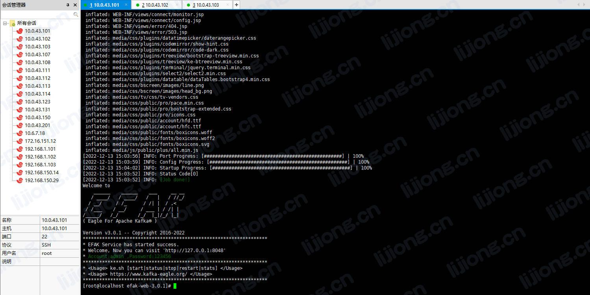
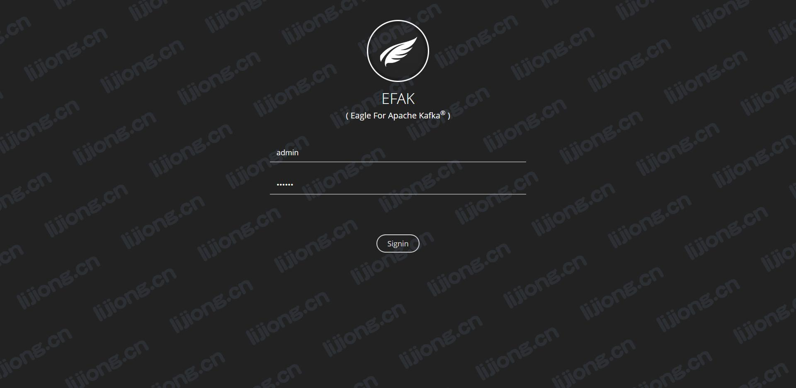
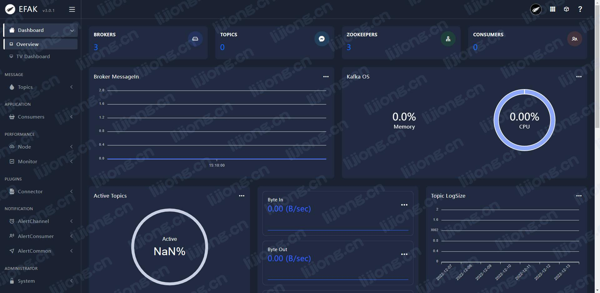

## **EFAK安装部署记录**

### 上传解压安装包

> tar -zxvf kafka-eagle-bin-3.0.1.tar.gz

> tar -zxvf kafka-eagle-bin-3.0.1/efak-web-3.0.1-bin.tar.gz -C /opt/app

### 配置环境变量

> vi /etc/profile

```
export KE_HOME=/opt/app/efak-web-3.0.1
export PATH=$PATH:$KE_HOME/bin
```

> source /etc/profile

### 修改配置文件

> vi conf/system-config.properties

```properties
efak.zk.cluster.alias=cluster1
cluster1.zk.list=10.0.43.101:2181,10.0.43.102:2181,10.0.43.103:2181/kafka
# cluster2.zk.list=xdn10:2181,xdn11:2181,xdn12:2181

cluster1.efak.broker.size=3

efak.driver=com.mysql.cj.jdbc.Driver
efak.url=jdbc:mysql://10.0.43.101:3306/ke?useUnicode=true&characterEncoding=UTF-8&zeroDateTimeBehavior=convertToNull
efak.username=root
efak.password=Unidata101.
```

### 修改Kafka启动脚本

> vi kafka-server-start.sh

```shell
if [ "x$KAFKA_HEAP_OPTS" = "x" ]; then
    export KAFKA_HEAP_OPTS="-Xmx1G -Xms1G"
    export JMX_PORT="9999"
fi
```

> scp kafka-server-start.sh 10.0.43.102:$PWD

> scp kafka-server-start.sh 10.0.43.103:$PWD

### 启动eagle

> ke.sh start

> ke.sh status
>
> ke.sh restart
>
> ke.sh stop






