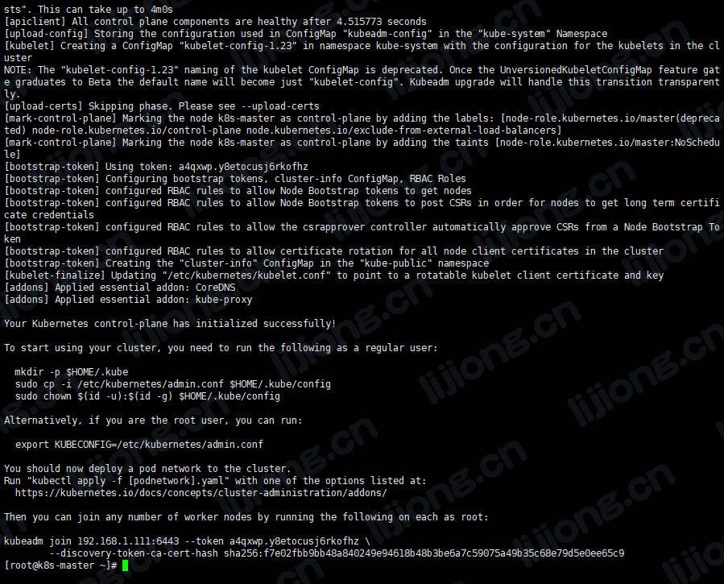
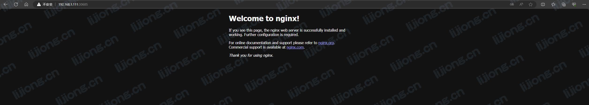

## Kubeadm搭建Kubernetes集群记录

### 初始设置

```
yum install -y kubelet-1.23.6 kubeadm-1.23.6 kubectl-1.23.6

systemctl enable kubelet

# 配置关闭 Docker 的 cgroups，修改 /etc/docker/daemon.json，加入以下内容
"exec-opts": ["native.cgroupdriver=systemd"]

# 重启 docker
systemctl daemon-reload
systemctl restart docker
```

- 关闭防火墙

  > systemctl stop firewalld
  > systemctl disable firewalld

- 关闭selinux

  > sed -i 's/enforcing/disabled/' /etc/selinux/config

- 关闭swap

  > sed -ri 's/.*swap.*/#&/' /etc/fstab

  > reboot

- 设置hostname

  > hostnamectl set-hostname k8s-master

  > hostnamectl set-hostname k8s-node1

  > hostnamectl set-hostname k8s-node2

- 在master添加hosts

  ```
  cat >> /etc/hosts << EOF
  192.168.1.111 k8s-master
  192.168.1.112 k8s-node1
  192.168.1.113 k8s-node2
  EOF
  ```

- 将桥接的IPv4流量传递到iptables的链

  ```
  cat > /etc/sysctl.d/k8s.conf << EOF
  net.bridge.bridge-nf-call-ip6tables = 1
  net.bridge.bridge-nf-call-iptables = 1
  EOF
  ```

  > sysctl --system

- 时间同步

  > ntpdate 0.asia.pool.ntp.org

### 在所有节点安装基础软件

#### 安装Docker

> sudo yum install -y yum-utils device-mapper-persistent-data lvm2

> sudo yum-config-manager --add-repo https://mirrors.aliyun.com/docker-ce/linux/centos/docker-ce.repo

> sudo yum makecache fast

> sudo yum -y install docker-ce

> sudo service docker start

#### 添加yum源

```
cat > /etc/yum.repos.d/kubernetes.repo << EOF
[kubernetes]
name=Kubernetes
baseurl=https://mirrors.aliyun.com/kubernetes/yum/repos/kubernetes-el7-x86_64
enabled=1
gpgcheck=0
repo_gpgcheck=0

gpgkey=https://mirrors.aliyun.com/kubernetes/yum/doc/yum-key.gpg https://mirrors.aliyun.com/kubernetes/yum/doc/rpm-package-key.gpg
EOF
```

#### 安装 kubeadm、kubelet、kubectl

> yum install -y kubelet-1.23.6 kubeadm-1.23.6 kubectl-1.23.6

> systemctl enable kubelet

- 设置Cgroup驱动程序

  > vi /etc/docker/daemon.json

  ```
  {
   "exec-opts": ["native.cgroupdriver=systemd"]
  }
  ```

- 重新加载配置文件

  > systemctl daemon-reload

- 重启docker

  > systemctl restart docker

### 部署Kubernetes Master

#### 在Master初始化

```
kubeadm init \
      --apiserver-advertise-address=192.168.1.111 \
      --image-repository registry.aliyuncs.com/google_containers \
      --kubernetes-version v1.23.6 \
      --service-cidr=10.96.0.0/12 \
      --pod-network-cidr=10.244.0.0/16
```



- 问题处理1

  - 查看启动状态

    > systemctl status kubelet

  - 查看日志

    > journalctl -xefu kubelet

    ```
    k8s-master kubelet[21090]: E0604 16:53:25.898556   21090 server.go:302] "Failed to run kubelet" err="failed to run Kubelet: misconfiguration: kubelet cgroup driver: \"systemd\" is different from docker cgroup driver: \"cgroupfs\""
    ```

    > docker info|grep Driver

    ```
     Storage Driver: overlay2
     Logging Driver: json-file
     Cgroup Driver: cgroupfs
    ```

  - 设置Cgroup驱动程序

  - 重启kubelet

    > systemctl restart kubelet

- 问题处理2

  - 重置kubeadm

    > kubeadm rest -y

  - 重新初始化

#### 配置kubectl

> mkdir -p $HOME/.kube

> sudo cp -i /etc/kubernetes/admin.conf $HOME/.kube/config

> sudo chown $(id -u):$(id -g) $HOME/.kube/config

#### 查看部署

> kubectl get nodes

```
NAME         STATUS     ROLES                  AGE     VERSION
k8s-master   NotReady   control-plane,master   5m43s   v1.23.6
```

### 部署Kubernetes Node

- 查看token

  > kubeadm token list

- 创建token

  > kubeadm token create

- 查看discovery-token-ca-cert-hash

  > openssl x509 -pubkey -in /etc/kubernetes/pki/ca.crt | openssl rsa -pubin -outform der 2>/dev/null | openssl dgst -sha256 -hex | sed 's/^.* //'

#### 分别在Node运行

> kubeadm join 192.168.1.111:6443 --token a4qxwp.y8etocusj6rkofhz --discovery-token-ca-cert-hash sha256:f7e02fbb9bb48a840249e94618b48b3be6a7c59075a49b35c68e79d5e0ee65c9

#### 查看部署

> kubectl get nodes

```
NAME         STATUS     ROLES                  AGE     VERSION
k8s-master   NotReady   control-plane,master   21m     v1.23.6
k8s-node1    NotReady   <none>                 5m11s   v1.23.6
k8s-node2    NotReady   <none>                 106s    v1.23.6
```

### 部署CNI网络插件

- 查看组件状态

  > kubectl get componentstatus

  ```
  Warning: v1 ComponentStatus is deprecated in v1.19+
  NAME                 STATUS    MESSAGE                         ERROR
  controller-manager   Healthy   ok                              
  scheduler            Healthy   ok                              
  etcd-0               Healthy   {"health":"true","reason":""} 
  ```

- 查看pods

  > kubectl get pods -n kube-system

  ```
  NAME                                 READY   STATUS    RESTARTS   AGE
  coredns-6d8c4cb4d-fnq7x              0/1     Pending   0          25m
  coredns-6d8c4cb4d-fv4zp              0/1     Pending   0          25m
  etcd-k8s-master                      1/1     Running   2          25m
  kube-apiserver-k8s-master            1/1     Running   2          25m
  kube-controller-manager-k8s-master   1/1     Running   2          25m
  kube-proxy-6pb9z                     1/1     Running   0          25m
  kube-proxy-cksbc                     1/1     Running   0          9m10s
  kube-proxy-jp2ql                     1/1     Running   0          5m45s
  kube-scheduler-k8s-master            1/1     Running   2          25m
  ```

#### 在master运行

- 下载 calico 配置文件

  > cd /opt
  >
  > mkdir k8s
  >
  > cd k8s

  > curl https://calico-v3-25.netlify.app/archive/v3.25/manifests/calico.yaml -O

  > grep image calico.yaml

  ```
            image: docker.io/calico/cni:v3.25.0
            imagePullPolicy: IfNotPresent
            image: docker.io/calico/cni:v3.25.0
            imagePullPolicy: IfNotPresent
            image: docker.io/calico/node:v3.25.0
            imagePullPolicy: IfNotPresent
            image: docker.io/calico/node:v3.25.0
            imagePullPolicy: IfNotPresent
            image: docker.io/calico/kube-controllers:v3.25.0
            imagePullPolicy: IfNotPresent
  ```

- 修改配置文件

  > sed -i 's#docker.io/##g' calico.yaml

- 构建应用

  > kubectl apply -f calico.yaml

- （状态查看）

  > kubectl get pods -n kube-system

  ```
  NAME                                     READY   STATUS              RESTARTS   AGE
  calico-kube-controllers-cd8566cf-7jx7b   0/1     ContainerCreating   0          52s
  calico-node-qmht8                        1/1     Running             0          52s
  calico-node-x7z4f                        1/1     Running             0          52s
  calico-node-zzlm7                        1/1     Running             0          52s
  coredns-6d8c4cb4d-fnq7x                  0/1     ContainerCreating   0          45m
  coredns-6d8c4cb4d-fv4zp                  0/1     ContainerCreating   0          45m
  etcd-k8s-master                          1/1     Running             2          45m
  kube-apiserver-k8s-master                1/1     Running             2          45m
  kube-controller-manager-k8s-master       1/1     Running             2          45m
  kube-proxy-6pb9z                         1/1     Running             0          45m
  kube-proxy-cksbc                         1/1     Running             0          28m
  kube-proxy-jp2ql                         1/1     Running             0          25m
  kube-scheduler-k8s-master                1/1     Running             2          45m
  ```

  > kubectl describe pod coredns-6d8c4cb4d-fnq7x -n kube-system

#### 查看部署

> kubectl get nodes

```
NAME         STATUS   ROLES                  AGE   VERSION
k8s-master   Ready    control-plane,master   48m   v1.23.6
k8s-node1    Ready    <none>                 31m   v1.23.6
k8s-node2    Ready    <none>                 28m   v1.23.6
```

### 测试集群

- 创建服务

  > kubectl create deployment nginx --image=nginx

- 暴露端口

  > kubectl expose deployment nginx --port=80 --type=NodePort

- 查看服务信息

  > kubectl get pod,svc

  ```
  NAME                         READY   STATUS    RESTARTS   AGE
  pod/nginx-85b98978db-nplhp   1/1     Running   0          114s
  
  NAME                 TYPE        CLUSTER-IP       EXTERNAL-IP   PORT(S)        AGE
  service/kubernetes   ClusterIP   10.96.0.1        <none>        443/TCP        60m
  service/nginx        NodePort    10.109.160.247   <none>        80:30685/TCP   107s
  ```

- 访问192.168.1.111/112/113:30685

  