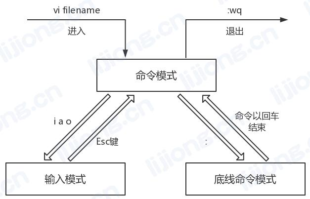

## **Linux的常用命令**

### 目录文件命令

#### cd

- change directory

- 切换目录

  > cd [目录]
  >
  > / 回到根目录
  >
  > .. ../ 回到上一级目录
  >
  > . 当前目录
  >
  > \- 回到上一次操作的目录
  >
  > ~ 当前用户的宿主目录（cd ~用户名 进入某个用户的宿主目录）

#### list

- list

- 列出目录

  > ls [目录]
  >
  > -a（all） 显示所有文件，包括隐藏文件（.开头文件）
  >
  > -l（long） 显示详细信息，包括文件大小、日期、权限等，相当于ll
  >
  > -R（recursive） 递归显示所有目录
  >
  > -t（time） 按修改时间降序

#### pwd

- print working directory
- 显示当前目录

#### mkdir

- make directory

- 创建目录

  > mkdir [目录名]
  >
  > -p（parent） 父目录不存在的情况下先创建父目录
  >
  > -m（mode） 配置文件权限：mkdir -m 777 demo

#### touch

- touch

- 更新文件时间为当前时间或创建空文件

  > touch [文件名]
  >
  > 创建多个文件：touch a.txt b.txt或touch {a.txt b.txt}
  >
  > 创建带空格的文件：touch 'program file'

#### cp

- copy

- 复制目录或文件

  > cp [源目录或文件] [目的目录或文件]
  >
  > -p（preserve） 保留文件属性如权限、时间等
  >
  > -r/R（recursive） 递归复制目录

#### mv

- move

- 移动目录或文件，目录或文件改名

  > mv [源目录或文件] [目的目录或文件]
  >
  > -f（force） 如果目标存在，不会询问而直接覆盖

#### rm

- remove

- 删除

  > rm [目录或文件]
  >
  > -f（force） 无需确认强制删除
  >
  > -r/R（recursive） 递归删除

#### echo

- 将内容打印在控制台上显示

  > echo 'abc' 引号可省略
  >
  > echo abc > a.txt 覆盖
  >
  > echo abc >> a.txt 追加
  >
  > echo \`ll` 将命令的输出转为字符串

#### less

- 分页显示内容，退出后不会留下显示的内容

  > less [文件名]
  >
  > -N（number） 显示行号
  >
  > b 向上一页
  >
  > f 向下一页

#### more

- 分页显示内容，不能向上

#### cat

- concatenate
- 连接并显示文件内容，将全部内容显示到屏幕上

#### tail

- 查看后几行（默认10行）

  > tail [文件]
  >
  > -n（number） 指定行数
  >
  > -f （follow） 循环读取，监控，改名继续监控，跟踪的是文件的inode号
  >
  > -F 删除文件再创建同名文件后继续监控，跟踪的是文件名

#### head

- 查看前几行（默认10行）

#### ln

- link

- 生产链接文件

  > ln -s [源文件或目录] [目标文件或目录] 创建软链接
  >
  > ln [源文件] [目标文件] 创建硬链接

- 软链接：

  1. 以路径的形式存在，类似于快捷方式
  2. 可以跨文件系统
  3. 可以对一个不存在的文件名进行链接
  4. 可以对目录进行链接
  5. 删除源文件会报错

- 硬链接：

  1. 以文件副本的形式存在，但不占用实际空间
  2. 只有在同一个文件系统中才能创建
  3. 不允许给目录创建硬链接
  4. 删除源文件不受影响

#### man

- manual

- 获取命令或配置文件的帮助信息

  > man [命令]

#### find

- 查找文件或目录

  > find [路径]
  >
  > -name 按名称查找 -iname 忽略大小写 find / -name demo
  >
  > -siza +/-[大小] +大于，-小于，不写等于（find /etc -size -204800 在etc下查找小于100M的文件）

#### whereis

- 查找命令或帮助文档所在目录

  > whereis [命令]
  >
  > -b（binariy） 只查找命令所在目录
  >
  > -m（manual） 只查找帮助文档

#### tar

- 压缩/解压

  > tar -zcf [压缩文件名] [文件或目录名]
  >
  > tar -zxf [压缩文件名]
  >
  > -c（create） 建立一个压缩文件
  >
  > -x（extract） 解开一个压缩文件
  >
  > -f（file） 指定文件名，必选项
  >
  > -z（gzip） 以gzip命令压缩/解压
  >
  > -v（verbose） 显示执行过程
  >
  > -C [目的目录] 解压到指定目录

#### gzip

- 压缩/解压文件，不保留原文件，不能压缩目录

  > gzip 文件1 文件2 文件3
  >
  > -d（decompress） 解压

### 系统相关命令

#### ps

- process

- 查看进程状态

  > ps -ef
  >
  > ps -aux
  >
  > -e 显示所有进程
  >
  > -f 用户id，进程id，父进程id，最近CPU使用情况，进程开始时间
  >
  > -a 显示现行终端机下的所有进程，包括其他用户的进程
  >
  > -u 以用户为主的格式来显示进程状况, 显示用户名和启动时间
  >
  > -x 显示所有进程，不以终端机来区分

#### netstat

- 显示网络状态

  > netstat -nltp
  >
  > -n（numeric） 使用数字形式显示地址和端口号
  >
  > -l（listening） 显示监控中的服务的socket
  >
  > -t（tcp） 显示tcp传输协议的连线状况
  >
  > -u（udp） 显示udp传输协议的连线状况
  >
  > -p（process） 显示正在使用socekt的pid和程序名

#### du

- disk usage

- 查看目录及子目录或文件大小

  > du [目录或文件]
  >
  > -a（all） 显示目录中子文件大小，而不只是目录
  >
  > -h（human-readable） 以易读方式显示
  >
  > -s（summarize） 只显示总计

#### df

-  file system disk space usage

- 显示文件系统磁盘空间的使用情况

  > -a（all） 显示所有分区包括大小为0的分区
  >
  > -h（human-readable） 以易读方式显示
  >
  > -m 以MB为单位显示信息

#### free

- 显示空闲内存和已使用内存状态

#### top

- 实时显示进程动态

  > top
  >
  > -d（delay time） 指定刷新实际，默认3秒
  >
  > -i（idle） 不显示idle闲置或zombie无用进程

#### shutdown

- 安全地关闭或重启Linux系统

  > shundown -h/r [时间]
  >
  > 时间 --- now, 12:30, 10(分钟)
  >
  > -h  halt关机
  >
  > -r reboot重新启动
  >
  > -c cancel取消正在进行的关机动作 (Ctrl+c --- Shutdown cancelled)
  >
  > 常用: shutdown -h now

#### halt

- 关机

  > halt
  >
  > -p 关机时顺便关闭电源

### 用户管理命令

#### useradd

- 添加用户

  > useradd [用户名]
  
  > useradd -d /home/sftp_user/avatar -s /sbin/nologin avatar
  >
  > passwd avatar

#### passwd

- 修改密码

  > passwd [用户名]

#### userel

- 删除用户

  > userdel [用户名]
  >
  > -r 删除用户登入目录以及目录中所有文件

#### groupadd

- 添加组

  > groupadd [组名]

#### groupdel

- 删除组

  > groupdel [组名]

### 权限管理命令

- 权限分类:
  1. r (read)读
  2. w (write)写
  3. x (excute)执行 (对文件夹的操作必须有执行权)

- 权限说明:

  1. 第1位: 文件类型
  2. 第2-4位: 所属用户权限
  3. 第5-7位: 所属组权限
  4. 第8-10位: 其他用户权限

#### chmod

- change mode

- 更改权限

  > chmod [ugoa] [+-=] [rwx] [文件或目录]
  >
  > chmod [数字] [文件或目录]
  >
  > r = 4, w = 2, x = 1, - = 0

#### chown

- change owner

- 修改所有者

  > chown \[所有者][:group] [文件或目录名]
  >
  > group 新的文件拥有者的使用者组 chown user:test demo.txt
  >
  > -R 递归修改

#### chgrp

- change group

- 改变所属组

  > chgrp [组名] [文件或目录名]

### 压缩/解压缩命令

#### tar

- tape archive

- 打包压缩/解压缩

  > tar -zcf [压缩文件名] [文件或目录名...]
  >
  > tar -zxf [压缩文件名] 
  >
  > -c (create)建立一个压缩文件
  >
  > -x (extract)解开一个压缩文件
  >
  > -f (file)指定文件名, 必选项
  >
  > -z 以gzip命令压缩/解压缩
  >
  > -v (verbose)显示执行过程
  >
  > -C [目的目录] 解压到指定目录

#### gzip

- 压缩/解压缩文件，不保留源文件，不能压缩目录

- 语法:

  > gzip 文件1 文件2 文件3 ...
  >
  > -d (decompress)解压，也可以使用gunzip

### 软件安装命令

#### yum

- Yellow dog Updater, Modified

- 基于RPM包管理，能够从指定的服务器自动下载RPM包并安装，可以自动处理依赖性关系，并一次安装所有依赖的软件包

  > yum list 查询所有可安装的软件包
  >
  > yum search [关键字] 查找和关键字相关的软件包
  >
  > yum info [关键字] 查找相应名字的软件包
  >
  > yum -y install [包名] 安装软件包
  >
  > yum -y update [包名] 升级软件包, 若不加包名则升级所有(慎用)
  >
  > yum check-update 查询可升级的软件包
  >
  > yum -y remove [包名] 卸载软件包
  >
  > yum clean all 清除缓存目录下的软件包及旧的headers (= yum clean packages; yum clean oldheaders)
  >
  > yum repolist 查看当前可用的yum源
  >
  > yum deplist [包名] 查询所依赖的包

#### rpm

- Red-Hat Package Manager

- RPM软件包管理器

  > -i (install)安装应用程序
  >
  > -vh (verbose hash)显示安装进度
  >
  > -U (update)升级软件包
  >
  > -qa (query all)显示所有已安装软件包
  >
  > -e (erase)卸载应用程序, 若存在依赖关系, 卸载时会出现提示信息, 可使用--nodeps (不验证关联性) 强行卸载
  >
  > rpm -qa 查询所有安装的rpm包
  >
  > rpm -qa|grep mysql 查询mysql相关的包
  >
  > rpm -ivh jdk.rpm 安装
  >
  > rpm -e mysql* 卸载
  >
  > rpm -e mysql* --nodeps 强行卸载

### 文件编辑命令

#### 移动光标

| 命令                      | 作用                                                 |
| ------------------------- | ---------------------------------------------------- |
| 方向键或kjhl              | 上下左右移动光标                                     |
| n+[方向键或kjhl]          | 上下移动n                                            |
| n+[Enter]                 | 向下移动n行且到行首                                  |
| PgDn或Ctrl+f/PgUp或Ctrl+b | 向下/上一页                                          |
| +/-                       | 移动到非空格符的下/上一行                            |
| Home或0/End或$            | 移动到这一行的第一个/最后一个字符处                  |
| H/M/L                     | 光标移动到屏幕上第一行/中间行/最后一行的第一个字符处 |
| gg/G                      | 移动到第一行/最后一行                                |
| n+gg或n+G                 | 移动到第n行                                          |

#### 输入模式切换

| 命令 | 作用                                    |
| ---- | --------------------------------------- |
| i    | 在光标所在处输入                        |
| I    | 在光标所在行的第一个非空格符处开始输入  |
| a    | 从光标所在的下一个字符处开始输入        |
| A    | 从光标所在行的最后一个字符处开始输入    |
| o/O  | 在光标所在的下一行/上一行处输入新的一行 |
| R    | 进入取代模式, 直到按下Esc               |
| Esc  | 退出输入模式                            |

#### 剪切、复制、粘贴

| 命令   | 作用                                  |
| ------ | ------------------------------------- |
| x或Del | 向后删除字符                          |
| X      | 向前删除字符 (编辑模式Backspace)      |
| nx或nX | 向后/向前删除n个字符                  |
| dd/ndd | 剪切光标所在行/向下剪切n行            |
| d1G/dG | 剪切光标所在行到第一行/最后一行       |
| d0/d$  | 剪切光标到该行第一个字符/最后一个字符 |
| yy/nyy | 复制光标所在行/向下复制n行            |
| y1G/yG | 复制光标所在行到第一行/最后一行       |
| y0/y$  | 复制光标到该行第一个字符/最后一个字符 |
| p/P    | 粘贴在光标下一行/上一行               |
| u      | 撤销                                  |
| Ctrl+r | 重做                                  |
| .      | 重复上一个动作                        |

#### 搜索替换

| 命令  | 作用                     |
| ----- | ------------------------ |
| /word | 向下搜索名为word的字符串 |
| ?word | 向上搜索名为woed的字符串 |
| n     | 继续搜索                 |
| N     | 返回上一个搜索结果       |

- 替换语法

  > :[行号1],[行号2]s/word1/word2/gc 替换[行号1]到[行号2]
  >
  > :%s/word1/word2/gc 替换所有
  >
  > 行号：$---最后一行，.---当前行
  >
  > /：替换每行第一个
  >
  > /g：替换所有
  >
  > /c：替换前需确认
  >
  > 可以使用#或+作为分隔符，此时/不会作为分隔符

#### 指令行模式命令

| 命令                        | 作用                                     |
| --------------------------- | ---------------------------------------- |
| :w                          | 保存                                     |
| :w!                         | 若文件属性为只读时, 强制写入             |
| :q                          | 退出                                     |
| :q!                         | 不保存强制退出                           |
| :wq                         | 保存后离开                               |
| :wq!                        | 强制保存后离开                           |
| ZZ                          | 若更改, 保存后离开; 若未更改, 不保存离开 |
| :w [文件名]                 | 另存为                                   |
| :r [文件名]                 | 读入另一个文件, 加在光标所在行后         |
| :[行号1],[行号2] w [文件名] | 将制定行的内容另存为                     |
| :set nu                     | 显示行号                                 |
| :set nonu                   | 取消行号                                 |
| :set paste                  | 粘贴模式（粘贴不自动调整格式）           |

#### 其他命令

| 命令   | 作用                   |
| ------ | ---------------------- |
| Ctrl+z | 最小化 ([1]+  Stopped) |
| fg 1   | 打开最小化的程序       |

