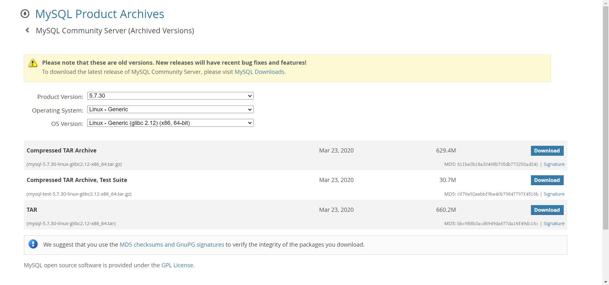

## **MySQL5.7.30安装配置记录**

### 下载安装包

下载版本mysql-5.7.30-linux-glibc2.12-x86_64.tar.gz

https://downloads.mysql.com/archives/community/




### 卸载MariaDB

查询已安装的MariaDB安装包

> rpm -qa|grep mariadb

卸载查询出的所有安装包

> yum -y remove mariadb-libs-5.5.65-1.el7.x86_64

### 解压Mysql安装包

> tar -zxvf mysql-5.7.30-linux-glibc2.12-x86_64.tar.gz
>
> mv mysql-5.7.30-linux-glibc2.12-x86_64 mysql

### 创建data目录

> mkdir /opt/app/mysql/data

### 创建sock目录并修改权限

> mkdir /var/lib/mysql
>
> chmod 777 /var/lib/mysql

### 创建mysql用户和用户组

> groupadd mysql
>
> useradd -g mysql mysql

### 修改mysql目录的归属用户

> chown -R mysql:mysql /opt/app/mysql

### 准备配置文件

> vi /etc/my.cnf

```
[mysql]
# 设置mysql客户端默认字符集
default-character-set=utf8mb4
socket=/var/lib/mysql/mysql.sock
[mysqld]
skip-name-resolve
#设置3306端⼝
port = 3306
socket=/var/lib/mysql/mysql.sock
# 设置mysql的安装⽬录
basedir=/opt/app/mysql
# 设置mysql数据库的数据的存放⽬录
datadir=/opt/app/mysql/data
# 允许最大连接数
max_connections=200
# 服务端使⽤的字符集默认为8⽐特编码的latin1字符集
character-set-server=utf8mb4
# 创建新表时将使⽤的默认存储引擎
default-storage-engine=INNODB
lower_case_table_names=1
max_allowed_packet=16M
```

### 安装Mysql

> /opt/app/mysql/bin/mysqld --initialize --user=mysql --basedir=/opt/app/mysql --datadir=/opt/app/mysql/data

```
[root@3fb69a6bdc53 mysql]# /opt/app/mysql/bin/mysqld --initialize --user=mysql --basedir=/opt/app/mysql --datadir=/opt/app/mysql/data
2022-02-15T06:35:20.985596Z 0 [Warning] TIMESTAMP with implicit DEFAULT value is deprecated. Please use --explicit_defaults_for_timestamp server option (see documentation for more details).
2022-02-15T06:35:21.137480Z 0 [Warning] InnoDB: New log files created, LSN=45790
2022-02-15T06:35:21.167416Z 0 [Warning] InnoDB: Creating foreign key constraint system tables.
2022-02-15T06:35:21.225291Z 0 [Warning] No existing UUID has been found, so we assume that this is the first time that this server has been started. Generating a new UUID: 72c97a7f-8e29-11ec-9d83-0242ac110002.
2022-02-15T06:35:21.226391Z 0 [Warning] Gtid table is not ready to be used. Table 'mysql.gtid_executed' cannot be opened.
2022-02-15T06:35:21.857467Z 0 [Warning] CA certificate ca.pem is self signed.
2022-02-15T06:35:21.998776Z 1 [Note] A temporary password is generated for root@localhost: t58>S;Oj33t_
```

### 复制启动脚本到资源目录

> cp /opt/app/mysql/support-files/mysql.server /etc/init.d/mysqld

修改脚本中的basedir和datadir为实际对应目录

> vi /etc/init.d/mysqld

```
basedir=/opt/app/mysql
datadir=/opt/app/mysql/data
```

### 设置Mysql系统服务并开启自启

增加mysqld服务控制脚本执行权限

> chmod +x /etc/init.d/mysqld

将mysqld服务加入到系统服务

> chkconfig --add mysqld

检查mysqld服务是否已生效

> chkconfig --list mysqld

```
[root@3fb69a6bdc53 mysql]# chkconfig --list mysqld

Note: This output shows SysV services only and does not include native
      systemd services. SysV configuration data might be overridden by native
      systemd configuration.

      If you want to list systemd services use 'systemctl list-unit-files'.
      To see services enabled on particular target use
      'systemctl list-dependencies [target]'.

mysqld         	0:off	1:off	2:on	3:on	4:on	5:on	6:off
```

- 表示mysqld服务已生效，在2、3、4、5运行级别随系统启动而自动启动，以后可以直接用service命令控制Mysql启停

### 启动Mysql

> service mysqld start

### 将Mysql的bin目录加入PATH环境变量

> vi ~/.bash_profile

```
# .bash_profile

# Get the aliases and functions
if [ -f ~/.bashrc ]; then
        . ~/.bashrc
fi

# User specific environment and startup programs

PATH=$PATH:$HOME/bin

export PATH

export PATH=$PATH:/opt/app/mysql/bin
```

使环境变量生效

> source ~/.bash_profile

### 首次登录Mysql

> mysql -uroot -p

```
[root@3fb69a6bdc53 ~]# mysql -uroot -p 
Enter password: 
Welcome to the MySQL monitor.  Commands end with ; or \g.
Your MySQL connection id is 3
Server version: 5.7.30

Copyright (c) 2000, 2020, Oracle and/or its affiliates. All rights reserved.

Oracle is a registered trademark of Oracle Corporation and/or its
affiliates. Other names may be trademarks of their respective
owners.

Type 'help;' or '\h' for help. Type '\c' to clear the current input statement.

mysql> 
```

### 修改root账户密码

> mysql> alter user user() identified by "\*\*\*\*\*\*";
>
> mysql> flush privileges;

### 设置远程登录

> mysql> use mysql;
>
> mysql> update user set user.Host='%' where user.User='root';
>
> mysql> flush privileges;

### Navicat连接测试
