## **Navicat Premium15安装方式**

### 下载并安装

- navicat150_premium_cs_x64

### Keygen使用

- 将Navicat Keygen Patch v5.6.0 DFoX.exe复制到navicat.exe同级目录下

- 点击Patch

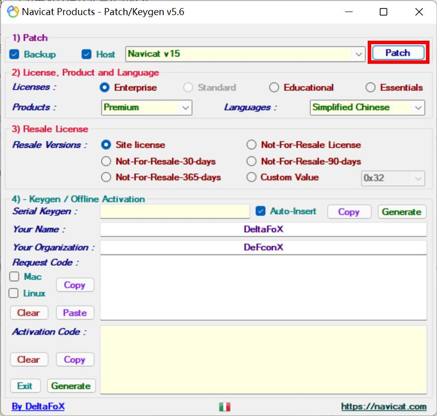

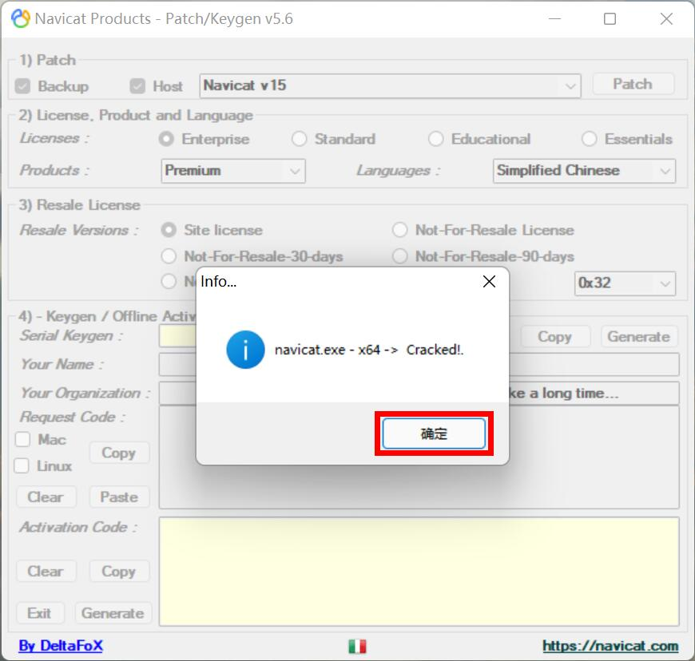

- 启动Navicat，点击注册

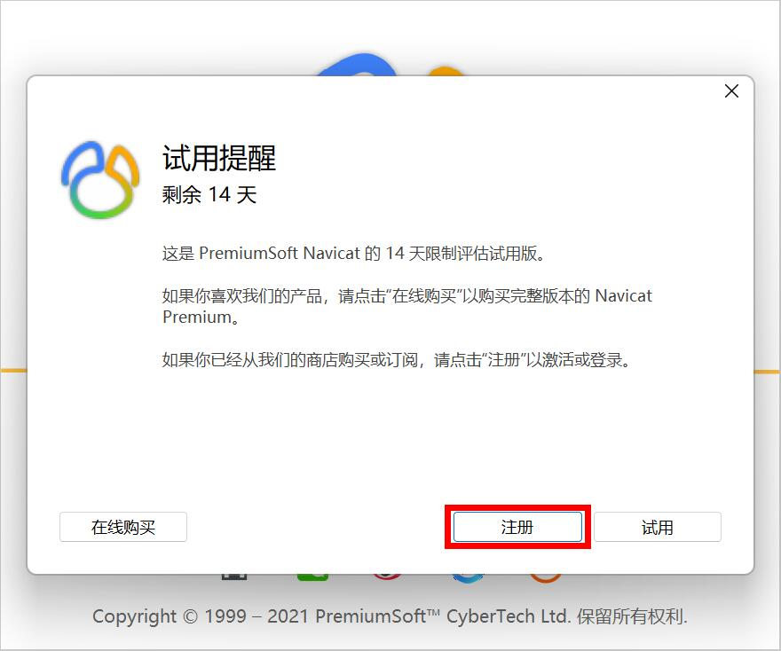

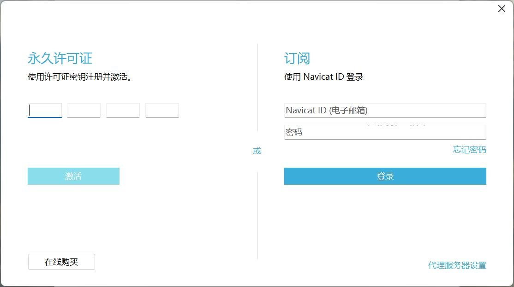

- 点击Generate生成密钥并自动填充

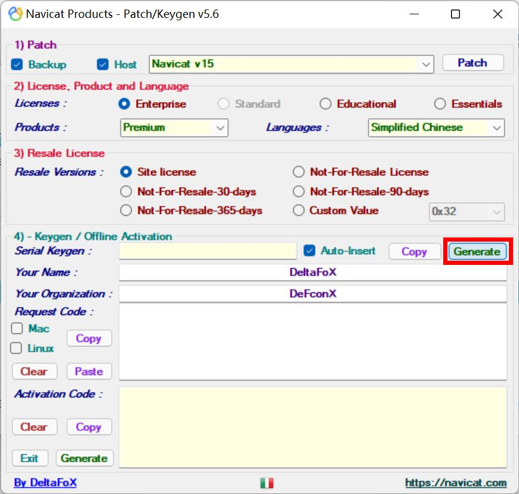

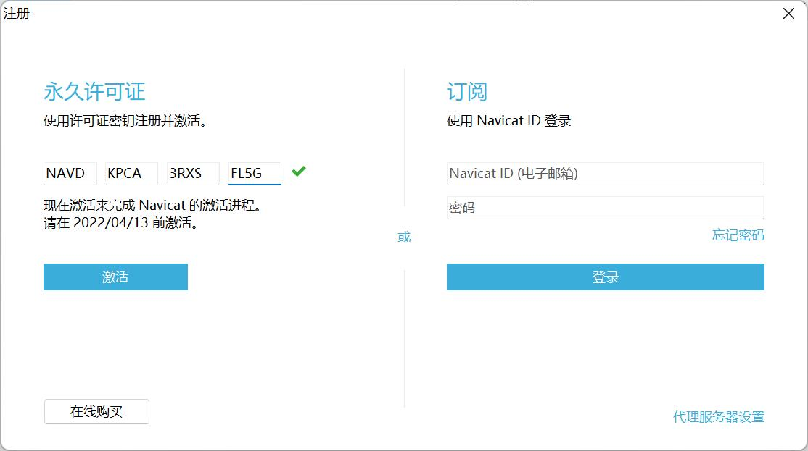

- 点击激活

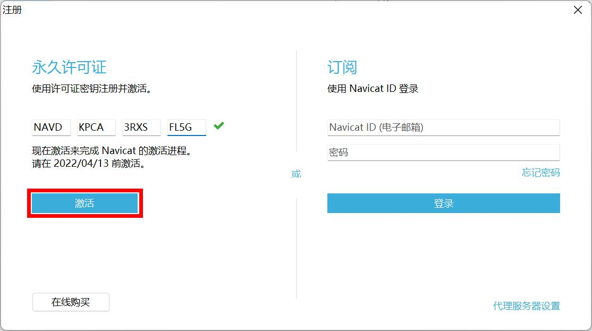

- 点击手动激活

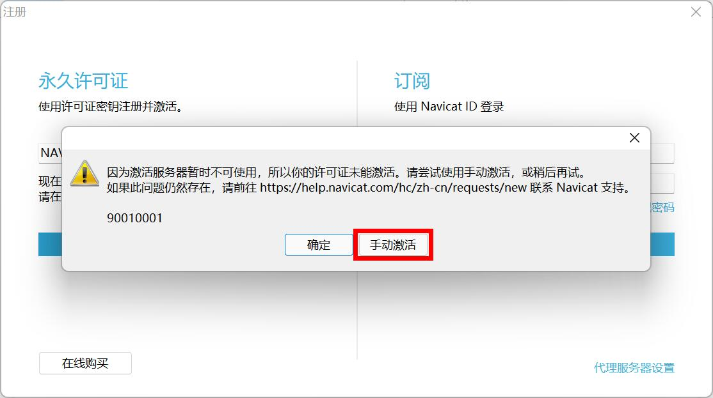

- 复制请求码到Request Code

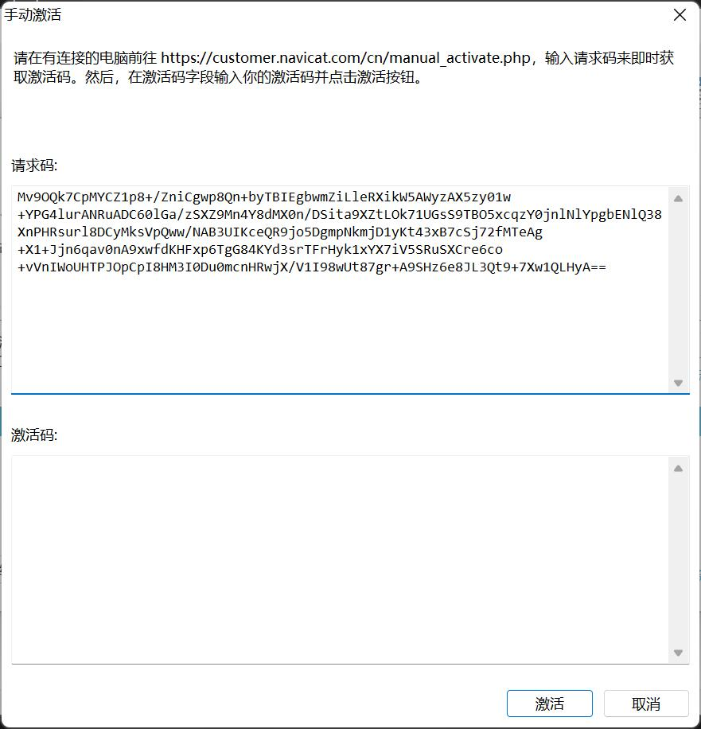

- 点击Activication Code的Generate生成激活码并自动填充

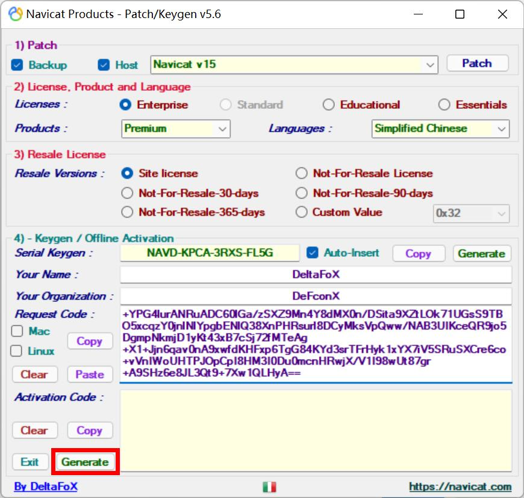

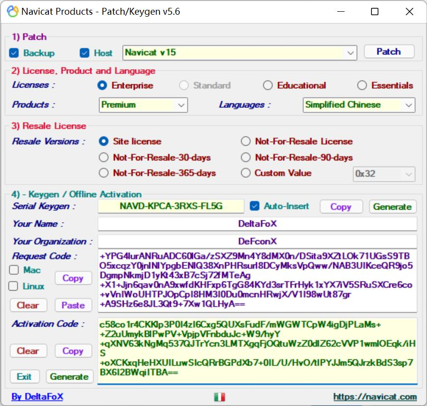

- 完成激活

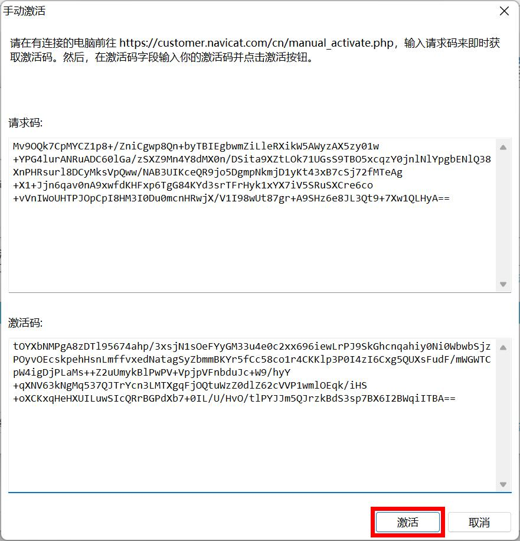