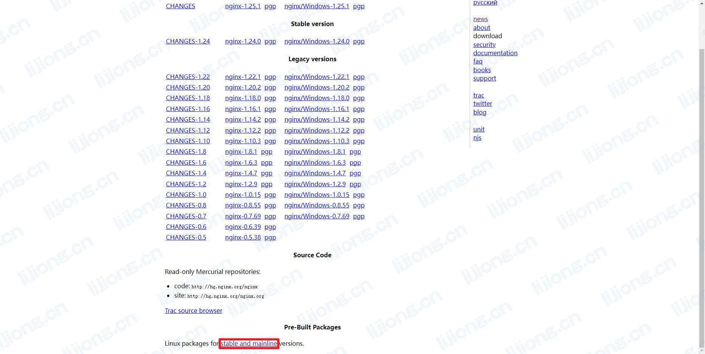
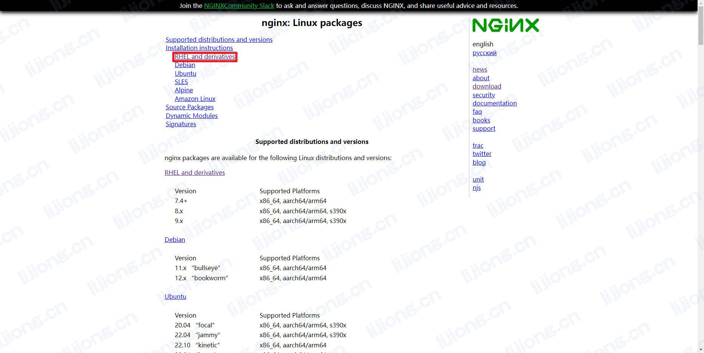
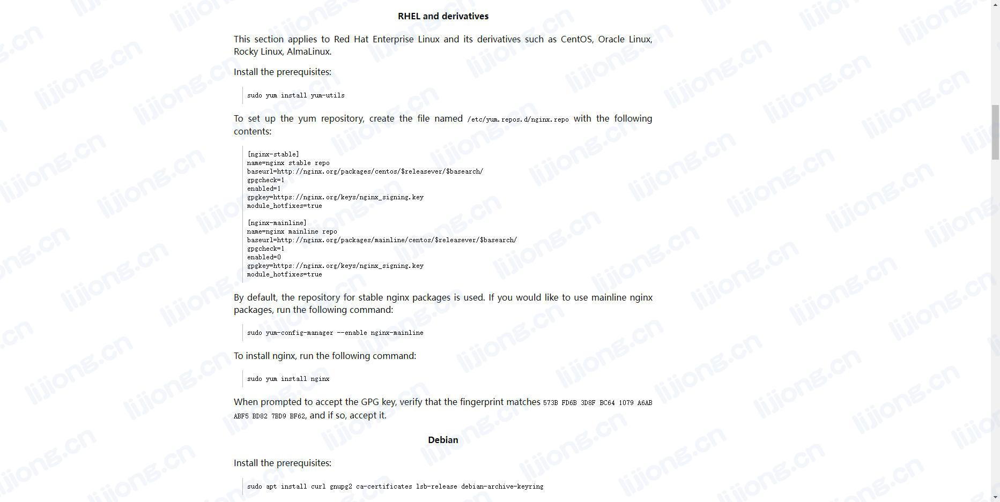

## **Nginx安装记录**

### 查看官方文档

- http://nginx.org/








### 安装前提组件

> sudo yum install yum-utils

### 创建nginx.repo

> vi /etc/yum.repos.d/nginx.repo

```
[nginx-stable]
name=nginx stable repo
baseurl=http://nginx.org/packages/centos/$releasever/$basearch/
gpgcheck=1
enabled=1
gpgkey=https://nginx.org/keys/nginx_signing.key
module_hotfixes=true
```

### 安装nginx

> sudo yum install nginx

### 启动Nginx并设置开机启动

> systemctl enable --now nginx

### 查看Nginx状态

> systemctl status nginx

### 访问Nginx页面

- 使用IP地址


### 查看Nginx目录结构

> rpm -ql nginx

```python
/etc/logrotate.d/nginx
/etc/nginx
/etc/nginx/conf.d
/etc/nginx/conf.d/default.conf # 默认配置文件
/etc/nginx/fastcgi_params
/etc/nginx/mime.types
/etc/nginx/modules
/etc/nginx/nginx.conf # 主配置文件
/etc/nginx/scgi_params
/etc/nginx/uwsgi_params
/usr/lib/systemd/system/nginx-debug.service
/usr/lib/systemd/system/nginx.service
/usr/lib64/nginx
/usr/lib64/nginx/modules
/usr/libexec/initscripts/legacy-actions/nginx
/usr/libexec/initscripts/legacy-actions/nginx/check-reload
/usr/libexec/initscripts/legacy-actions/nginx/upgrade
/usr/sbin/nginx
/usr/sbin/nginx-debug
/usr/share/doc/nginx-1.24.0
/usr/share/doc/nginx-1.24.0/COPYRIGHT
/usr/share/man/man8/nginx.8.gz
/usr/share/nginx
/usr/share/nginx/html
/usr/share/nginx/html/50x.html
/usr/share/nginx/html/index.html
/var/cache/nginx
/var/log/nginx # 默认日志目录
```

