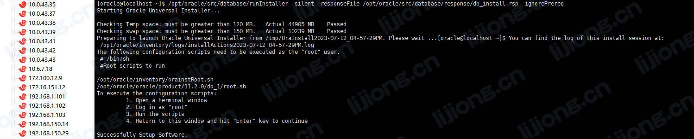

## **Oracle安装配置记录**

### 系统环境配置

#### 查看系统信息

```
[root@localhost ~]# cat /etc/redhat-release
CentOS Linux release 7.6.1810 (Core) 
```

#### 修改CentOS系统标识

- Oracle不支持CentOS

> vi /etc/redhat-release

```
redhat-7
```

#### 修改内核参数

> vi /etc/sysctl.conf

```
fs.aio-max-nr = 1048576
fs.file-max = 6815744
kernel.shmmni = 4096
kernel.sem = 250 32000 100 128
kernel.shmall = 2097152
kernel.shmmax = 2147483648
net.ipv4.ip_local_port_range = 9000 65500
net.ipv4.icmp_echo_ignore_broadcasts = 1
net.ipv4.conf.all.rp_filter = 1
net.core.rmem_default = 262144
net.core.rmem_max= 4194304
net.core.wmem_default= 262144
net.core.wmem_max= 1048576
```

- 启用新配置

> sysctl -p

#### 安装所需软件包

> yum -y install binutils* compat-libcap1* compat-libstdc++* gcc* gcc-c++* glibc* glibc-devel* ksh* libaio* libaio-devel* libgcc* libstdc++* libstdc++-devel* libXi* libXtst* make* sysstat* elfutils* unixODBC* unzip lrzsz

#### 创建用户和用户组

- 创建安装Oracle程序用户组

> groupadd oinstall 

- 创建DBA用户组

> groupadd dba

- 创建用户oracle并加入到DBA组

> useradd -g dba -m oracle

- 将用户oracle加入到oinstall组

> usermod -a -G oinstall oracle

- 设置用户oracle密码为oracle

> passwd oracle

#### 创建安装目录

- 创建Oracle主目录

> mkdir -p /opt/oracle/oracle

- 创建Oralce配置目录

> mkdir -p /opt/oracle/inventory

- 创建Oracle压缩包解压目录

> mkdir -p /opt/oracle/src

- 修改目录权限

> chown -R oracle:oinstall /opt/oracle/oracle
>
> chown -R oracle:oinstall /opt/oracle/inventory
>
> chown -R oracle:oinstall /opt/oracle/src

#### 修改oracle用户安全性设置

- 修改/etc/security/limits.conf

```
#@student        -       maxlogins       4
oracle soft nproc 2047
oracle hard nproc 16384
oracle soft nofile 1024
oracle hard nofile 65536
# End of file
```

#### 修改oracle用户环境变量

> vi /home/oracle/.bashrc

```
export PATH
export ORACLE_BASE=/opt/oracle/oracle
export ORACLE_HOME=$ORACLE_BASE/product/11.2.0/db_1
export ORACLE_SID=orcl
export ORACLE_UNQNAME=orcl
export PATH=$ORACLE_HOME/bin:/usr/sbin:$PATH
export LD_LIBRARY_PATH=$ORACLE_HOME/lib:/lib:/usr/lib
export LANG=C
export NLS_LANG=AMERICAN_AMERICA.AL32UTF8
```

- 使环境变量生效

> source /home/oracle/.bashrc

#### 解压安装包

> unzip linux.x64_11gR2_database_1of2.zip -d /opt/oracle/src/

> unzip linux.x64_11gR2_database_2of2.zip -d /opt/oracle/src/

- 修改目录权限

> chown -R oracle:oinstall /opt/oracle/src/

#### 关闭SELinux

> vi /etc/selinux/config

```
SELINUX=disabled
```

- 重启

> reboot

#### 关闭防火墙

> systemctl stop firewalld

> systemctl disable firewalld

### 安装Oracle

- 切换oracle用户

> su oracle

#### 修改安装文件

- /opt/oracle/src/database/response/db_install.rsp

```
oracle.install.option=INSTALL_DB_SWONLY # 安装类型
ORACLE_HOSTNAME=oracle.server # 主机名称
UNIX_GROUP_NAME=oinstall # 安装组
INVENTORY_LOCATION=/opt/oracle/inventory # INVENTORY目录
SELECTED_LANGUAGES=en,zh_CN # 选择语言
ORACLE_HOME=/opt/oracle/oracle/product/11.2.0/db_1 # oracle_home
ORACLE_BASE=/opt/oracle/oracle # oracle_base
oracle.install.db.InstallEdition=EE # oracle版本
oracle.install.db.DBA_GROUP=dba # dba用户组
oracle.install.db.OPER_GROUP=oinstall # oper用户组
oracle.install.db.config.starterdb.type=GENERAL_PURPOSE # 数据库类型
oracle.install.db.config.starterdb.globalDBName=orcl # globalDBName
oracle.install.db.config.starterdb.SID=orcl # SID
oracle.install.db.config.starterdb.characterSet=AL32UTF8 # 默认数据库编码
oracle.install.db.config.starterdb.memoryLimit=800 # 自动管理内存的最小内存(M)
oracle.install.db.config.starterdb.password.ALL=oracle # 设定所有数据库用户使用同一个密码
DECLINE_SECURITY_UPDATES=true # 设置安全更新
```

#### 运行安装命令

> /opt/oracle/src/database/runInstaller -silent -responseFile /opt/oracle/src/database/response/db_install.rsp -ignorePrereq



#### 根据安装提示运行对应的文件（root用户）

> /opt/oracle/inventory/orainstRoot.sh

> /opt/oracle/oracle/product/11.2.0/db_1/root.sh


### 配置Oracle监听程序

#### 修改监听配置文件

- /opt/oracle/src/database/response/netca.rsp

```
INSTALL_TYPE=""custom"" # 安装的类型
LISTENER_NUMBER=1 # 监听器数量
LISTENER_NAMES={"LISTENER"} # 监听器的名称列表
LISTENER_PROTOCOLS={"TCP;1521"} # 监听器使用的通讯协议列表
LISTENER_START=""LISTENER"" # 监听器启动的名称
```

#### 运行监听命令

> /opt/oracle/oracle/product/11.2.0/db_1/bin/netca /silent /responseFile /opt/oracle/src/database/response/netca.rsp


#### 查看监听程序是否运行

> netstat -tnulp | grep 1521

- （监听的开启/关闭）

> /opt/oracle/oracle/product/11.2.0/db_1/bin/lsnrctl start

> /opt/oracle/oracle/product/11.2.0/db_1/bin/lsnrctl stop

### 启动数据库实例

#### 修改数据库实例文件

- /opt/oracle/src/database/response/dbca.rsp

```
RESPONSEFILE_VERSION = "11.2.0" # 数据库版本
OPERATION_TYPE = "createDatabase" # 操作为创建实例
GDBNAME = "orcl" # 数据库名
SID = "orcl" # 数据库系统标识
TEMPLATENAME = "General_Purpose.dbc" # 模板文件
SYSPASSWORD = "oracle" # SYS用户密码
SYSTEMPASSWORD = "oracle" # SYSTEM用户密码
SYSMANPASSWORD = "oracle" # SYSMAN用户密码
DBSNMPPASSWORD = "oracle" # DBSNMP用户密码
DATAFILEDESTINATION = /data/oracle/oradata # 数据文件存放目录
RECOVERYAREADESTINATION = /data/oracle/flash_recovery_area # 恢复数据存放目录
CHARACTERSET = "AL32UTF8" # 字符集
NATIONALCHARACTERSET= "AL16UTF16" # 字符集
TOTALMEMORY = "2000" # 总内存
```

#### 创建存放目录

> mkdir -p /data/oracle/oradata

> mkdir -p /data/oracle/flash_recovery_area

> chown -R oracle:oinstall /data/oracle/

#### 运行实例命令

> /opt/oracle/oracle/product/11.2.0/db_1/bin/dbca -silent -responseFile /opt/oracle/src/database/response/dbca.rsp


#### 查看实例运行情况

> ps -ef | grep ora_ | grep -v grep


#### 修改启动和关闭实例程序

> vi /opt/oracle/oracle/product/11.2.0/db_1/bin/dbstart

```
#ORACLE_HOME_LISTNER=$1
ORACLE_HOME_LISTNER=/opt/oracle/oracle/product/11.2.0/db_1
```

> vi /opt/oracle/oracle/product/11.2.0/db_1/bin/dbshut

```
#ORACLE_HOME_LISTNER=$1
ORACLE_HOME_LISTNER=/opt/oracle/oracle/product/11.2.0/db_1
```

> vi /etc/oratab

```
#orcl:/opt/oracle/oracle/product/11.2.0/db_1:N
orcl:/opt/oracle/oracle/product/11.2.0/db_1:Y
```

- （实例的启动/关闭）

> /opt/oracle/oracle/product/11.2.0/db_1/bin/dbstart

> /opt/oracle/oracle/product/11.2.0/db_1/bin/dbshut

### 进入Oracle

> sqlplus / as sysdba

### 设置开机启动（root用户）

> chmod +x /etc/rc.d/rc.local

> /etc/rc.d/rc.local

```
su oracle -lc "/opt/oracle/oracle/product/11.2.0/db_1/bin/lsnrctl start"
su oracle -lc "/opt/oracle/oracle/product/11.2.0/db_1/bin/dbstart"
```

