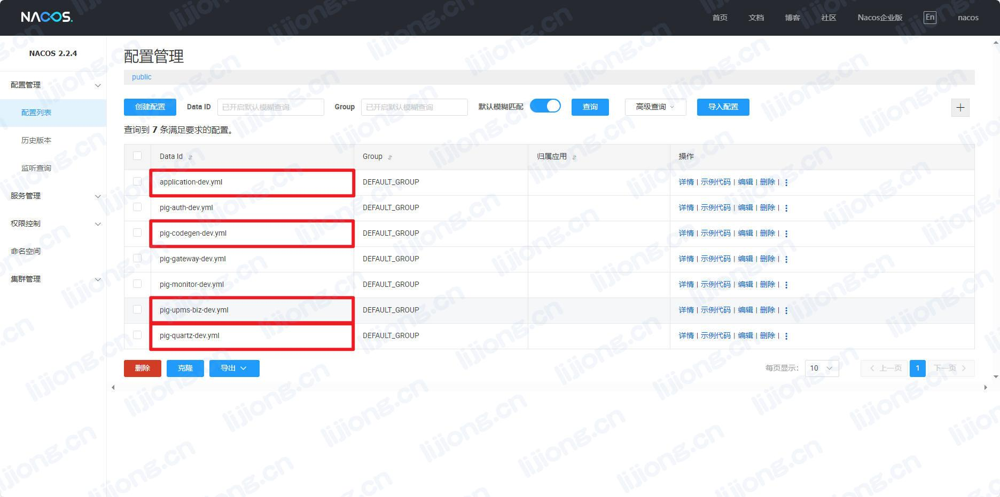

## **PIG开发平台部署记录**

### 基础环境

- JDK：8、17
- Maven：3.8+
- MySQL：5.7.8+
- Redis：3.2+
- Node：16

### 配置hosts

```
127.0.0.1   pig-mysql
127.0.0.1   pig-redis
127.0.0.1   pig-gateway
127.0.0.1   pig-register
127.0.0.1   pig-sentinel
127.0.0.1	pig-monitor
127.0.0.1	pig-job
127.0.0.1   pig-seata
```

### 项目下载

- 后端（JDK8）

  > git clone https://gitee.com/log4j/pig.git -b master

- 后端（JDK17）

  > git clone https://gitee.com/log4j/pig.git -b jdk17

- 前端

  > git clone https://gitee.com/log4j/pig-ui.git

### 初始化数据库

```mysql
-- 核心数据库
source db/pig.sql;
-- nacos配置
source db/pig_config.sql;
-- 代码生成模块脚本
source db/pig_codegen.sql;
-- 定时任务模块脚本
source db/pig_job.sql;
```

### 配置修改与启动

- pig-register/src/main/resources/application.yml
  - 修改user和password

```yaml
db:
  num: 1
  user: ${MYSQL_USER:root}
  password: ${MYSQL_PWD:123456}
  url:
    0: jdbc:mysql://${MYSQL_HOST:pig-mysql}:${MYSQL_PORT:3306}/${MYSQL_DB:pig_config}?characterEncoding=utf8&zeroDateTimeBehavior=convertToNull&useSSL=false&useJDBCCompliantTimezoneShift=true&useLegacyDatetimeCode=false&serverTimezone=GMT%2B8&nullCatalogMeansCurrent=true&allowPublicKeyRetrieval=true
```

- 启动pig-register/src/main/java/com/alibaba/nacos/PigNacosApplication.java
- nacos访问
  - localhost:8848/nacos
  - nacos/nacos

- 修改mysql配置
  - pig-upms-biz-dev.yml
  - pig-quartz-dev.yml
  - pig-codegen-dev.yml
- 修改redis配置
  - application-dev.yml



- 启动pig-upms/pig-upms-biz/src/main/java/com/pig4cloud/pig/admin/PigAdminApplication.java
- 启动pig-auth/src/main/java/com/pig4cloud/pig/auth/PigAuthApplication.java
- 启动pig-gateway/src/main/java/com/pig4cloud/pig/gateway/PigGatewayApplication.java
- 其他启动项
  - pig-visual/pig-codegen/src/main/java/com/pig4cloud/pig/codegen/PigCodeGenApplication.java
  - pig-visual/pig-monitor/src/main/java/com/pig4cloud/pig/monitor/PigMonitorApplication.java
  - pig-visual/pig-quartz/src/main/java/com/pig4cloud/pig/daemon/quartz/PigQuartzApplication.java

### 前端启动

- 依赖安装（pig-ui目录下）

  > npm install  --registry=https://registry.npmmirror.com

- 启动（pig-ui目录下）

  > npm run dev

- 前端访问

  - localhost:8888
  - admin/123456

