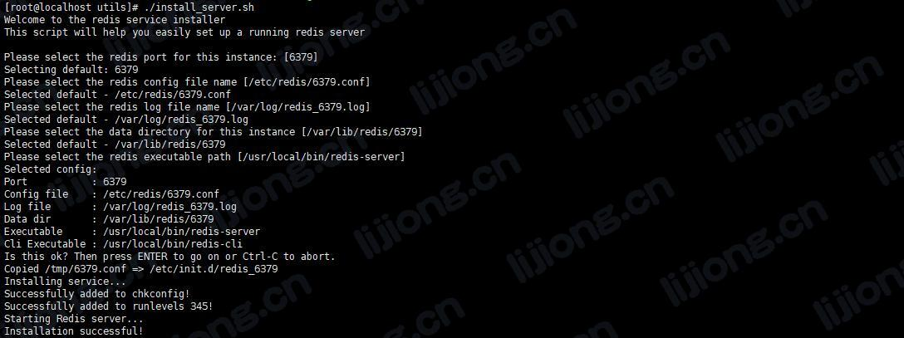

## **Redis安装部署记录**

### 下载安装包

> https://download.redis.io/releases/

### 上传并解压安装包

> tar -zxvf redis-5.0.8.tar.gz

### 编译并安装

> cd redis-5.0.8

> make && make install

### 安装为系统服务并启动

> cd utils

> ./install_server.sh




### 查看启动情况

> service redis_6379 status

### 设置允许远程连接

- vi /etc/redis/6379.conf

```
# IF YOU ARE SURE YOU WANT YOUR INSTANCE TO LISTEN TO ALL THE INTERFACES
# JUST COMMENT THE FOLLOWING LINE.
# ~~~~~~~~~~~~~~~~~~~~~~~~~~~~~~~~~~~~~~~~~~~~~~~~~~~~~~~~~~~~~~~~~~~~~~~~
bind 0.0.0.0
```

- 重启服务

> service redis_6379 restart

### 设置密码

- vi /etc/redis/6379.conf

```
requirepass ******
```

- 重启服务

> service redis_6379 restart

