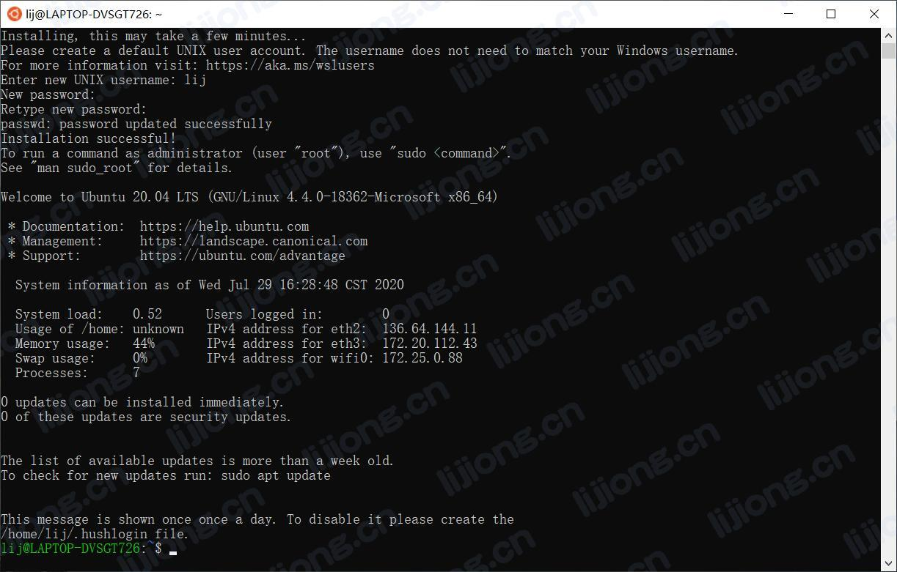

## **Windows安装Linux子系统**

### 子系统安装

- Windows设置 -> 更新与安全 -> 开发者选项 -> 开发人员模式

- 控制面板 -> 程序 -> 启用或关闭Windows功能 -> 适用于Linux的Windows子系统

- Microsoft Store -> 安装Ubuntu

- 设置用户名和密码

***

### 进入bash

- Win + R

- cmd

- Ubuntu

***

### 切换root

- 切换到root用户，需先设置root用户密码

