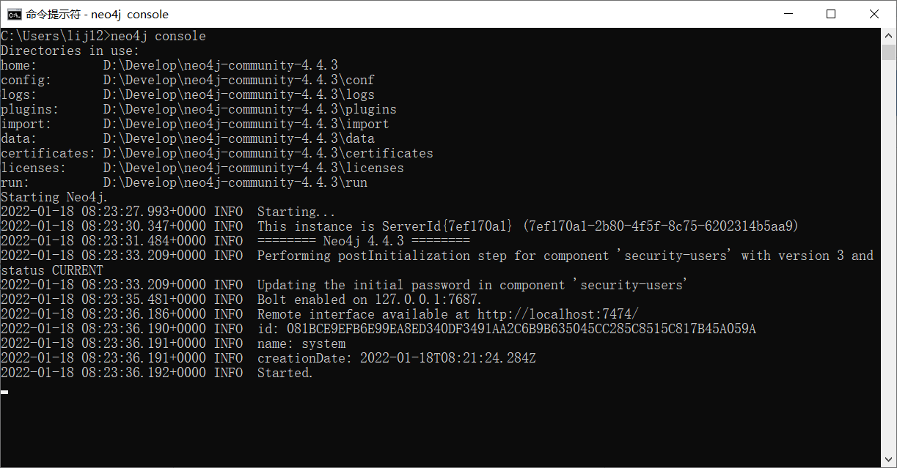
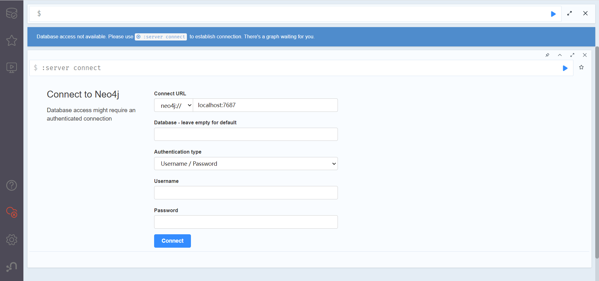
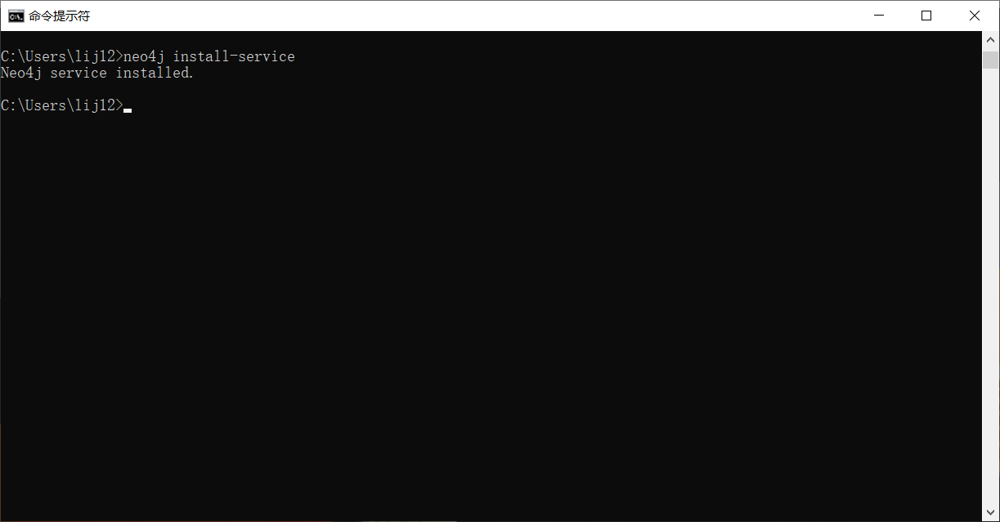

## **Windows版Neo4j安装记录**

### 解压压缩包

- neo4j-community-4.4.3-windows.zip

### 安装相应版本JDK

- jdk-11.0.13_windows-x64_bin.exe

### 设置环境变量

- JAVA_HOME和NEO4J_HOME

### 启动命令行客户端

```
neo4j console
```







- 默认用户名密码为：neo4j/neo4j

### 启动服务

```
neo4j install-service
```

