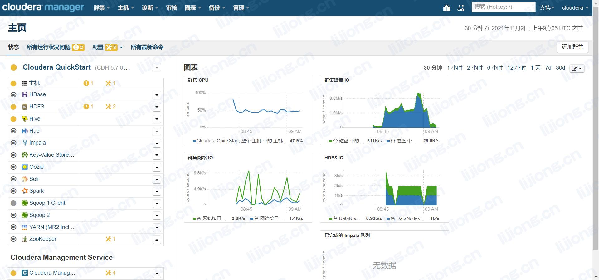

## **基于Docker的单机版CDH安装**
### 拉取镜像

> docker pull cloudera/quickstart

```
[root@avatar ~]# docker pull cloudera/quickstart
Using default tag: latest
Trying to pull repository docker.io/cloudera/quickstart ... 
latest: Pulling from docker.io/cloudera/quickstart
1d00652ce734: Pull complete 
Digest: sha256:f91bee4cdfa2c92ea3652929a22f729d4d13fc838b00f120e630f91c941acb63
Status: Downloaded newer image for docker.io/cloudera/quickstart:latest
```

```
[root@avatar ~]# docker image ls
REPOSITORY                      TAG                 IMAGE ID            CREATED             SIZE
docker.io/hello-world           latest              feb5d9fea6a5        5 weeks ago         13.3 kB
docker.io/cloudera/quickstart   latest              4239cd2958c6        5 years ago         6.34 GB
```

### 启动容器

```
--hostname=quickstart.cloudera    Required: pseudo-distributed configuration assumes this hostname
--privileged=true                 Required: for HBase, MySQL-backed Hive metastore, Hue, Oozie, Sentry, and Cloudera Manager, and possibly others
-t                                Required: once services are started, a Bash shell takes over and will die without this
-i                                Required: if you want to use the terminal, either immediately or attach later
-p 8888                           Recommended: maps the Hue port in the guest to another port on the host
-p [PORT]                         Optional: map any other ports (e.g. 7180 for Cloudera Manager, 80 for a guided tutorial)
-d                                Optional: runs the container in the background
```


> docker run \
> -idt \
> --hostname=quickstart.cloudera \
> --privileged=true  \
> -p 8020:8020 -p 7180:7180 -p 21050:21050 -p 50070:50070 -p 50075:50075 \
> -p 50010:50010 -p 50020:50020 -p 8890:8890 -p 60010:60010 -p 10002:10002  \
> -p 25010:25010 -p 25020:25020 -p 18088:18088 -p 8088:8088 -p 19888:19888 \
> -p 7187:7187 -p 11000:11000 -p 8888:8888 \
> --name=mycdh \
> cloudera/quickstart /usr/bin/docker-quickstart 

```
[root@avatar /]# docker run \
>  -idt \
>  --hostname=quickstart.cloudera \
>  --privileged=true  \
>  -p 8020:8020 -p 7180:7180 -p 21050:21050 -p 50070:50070 -p 50075:50075 \
>  -p 50010:50010 -p 50020:50020 -p 8890:8890 -p 60010:60010 -p 10002:10002  \
>  -p 25010:25010 -p 25020:25020 -p 18088:18088 -p 8088:8088 -p 19888:19888 \
>  -p 7187:7187 -p 11000:11000 -p 8888:8888 \
>  --name=mycdh \
>  cloudera/quickstart /usr/bin/docker-quickstart 
a8fc833fc1579e75513504ca14c2d3241af620578e133c4dd3446c60803d3941

```

### 进入容器

> docker exec -it mycdh bash

```
[root@avatar docker]# docker exec -it mycdh bash
[root@quickstart /]# 
```

### 启动Cloudera Manager

> /home/cloudera/cloudera-manager --enterprise && service ntpd start

```
[root@quickstart /]# /home/cloudera/cloudera-manager --enterprise && service ntpd start
[QuickStart] Shutting down CDH services via init scripts...
kafka-server: unrecognized service
JMX enabled by default
Using config: /etc/zookeeper/conf/zoo.cfg
[QuickStart] Disabling CDH services on boot...
error reading information on service kafka-server: No such file or directory
[QuickStart] Starting Cloudera Manager server...
[QuickStart] Waiting for Cloudera Manager API...
[QuickStart] Starting Cloudera Manager agent...
[QuickStart] Activating trial license for Enterprise...
[QuickStart] Configuring deployment...
Submitted jobs: 15
[QuickStart] Deploying client configuration...
Submitted jobs: 17
[QuickStart] Starting Cloudera Management Service...
Submitted jobs: 25
[QuickStart] Enabling Cloudera Manager daemons on boot...
________________________________________________________________________________

Success! You can now log into Cloudera Manager from the QuickStart VM's browser:

    http://quickstart.cloudera:7180

    Username: cloudera
    Password: cloudera

Starting ntpd:                                             [  OK  ]
```

### 访问页面

- 配置linux和windows的hosts文件

```
192.168.1.111 quickstart.cloudera
```

- 192.168.101.12:7180 账号: cloudera 密码: cloudera



```
[root@quickstart /]# hdfs dfs -ls /
Found 5 items
drwxrwxrwx   - hdfs  supergroup          0 2016-04-06 02:26 /benchmarks
drwxr-xr-x   - hbase supergroup          0 2016-04-06 02:26 /hbase
drwxrwxrwt   - hdfs  supergroup          0 2021-11-02 08:47 /tmp
drwxr-xr-x   - hdfs  supergroup          0 2016-04-06 02:27 /user
drwxr-xr-x   - hdfs  supergroup          0 2016-04-06 02:27 /var
```