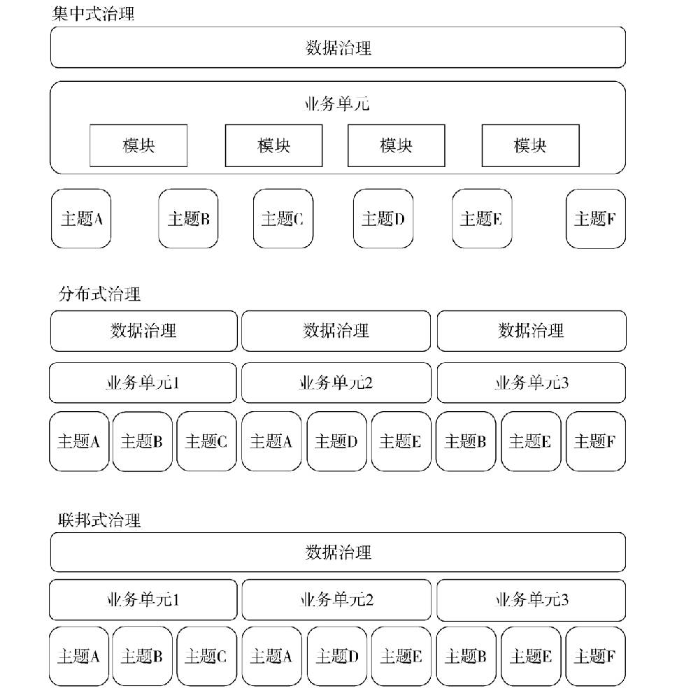

# 数据管理

### 数据管理原则

**姿经质元规驱 跨企多期特险**
- 数据是一种有特殊属性的**资产**
- 数据的价值可以而且应该用**经济术语**来表达
- 管理数据的意思是管理数据的**质量**
- 通过**元数据**来管理数据
- 通过**规划**来管理数据
- 数据管理需求必须**驱动信息技术决策**
- 数据管理是**跨职能**的，需要一系列的技术和专业知识
- 数据管理需要**企业视角**
- 数据管理必须**对多方面负责**
- 数据管理就是**生命周期管理**
- 不同的数据有**不同的生命周期特征**
- 管理数据包括管理数据相关的**风险**

### 数据和信息

- 如“这是上季度的销售报告”（信息）。它基于数据仓库中的数据（数据）。下一季度，这些结果（数据）将用于生成季度绩效指标（信息）

### 生命周期管理ROT数据

- 生命周期管理应专注于关键数据并尽可能减少冗余（redundant）、过时（obsolete）和不重要（trivial）的数据

### 活动的四阶段

- 中：**计划P**控制C开发D**运营O**
- 英：**计划P**开发D控制C**运营O**

### 数据管理战略的SMART原则

- 具体specific，可衡量measurable，可达到actionable，现实realistic，有时限timebound

### DAMA-DMBOK框架

- DAMA轮、环境因素六边形、语境关系图

### 数据的成本

- 获取和存储数据的成本
- 如果数据丢失，更换数据需要的成本
- 数据丢失对组织的影响
- 风险缓解成本和与数据相关的潜在风险成本
- 改进数据的成本
- 高质量数据的优势
- 竞争对手为数据付出的费用
- 数据潜在的销售价格
- 创新性应用数据的预期收入

# 数据处理伦理

### 语境图

- 定义
  - 数据处理道德关注如何以符合道德原则（包括社会责任）的方式获取、存储、管理、解释、分析/应用和销毁数据
- 目标
  1. 定义组织中合乎道德的数据处理
  2. 教导员工关于不当数据处理的风险
  3. 改变/逐渐灌输数据处理的文化和行为
  4. 衡量、监控和调整组织以数据道德为目的的方法
- 输入
  - 组织现有和倾向的道德原则
  - 业务策略 & 目标
  - 组织结构
  - 商业文化
  - 法规
  - 当前企业政策
- 提供者
  - 管理人员
  - 数据管理专员
  - 数据实施管理专员
  - 信息技术主管
  - 数据提供商
  - 监管人员
- 活动
  1. 【规划】审查数据处理做法
  2. 【规划】定义原则、做法和风险因素
  3. 【规划】创建符合道德的数据处理策略
  4. 【执行】解决实践中的差距
  5. 【执行】沟通和教导员工
  6. 【控制】监控和维持一致性
- 参与者
  - 数据治理人员
  - 首席数据官 / 首席信息官
  - 管理人员
  - 协调数据管理专员
  - 主题专家
  - 变革经理
  - DM服务者
- 交付
  - 现在的做法和差距
  - 符合道德的数据处理策略
  - 沟通计划
  - 道德培训课程
  - 企业的数据道德声明
  - 对数据道德问题的认识
  - 一致的激励、KPI和目标
  - 更新的政策
  - 数据道德处理报告
- 消费者
  - 员工
  - 管理人员
  - 监管人员
- 技术
  - 沟通计划清单
  - 年度道德承诺声明
- 工具
  - Wikis、知识库和内部网站
  - 微博，其他内部沟通工具
- 指标
  - 被培训的员工数量
  - 合规 / 不合规事件
  - 企业管理人员的参与

### 数据伦理准则

- 尊重他人
- 行善原则
- 公正
- 尊重法律和公众利益
- （没有团结友爱）

### GDPR准则

通用数据保护条例（General Data Protection Regulation）

- 公平、合法、透明
- 目的限制
- 数据最小化
- 准确性
- 存储限制
- 诚信和保密
- 问责制

# 数据治理

### 语境图

- 定义
  - 对数据资产管理行使权限、进行控制、共同决定重要事项（规划、监控和执行）
- 目标
  1. **使组织能够将数据作为资产进行管理**
  2. **定义、批准、沟通和实施数据管理的原则、制度、流程、指标、工具和职责**
  3. **监控和指导制度合规、数据使用和管理活动**
- 输入
  - 业务策略 & 目标
  - IT策略 & 目标
  - 数据管理和数据策略 
  - 组织原则 & 标准
  - 商业文化评估
  - 数据成熟度评估
  - IT实践
  - 监管要求
- 提供者
  - 业务主管
  - 数据专员
  - 数据所有者
  - 主题专家
  - 成熟度评估员
  - 监管人员
  - 企业架构师
- 活动
  1. 【规划】为组织定义数据治理
     1. 制定数据治理策略
     2. 进行准备情况评估
     3. 进行发现和业务对齐
     4. 制定组织触点
  2. 【计划】确定数据治理策略
     1. 确定数据治理运营框架
     2. 制定目标、原则和制度
     3. 承保数据管理项目
     4. 参与变革管理
     5. 参与问题管理
     6. 评估监管合规要求
  3. 【运营】实施数据治理
     1. 实施数据标准和流程
     2. 制定业务术语表
     3. 与架构组进行协调
     4. 实施数据资产价值评估
  4. 【控制 运营】嵌入数据治理
- 参与者
  - **指导委员会**
  - 首席信息官
  - **首席数据官**
  - 执行数据专员
  - 协调数据专员
  - 业务数据专员
  - 数据治理人员
  - 合规团队
  - DM执行人员
  - 变革经理
  - 企业数据架构师
  - 项目管理办公室
  - 治理人员
  - 审计
  - **数据专业人员**
- 交付
  - 数据治理策略
  - 数据策略
  - 业务 / 数据治理战略路线图
  - 数据原则、数据治理制度、流程
  - 运营框架
  - 路线图和实施策略
  - 运营计划
  - **业务术语表**
  - 数据治理记分卡
  - **数据治理网站**
  - 沟通计划
  - 经过认可的数据价值
  - 成熟的数据管理实践
- 消费者
  - 数据治理人员
  - 项目经理
  - 合规团队
  - DM兴趣社区
  - DM团队
  - 业务管理
  - 架构组
  - 合作机构
- 技术
  - 简明消息
  - 联系人列表
  - 图标
- 工具
  - 网站
  - 业务术语工具
  - 工作流工具
  - 文档管理工具
  - 数据治理记分卡
- 指标
  - 遵守监管政策和内部数据制度
  - 价值
  - 有效性
  - 持续性

### 数据治理最常见的驱动因素

- 法规遵从性

### 数据治理的原则

- 可持续发展
  - 不是以一个项目作为终点，而是一个持续的过程
- 嵌入式
  - 数据治理不是一个附加管理流程。数据治理活动需要融合软件开发方法、数据分析应用、主数据管理和风险管理
- 可度量
- 领导力和战略
- 业务驱动
  - 数据治理是一项业务管理计划，因此必须管理与数据相关的IT决策，就像管理与数据有关的业务活动一样
- 共同担责
- 多层面
  - 数据治理活动发生在企业层面和各地基层，但通常发生在中间各层面
- 基于框架
- 原则导向

### 数据治理项目的范围和焦点

- 战略
- 制度
- 标准和质量
- 监督
- 合规
- 问题管理
- 数据管理项目
- 数据资产估值
- （没有技术选型、技术架构）

### 数据管理专员的职责

- 创建和管理核心元数据
- 记录规则和标准
- 管理数据质量问题
- 执行数据治理运营活动

### 数据治理运营框架需考虑的方面

- 数据对组织的价值
- **业务模式**
- 文化因素
- **监管影响**

### 对管理信息资产有重大影响的部分全球性法规

- 会计准则
- BCBS239和巴塞尔Ⅱ
- CPG235
- PCI-DSS
- 偿付能力标准Ⅱ
- 隐私法

### 业务术语表的建设目标

- 对核心业务概念和术语的共同理解
- 减少因对业务概念的理解不一致而导致的数据滥用风险
- 改进技术资产与业务组织之间的一致性
- 最大限度地提供搜索能力并允许访问已记录的机构知识

### 数据标准起草

- 数据标准由数据管理专业人员起草
- 由数据治理办公室或授权工作组（如数据标准指导委员会）审查、批准和采用

### 数据治理是一个持续的项目集

- 数据治理不是一次性行为，治理数据是一个持续的项目集，以保证组织一直聚焦于能够从数据获得价值和降低有关数据的风险

### 数据治理机构职责

- 数据治理指导委员会（Data Governance Steering Committee）
  - 组织中数据治理的主要和最高权力机构，负责监督、支持和资助数据治理活动，由跨职能的高级管理人员组成
- 数据治理委员会（DGC, Data Governance Council）
  - 管理数据治理相关的倡议、问题和上报，根据所使用的运营模式由执行人员组成
- 数据治理办公室（DGO, Data Governance Office）
  - 持续关注所有数据管理知识领域中的企业级数据定义和数据管理标准，由数据专员或数据保管人，以及数据所有者组成

### 数据治理要与IT治理区分开

- IT治理制定关于IT投资、IT应用组合和IT项目组合的决策，从另一个角度还包括硬件、软件和总体技术架构。IT治理的作用是确保IT战略、投资与企业目标、战略的一致性
- **数据治理仅聚焦于管理数据资产和作为资产的数据**

### 以数据为中心的组织

- 以数据为中心的组织将数据作为资产估值，在生命周期所有阶段进行管理，包括项目开发和持续运营阶段
- 数据不再被作为是流程和业务产品的附属
- 业务处理的目标就是为了得到高质量的数据
- 有效数据管理成为企业致力于通过分析获得洞察、制定决策时的高优先级事项

### 数据治理运营模型类型

- 集中式管理模式
  - 数据治理组织监督所有业务领域中的活动
- 在分布式管理模式
  - 每个业务单元中采用相同的数据治理运营模型和标准
- 在联邦式管理模式中
  - 数据治理组织与多个业务单元协同，以维护一致的定义和标准

### 数据制度

- 数据制度包括对数据治理管理初衷的简要说明和相关基本规则，这些规则贯穿数据和信息的创造、获取、集成、安全、质量和使用的全过程
- 数据制度是全局性的，它们支持数据标准以及与数据管理和使用等关键方面的预期行为，不同组织的数据制度差异很大
- 数据制度描述了数据治理的“什么”（做什么和不做什么），而标准和规程描述了数据治理的“如何”
- 数据制度应该相对较少，并且尽量采用简单直接的表述

# 数据架构

### 语境图

- 定义
  - 确定企业的数据需求（无论结构如何），并设计和维护主蓝图以满足这些需求。使用主蓝图来指导数据集成、控制数据资产，并使数据投资和业务策略保持一致
- 目标
  1. 确定数据存储和处理需求
  2. 设计满足企业当前和长期数据需求的结构和计划
  3. 战略性地准备组织以快速发展其产品、服务和数据，以利用新兴技术的固有商业机会
- 输入
  - 企业架构
  - 业务架构
  - IT标准和目标
  - 数据策略
- 提供者
  - 企业架构师
  - 数据专员
  - 主题专家
  - 数据分析师
- 活动
  1. 【规划】建立企业数据架构
     1. 评估现有数据架构规范
     2. 制定路线图
     3. 【开发】管理项目内的企业需求
  2. 【运营】与企业架构整合
- 参与者
  - 企业数据架构师
  - 数据建模师
- 交付
  - 数据架构设计
  - 数据流
  - 数据价值链
  - 企业数据模型
  - 实施路线图
- 消费者
  - 数据库管理员
  - 软件开发人员
  - 项目经理
  - 支持团队
- 技术
  - 生命周期审查
  - 图示清晰
- 工具
  - 数据建模工具
  - 资产管理软件
  - 图形设计应用程序
- **指标**
  - **架构标准接受率**
  - **实施趋势**
  - **业务价值指标**
    - **业务敏捷性提升**
    - **业务质量**
    - **业务运营质量**
    - **业务环境改进**

### 架构的定义

- 系统的基本结构，具体体现在架构构成中的组件、组件之间的相互关系以及管理其设计和演变的原则

### 数据架构的主要职责

- 利用新兴技术所带来的业务优势，从战略上帮助组织快速改变产品、服务和数据
- 将业务需求转换为数据和应用需求，以确保能够为业务流程处理提供有效数据
- 管理复杂数据和信息，并传递至整个企业
- 确保业务和IT技术保持一致
- 为企业改革、转型和提高适应性提供支撑

### 数据架构师的职责

- 定义组织中数据的**当前状态**
- 为数据和组件提供标准的**业务术语表**
- 使数据架构与企业策略和业务架构**保持一致**
- 表达**战略数据需求**
- 概述**高层级集成设计**以满足这些需求
- 与企业架构路线图进行**整合**

### 企业架构的组成

**业应技数**

- 业务架构
- 数据架构
- 应用架构
- 技术架构

### 企业数据架构的组成

- 企业数据模型
- 企业数据流设计

### 数据架构的基本组成部分

- 数据架构成果
  - 包括不同层级的模型、定义、数据流，这些通常被称为数据架构的构件
- 数据架构活动
  - 用于形成、部署和实现数据架构的目标
- 数据架构行为
  - 包括影响企业数据架构的不同角色之间的协作、思维方式和技能

### 数据和企业架构处理问题的角度

- 面向质量
- 面向创新

### 实施企业数据架构的工作内容

- 建立企业数据架构团队和举办问题讨论会
- 生成数据架构构件的初始版本，如企业数据模型、企业数据流和路线图
- 在开发项目中，形成和建立数据架构工作方式
- 提高组织对数据架构工作价值的认识

### 建立企业数据架构需要考虑的方面

- 战略
- 沟通和文化
- 组织
- 工作方法
- 结果

### 数据架构治理活动

- 项目监督
- 管理架构设计、生命周期和工具
- 定义标准
- 创建数据相关构件

### 组织接受并实施数据架构的能力的依赖因素

- 对架构方法的接受度
- 组织将数据视为业务资产，而不仅是IT问题
- 放弃本地视角并采用企业视角看待数据的组织能力
- 将架构成果集成到项目执行方法的组织能力
- 规范数据治理的接受度
- 立足企业全局而不只是关注项目交付和IT解决方案的能力

### 最著名的企业架构框架

- Zachman框架

### 企业数据架构项目相关活动

- 定义范围
- 理解业务需求
- 设计
- 实施

# 数据建模和设计

### 语境图

- 定义
  - 数据建模是发现、分析数据需求并确定其范围，然后以被称为数据模型的精确形式表示和传达这些数据需求的过程。这个过程是迭代的，可能包括概念、逻辑和物理模型
- 目标
  - 确认并记录不同视角的理解，从而使应用程序更符合当前和未来的业务需求，并为成功完成主数据管理和数据治理方案等范围广泛的计划创造基础
- 输入
  - 现有的数据模型和数据库
  - 数据标准）
  - 数据集
  - 初始数据需求
  - 原始数据需求
  - 数据架构
  - 企业分类系统
- 提供者
  - 业务专业人员
  - 业务分析师
  - 数据架构师
  - 数据库管理员和开发人员
  - 主题专家
  - 数据转移
  - 元数据管理员
- 活动
  1. 【规划】规划数据建模
  2. 【开发】构建数据模型
     1. 创建概念数据模型
     2. 创建逻辑数据模型
     3. 创建物理数据模型
  3. 【控制】审查数据模型
  4. 【运营】管理数据模型
- 参与者
  - 业务分析师
  - 数据建模师
- 交付
  - 概念数据模型
  - 逻辑数据模型
  - 物理数据模型
- 消费者
  - 业务分析师
  - 数据建模师
  - 数据库管理员和开发人员
  - 软件开发人员
  - 数据专员
  - 数据质量分析师
  - 数据消费者
- 技术
  - 命名规则
  - 数据库设计
  - 数据库类型选择
- 工具
  - 数据建模工具
  - 血缘工具
  - 元数据存储库
  - 数据模型模式
  - 行业数据模型
- 指标
  - 数据模型验证测量

### 数据建模的驱动因素

- 提供有关数据的通用术语表
- 捕获和记录有关组织数据和系统的明确知识
- 作为项目期间的主要沟通工具
- 为应用程序的定制、集成或替换提供起点

### 数据建模的目标

数据建模的目标是确认和记录不同视角对数据需求的理解，从而使应用程序与当前和未来的业务需求更加紧密地结合在一起，并为成功地完成广泛的数据应用和管理活动奠定基础

- 格式化
  - 数据模型是对数据结构和数据关系的简洁定义。能够评估当前或者理想情况下业务规则对数据的影响情况
- 范围定义
  - 数据模型可以帮助解释数据上下文的边界，以及购买的应用程序包、项目、方案或实施的现有系统
- 知识保留记录
  - 数据模型通过以书面的形式获取知识来保存系统或项目的企业信息。它能给未来项目提供原始记录

### 模型区分

- 既有学生属性又有学校属性：物理模型
- 只有学生属性：逻辑模型
- 没有属性只有实体：概念模型

### 高质量数据定义的基本特征

- 清晰
- 准确
- 完整

### 关系的元数

- 一元关系、二元关系、三元关系

### 非关系型建模方案

- 文档、键值、面向列、图

### 域的定义方式

- 数据类型
- 数据格式
- 列表
- 范围
- 基于规则

### 缓慢变化维SCD的三种变化类型ORC

- 覆盖、新行、新列

### PRISM原则

- 性能和易用性（Performance and ease of use）
- 可重用性（Reusability）
- 完整性（Integrity）
- 安全性（Security）
- 可维护性（Maintainability）

### 范式建模和维度建模

- 范式建模和维度建模是两种不同的设计方法，而且它们可以相互兼容和结合使用
- 维度建模是一种基于数据仓库的设计方法，重点考虑以维度为核心的数据分析需求，而范式建模则更注重数据关系的规范化和完整性

### 数据模型记分卡内容

- 很好地捕捉需求
- 完整性
- 与方案的匹配程度
- 结构健全
- **重复利用通用结构**
- **遵循命名标准**
- **模型可读性**
- 模型的定义
- 与企业数据架构的一致性
- 与元数据的匹配程度

### 命名标准对什么尤为重要

- 实体、表、属性、键、视图和索引

### 6种数据建模的方法

- 关系建模
- 维度建模
- 面向对象建模
- 基于事实建模
- 基于时间建模
- 非关系型建模

### 物理数据建模

- 解决逻辑抽象
- 添加属性细节
- 添加参考数据对象
- 指定代理键
- 逆规范化
- 建立索引
- 分区
- 创建视图

### 逆规范化

是将符合范式规则的逻辑数据模型经过慎重考虑后，转换成一些带冗余数据的物理表。换言之，逆规范化有意将一个属性放在多个位置。将数据逆规范化有很多原因，最重要的是提高性能

- 提前组合来自多个其他表的数据，以避免代价高昂的运行时连接
- 创建更小的、预先过滤的数据副本，以减少昂贵的运行时计算和/或大型表的扫描
- 预先计算和存储昂贵的数据计算结果，以避免运行时系统资源竞争

# 数据存储和操作

### 语境图

- 定义
  - 存储数据的设计、实施和支持以最大化其价值
- 目标
  1. 在整个数据生命周期中管理数据的可用性
  2. 确保数据资产的完整性
  3. 管理数据事务的性能
- 输入
  - 数据架构
  - 数据需求
  - 数据模型
  - 服务级别协议
- 提供者
  - 数据架构师
  - 数据建模师
  - 软件开发人员
  - 应用测试团队
- 活动
  1. 管理数据技术
     1. 【规划】了解数据库技术
     2. 【开发】评估数据库技术
     3. 【运营】管理和监控数据库技术
  2. 管理数据库操作
     1. 【规划】了解需求
     2. 【规划】规划业务连续性
     3. 【开发】开发数据库实例
     4. 【控制，运营】管理数据库性能
     5. 【运营】管理测试数据集
     6. 【运营】管理数据迁移
- 参与者
  - 数据库管理员
  - 数据架构师
- 交付
  - 数据库技术评价标准
  - 数据库环境
  - 迁移/复制/版本化数据
  - 业务连续性计划
  - 数据库性能在线分析
- 消费者
  - 数据建模师
  - 软件开发人员
  - 应用测试团队
  - 基础设施运营人员
- 技术
  - 变更实施路径
  - 物理命名标准
  - 数据生命周期管理
  - 所有变更的脚本化
- 工具
  - 数据建模工具
  - 数据库监控工具
  - 数据库管理工具
  - 开发者支持工具
- 指标
  - 数据存储指标
  - 性能指标
  - 运营指标
  - 服务指标

### 数据存储和操作的两个子活动

- 数据库操作支持
- 数据库技术支持

### ACID

- 原子性（Atomicity）
- 一致性（Consistency)
- 隔离性（Isolation）
- 持久性（Durability）

### BASE

- 基本可用（Basically Available）
- 软状态（Soft State）
- 最终一致性（Eventual Consistency）

### 测试环境的应用场景

- 质量保证测试（QA）
- 集成测试
- 用户验收测试（UAT）
- 性能测试

# 数据安全

### 语境图

- 定义
  - 安全策略和流程的定义、规划、开发和执行，以提供数据和信息资产的正确身份验证、授权、访问和审计
- **目标**
  1. **确保对企业数据资产的适当访问，并防止不当访问**
  2. **了解并遵守所有有关隐私、保护和保密的法规和政策**
  3. **确保所有利益相关者的隐私和保密需求得到执行和审计**
- 输入
  - 业务目标和战略
  - 业务规则和过程
  - 监管要求
  - 企业架构标准
  - 企业数据模型
- 提供者
  - 信息技术指导委员会
  - 企业架构师
  - 政府
  - 监管机构
- 活动
  1. 【规划】识别相关数据安全要求
  2. 【控制】确定数据安全策略
  3. 【开发】确定数据安全标准
  4. 【规划】评估当前安全风险
  5. 【运营】实施控制和程序
- 参与者
  - 数据专员
  - 信息安全团队
  - 内部审计师
  - 过程分析师
- 交付
  - 数据安全架构
  - 数据安全策略
  - 数据隐私和保密标准
  - 数据安全访问控制
  - 符合监管的数据访问视图
  - 已记录的安全分类
  - 认证和用户访问历史
  - 数据安全审计报告
- 消费者
  - 业务用户
  - 监管审计师
- 技术
  - 使用CRUDE矩阵
  - 即时安全补丁部署
  - 元数据中的数据安全属性
  - 项目需求中的安全需求
  - 文件清理
- 工具
  - 访问控制系统
  - 保护软件
  - 身份管理技术
  - 入侵检测 / 防御软件
  - 元数据追踪
  - 数据遮蔽 / 加密
- **指标**
  - **安全实施指标**
  - **安全意识指标**
  - **数据保护指标**
  - **安全事件指标**
  - **机密数据扩散率**

### 数据安全的需求和过程4A+E

**访审验授权**

- 访问（Access）
- 审查（Audit）
- 验证（Authentication）
- 授权（Authorization）
- 权限（Entitlement）

### 威胁数据安全的最主要因素

- 员工对高度敏感的信息缺乏认识

### 数据安全实践的共同目标

- 虽然数据安全的详细情况（如哪些数据需要保护）因行业和国家有所不同，但是数据安全实践的目标是相同的，即根据隐私和保密法规、合同协议和业务要求来保护信息资产

### 外包的风险

- 数据安全措施和流程必须将外包供应商的风险既视为外部风险，又视为内部风险

### 保密级别

- 面向一般受众
  - 任何人都可获得的信息
- 仅内部使用
  - 仅限于员工或成员，如果被共享其风险最小，可以在组织外部展示和讨论，但不能复制
- 机密
  - 如果没有正确执行的保密协议或类似协议，则无法再组织外部共享的信息
- 受限机密
  - 信息仅限于某些需要知道的个人，受限机密可能要求个人通过许可以获得资格
- 注册机密
  - 信息非常机密，任何访问该信息的人都必须签署法律协议才能访问数据并承担其保密责任

### RACI

- 负责
- 批注
- 咨询
- 通知

# 数据集成和互操作

### 语境图

- 定义
  - 管理应用程序和组织内部及其之间的数据移动和整合
- 目标
  1. 以所需的格式和时间范围安全地提供数据，并遵守法规
  2. 通过开发共享模型和接口来降低管理解决方案的成本和复杂性
  3. 识别有意义的事件并自动触发警报和操作
  4. 支持商业智能、分析、主数据管理和运营效率工作
- 输入
  - 业务目标和策略
  - 数据需求和标准
  - 监管、合规和安全要求
  - 数据、过程、应用和技术架构
  - 数据语义
  - 源数据
- 提供者
  - 数据生产者
  - 信息技术指导委员会
  - 高管和经理
  - 主题专家
- 活动
  1. 【规划】计划和分析
     1. 确定数据集成和生命周期要求
     2. 执行数据发现
     3. 记录数据血缘
     4. 数据概要分析
     5. 检查业务规则合规性
  2. 【规划】设计DII解决方案
     1. 设计解决方案组件
     2. 将源映射到目标
     3. 设计数据编排
  3. 【开发】开发DII解决方案
     1. 开发数据服务
     2. 开发数据流编排
     3. 制定数据迁移方法
     4. 开发复杂事件处理
     5. 维护DII元数据
  4. 【运营】实施和监控
- 参与者
  - 数据架构师
  - 业务和数据分析师
  - 数据建模师
  - 数据专员
  - ETL、服务、接口开发人员
  - 项目和项目集经理
- 交付
  - DII架构
  - 数据交换规范
  - 数据访问协议
  - 数据服务
  - 复杂事件处理阈值和警报
- 消费者
  - 信息消费组
  - 知识工作中
  - 经理和高管
- 技术
  - 中心辐射式集成
  - 抽取、转换、加载
  - 企业应用集成
  - 面向服务架构
- 工具
  - 数据转换引擎
  - 数据虚拟化服务器
  - 企业服务总线
  - 数据和过程建模工具
  - 数据概要分析工具
  - 元数据存储库
- 指标
  - 数据量和传输速度
  - 数据延迟
  - 增强功能的上线时间
  - 解决方案成本和复杂性
  - 已交付价值

### 编排

- 编排用来描述在一个系统中如何**组织和执行多个相关流程**

# 文件和内容管理

### 语境图

- 定义
  - 对任何形式或介质中的数据和信息进行生命周期管理的规划、实施和控制活动
- 目标
  1. **遵守有关记录管理的法律义务和客户期望**
  2. **确保有效且高效地存储、检索、使用文档和内容**
  3. **确保结构化和非结构化内容之间的集成能力**
  
  - （没有统一管理）
- 输入
  - 业务战略
  - IT战略
  - 法定保留要求
  - 文本文件
  - 电子格式文件
  - 打印的纸质文件
  - 社会媒体流
- 提供者
  - 法律团队
  - 业务团队
  - IT团队
  - 外部团队
- 活动
  1. 【规划】生命周期管理规划
     1. 记录管理规划
     2. 制定内容策略
  2. 【规划】制定内容处理制度，包括电子发现方法
  3. 【开发】定义信息架构
  4. 【运营】管理生命周期
     1. 捕获和管理记录和内容
     2. 保留、处置和归档记录和内容
  5. 【运营】发布和传递内容
- 参与者
  - 数据专员
  - 数据管理专家
  - 记录管理员
  - 内容管理员
  - 网页开发人员
  - 图书馆员
- 交付
  - 内容和记录管理策略
  - 政策和程序
  - 内容库
  - 管理中的多种媒体格式中的记录
  - 审计跟踪和日志
- 消费者
  - 业务用户
  - IT用户
  - 政府监管机构
  - 审计团队
  - 外部客户
- 技术
  - 元数据标签
  - 数据标记和交换格式
  - 数据映射
  - 故事板
  - 信息图表
- 工具
  - 办公生产力软件
  - 企业内容管理系统
  - 受控词汇 / 元数据工具
  - 知识管理维基
  - 视觉媒体工具
  - 社交媒体
  - 电子发现技术
- 指标
  - 合规审计指标
  - 投资回报
  - 使用指标
  - 记录管理KPI
  - 电子发现KPI
  - 企业内容管理程序指标
  - 企业内容管理运营指标

### 文件和内容管理的驱动因素

- 法规遵从性
- 响应诉讼和电子取证请求的能力
- 业务连续性要求
- 提高效率

# 参考数据和主数据

### 语境图

- 定义
  - 管理共享数据以满足组织目标，减少与数据冗余相关的风险，确保更高的质量，并降低数据整合成本
- 目标
  1. 在一个组织内，跨业务领域和应用程序共享信息资产
  2. 提供权威的经协调和质量评估的参考数据和主数据来源
  3. 通过使用标准、通用数据模型和集成模式降低成本和复杂性
- 输入
  - 业务驱动因素
  - 跨功能需求
  - 行业标准
  - 数据术语表
  - 购买数据代码集
  - 公开数据代码集
  - 业务规则
- 提供者
  - 业务领域专家
  - 数据管理专员
  - 应用程序开发人员
  - 数据提供者
  - 业务分析师
  - 基础设施系统分析师
- 活动
  1. 【规划】识别驱动因素和需求
     1. 【控制】验证数据定义
  2. 【规划】评价和评估数据源
  3. 【开发】定义架构方法
  4. 【开发】建模主数据/参考数据
  5. 【控制】定义管理职责和维护流程
  6. 【控制】制定治理制度
  7. 【开发 运营】实现数据共享/整合服务
     1. 获取用于共享的数据源
     2. 发布参考数据和主数据
- 参与者
  - 数据分析师
  - 数据建模师
  - 数据管理专员
  - 数据整合者
  - 数据架构师
  - 数据质量分析师
- 交付
  - 主数据和参考数据需求
  - 数据模型和集成模式
  - 可信的参考数据和主数据
  - 可重复利用的数据服务
- 消费者
  - 主数据分析师
  - 数据整合者
  - 数据架构师
  - 应用程序用户
  - 应用程序开发者
  - 解决方案架构师
- 技术
  - 使用条件协议
  - 业务关键部分交叉引用
  - 处理日志分析
- 工具
  - 数据建模工具
  - 元数据资料库
  - 数据剖析和质量工具
  - 数据集成工具
  - 主数据管理应用平台
  - 数据共享/集成架构
- 指标
  - **数据质量和遵从性**
  - **数据变更活动**
  - **数据消费和服务**
  - **数据共享可用性**
  - **服务水平协议（SLA）**
  - **数据管理专员覆盖率**
  - **数据共享量和使用情况**
  - **拥有总成本**

### 参考数据驱动因素

- 通过使用一致的参考数据，满足多个项目的数据需求，降低数据整合的风险和成本
- 提升参考数据的质量

### 主数据驱动因素

- 满足组织数据需求
- 管理数据质量
- 管理数据集成成本
- 降低风险

### 参考数据和主数据管理目标

- 确保组织在各个流程中都拥有完整、一致、最新且权威的参考数据和主数据
- 促使企业在各业务单元和各应用系统之间共享参考数据和主数据
- 通过采用标准的、通用的数据模型和整合模式，降低数据使用和数据整合的成本及复杂性

### 参考数据和主数据管理原则

- 共享数据
  - 为了能在组织中实现参考数据和主数据共享，必须把这些数据管理起来
- 所有权
  - 参考数据和主数据的所有权属于整个组织，而不是属于某个应用系统或部门。因为需要广泛共享，所以需要全局的组织管理
- 质量
  - 参考数据和主数据需要持续的数据质量监控和治理
- 管理职责
  - 业务数据管理专员要对控制和保证参考数据的质量负责
- 控制变更
  - 在给定的时间点，主数据值应该代表组织对准确和最新内容的最佳理解。改变数据值的匹配规则，应该在有关监督下谨慎地运用。任何合并或拆分参考数据和主数据的操作都应该是可追溯的
  - 对参考数据的更改应该遵循一个明确的流程：在实施变更之前应该进行沟通并得到批准
- 权限
  - 主数据值应仅从记录系统中复制。为了实现跨组织的主数据共享，可能需要建立一个参考数据管理系统

### 参考数据和主数据定义

- 参考数据：可用于描述或分类其他数据，获奖数据与组织外部的信息联系起来的任何数据，最基本的参考数据由代码和描述组织。
  - 参考数据可根据状态或类型进行分类（订单状态：新订单、处理中的订单、已结束的订单、已取消的订），也可根据其他外部信息进行分类（地理信息）
- 主数据：有关业务实体（如雇员、客户、产品、金融结构、资产和位置）的数据，这些实体为业务交易和分析提供了语境信息，实体是客观世界的对象
  - 主数据包括
    - 参与方
    - 产品和服务
    - 财务体系（合同、总账、成本、利润）
    - 位置信息

### 主数据面临的主要挑战

- 实体解析（也称为身份管理，Identity Management），它是识别和管理来自不同系统和流程的数据之间的关联的过程

### 参考数据

- 参考数据不易变化，它的数据集通常会比交易数据集或主数据集小、复杂程度低，拥有的列和行也更少
- 参考数据管理不包括实体解析的挑战

### 主数据管理工具

- 数据整合工具
- 数据修复工具
- 操作型数据存储（ODS）
- 数据共享中心（DSH）
- 专门的主数据管理应用

### 产品主数据

- 产品生命周期管理（PLM）
- 产品数据管理（PDM）
- 企业资源规划（ERP）
- 制造执行系统（MES）
- 客户关系管理（CRM）

### 在一个域内规划主数据管理的基本步骤

- 识别能提供主数据实体全面视图的候选数据源
- 为精确匹配和合并实体、实例制定规则
- 建立识别和恢复未恰当匹配或合并的数据的方法
- 建立将可信数据分发到整个企业的系统中的方法

### 主数据管理的关键处理步骤

- 数据模型管理
- 数据采集
- 数据验证
- 标准化和数据丰富
- 实体解析
- 管理和共享

### 实现主数据共享的三种基本方法

- 注册表
- 交易中心
- 混合模式

# 数据仓库和商务智能

### 语境图

- 定义
  - 规划、实施和控制流程，以提供决策支持数据，并支持知识工作者进行报告、查询和分析
- 目标
  1. 构建和维护提供集成数据所需的技术环境以及技术和业务流程，以支持运营功能、合规性要求和商业智能活动
  2. 支持知识工作者进行有效的业务分析和决策
- 输入
  - 业务需求
  - 可扩展性、运营、基础设施和支持要求
  - 数据质量、安全和访问要求
  - IT战略
  - 相关IT政策和标准
  - 内部数据
  - 主数据和参考数据
  - 行业及外部数据
- 提供者
  - 企业主管
  - 治理机构
  - 企业架构
  - 数据生产者
  - 信息消费者
  - 主题专家
- 活动
  1. 【规划】了解需求
  2. 【规划】确定和维护数据仓库和商业智能架构
  3. 【开发】开发数据仓库和数据集市
  4. 【开发】加载数据到数据仓库
  5. 【开发】实施商业智能组合
  6. 【运营】维护数据产品
- 参与者
  - 赞助人和产品负责人
  - 架构师和分析师
  - 数据仓库/商业智能专家（BI平台、数据存储、信息管理）
  - 项目管理
  - 变更管理
- 交付
  - 数据仓库和商业智能架构
  - 数据产品
  - 加载流程
  - 治理活动
  - 血缘字典
  - 学习和采用计划
  - 发布计划
  - 生成支持流程
  - 加载调优活动
  - 商业智能活动监控
- 消费者
  - 信息消费者
  - 客户
  - 经理和高管
- 技术
  - 驱动需求的原型
  - 自助式BI
  - 可查询的审计数据
- 工具
  - 元数据存储库
  - 数据集成工具
  - 分析应用
- 指标
  - **使用指标**（注册用户数、连接用户数、并发用户数）
  - **客户/用户满意度**
  - **主题域覆盖率**
  - **响应/性能指标**

### 数仓建设的主要驱动力

- 运营支持职能
- 合规需求
- 商务智能活动

### 数据仓库建设的目标

- 支持商务智能活动
- 赋能商业分析和高效决策
- 基于数据洞察寻找创新方法

### 数据仓库建设的原则

- 聚焦业务目标
- 以终为始
- 全局性的思考和设计，局部性的行动和建设
- 总结并持续优化，而不是一开始就这样做
- 提升透明度和自助服务
- 与数据仓库一起建立元数据
- 协同
- 不要千篇一律

### Inmon和Kimball共同遵循的核心理念

- 数据仓库存储的数据来自其他系统
- 存储行为包括以提升数据价值的方式整合数据
- 数据仓库便于数据被访问和分析使用
- 组织建设数据仓库，因为他们需要让授权的利益相关方访问到可靠的、集成的数据
- 数据仓库数据建设**有很多目的**，涵盖工作流支持、运营管理和预测分析

### Inmon数据仓库定义

- 面向主题的、整合的、随时间变化的、相对稳定的支持管理决策的数据集合
- 面向主题的、整合的、随时间变化的、包含汇总和明细的、稳定的历史数据集合

### Inmon的企业信息工厂CIF组成

- 应用程序
- 数据暂存区
- 集成和转换
- 操作型数据存储
  - **不是所有的组织都会建设ODS**，ODS的存在满足了企业对低延迟数据的需求
- 数据集市
- 操作型数据集市
- 数据仓库
- 运营报告
- 参考数据、主数据和外部数据

### Kimball数据仓库定义

- 为查询和分析定制的交易数据的副本，通常被称为多维数据仓库，多维模型通常被称为星型模型

### Kimball的多维数据仓库架构组成

- 业务源系统
- 数据暂存区域
- 数据展示区域
- 数据访问工具

### 数据仓库架构组件

- 源系统
- 数据集成
- 数据存储区域

### 数据仓库/商业智能建设的三条并存的构建轨迹

- 数据
  - 支持业务分析所必需的数据。这条轨迹涉及识别数据的最佳来源，设计如何修正、转换、集成、存储以及提供给应用程序使用数据的规则。此步骤还包括决定如何处理不符合预期的数据
- 技术
  - 支持数据存储和迁移的后端系统及流程。与现有企业系统的集成是必需的，因为数据仓库本身并不是一个孤岛。企业架构，特别是技术架构和应用架构，通常管理着这条轨迹
- 商务智能工具
  - 数据消费者从已部署的数据产品中获得有意义的数据洞察所必需的应用套件

### 实施商务智能组合的内容

- 根据需求给用户分组
- 将工具与用户要求相匹配

### 三种经典的OLAP实现方法

- 关系型联机分析处理（ROLAP）
  - ROLAP通过在关系数据库的二维表中使用多维技术来支持OLAP。**星型架构**是ROLAP环境中常用的数据库设计技术
- 多维矩阵型联机分析处理（MOLAP）
  - MOLAP通过使用专门的多维数据库技术支持OLAP
- 混合型联机分析处理（HOLAP）
  - 是ROLAP和MOLAP的结合。HOLAP实现允许部分数据以MOLAP形式存储，而另一部分数据存储在ROLAP中。控件的实现方式各不相同，设计师对分区的组合也各有不同

### 数据仓库的两种数据集成处理类型

- 历史数据加载
- 持续不断的数据更新

### 数据血缘关系的用途

- 调查数据问题的根本原因
- 对系统变更或数据问题进行影响分析
- 根据数据来源确定数据的可靠性

### 自助式商务智能的功能

- 消息传递、警报、查看预定的生产报表、与分析报表交互、开发即席查询报表
- 仪表盘和计分卡功能
- 报表按标准计划推送到门户，供用户在空闲时检索
- 用户通过在门户中执行报表来提取数据

### 工作量最大的阶段

- 在所有数据仓库/商务智能工作中，工作量最大的部分都是数据准备和预处理

# 元数据管理

### 语境图

- 定义
  - 规划、实施和控制活动，以实现高质量的、整合的元数据访问
- 目标
  1. 提供对业务术语及其用法的组织理解
  2. 采集和整合来自不同数据源的元数据
  3. 提供访问元数据的标准方式
  4. 确保元数据质量和安全
- 输入
  - 业务需求
  - 元数据问题
  - 数据架构
  - 业务元数据
  - 技术元数据
  - 流程元数据
  - 操作元数据
  - 数据治理元数据
- 提供者
  - 业务数据专员
  - 数据管理员
  - 数据治理机构
  - 数据建模师
  - 数据库管理员
- 活动
  1. **【规划】确定元数据策略**
  2. **【规划】理解元数据需求**
     1. 业务人员需求
     2. 技术人员需求
  3. **【规划】确定元数据架构**
     1. 【开发】创建元模型
     2. 【控制】应用元数据标准
     3. 【控制】管理元数据存储
  4. **【运营】创建和维护元数据**
     1. 【运营】整合元数据
     2. 【运营】分发和传递元数据
  5. **【运营】查询、报告和分析元数据**
- 参与者
  - 数据专员
  - 项目经理
  - 数据架构师
  - 业务分析师
  - 系统分析师
- 交付
  - 元数据策略
  - 元数据标准
  - 元数据架构
  - 元模型
  - 统一元数据
  - 元数据存储
  - 数据血缘
  - 影响分析
  - 依赖分析
  - 元数据控制流程
- 消费者
  - 应用开发分析师
  - 数据整合人员
  - 业务用户
  - 知识工作者
  - 客户和合作伙伴
  - 数据科学家
  - 数据记者
- 技术
  - 数据血缘和影响分析
  - 用于大数据采集的元数据
- 工具
  - 元数据存储库管理工具
  - 其他工具中的元数据存储库
- 指标
  - 元数据覆盖率记分卡
  - 元数据存储库贡献
  - 元数据使用报告
  - 元数据质量记分卡

### 驱动因素

- 通过提供上下文语境和执行数据质量检查提高数据的可信度
- 通过扩展用途增加战略信息（如主数据）的价值
- 通过识别冗余数据和流程提高运营效率
- 防止使用过时或不正确的数据
- 减少数据的研究时间
- 改善数据使用者和IT专业人员之间的沟通
- 创建准确的影响分析，从而降低项目失败的风险
- 通过缩短系统开发生命周期时间缩短产品上市时间
- 通过全面记录数据背景、历史和来源降低培训成本和员工流动的影响
- 满足监管合规

### 元数据管理的目标

- 记录和管理与数据相关的业务术语的知识体系，以确保人们理解和使用数据内容的一致性
- 收集和整合来自不同来源的元数据，以确保人们了解来自组织不同部门的数据之间的相似与差异
- 确保元数据的质量、一致性、及时性和安全
- 提供标准途径，使元数据使用者（人员、系统和流程）可以访问元数据
- 推广或强制使用技术元数据标准，以实现数据交换

### 元数据实施的指导原则

- 组织承诺
- 战略
- 企业视角
- 潜移默化
- 访问
- 质量
- 审计
- 改进
- （没有业务视角）

### 元数据的类型

- 业务元数据
  - 数据集、表和字段的定义和描述
  - 业务规则、转换规则、计算公式和推导公式
  - **数据模型**
  - **数据质量规则和检核结果**
  - 数据的更新计划
  - 数据溯源和数据血缘
  - 数据标准
  - 特定的数据元素记录系统
  - 有效值约束
  - 利益相关方联系信息（如数据所有者、数据管理专员）
  - 数据的安全/隐私级别
  - 已知的数据问题
  - 数据使用说明
- 技术元数据
  - 物理数据库表名和字段名
  - 字段属性
  - 数据库对象的属性
  - 访问权限
  - **数据CRUD（增、删、改、查）规则**
  - 物理数据模型，包括数据表名、键和索引
  - 记录数据模型与实物资产之间的关系
  - ETL作业详细信息
  - 文件格式模式定义
  - **源到目标的映射文档**
  - 数据血缘文档，包括上游和下游变更影响的信息
  - 程序和应用的名称和描述
  - 周期作业（内容更新）的调度计划和依赖
  - 恢复和备份规则
  - 数据访问的权限、组、角色
- 操作元数据
  - 批处理程序的作业执行日志
  - **抽取历史和结果**
  - **调度异常处理**
  - 审计、平衡、控制度量的结果
  - 错误日志
  - 报表和查询的访问模式、频率和执行时间
  - 补丁和版本的维护计划和执行情况，以及当前的补丁级别
  - 备份、保留、创建日期、灾备恢复预案
  - **服务水平协议（SLA）要求和规定**
  - 容量和使用模式
  - 数据归档、保留规则和相关归档文件
  - 清洗标准
  - **数据共享规则和协议**
  - 技术人员的角色、职责和联系信息

### 管理元数据存储的质量控制活动

- 质量保证，质量控制
- 数据更新频率——与时间表匹配
- 缺失元数据报告
- 未更新的元数据报告

### 数据血缘和影响分析

- 基于程序编码的当前版本的血缘称为实现态血缘
- 映射规范文档中描述的血缘称为设计态血缘
- 数据血缘创建的局限性在于元数据管理系统的覆盖范围
- 元数据管理系统通过可以提供数据血缘详情的工具导入实现态血缘，并从无法自动抽取的设计态血缘文件中获取实施细节加以补充
- 数据血缘需要兼顾业务焦点和技术焦点
  - 业务焦点
    - 根据**业务优先级**寻找数据元的血缘关系。从目标位置回溯到具体数据起源的源系统
  - 技术焦点
    - 从源系统开始识别直接相关的数据使用者，依次识别间接的数据使用者，直到识别出所有系统为止。

### 定义标准和管理元数据的状态变化的团队

- 数据管理团队负责定义标准和管理元数据的状态变化（通常使用工作流或协作软件），同时可以负责组织内的质量提升活动、培训计划或实际培训活动

### 元模型

- 元数据存储库的模型
- 构成顺序
  - 属性、实体、数据模型、存储库、应用程序
  - 列/字段、文件/表、存储库、应用程序

### 业务术语表的核心用户

- 业务用户
- 数据管理专员
- 技术用户

### 管理元数据质量的方法

- 责任
  - 认识到元数据通常通过现有流程产生（数据建模，SDLC，业务流程定义），因此流程的执行者对元数据的质量负责
- 标准
  - 制定、执行和审计元数据标准，简化集成过程，并且适用
- 改进
  - 建立反馈机制保障用户可以将不准确或已过时的元数据通知元数据管理团队

### 元数据架构类型

- 集中式
  - 优点
    - **高可用性**，因为它独立于源系统
    - 快速的元数据检索，因为存储库和查询功能在一起
    - 解决了数据库结构问题，使其不受第三方或商业系统特有属性的影响
    - 抽取元数据时可进行转换、自定义或使用其他源系统中的元数据进行补充，提高了元数据的质量
  - 缺点
    - 必须使用复杂的流程确保元数据源头中的更改能够快速同步到存储库中
    - 维护集中式存储库的成本可能很高
    - 元数据的抽取可能需要自定义模块或中间件
    - 验证和维护自定义代码会增加对内部IT人员和软件供应商的要求
- 分布式
  - 优点
    - 元数据总是尽可能保持最新且有效，因为它是从其数据源中直接检索的
    - 查询是分布式的，可能会提高响应和处理的效率
    - 来自专有系统的元数据请求仅限于查询处理，而不需要详细了解专有数据结构，因此最大限度地减少了实施和维护所需的工作量
    - 自动化元数据查询处理的开发可能更简单，只需要很少的人工干预
    - 减少了批处理，没有元数据复制或同步过程
  - 缺点
    - 无法支持用户定义或手动插入的元数据项，因为没有存储库可以放置这些添加项
    - 需要通过统一的、标准化的展示方式呈现来自不同系统的元数据
    - 查询功能受源系统可用性的影响
    - 元数据的质量完全取决于源系统
- 混合式
- 双向式

### 缺失高质量元数据可能带来的影响

- 因不正确、不完整和不合理的假设或缺乏数据内容的知识导致错误判断
- 暴露敏感数据，使客户或员工面临风险，影响商业信誉和导致法律纠纷
- 如果了解数据的那些领域专家们离开了，那么他们了解的知识也随之被带走了

### 元数据管理指标

- 元数据存储库完整性
- 元数据管理成熟度
- 专职人员配备
- 元数据使用情况
- 业务术语活动
- 主数据服务数据遵从性
- 元数据文档质量
- 元数据存储库可用性

### 元数据概念

- 元数据是关于数据的数据
- 不仅包括技术和业务流程、数据规则和约束，还包括逻辑数据结构与物理数据结构等
- 描述了数据本身（如数据库、数据元素、数据模型），数据表示的概念（如业务流程、应用系统、软件代码、技术基础设施），数据与概念之间的联系（关系）
- 元数据可以帮助组织理解其自身的数据、系统和流程
- 帮助用户评估数据质量，对数据库与其他应用程序的管理来说是不可或缺的
- 有助于处理、维护、集成、保护和治理其他数据

### 元数据的来源

- 应用程序中的元数据存储库
- 业务术语表
- 商务智能工具
- 配置管理工具
- 数据字典
  - 数据字典定义数据集的结构和内容，通常用于**单个**数据库、应用程序或数据仓库
- 数据集成工具
- 数据库管理和系统目录
- 数据映射管理工具
- 数据质量工具
- 字典和目录
- 事件消息工具
- 建模工具和存储库
- 参考数据库
- 服务注册
- 其他元数据存储

### 元数据综合解决方案的功能需求点

- **更新频次**
- **同步情况**
- **历史信息**
- **访问权限**
- 存储结构
- 集成要求
- 运维要求
- 管理要求
- 质量要求
- 安全要求

# 数据质量

### 语境图

- 定义
  - 对将质量管理技术应用于数据的活动进行规划、实施和控制，以确保数据适合消费并满足数据消费者的需求
- 目标
  1. 根据数据消费者的需求制定一种管理方法，以使数据符合目的
  2. 确定数据生命周期中数据质量控制的标准、要求和规范
  3. 确定并实施衡量、监控和报告数据质量水平的流程
  4. 通过流程和系统改进，识别并倡导提高数据质量的机会
- 输入
  - 数据政策和标准
  - 数据质量期望
  - 业务需求
  - 业务规则
  - 数据要求
  - 业务元数据
  - 技术元数据
  - 数据源和数据存储
  - 数据血缘
- 提供者
  - 业务管理人员
  - 主题专家
  - 数据架构师
  - 数据建模师
  - 系统专家
  - 数据专员
  - 业务流程分析师
- 活动
  1. 【规划】定义高质量数据
  2. 【规划】确定数据质量策略
  3. 【规划】确定初步评估范围
     1. 识别关键数据
     2. 识别现有规则和模式
  4. 【规划】进行初始数据质量评估
     1. 识别问题并确定优先级
     2. 对问题进行根本原因分析
  5. 【规划】确定改进措施并确定优先级
     1. 根据业务影响确定行动优先级
     2. 制定预防和纠正措施
     3. 确认规划的行动
  6. 【开发】开发和部署数据质量操作
     1. 开发数据质量操作程序
     2. 修正数据质量缺陷
     3. 度量和监控数据质量
     4. 报告数据质量水平和调查结果
- 参与者
  - 首席数据官
  - **数据质量分析师**
  - 数据专员
  - 数据所有者
  - 数据分析师
  - 数据库管理员
  - 数据专业人士
  - 数据质量经理
  - IT操作人员
  - 数据集成架构师
  - 合规团队
- 交付
  - 数据质量策略和框架
  - 数据质量方案组织
  - 数据概况分析
  - 基于问题根本原因分析的建议
  - 数据质量管理程序
  - 数据质量报告
  - 数据质量治理报告
  - 数据质量服务水平协议
  - 数据政策和指南
- 消费者
  - 业务数据消费者
  - 数据专员
  - 数据专业人士
  - IT专业人士
  - 知识工作者
  - 数据治理机构
  - 合作组织
  - 卓越中心
- 技术
  - 使用多个子集进行抽查
  - 标记和注释数据问题
  - 根本原因分析
  - 统计过程控制
- 工具
  - 分析引擎、查询工具
  - 数据质量规则模板
  - 质量检查和审核代码模块
- 指标
  - 治理和一致性指标
  - 数据质量测量结果
  - 改进趋势
  - 问题管理指标

### 数据质量管理原则

- 重要性
- 全生命周期管理
- 预防
- 根因修正
- 治理
- 标准驱动
- 客观测量和透明度
- 嵌入业务流程
- 系统强制执行
- 与服务水平关联

### 开发和部署数据质量操作的内容

- 管理数据质量规则
- 测量和监控数据质量
- 制定管理数据问题的操作过程
- 制定数据质量服务水平协议
- 编写数据质量报告

### 质量维度最具影响力人物

- Strong-Wang、Thomas Redman、Larry English

### Strong-Wang框架

侧重于消费者对数据的看法

- 内在数据质量
  - 准确性、客观性、可信度、信誉度
- 场景数据质量
  - 增值性、关联性、及时性、完整性、**适量性**
- 表达数据质量
  - 可解释性、易理解性、表达一致性、简洁性
- 访问数据质量
  - 可访问性、访问安全性

### Thomas Redman质量维度

基于数据结构

- 数据模型
  - **内容**
    - 数据关联性、获取价值的能力、定义清晰性
  - **详细程度**
    - 特征描述颗粒度
- 属性域的精确度
  - 构成
    - 自然性、可识别性、同一性、最小必要冗余性
  - 一致性
    - 模型各组成部分的语义一致性、跨实体类型属性的结构一致性
  - 应变性
    - **健壮性、灵活性**
  - 数据值
    - **准确性、完备性、时效性、一致性**
  - 数据表达
    - 适当性、可解释性、可移植性、格式精确性、格式灵活性、表达空值的能力、有效利用存储、数据的物理实例与其格式一致

### Larry English综合指标

固有特征与数据使用无关，实用特征是动态的，与数据表达相关，其质量价值依赖数据的用途而不同

- 固有质量特征
  - 定义的一致性
  - 值域的完备性
  - 有效性或业务规则一致性
  - 数据源的准确性
  - 反映现实的准确性
  - 精确性
  - 非冗余性
  - 冗余或分布数据的等效性
  - 冗余或分布数据的并发性
- 实用质量特征
  - 可访问性
  - 及时性
  - 语境清晰性
  - 可用性
  - 多源数据的整合性
  - 适当性或事实完整性

### 数据质量改进工作

- 数据清理
- 数据增强
- 数据解析和格式化
- 数据转换与标准化

### 数据质量管理工作应首先关注

- 组织中最重要的数据
  - 如果数据质量更高，将为组织及其客户提供更多的价值。可以根据监管要求、财务价值和对客户的直接影响等因素对数据进行优先级排序

### 有效的数据质量指标特征

- 可度量性
- 业务相关性
- 可接受性
- 问责/管理制度
- 可控制性
- 趋势分析

### 数据质量的高阶指标

- 投资回报
- 质量水平
- 数据质量趋势
- 数据问题管理指标
- 服务水平的一致性
- 数据质量计划示意图

### 有效管理数据质量的障碍

- 领导和员工缺乏意识
- 缺乏治理
- 缺乏领导力和管理能力
- 难以证明改进的合理性
- 测量价值的工具不合适或不起作用

### 关键数据有哪些

- 监管报告
- 财务报告
- 商业政策
- 持续经营
- 商业战略，尤其是差异化竞争战略

### 数据剖析的识别内容

一种用于检查数据和评估质量的数据分析形式，数据剖析使用统计技术来发现数据集合的真实结构、内容和质量

- 空值数
- 最大/最小值
- 最大/最小长度
- 单个列值的频率分布
- 数据类型和格式

### 戴明环PDCA开始新周期的条件

计划-执行-检查-处理

- 现有测量值低于阈值
- 新数据集正在调查中
- 对现有数据集提出新的数据质量要求
- 业务规则、标准或期望变更

### 常见的根因分析技术

- 帕累托分析（80/20规则）
- 鱼骨图分析
- 跟踪和追踪
- 过程分析
- 五个为什么

### 数据清理需求的解决方式

- 实施控制以防止数据输入错误
- 纠正源系统中的数据
- 改进数据录入的业务流程

### 数据质量管理的工具

- 数据剖析工具
- 数据查询工具
- 建模和ETL工具
- 数据质量规则模板
- 元数据存储库

### 数据质量管理中的最佳实践

- “就地解决问题”是数据质量管理中的最佳实践，这通常意味着纠正措施应包括防止产生质量问题的原因再次发生

# 大数据和数据科学

### 语境图

- 定义
  - 对多种不同类型的数据进行收集和分析，以此来为在分析的初始阶段未知的问题找到答案
- 目标
  1. 发现数据和业务的联系
  2. 支持将数据源迭代集成到企业中
  3. 发现和分析可能影响到业务的因素
  4. 利用可视化技术，以恰当的、可靠的且符合道德规范的方式来发布数据
- 输入
  - 业务战略和目标
  - 建设/购买/租赁
  - 决策树
  - IT标准
  - 数据源
- 提供者
  - 大数据平台架构师
  - 数据科学家
  - 数据生产者
  - 数据供应商
  - 信息消费者
- 活动
  1. 【规划】定义大数据战略和业务需求
  2. 【规划】选择数据源
  3. 【开发】获得和接收数据源
  4. 【开发】制定数据假设和方法
  5. 【开发】集成和调整数据进行分析
  6. 【开发】使用模型探索数据
  7. 【运营】部署和监控
- 参与者
  - 大数据平台架构师
  - 融合架构师
  - 数据中小企业人员
  - 数据科学家
  - 分析设计领导者
  - DM经理
  - 元数据专家
- 交付
  - 大数据战略与标准
  - 数据采购计划
  - 获取数据源
  - 初步数据分析和假设
  - 数据洞察和发现
  - 增强计划
- 消费者
  - 业务合作伙伴
  - 业务主管
  - IT主管
- 技术
  - 数据混搭
  - 机器学习技术
  - 高级有监督学习
- 工具
  - 分布式文件解决方案
  - 列压缩
  - MPP无共享架构
  - 内存计算和数据库
  - 数据库内算法
  - 数据可视化工具集
- 指标
  - 数据使用指标
  - 响应和性能指标
  - 加载和扫描指标
  - 学习和故事场景

### 提升大数据和数据科学能力的最大业务驱动力

- 期望抓住从多种流程生成的数据集中发现的商机

### 大数据管理原则

- 组织应仔细管理与大数据源相关的元数据，以便对数据文件及其来源和价值进行准确的清单管理

### 数据科学的定义

- 将**数据挖掘**、**统计分析**和**机器学习**与数据集成整合，结合数据建模能力，去构建预测模型、探索数据内容模式

### 大数据的特征

- 早期3V
  - 数据量大（Volume）
  - 数据更新快（Velocity）
  - 数据类型多样/可变（Variety）
- 新增
  - 数据黏度大（Viscosity）
  - 数据波动性大（Volatility）
  - 数据准确性低（Veracity）

### 数据湖的作用

- 数据科学家可以挖掘和分析数据的环境
- 原始数据的集中存储区域，只需很少量的转换（如果需要的话）
- 数据仓库明细历史数据的备用存储区域
- 信息记录的在线归档
- 可以通过自动化的模型识别提取流数据的环境

### 机器学习算法的分类

- 监督学习（Supervised learning）
  - 基于通用规则（如将SPAM邮件与非SPAM邮件分开、**预测销售额**）
- 无监督学习（Unsupervised learning）
  - 基于找到的那些隐藏的规律（数据挖掘）
- 强化学习（Reinforcement learning）
  - 基于目标的实现（如在国际象棋中击败对手）

### ETL和ELT

- 大多数数据仓库依赖于ETL（提取、转换和加载）的概念
- 大数据解决方案，如数据湖，则依赖于ELT的概念——先加载后转换

# 数据管理成熟度评估

### 语境图

- 定义
  - 对组织内处理数据的实践进行评级的方法，以描述数据管理的当前状态及其对组织的影响
- 目标
  1. 全面发现和评估整个组织的关键数据管理活动
  2. 向利益相关方介绍数据管理的概念、原则和实践，并在更广泛的背景下确定其作为数据创建者和管理者的角色和职责
  3. 建立或加强可持续的企业范围数据管理计划，以支持运营和战略目标
- 输入
  - 业务战略和目标
  - 文化与风险承受能力
  - 成熟度框架与DAMA-DMBOK
  - 政策、流程、标准
  - 操作模式
  - 基准
- 提供者
  - 经理
  - 数据管理专员
  - DM管理层
  - 业务领域专家
  - 员工
- 活动
  1. **【规划】规划评估活动**
     1. 确定范围和方法
     2. 计划沟通
  2. **【控制】执行成熟度评估**
     1. 收集信息
     2. 进行评估
     3. 解释结果
  3. **【开发】解释结果及建议**
  4. **【规划】制定有针对性的改进计划**
  5. **【控制】重新评估成熟度**
- 参与者
  - CDO/CIO
  - 业务管理
  - DM管理层和数据治理机构
  - 数据治理办公室
  - 成熟度评估师
  - 员工
- 交付
  - 等级和排名
  - **成熟度基线**
  - 准备评估
  - 风险评估
  - 人员配置能力
  - **投资和成果选择**
  - 建议
  - **路线图**
  - 执行简报
- 消费者
  - 经理
  - 审计/合规
  - 监管机构
  - 数据管理专员
  - 数据治理机构
  - 组织效能小组
- 技术
  - 数据管理成熟度框架选择
  - 社区参与
  - DAMA-DMBOK
  - 现有基准
- 工具
  - 数据管理成熟度框架
  - 沟通计划
  - 协作工具
  - 知识管理和元数据存储库
  - 数据分析工具
- 指标
  - DMMA局部和总评级
  - 资源利用率
  - 风险敞口
  - 支出管理
  - DMMA的输入
  - 变革速度

### 成熟度评估的驱动因素

- 监管
- 数据治理，出于规划与合规性目的，数据治理需要进行成熟度评估
- 过程改进的组织就绪，组织认识到要改进其实践过程应从评估其当前状态开始
- 组织变更
- 新技术，技术的进步提供了管理和使用数据的新方法
- 数据管理问题

### 数据管理成熟度评估的目标

- 向利益相关方介绍数据管理概念、原则和实践
- 厘清利益相关方在组织数据方面的角色和责任
- 强调将数据作为关键资产进行管理的必要性
- 扩大对整个组织内数据管理活动的认识
- 有助于改进有效数据治理所需的协作

### 成熟度评级

在每个级别中，判定标准是通过展现的能力特征来描述的

- 0级：无能力
  - 无组织状态
- 1级：初始/临时
  - 使用有限的工具进行数据管理，很少或根本没有治理活动，数据处理高度依赖于少数专家，角色和责任在各部门中分开定义。每个数据所有者自主接收、生成和发送数据的应用不一致。管理数据的解决方案是有限的。数据质量普遍存在问题，但无法得到解决，基础设施支持处于约为单元级别。
  - 评估标准可能包括对任意一个流程进行控制，如记录数据质量问题。
- 2级：可重复。
  - 有一致的工具和角色定义来支持流程执行。组织开始使用集中化的工具，并为数据管理提供更多的监控手段。角色的定义和流程不完全依赖于特定专家。组织对数据质量问题和概念有认识，开始认识到主数据和参考数据的概念
  - 评估标准可能包括组件中的正式角色定义，如职位描述、流程文档及利用工具集的能力。
- 3级：已定义。
  - 引入可扩展的数据管理流程将其制度化，并将数据管理视为一种组织促成因素。其特点包括在组织中的数据复制收到控制，总体数据质量普遍提高，有协调一致的政策定义和管理。越正式的流程定义越能显著减少人工干预，伴随着集中化的设计流程，意味着流程的结果更加可预测。
  - 评估标准可能包括制定数据管理政策、可扩展过程的使用以及数据模型和系统控制的一致性。
- 4级：已管理。
  - 从成熟度增长中获得的经验积累使组织能够在即将开展新项目和任务时预测结果，并开始管理与数据相关的风险，数据管理包括一些绩效指标。从桌面到基础设施的数据管理工具标准化，以及结构良好的集中规划和治理功能。机构在数据治理和全组织数据管理能力（如端到端的数据审核）等方面显著提高。
  - 评估标准可能包括与项目成功相关的指标、系统的操作指标和数据质量指标。
- 5级：优化。
  - 当数据管理实践得到优化，由于流程自动化和技术变更管理，其是高度可预测的，组织更关注于持续改进。工具支持跨流程查看数据。控制数据的扩散防止不必要的复制，使用容易理解的指标来管理和度量数据质量和过程。
  - 评估标准可能包括变更管理组件和流程改进的一些度量指标。

### 重新评估成熟度的步骤

- 通过第一次评估建立基线评级
- 定义重新评估参数，包括组织范围
- 根据需要，在公布的时间表上重复DMM评估
- 跟踪相对于初始基线的趋势
- 根据**重新评估结果**制定建议

### 数据管理成熟度模型

- CMMI数据管理成熟度模型DMM
- EDM委员会数据管理能力评估模型DCAM
- IBM数据治理委员会成熟度模型
- 斯坦福数据治理成熟度模型
- Gartner的企业信息管理成熟度模型

### IBM数据治理委员会成熟度模型的关键类别

- 结果：数据风险管理和合规、价值创造
- 使能因素：组织结构和认知、政策、管理
- 核心内容：数据质量管理、信息生命周期管理、信息安全和隐私
- 支持内容：数据架构、分类和元数据、审计信息、日志记录和报告

### 评估报告的内容

- 评估的业务驱动因素
- 评估的总体结果
- 按主题分类有差距的评级
- 弥补差距的建议方法
- 所观察到的组织的优势
- 进展的风险
- 投资和成果选项
- 衡量进展的治理和指标
- 资源分析与未来潜在效用
- 可在组织内使用或重复使用的组件

### CMMI数据管理成熟度模型DMM的评估标准

- 数据管理策略
- 数据治理
- 数据质量
- 平台与架构
- 数据操作
- 支持流程

# 数据管理组织与角色期望

### 数据管理关键成功因素

- 高管层的支持
- 明确的愿景
- 主动的变更管理
- 领导者之间的共识
- 持续沟通
- 利益相关方的参与
- 指导和培训
- 采用度量策略
- 坚持指导原则
- **演进而非革命**

### 建立数据管理组织的工作

- 识别当前的数据管理参与者
- 识别委员会的参与者
- 识别和分析利益相关方
- 让利益相关方参与进来

### 混合角色

需要同时具备业务和技术知识

- 数据质量分析师、元数据专家、BI架构师、BI分析师/管理员、BI项目经理

### Dataversity发布的首席数据官（CDO）常见任务

- 建立组织数据战略
- 使以数据为中心的需求与可用的IT和业务资源保持一致
- 建立数据治理标准、政策和程序
- 为业务提供建议（以及可能的服务）以实现数据能动性，如业务分析、大数据、数据质量和数据技术
- 向企业内外部利益相关方宣传良好的信息管理原则的重要性
- 监督数据在业务分析和商务智能中的使用情况

### 数据管理专员是业务角色

# 数据管理和组织变革管理

### 科特的变革管理八大误区

1. 过于自满
2. 未能建立足够强大的指导联盟
3. 低估愿景的力量
4. 10倍、100倍或1000倍地放大愿景
5. 允许阻挡愿景的阻碍存在
6. 未能创造短期收益
7. 过早宣布胜利
8. 忽视将变革融入企业文化

### 阻碍变革管理的常见因素

- 内向型文化
- 瘫痪的官僚机构
- 狭隘性政治
- 信任度低
- 缺乏团队合作
- 狂妄自大
- 欠缺领导力或者领导力失败
- 对未知的恐惧

### 变革转型阶段

转型过程在变革管理进程中占核心地位

- 结束阶段
- 相持阶段
- 新的开始阶段

### 自满情绪的根源

- 缺乏明显危机
- 成功的表象
- 过低的绩效评估标准
- 绩效衡量指标各异，职能目标过窄，导致无人负责
- 目标都很轻松
- 绩效反馈的来源是错误的内部评价，缺少外部的绩效反馈
- 在发现问题或收集外部绩效反馈时，专注于杀死信息传递者
- 不接受不想听到的事情，重新解释
- 愉快谈话产生不必要的安全感和成功感
- 过多有形资源

### 说服他人参与数据管理价值沟通的方法

- 解决问题
- 解决痛点
- 视变革为改进
- 成功愿景
- 避免专业术语
- 分享案例
- 变恐惧为动力

### 有效愿景的特征

- 充满想象
- 吸引力
- 可行性
- 重点突出
- 灵活性
- 可交流性，容易在5分钟或者更短时间内分享和清晰交流

### 促使紧迫感产生的因素

- 监管变化
- 信息安全的潜在威胁
- 业务连续性风险
- 商业策略的改变
- 兼并与收购
- 监管审计或诉讼风险
- 技术变革
- 市场竞争对手的能力变化
- 媒体对组织或者行业信息管理问题的评论
