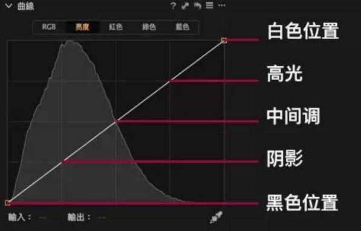
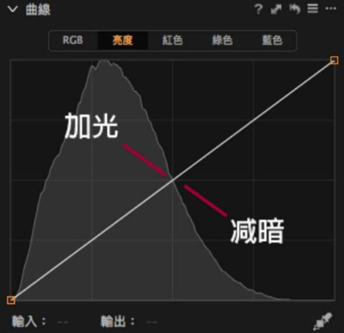

# **CaptureOne相关操作**

### 拉直

- 沿水平面画直线校正倾斜度

### 画笔渐变遮罩

- 快捷键B
- 参数设置
  - 硬度【0】，过渡自然
  - 尺寸【165】
  - 不透明度【100】
  - 流量【100】
  - 气笔【否】
  - 使用笔触压力【是】
  - 自动遮罩【否】
  - 连接所有笔刷【否】
- 反选操作：该图层上单击右键 => 反转遮罩

### 绘制修复遮罩/克隆遮罩

- Alt键取样后进行涂抹修复

### 擦除遮罩

- 擦除画笔和渐变工具绘制的选取

### 选取白平衡

- 快捷键W
- 自动校正色温色偏，吸取图像高光部分进行校正最准确

### 盖印图层

- 用于创建多个图层后对整个图像进行调整
- 盖印所有图层：新建图层 => 右键点击 => 填充遮罩

### 曝光

- 为图像进行基础的曝光度调整
- 调整项
  - 曝光
  - 对比度
  - 亮度
  - 饱和度

### 色彩编辑器

- 调整指定色彩范围的色相、饱和度和亮度，同时不影响其他颜色

#### 基本

- 调整项
  - 色相
  - 饱和度
  - 亮度

#### 高级

- 可用吸管工具取色，调整范围更大，且可对基色进行多次叠加调整
- 调整项
  - 平滑度：色彩之间的过渡
  - 色相
  - 饱和度
  - 亮度

#### 皮肤色调

- 增加均匀度调整选项，可在调整时让皮肤色调统一变得简单
- 调整项
  - 均匀度色相：调整所选色相的强弱，而非改变色相
  - 均匀度饱和度
  - 均匀度亮度

### 色彩平衡

- 通过向阴影、中间调和高光添加单独的色调来为图像调色
  - 左侧滑块控制饱和度
  - 右侧滑块控制明暗
- 快捷键
  - ⬅/➡、Shift + ⬅/➡：调整色相
  - ⬆/⬇、Shift + ⬆/⬇：调整饱和度
  - 双击：复位

#### 主要

- 为图像整体定调

#### 三向

- 在同一界面显示阴影、中间调、高光调整

#### 阴影

- 从中间至外侧，影响范围由阴影扩展到中间调

#### 中间调

- 从中间至外侧，影响范围由中间调扩展到高光和阴影

#### 高光

- 从中间至外侧，影响范围由高光扩展到中间调

### 曲线

- 为图像的色调范围进行精确调整
- 通道：RGB、红、绿、蓝、亮度
- 亮度曲线

### 色阶

- 设置图像的基础对比度，并调整中间调的亮度
- 通道：RGB、红、绿、蓝

### 除雾

- 调整图像中朦胧不清、雾茫茫或模糊部分的对比度

### 白平衡

- 调整图像中的色彩平衡以获得中性灰色调与自然色调

### 黑白

- 将图像转换为黑白，并通过不同的通道调整亮度

#### 色彩敏感度

- 只对每个通道的层次质感起作用

#### 拆分色调

- 调整高光和阴影里的色相和饱和度的层次质感

### 高动态范围

- 为图像恢复阴影与高光部分的细节
- 彼此独立地控制高光和阴影里的细节，白色和黑色可控制高光中过曝的亮色和阴影中的死黑

### 渐晕

- 减暗或提亮图像四角和边缘

### 锐化

- 微调图像的锐利成都，还可减少镜头炫光的影响

### 清晰度

- 通过增强微对比提升图像的整体清晰度
- 方法：自然、冲击力、中性、经典，经典对风光摄影是否有用

### 降噪

- 减少或一处高感光度图像中的明度或色彩噪点
- 调整项：
  - 明亮度
  - 细节
  - 色彩
  - 单一像素