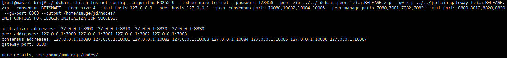
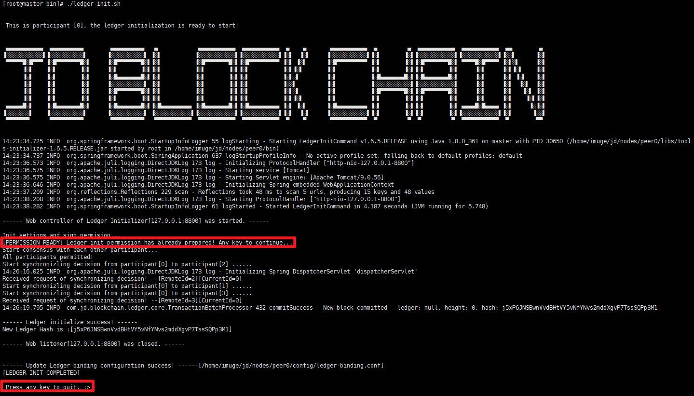
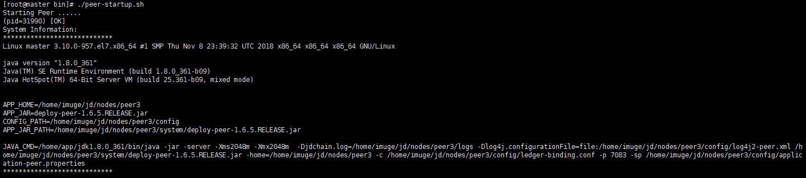
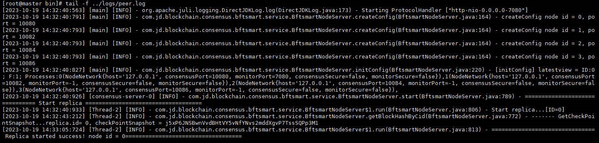
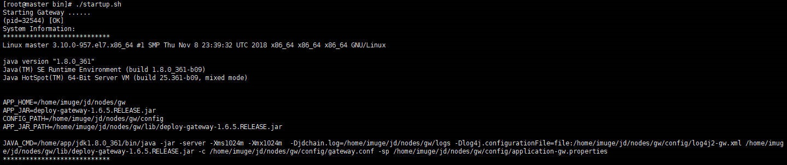
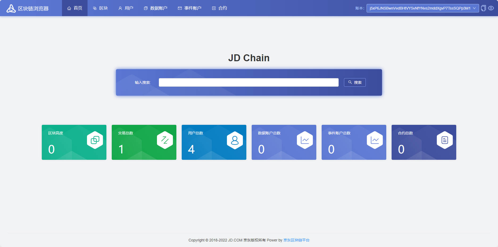

## JDChain安装部署记录

### 下载安装包

- jdchain-peer-1.6.5.RELEASE.zip
- jdchain-gateway-1.6.5.RELEASE.zip

### 生成配置

- 解压jdchain-peer

  > unzip jdchain-peer-1.6.5.RELEASE.zip -d ./jdchain-peer-1.6.5.RELEASE

- 添加可执行权限

  > cd jdchain-peer-1.6.5.RELEASE/bin
  >
  > chmod +x *.sh

- 生成配置

  - 使用命令行工具TestNet指令快速生成JD Chain测试网络初始化配置文件，如创建四节点，单网关基于BFT-SMaRt共识、KEYPAIR身份认证模式的单机运行网络

  > ./jdchain-cli.sh testnet config --algorithm ED25519 --ledger-name testnet --password 123456 --peer-zip ../../jdchain-peer-1.6.5.RELEASE.zip --gw-zip ../../jdchain-gateway-1.6.5.RELEASE.zip --consensus BFTSMART --peer-size 4 --init-hosts 127.0.0.1 --peer-hosts 127.0.0.1 --peer-consensus-ports 10080,10082,10084,10086 --peer-manage-ports 7080,7081,7082,7083 --init-ports 8800,8810,8820,8830 --gw-port 8080 --output /home/imuge/jd/nodes/



```shell
INIT CONFIGS FOR LEDGER INITIALIZATION SUCCESS: 
# 后续初始化地址端口信息
initializer addresses: 127.0.0.1:8800 127.0.0.1:8810 127.0.0.1:8820 127.0.0.1:8830 
# peer运行时占用的地址端口信息
peer addresses: 127.0.0.1:7080 127.0.0.1:7081 127.0.0.1:7082 127.0.0.1:7083 
consensus addresses: 127.0.0.1:10080 127.0.0.1:10081 127.0.0.1:10082 127.0.0.1:10083 127.0.0.1:10084 127.0.0.1:10085 127.0.0.1:10086 127.0.0.1:10087 
# 网关运行时占用的端口信息
gateway port: 8080
# 配置文件地址信息
more details, see /home/imuge/jd/nodes/
```

### 初始化

- 分别进入/home/imuge/jd/nodes/peer*/bin目录下，修改脚本可执行权限，并分别执行ledger-init.sh初始化

  > cd cd /home/imuge/jd/nodes/peer0/bin
  >
  > cd cd /home/imuge/jd/nodes/peer1/bin
  >
  > cd cd /home/imuge/jd/nodes/peer2/bin
  >
  > cd cd /home/imuge/jd/nodes/peer3/bin

  > chmod +x *.sh

  > ./ledger-init.sh



### 启动

- 启动peer节点

  - 依次执行peer-startup.sh启动节点

    > ./peer-startup.sh

  - 查看启动日志

    > tail -f ../logs/peer.log





- 启动网关

  > cd /home/imuge/jd/nodes/gw/bin

  > chmod +x *.sh

  > ./startup.sh



### 区块链浏览器

- localhost:8080 jdchain/jdchain

