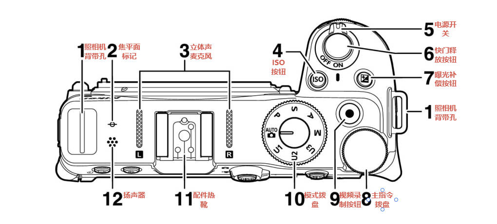
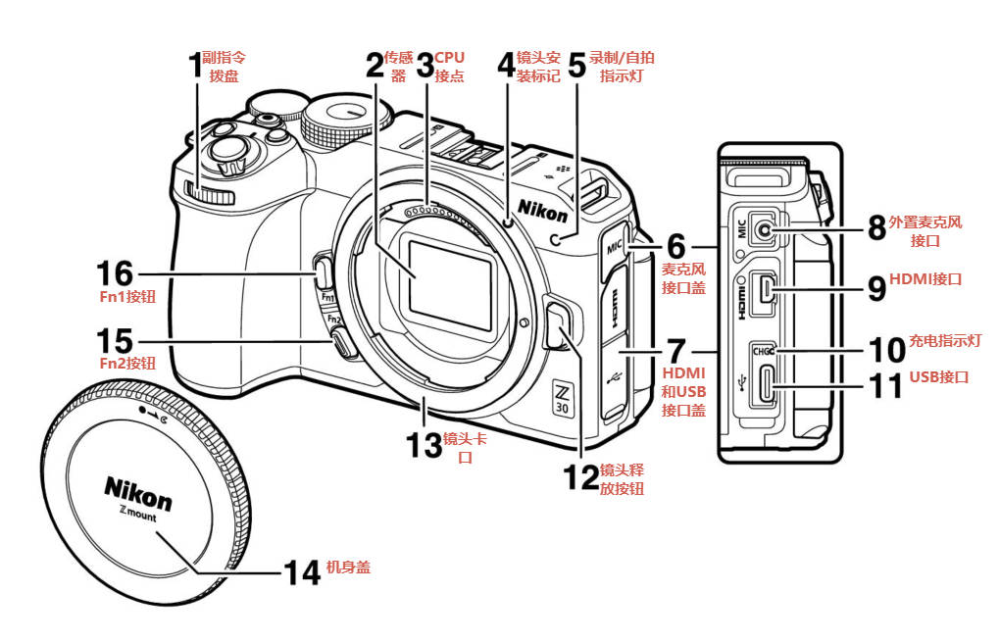
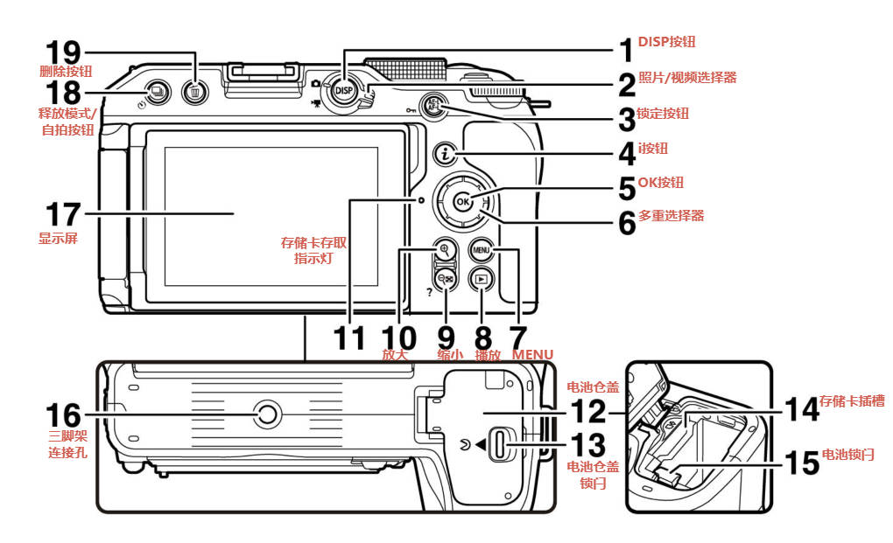
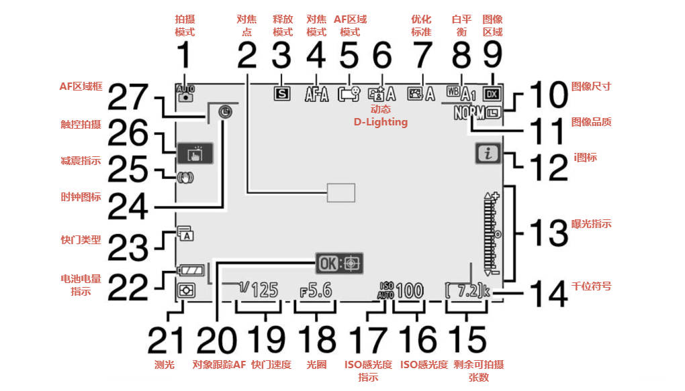
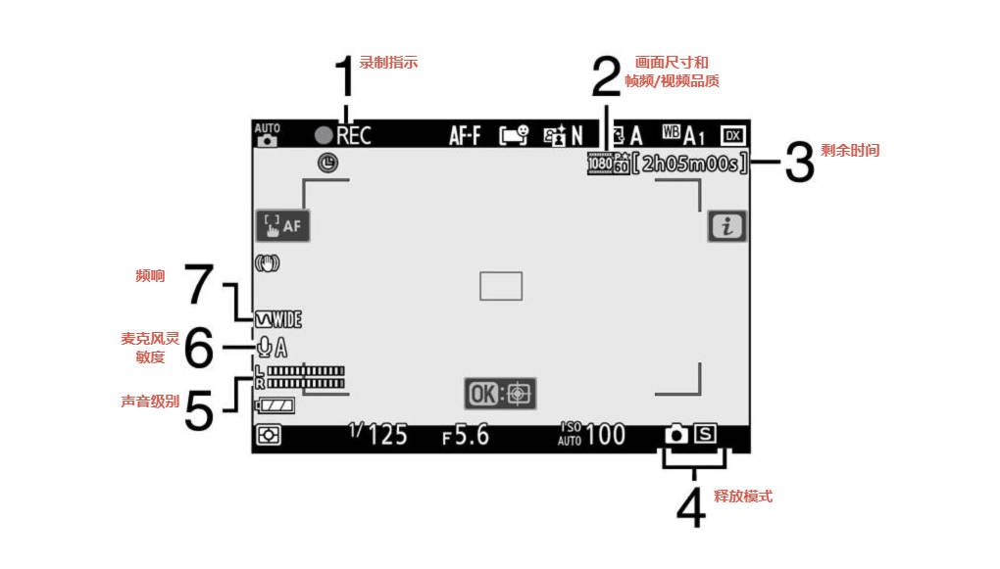

- 白平衡切换、对焦切换，按住fn+拨动滚轮
- 连拍：按住快门释放模式同时拨动后滚轮，

# 相机部件

# 特殊情况

### 时钟图标闪烁

- 表示时钟已被重设（时钟由时钟电池单独供电，由主电池充电），新拍摄照片中记录的时间将不正确
- 设定菜单>时区和日期>日期和时间进行重新设定

### REC图标

- 表示无法录制视频

### 录制指示灯

- 慢速闪烁：剩余可拍摄时间很短
- 快速闪烁两次：电量不足
- 快速闪烁四次：内部温度升高

# 相机控制

## 指令拨盘

- 控制快门和感光度

## ISO按钮

- 照片模式
  - P S A M模式下，按住ISO按钮+旋转副指令拨盘：切换ISO AUTO和ISO
    - 按住ISO按钮+旋转主指令拨盘：调整ISO感光度
  - AUTO模式下，固定为ISO AUTO
- 视频模式
  - M模式（其他模式不可调整感光度）下，按住ISO按钮+旋转副指令拨盘：切换ISO AUTO和ISO
    - 按住ISO按钮+旋转主指令拨盘：调整ISO感光度
  - ISO感光度设定>自动ISO控制（M模式）为关闭时，应用ISO感光度设定>ISO感光度（M模式）选择的值

## 曝光补偿按钮

- 按住曝光补偿按钮+旋转任意指令拨盘：调整曝光补偿

## 人像自拍模式

- 除电源、快门、视频录制按钮、照片/视频选择器、模式拨盘外的控制将禁用
- 自定义设定>c3电源关闭延迟>待机定时器同样对自拍模式生效
- 固定设定
  - 释放模式：自拍
  - 视频拍摄菜单>对焦模式：全时AF
  - 设定菜单>触控控制>启用/禁用触控控制：启用
- 无法使用功能
  - 长时间曝光降噪
  - 自动包围
  - HDR（高动态范围）
  - 曝光延迟模式
- 禁用方式
  - 设定菜单>人像自拍模式：禁用

## 触控控制

- 对焦并释放快门
  - 轻触显示屏可对焦于所选点（触控AF）
  - 在照片模式下，从屏幕抬起手指释放快门（触控快门）
  - 可通过屏幕上的触控拍摄标志调整触控快门/AF

## 调整设定

- 轻触加亮图标调整设定
- 轻触右上返回图标或按下OK按钮确认并返回上一级

## 播放

- 左右方向键或向左或向右轻拨查看其他照片
- 半按快门可返回拍摄模式

- 全屏播放中轻触屏幕底部显示图像快进条，可快速切换照片
- 手指分开/并拢
  - 放大/缩小（双击同样效果）
  - 显示4张/9张/72张图像显示数量
  - 显示72张图像后进一步缩小进行日历播放

## 查看视频

- 轻触屏幕开始/暂停/恢复播放
- 半按快门可返回拍摄模式
- 暂停
  - 下方向键
- 快退/快进
  - 按下左右方向键调整速度
- 恢复
  - 暂停或快退/快进时按下OK按钮可恢复播放
- 开始慢动作播放
  - 暂停时下方向键可开始慢动作播放
- 帧快退/快进
  - 暂停时左右方向键可一次后退或前进一幅画面
  - 按住左右方向键可连续后退或前进
- 跳越10秒
  - 主指令拨盘旋转一档可向前或向后跳越10秒
- 跳至第一幅画面或最后一幅画面
  - 按住左右方向键或旋转副指令拨盘
- 调整音量
  - 放大缩小按钮
- 编辑视频
  - 暂停播放并按下i按钮
- 退出
  - 上方向键或播放按钮

## i菜单

- 轻触i图标显示i菜单，轻触项目查看并更改

## 菜单操作方法

- 向上或向下滑动可滚动菜单
- 轻触图标和项目进行选择
- 轻触返回退出而不更改设定

## DISP按钮

- 循环切换即使取景显示模式

### 照片模式

- 指示开启、简单显示、直方图、虚拟水平、信息显示（596）
- 自定义设定>d6将设置应用于即使取景设置为开启时显示
- 多重曝光拍摄时，重叠拍摄选为开启时不显示
- 自定义设定>f2自定义控制（拍摄）>即使取景信息显示关闭可设定按钮控制显示的开启和关闭

### 视频模型

- 指示开启、简单显示、直方图、虚拟水平

## 放大/缩小按钮

- 拍摄或播放期间放大或缩小显示

## 锁定按钮

### 拍摄

- 同时锁定对焦和曝光

### 播放

- 保护当前图像

（以下为拍摄控制内容）

### 曝光锁定

- 对将不再最终构图中所选对焦区域的拍摄对象进行测光后，曝光锁定可用于重新进行构图
- 进行点测光或中央重点测光后，曝光锁定尤其有效

### 对焦锁定

- 当对焦模式选为AF-C时，使用对焦锁定可将对焦锁定于当前拍摄对象
- 使用对焦锁定时，需选择自动区域AF、自动区域AF（人物）和自动区域AF（动物）以外的AF区域模式

### 锁定对焦和曝光

1. 将拍摄对象置于所选对焦点，半按快门设定对焦和曝光
2. 按下锁定按钮
   - 按下期间，对焦和曝光将锁定（左下显示AE-L图标）
3. 按住锁定按钮，重新构图并拍摄照片
   - 请勿改变与拍摄对象之间的距离，若距离变化，需解除锁定并重新对焦

- 对焦模式为AF-S或对焦模式为AF-A使用AF-S拍摄时，半按快门锁定对焦，也可以按下锁定按钮锁定
- 自定义设定>c1快门释放按钮AE-L>开启（半按）：半按快门将锁定曝光
- 持续半按快门或按住锁定按钮，可在相同对焦距离下锁定对焦拍摄多张照片

## MENU按钮

- 退出菜单
  - 按下MUEN按钮
- 退出并返回拍摄模式
  - 半按快门

## i按钮

- 快速访问常用设定
- 播放模式中显示相应选项（润饰、保护、评级等）
- 自定义i菜单
  - 自定义设定>f1/g1自定义i菜单

## Fn1/Fn2按钮

- 快速访问所选设定，可按住Fn并旋转指令拨盘调整
- 默认
  - Fn1：白平衡
  - Fn2：对焦和AF区域选择
- 设置Fn1/Fn2按钮的功能
  - 自定义设定>f2自定义控制（拍摄）
  - 自定义设定>g2自定义控制>Fn1按钮和Fn2按钮

# 基础操作

## 自动拍摄

- 将主要拍摄对象置于AF区域框，AF区域框将消失，若侦测到脸部则脸部周围出现黄色对焦点，若侦测到眼部，则黄色对焦点出现在其中一只眼睛上
- 完成对焦时对焦点显示为绿色，无法对焦时AF区域框闪烁
- 若侦测到脸部或眼部，清晰对焦时对焦点为绿色，无法对焦时对焦点为闪烁红色
- 平稳地完全按下快门拍摄照片，照片记录过程中存储卡存取指示灯点亮
- 照片模式下可通过放大和缩小按钮调整视野，并可通过多重选择器滚动区域

## 自动录制

- 按下顶部右侧中间的视频录制按钮开始录制
- 录制过程中轻触拍摄对象，则拍摄对象移动时将跟踪其对焦
- 再次按下视频录制按钮结束录制，视频记录过程中存储卡存取指示灯点亮
- 视频模式下可通过放大和缩小按钮调整视野

## 视频模式下拍摄

- 完全按下快门可在视频模式下拍摄，拍摄一张照片后右下角释放模式（相机）图标闪烁
- 按下释放模式按钮同时旋转任一指令拨盘可选择单张或连拍释放模式
- 连拍模式每秒幅数和画面尺寸/帧频有关，且每按一次快门仅拍摄一张
- 注意事项
  - 照片设定不会应用到视频模式下拍摄照片
  - 每个视频录制过程最多拍摄40张照片
  - 即使未清晰对焦也可拍摄照片
  - 照片尺寸为视频画面尺寸，品质固定为JPEG精细
  - 照相机斜杠图标表示无法拍摄照片

## 删除不想要的照片

1. 按下播放键开始播放，按下左右方向键选中所需照片
2. 按下删除按钮显示确认对话框，再按下删除按钮删除照片并返回播放
3. 按下播放按钮不删除照片直接退出

# 基本设定

## 对焦

### 对焦模式

#### 选择对焦模式

- 可使用i菜单、照片拍摄菜单和视频拍摄菜单中的对焦模式项目进行选择
- 可通过按住Fn2按钮并旋转主指令拨盘进行选择

#### 对焦模式选项

- AF-A：AF模式自动开关
  - 仅照片模式可用
  - 使用AF-S拍摄静止的拍摄对象，使用AF-C拍摄移动的拍摄对象
- AF-S：单次AF
  - 适用于拍摄静止对象，半按快门时对焦点从红色变为绿色，且对焦将锁定。若无法对焦时对焦点闪烁红色，快门被禁用
  - 默认可进行对焦时快门才开释放（对焦优先）
- AF-C：连续AF
  - 适用于拍摄移动对象，半按快门时将根据与拍摄对象之间的距离持续调整对焦
  - 默认无论拍摄对象是否清晰对焦都可释放快门（快门释放优先）
- AF-F：全时AF
  - 仅视频模式可用
  - 根据拍摄对象的移动或构图变化持续调整对焦
  - 半按快门时对焦点从红色变为绿色，且对焦将锁定
- MF：手动对焦
  - 无论拍摄对象是否清晰对焦都可释放快门

#### 对焦位置记忆

- 照相机关闭时也能保存对焦位置：设定菜单—>保存对焦位置—>开启
- 开启照相机后，可能需要一些时间才能使用照相机（根据变焦操作和温度变化，开启照相机后的对焦位置可能与照相机关闭前的位置有所不同）

### AF区域对焦

- 在自动区域AF、自动区域AF(人物)和自动区域AF(动物)以外的模式下，可使用多重选择器定位对焦点

#### 选择AF区域模式

### 触控快门

### 手动对焦

### 保存/重新调用对焦位置

# 播放菜单

## 删除

- 删除多张照片
- 删除所选日期的照片
- 删除所选文件夹的照片

## 播放文件夹

## 播放显示选项

## 照片查看

## 旋转至竖直方向

## 幻灯播放

## 评级

# 照片拍摄菜单

## 重设照片拍摄菜单

## 存储文件夹

## 文件命名

## 选择图像区域

- DX（24*6）
- 1:1（16*16）
- 16:9（24*14）

## 图像品质

- RAW+JPEG精细
- RAW+JPEG标准
- RAW+JPEG基本
- RAW
- JPEG精细
- JPEG标准
- JPEG基本

## 图像尺寸

- 大（5568*3712；20.7M）
- 中（4176*2784；11.6M）
- 小（2784*1856；5.2M）

## RAW录制

- 12-bit 12位
- 14-bit 14位

## ISO感光度设定

- ISO感光度
- ISO感光度自动控制
- 最大感光度
- 使用闪光灯时的最大感光度
- 最小快门速度

## 白平衡

- 自动
- 自然光自动适应
  - （白平衡更准确）
- 晴天
- 阴天
- 背阴
- 白炽灯
- 荧光灯
- 闪光灯
- 选择色温
- 手动预设

## 设定优化标准

- 自动
- 标准
- 自然
- 鲜艳
- 单色
- 人像
- 风景
- 平面
  - （【视频】可以大幅提升视频动态范围）
- 梦幻
- 清晨
- 流行
- 星期天
- 低沉
- 戏剧
- 静寂
- 漂白
- 忧郁
- 纯净
- 牛仔布
- 玩具
- 棕褐色
- 蓝色
- 红色
- 粉色
- 木炭
- 石墨
- 双色
- 黑炭

## 管理优化标准

- 保存/编辑
- 重新命名
- 删除
- 载入/保存

## 色空间

- sRGB
- Adobe RGB

## 动态D-Lighting

- （【视频】晚上或高ISO情况下，阴影处会产生噪点）
- （【视频】视频整体动态范围提升，并且高光和阴影过渡更自然）

- 自动
- 高+
- 高
- 标准
- 低
- 关闭

## 长时间曝光降噪

- 开启
- 关闭

## 高ISO降噪

- 高
- 标准
- 低
- 关闭

## 暗角控制

- 高
- 标准
- 低
- 关闭

## 衍射补偿

- 开启
- 关闭

## 自动失真控制

## 闪烁消减拍摄

- 开启
- 关闭

## 测光

- 矩阵测光
- 中央重点测光
- 点测光
- 亮部重点测光

## 闪光控制

## 闪光模式

- 补充闪光
- 防红眼
- 慢同步
- 慢同步+红眼
- 后帘同步
- 闪光灯关闭

## 闪光补偿

- 0.0

## 释放模式

- 单张拍摄
- 低速连拍
- 高速连拍
- 高速连拍（延长）
- 自拍

## 对焦模式

- AF-A AF模式自动开关
- AF-S 单次AF
- AF-C 连续AF
- MF 手动对焦

## AF区域模式

- 自动区域AF（人物）
- 自动区域AF（动物）

## 减震

- Normal
- Sport
- 关闭

## 自动包围

- 自动包围设定
  - 自动曝光和闪光包围
  - 自动曝光包围
  - 闪光包围
  - 白平衡包围
  - 动态D-Lighting包围
- 拍摄张数
- 增量

## 多重曝光

- 多重曝光模式
  - 开启（一系列）
  - 开启（单张照片）
  - 关闭
- 拍摄张数
- 重叠模式
  - ADD 叠加
  - AVG 平均
  - LIGHT 量化
  - DARK 暗化
- 保存单个照片（RAW）
  - 开启
  - 关闭
- 重叠拍摄
  - 开启
  - 关闭

## HDR（高动态范围）

- HDR模式
  - 开启（一系列）
  - 开启（单张照片）
  - 关闭
- 曝光差异
  - 自动
  - 1EV
  - 2EV
  - 3EV
- 平滑
  - 高
  - 标准
  - 低
- 保存单个照片（RAW）
  - 开启
  - 关闭

## 间隔拍摄

- 开始

- 选择开始日期/时间

- 间隔时间

- 间隔*拍摄张数/间隔

- 曝光平滑

  - （同时开启ISO感光度设定-最小快门速度-自动-低速，可显著过滤延时摄影中的闪烁，实现A挡日转夜延时）

  - 开启
  - 关闭

- 静音拍摄

  - （使用电子快门，减少快门震动对长曝光的影响）

  - 开启
  - 关闭

- 间隔优先

  - 开启
  - 关闭

- 在每次拍摄之前对焦

  - 开启
  - 关闭

- 选项

  - 自动曝光包围
  - 延时摄影视频
    - （在记录RAW照片的同时生成视频）
  - 关闭

- 开启存储文件夹

  - 新建文件夹

  - 重设文件编号

- 结束日期/时间

## 延时摄影视频

- 开始
- 间隔时间
- 拍摄时间
- 曝光平滑
  - 开启
  - 关闭
- 静音拍摄
  - 开启
  - 关闭
- 画面尺寸/帧频
  - 3840*2160；30p
  - 3840*2160；24p
  - 1920*1080；60p
- 间隔优先
  - 开启
  - 关闭
- 在每次拍摄之前对焦
  - 开启
  - 关闭

## 焦距变化拍摄

- 拍摄张数

- 焦距步长

- 到下一次拍摄的间隔

- 首次构图预览曝光锁定

  - 开启
  - 关闭

- 静音拍摄

  - 开启
  - 关闭

- 开启存储文件夹

  - 新建文件夹

  - 重设文件编号

## 静音拍摄

- 开启
- 关闭

# 视频拍摄菜单

## 重设视频拍摄菜单

## 文件命名

## 画面尺寸/帧频

- 3840*2160；30p
- 3840*2160；24p
- 1920*1080；60p

## 视频品质

- 高品质
- 标准

## 视频文件类型

- MOV
- MP4

## ISO感光度设定

- 最大感光度
- 自动ISO控制（M模式）
  - 开启
  - 关闭
- ISO感光度（M模式）

## 白平衡

- 与照片设定相同

## 设定优化标准

- 与照片设定相同

## 管理优化标准

- 保存/编辑
- 重新命名
- 删除
- 载入/保存

## 动态D-Lighting

- 与照片设定相同

## 高ISO降噪

- 高
- 标准
- 低
- 关闭

## 暗角控制

- 与照片设定相同

## 衍射补偿

- 开启
- 关闭

## 自动失真控制

- 开启
- 关闭

## 闪烁消减

- 自动
- 50Hz
- 60Hz

## 测光

- 矩阵测光
- 中央重点测光
- 亮部重点测光

## 释放模式（保存帧）

- 单张拍摄
- 连拍

## 对焦模式

- AF-S 单次AF
- AF-C 连续AF
- AF-F 全时AF
- MF 手动对焦

## AF区域模式

- 单点AF
- 宽区域AF（S）
- 宽区域AF（L）
- 宽区域AF（L-人物）
- 宽区域AF（L-动物）
- 自动区域AF
- 自动区域AF（人物）
- 自动区域AF（动物）

## 减震

- 与照片设定相同
- ON Normal
- SPT Sport
- 关闭

## 电子减震

- 开启
- 关闭

## 麦克风灵敏度

- 自动
- 手动
- 麦克风关闭

## 衰减器

- 启用
- 禁用

## 频响

- 宽范围
- 音域

## 降低风噪

- 开启
- 关闭

## 时间码

- 录制时间码
  - 开启
  - 开启（使用HDMI输出）
  - 关闭
- 计数方法
- 时间码起源时间
- 丢帧

# 自定义设定菜单

## 自动对焦

- 低光度AF：大幅提高夜晚自动对焦能力

## 测光/曝光

## 计时/AE锁定

## 拍摄/显示

## 包围/闪光

## 控制

## 视频

# 设定菜单

## 格式化存储卡

## 保存用户设定

- 保存到U1
- 保存到U2
- 保存到U3

## 重设用户设定

- 重设U1
- 重设U2
- 重设U3

## 语言

## 时区和日期

## 显示屏亮度

## 显示屏色彩平衡

## 录制指示灯亮度

- 关闭可防止录制指示灯灯光出现在视频中

- 视频拍摄
  - 3
  - 2
  - 1
  - 关闭
- 延时摄影视频拍摄
  - 3
  - 2
  - 1
  - 关闭

## 信息显示

- 光亮时用暗字体
- 黑暗时用亮字体

## AF微调选项

- AF微调
- 微调并保存镜头
- 默认值
- 保存值列表

## 非CPU镜头数据

- 镜头编号
- 焦距
- 最大光驱

## 保存对焦位置

- 开启
- 关闭

## 保存对焦位置（PZ镜头）

- 开启
- 关闭

## 图像除尘参照图

- 启用

## 像素映射

- 开始

## 图像注释

- 附加注释
- 输入注释

## 版权信息

- 附加版权信息
- 拍摄者
- 版权

## 蜂鸣音选项

- 蜂鸣音开启/关闭
  - 开启
  - 关闭（仅限触控控制）
  - 关闭
- 音量
- 音调

## 触控控制

- 启用/禁用触控控制
  - 启用
  - 仅限播放
  - 禁用
- 满帧播放轻拨方向
  - 左←右
  - 左→右

## 人像自拍模式

- 启用
- 禁用

## HDMI

- 输出分辨率
- 高级
  - 输出范围
    - 自动
    - 有限范围
    - 完整范围
  - 外部录像控制
    - 开启
    - 关闭

## 飞行模式

- 启用
- 禁用

## 连接至智能设备

- 配对（Bluetooth）
  - 开始配对
  - 已配对设备
  - Bluetooth连接
- 选择以上传（Bluetooth）
- Wi-Fi连接
  - 建立/关闭Wi-Fi连接
  - Wi-Fi连接设定
- 照相机关闭时上传
  - 开启
  - 关闭

## 连接到计算机

- Wi-Fi连接
- 网络设定
  - 创建配置文件
- 选项
  - 自动上传
    - 开启
    - 关闭
  - 上传后删除
    - 是
    - 否
  - 上传文件为
    - RAW+JPEG
    - JPEG
  - 取消全部选择
- MAC地址

## USB

- MTP/PTP
- iPhone

## 无线遥控器（ML-L7）选项

- 无线遥控连接
- 保存无线遥控器
- 删除无线遥控器
- 指定Fn1按钮
  - 与照相机播放按钮相同
  - 与照相机MENU按钮相同
  - 与照相机i按钮相同
  - 无
- 指定Fn2按钮
  - 与照相机播放按钮相同
  - 与照相机MENU按钮相同
  - 与照相机i按钮相同
  - 无

## 一致性标记

## USB电力输送

- 启用
- 禁用

## 节能（照片模式）

- 启用
- 禁用

## 空插槽时快门释放锁定

- 快门释放锁定
- 快门释放启用

## 保存/载入菜单设定

- 保存菜单设定
- 载入菜单设定

## 重设所有设定

- 重设
- 请勿重设

## 固件版本

# 润湿菜单

## RAW处理

## 裁切

## 调整尺寸

## D-Lighting

## 红眼修正

## 矫正

## 失真控制

## 透视控制

## 单色

## 合成照片

## 裁切视频

# 我的菜单

## 添加项目

## 删除项目

## 为项目排序

## 选择标签