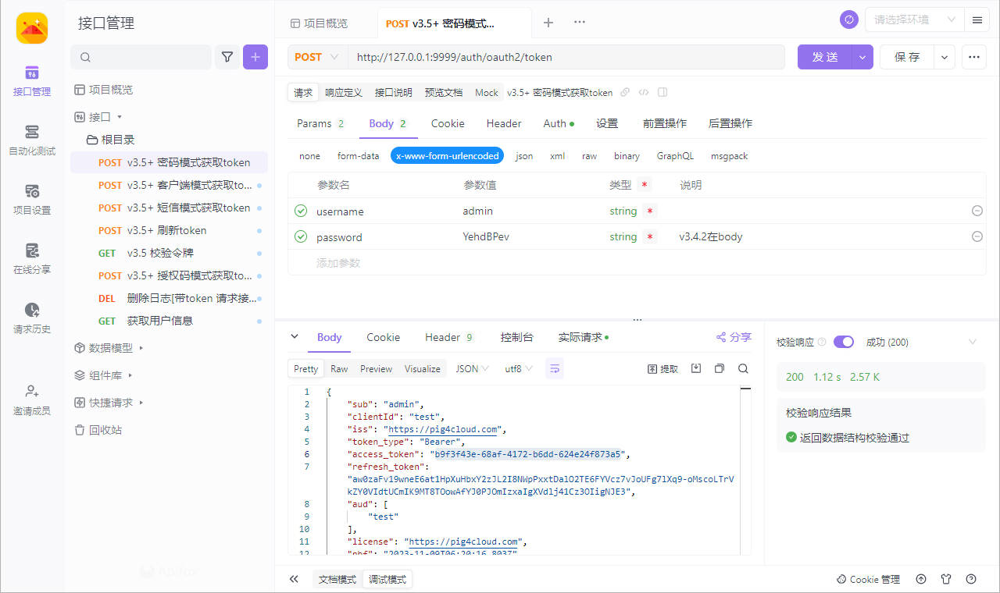
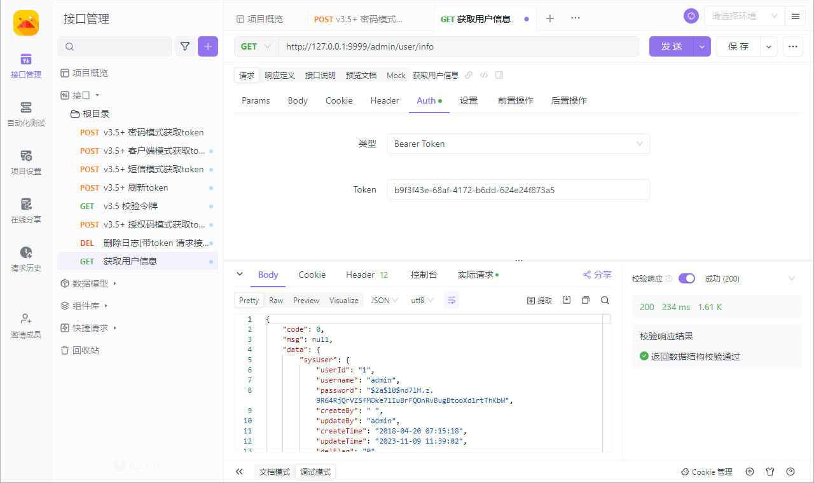

## **PIG令牌获取与接口调用**

### 导入脚本文件

- [pig.apifox.json](https://www.yuque.com/raw?filekey=yuque%2F0%2F2022%2Fjson%2F283679%2F1662169309590-f8221bb9-8814-469c-b008-c0a2ee117723.json&from=https%3A%2F%2Fwww.yuque.com%2Fpig4cloud%2Fpig%2Fdzlb0v)

```json
{"apifoxProject":"1.0.0","info":{"name":"PIGTEST","description":"","mockRule":{"rules":[],"enableSystemRule":true}},"responseCollection":[{"jsonSchema":{"type":"object","properties":{"code":{"type":"integer","mock":{"mock":"401"}},"message":{"type":"string","mock":{"mock":"Invalid Param"}}},"required":["code","message"],"x-apifox-orders":["code","message"]},"defaultEnable":false,"name":"参数不正确","code":401,"contentType":"json","id":"92675728"},{"jsonSchema":{"type":"object","properties":{"code":{"type":"integer"},"message":{"type":"string","mock":{"mock":"Not found"}}},"required":["code","message"],"x-apifox-orders":["code","message"]},"defaultEnable":false,"name":"记录不存在","code":404,"contentType":"json","id":"92675729"},{"jsonSchema":{"type":"object","properties":{},"x-apifox-orders":[]},"defaultEnable":false,"name":"修改成功","code":200,"contentType":"json","id":"92675730"},{"jsonSchema":{"type":"object","properties":{},"x-apifox-orders":[]},"defaultEnable":false,"name":"新建成功","code":201,"contentType":"json","id":"92675731"}],"apiCollection":[{"name":"根目录","parentId":0,"serverId":"","description":"","preProcessors":[],"postProcessors":[],"auth":{},"items":[{"name":"v3.5+ 密码模式获取token","api":{"id":"37848042","method":"post","path":"http://127.0.0.1:9999/auth/oauth2/token","parameters":{"path":[],"query":[{"name":"grant_type","required":true,"description":"","sampleValue":"password","type":"string"},{"name":"scope","required":true,"description":"","sampleValue":"server","type":"string"}],"cookie":[],"header":[]},"auth":{"type":"basic","basic":{"username":"test","password":"test"}},"commonParameters":{"query":[],"body":[],"cookie":[],"header":[]},"responses":[{"id":"92675733","name":"成功","code":200,"contentType":"json","jsonSchema":{"type":"object","properties":{},"x-apifox-orders":[]}}],"responseExamples":[],"requestBody":{"type":"application/x-www-form-urlencoded","parameters":[{"name":"username","required":true,"description":"","sampleValue":"admin","type":"string"},{"name":"password","required":true,"description":"v3.4.2在body","sampleValue":"YehdBPev","type":"string"}]},"description":"","tags":[],"status":"released","serverId":"","operationId":"","sourceUrl":"","ordering":0,"cases":[],"mocks":[],"customApiFields":"{}","advancedSettings":{},"mockScript":{}}},{"name":"v3.5+ 客户端模式获取token","api":{"id":"37848041","method":"post","path":"http://127.0.0.1:9999/auth/oauth2/token","parameters":{"path":[],"query":[{"name":"grant_type","required":true,"description":"","sampleValue":"client_credentials","type":"string"},{"name":"scope","required":true,"description":"","sampleValue":"server","type":"string"}],"cookie":[],"header":[]},"auth":{"type":"basic","basic":{"password":"client","username":"client"}},"commonParameters":{"query":[],"body":[],"cookie":[],"header":[]},"responses":[{"id":"92675732","name":"成功","code":200,"contentType":"json","jsonSchema":{"type":"object","properties":{},"x-apifox-orders":[]}}],"responseExamples":[],"requestBody":{"type":"application/x-www-form-urlencoded","parameters":[]},"description":"","tags":[],"status":"developing","serverId":"","operationId":"","sourceUrl":"","ordering":6,"cases":[],"mocks":[],"customApiFields":"{}","advancedSettings":{},"mockScript":{}}},{"name":"v3.5+ 短信模式获取token","api":{"id":"37848044","method":"post","path":"http://127.0.0.1:9999/auth/oauth2/token","parameters":{"path":[],"query":[{"name":"grant_type","required":true,"description":"","sampleValue":"app","type":"string"},{"name":"scope","required":true,"description":"","sampleValue":"server","type":"string"}],"cookie":[],"header":[]},"auth":{"type":"basic","basic":{"password":"app","username":"app"}},"commonParameters":{"query":[],"body":[],"cookie":[],"header":[]},"responses":[{"id":"92675736","name":"成功","code":200,"contentType":"json","jsonSchema":{"type":"object","properties":{},"x-apifox-orders":[]}}],"responseExamples":[],"requestBody":{"type":"application/x-www-form-urlencoded","parameters":[{"name":"mobile","required":true,"description":"","sampleValue":"17034642999","type":"string"}]},"description":"","tags":[],"status":"developing","serverId":"","operationId":"","sourceUrl":"","ordering":12,"cases":[],"mocks":[],"customApiFields":"{}","advancedSettings":{},"mockScript":{}}},{"name":"v3.5+ 刷新token","api":{"id":"37848046","method":"post","path":"http://127.0.0.1:9999/auth/oauth2/token","parameters":{"path":[],"query":[{"name":"grant_type","required":true,"description":"","sampleValue":"refresh_token","type":"string"}],"cookie":[],"header":[]},"auth":{"type":"basic","basic":{"username":"test","password":"test"}},"commonParameters":{"query":[],"body":[],"cookie":[],"header":[]},"responses":[{"id":"92675737","name":"成功","code":200,"contentType":"json","jsonSchema":{"type":"object","properties":{},"x-apifox-orders":[]}}],"responseExamples":[],"requestBody":{"type":"application/x-www-form-urlencoded","parameters":[{"name":"scope","required":true,"description":"","sampleValue":"server","type":"string"},{"name":"refresh_token","required":true,"description":"","sampleValue":"{{refresh_token}}","type":"string"}]},"description":"","tags":[],"status":"developing","serverId":"","operationId":"","sourceUrl":"","ordering":18,"cases":[],"mocks":[],"customApiFields":"{}","advancedSettings":{},"mockScript":{}}},{"name":"v3.5 校验令牌","api":{"id":"37848043","method":"get","path":"http://127.0.0.1:9999/auth/token/check_token","parameters":{"path":[],"query":[{"name":"token","required":true,"description":"","sampleValue":"{{access_token}}","type":"string"}],"cookie":[],"header":[]},"auth":{},"commonParameters":{"query":[],"body":[],"cookie":[],"header":[]},"responses":[{"id":"92675734","name":"成功","code":200,"contentType":"json","jsonSchema":{"type":"object","properties":{},"x-apifox-orders":[]}}],"responseExamples":[],"requestBody":{"type":"none","parameters":[]},"description":"","tags":[],"status":"developing","serverId":"","operationId":"","sourceUrl":"","ordering":24,"cases":[],"mocks":[],"customApiFields":"{}","advancedSettings":{},"mockScript":{}}},{"name":"v3.5+ 授权码模式获取token","api":{"id":"37848045","method":"post","path":"http://127.0.0.1:3000/oauth2/token","parameters":{"path":[],"query":[{"name":"grant_type","required":true,"description":"授权类型固定为: authorization_code","sampleValue":"authorization_code","type":"string"},{"name":"scope","required":true,"description":"必须和数据库scope定义一致","sampleValue":"server","type":"string"},{"name":"code","required":true,"description":"输入回调给的Code","sampleValue":"-FQXs8zhJ1TgI3dwmQyzXe5kKgPpo-VRMvMOeIAtIOz00YjOGKm2Dwn6CsWcQNgTwh5vjG4ugekgoTGeeXxYXSB3q7_mKcy52Ba-Jetn6WWluubWQmzhXPDWg3_msN0l","type":"string"},{"name":"redirect_uri","required":true,"description":"必须和数据库client定义一致","sampleValue":"https://pig4cloud.com","type":"string"}],"cookie":[],"header":[]},"auth":{"type":"basic","basic":{"password":"pig","username":"pig"}},"commonParameters":{"query":[],"body":[],"cookie":[],"header":[]},"responses":[{"id":"92675735","name":"成功","code":200,"contentType":"json","jsonSchema":{"type":"object","properties":{},"x-apifox-orders":[]}}],"responseExamples":[],"requestBody":{"type":"application/x-www-form-urlencoded","parameters":[]},"description":"","tags":[],"status":"developing","serverId":"","operationId":"","sourceUrl":"","ordering":30,"cases":[],"mocks":[],"customApiFields":"{}","advancedSettings":{},"mockScript":{}}},{"name":"删除日志[带token 请求接口演示]","api":{"id":"37848047","method":"delete","path":"http://127.0.0.1:9999/admin/log/1","parameters":{"path":[],"query":[],"cookie":[],"header":[]},"auth":{"type":"bearer","bearer":{"token":"{{access_token}}"}},"commonParameters":{"query":[],"body":[],"cookie":[],"header":[]},"responses":[{"id":"92675738","name":"成功","code":200,"contentType":"json","jsonSchema":{"type":"object","properties":{},"x-apifox-orders":[]}}],"responseExamples":[],"requestBody":{"type":"none","parameters":[]},"description":"请维护header 中的 token 信息","tags":[],"status":"developing","serverId":"","operationId":"","sourceUrl":"","ordering":36,"cases":[],"mocks":[],"customApiFields":"{}","advancedSettings":{},"mockScript":{}}},{"name":"获取用户信息","api":{"id":"37848048","method":"get","path":"http://127.0.0.1:9999/admin/user/info","parameters":{"path":[],"query":[],"cookie":[],"header":[]},"auth":{"type":"bearer","bearer":{"token":"{{access_token}}"}},"commonParameters":{"query":[],"body":[],"cookie":[],"header":[]},"responses":[{"id":"92675739","name":"成功","code":200,"contentType":"json","jsonSchema":{"type":"object","properties":{},"x-apifox-orders":[]}}],"responseExamples":[],"requestBody":{"type":"none","parameters":[]},"description":"","tags":[],"status":"developing","serverId":"","operationId":"","sourceUrl":"","ordering":42,"cases":[],"mocks":[],"customApiFields":"{}","advancedSettings":{},"mockScript":{}}}]}],"socketCollection":[],"docCollection":[],"schemaCollection":[],"apiTestCaseCollection":[{"name":"默认分组","children":[],"items":[]},{"name":"宠物店","children":[],"items":[{"id":1250683,"name":"测试宠物新建/修改/删除流程","description":"","steps":[]}]}],"apiTestSuiteCollection":[],"environments":[{"baseUrl":"http://127.0.0.1","baseUrls":{"default":"http://127.0.0.1"},"parameters":{},"variables":[],"name":"测试环境","type":"normal","visibility":"protected","ordering":0,"id":"5508412"},{"baseUrl":"http://127.0.0.1","baseUrls":{"default":"http://127.0.0.1"},"parameters":{},"variables":[],"name":"正式环境","type":"normal","visibility":"protected","ordering":0,"id":"5508413"},{"baseUrl":"http://127.0.0.1:4523/mock/1555921","baseUrls":{"default":"http://127.0.0.1:4523/mock/undefined"},"parameters":{},"variables":[],"name":"本地 Mock","type":"mock","visibility":"protected","ordering":0,"id":"5508414"},{"baseUrl":"","baseUrls":{"default":""},"parameters":{},"variables":[],"name":"云端 Mock","type":"cloudMock","visibility":"protected","ordering":0,"id":"5508415"}],"commonScripts":[],"databaseConnections":[],"globalVariables":[],"commonParameters":null,"projectSetting":{"apiStatuses":["developing","testing","released","deprecated"],"servers":[{"id":"default","name":"默认服务"}],"preProcessors":[],"postProcessors":[],"auth":{},"cloudMock":{"security":"free","token":"cgMtOnkXZCv10Bh1ltOanVgUopj2bbS6","enable":false,"tokenKey":"apifoxToken"},"initialDisabledMockIds":[],"gateway":[],"language":"zh-CN","id":"1213908"}}
```

### 获取令牌



### 调用接口

