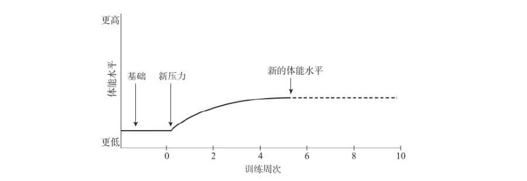

### 训练计划

- 增加压力时，务必将所选择的压力沉痼保持4到周，然后再进行改变
- 增加压力的四个变量
  - 训练量
    - 单日训练总量
  - 强度
    - 配速
  - 恢复
    - 间隔的休息分钟数
  - 频率
    - 每周次数

- 在赛后第一天进行训练，因为在身体承受压力48小时后训练带来的肌肉不适要比身体承受压力24小时后更严重

### 步频

- 以每分钟180步的步频奔跑，可以将跑步带来的落地冲击力减至最小
- 步频越慢，滞空时间越长，意味着把自身重量抬得越高，下一次落地时就会更重地撞击地面
- 许多小伤病的出现，正式由落地时产生的冲击力引起的

### 落地冲击力

- 将落地冲击力减至最小的方式是假装在滚过地面，而不是双脚交替在地面上跳跃
- 试着不要把脚落在身体前方，这个动作通常会有制动作用，会在换脚落地时增加冲击力
- 试着让双脚向后落，落得离身体更近些，靠近身体中心

### 脚的着地

- 全脚掌或脚跟着地的一大优势在于可以减轻腓肠肌所承受的压力，并将着地的压力更多地转移到更大块的大腿肌肉上
- 前脚掌着地会增大出现小腿疼痛的可能性
- 使用脚跟先着地的话，每次脚着地后身体向前移动时，便可以试着想象自己正在摆动双脚滚过地面

