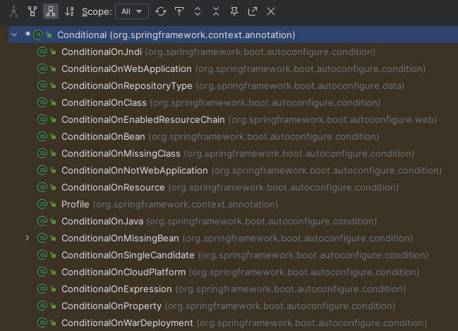

@SpringBootApplication声明是一个SpringBoot应用，主程序类

@Controller

@ResponseBody

@RequestMapping

@RestController

@Configuration声明配置类，相当于配置文件

@Bean向容器中添加组件，方法名对应组件id（可添加参数指定id），返回类型对应组件类型，返回值对应组件在容器中的实例

@Import给容器中自动创建组件

## 基本使用

### 相关依赖

```xml
<parent>
    <groupId>org.springframework.boot</groupId>
    <artifactId>spring-boot-starter-parent</artifactId>
    <version>2.3.4.RELEASE</version>
</parent>

<dependencies>
    <dependency>
        <groupId>org.springframework.boot</groupId>
        <artifactId>spring-boot-starter-web</artifactId>
    </dependency>
</dependencies>

<build>
    <plugins>
        <plugin>
            <groupId>org.springframework.boot</groupId>
            <artifactId>spring-boot-maven-plugin</artifactId>
        </plugin>
    </plugins>
</build>
```

### 主程序

```java
package cn.lijiong.boot;

import org.springframework.boot.SpringApplication;
import org.springframework.boot.autoconfigure.SpringBootApplication;

@SpringBootApplication
public class MainApplication {
    public static void main(String[] args) {
        SpringApplication.run(MainApplication.class, args);
    }
}
```

### 业务逻辑

```java
package cn.lijiong.boot.controller;

import org.springframework.web.bind.annotation.RequestMapping;
import org.springframework.web.bind.annotation.RestController;

@RestController
public class DemoController {
    @RequestMapping("/test")
    public String handle(){
        return "TEST";
    }
}
```

### 修改配置

- resources目录下的application.properties

> https://docs.spring.io/spring-boot/docs/2.3.4.RELEASE/reference/html/appendix-application-properties.html

### 打包部署

- clean+package进行打包后直接在目标服务器执行

## 依赖管理

### 场景启动器

- 官方场景启动器spring-boot-starter-*
- 第三方场景启动器 *-spring-boot-starter

### 版本号

- 默认版本号位于spring-boot-dependencies
- 修改版本号

```xml
<properties>
	<mysql.version>6.0.2</mysql.version>
</properties>
```

## 自动配置

- 自动配好Tomcat、SpringMVC和Web常见功能

- 默认包结构

  - 主程序所在包及其下所有子包内的组件都被默认扫描进来

  - 更改包扫描路径

    - @SpringBootApplication(scanBasePackages="cn.lijiong")

    - @SpringBootConfiguration

      @EnableAutoConfiguration

      @ComponentScan("cn.lijiong")

- 默认配置最终都是映射到某个类上，这个类会在容器中创建对象，引入场景后开启对应的自动配置，SpringBoot所有的自动配置功能都在spring-boot-autoconfigure包


## Configuration

- 声明配置类

- 配置类中使用@Bean标注在方法上为容器注册组件，默认是单实例

- 配置类本身也是组件

- proxyBeanMethods：代理bean的方法
  - Full(proxyBeanMethods = true)：@Bean方法被调用返回的组件是单实例的（默认），代理对象调用方法，SpringBoot会检查组件是否在容器中存在。
    - 适用于组件间有依赖关系，方法被调用得到之间的单实例组件。
  - Lite(proxyBeanMethods = false)：@Bean方法被调用返回的组件是新创建的。
    - 适用于组件间无依赖关系，提高容器启动速度。

```java
package cn.lijiong.boot;

import cn.lijiong.boot.bean.Pet;
import cn.lijiong.boot.bean.User;
import org.springframework.boot.SpringApplication;
import org.springframework.boot.autoconfigure.SpringBootApplication;
import org.springframework.context.ConfigurableApplicationContext;

@SpringBootApplication
public class MainApplication {
    public static void main(String[] args) {
        // 返回IOC容器
        ConfigurableApplicationContext run = SpringApplication.run(MainApplication.class, args);

        // 查看容器中的组件
        String[] names = run.getBeanDefinitionNames();
        for (String name : names) {
            System.out.println(name);
        }

        // 从容器获取组件
        System.out.println("------------");
        User user01 = run.getBean("user01", User.class);
        System.out.println(user01);

        Pet pet01 = run.getBean("pet01", Pet.class);
        // Full模式返回单实例组件
        System.out.println(user01.getPet() == pet01);
    }
}
```

```java
package cn.lijiong.boot.config;

import cn.lijiong.boot.bean.Pet;
import cn.lijiong.boot.bean.User;
import org.springframework.context.annotation.Bean;
import org.springframework.context.annotation.Configuration;


@Configuration
public class DemoConfig {
    @Bean
    public User user01(){
        User avatar = new User("Avatar", 10);
        avatar.setPet(pet01());
        return avatar;
    }
    @Bean
    public Pet pet01(){
        return new Pet("Appa");
    }
}
```

```java
package cn.lijiong.boot.bean;

public class User {
    private String name;
    private Integer age;
    private Pet pet;
    public User() {}
    public User(String name, Integer age) {
        this.name = name;
        this.age = age;
    }
    public Pet getPet() {
        return pet;
    }
    public void setPet(Pet pet) {
        this.pet = pet;
    }
}
```

```java
package cn.lijiong.boot.bean;

public class Pet {
    private String name;
    public Pet() {}
    public Pet(String name){
        this.name = name;
    }
}
```

## Import

- 给容器中自动创建组件，默认组件名为全类名，调用无参构造器创建

```
------------
cn.lijiong.boot.bean.User
user01
```

```java
package cn.lijiong.boot;

import cn.lijiong.boot.bean.User;
import org.springframework.boot.SpringApplication;
import org.springframework.boot.autoconfigure.SpringBootApplication;
import org.springframework.context.ConfigurableApplicationContext;

@SpringBootApplication
public class MainApplication {
    public static void main(String[] args) {
        // 返回IOC容器
        ConfigurableApplicationContext run = SpringApplication.run(MainApplication.class, args);

        // 查看容器中的组件
        String[] names = run.getBeanDefinitionNames();
        for (String name : names) {
            System.out.println(name);
        }

        // 从容器获取组件
        System.out.println("------------");
        String[] beanNamesForType = run.getBeanNamesForType(User.class);
        for (String s : beanNamesForType) {
            System.out.println(s);
        }
    }
}
```

```java
package cn.lijiong.boot.config;

import cn.lijiong.boot.bean.Pet;
import cn.lijiong.boot.bean.User;
import org.springframework.context.annotation.Bean;
import org.springframework.context.annotation.Configuration;
import org.springframework.context.annotation.Import;

@Import(User.class)
@Configuration
public class DemoConfig {
    @Bean
    public User user01(){
        User avatar = new User("Avatar", 10);
        avatar.setPet(pet01());
        return avatar;
    }
    @Bean
    public Pet pet01(){
        return new Pet("Appa");
    }
}
```

## Conditional

- 满足指定的条件，则进行组件注入 



## ImportResource

- 导入Spring配置文件

  > @ImportResource(classpath:bean.xml)


## ConfigurationProperties

- 配置绑定，读取properties内容绑定到JavaBean

```
user01.name=avatar
user01.pwd=123456
```

```java
package cn.lijiong.boot.controller;

import cn.lijiong.boot.bean.User;
import org.springframework.beans.factory.annotation.Autowired;
import org.springframework.web.bind.annotation.RequestMapping;
import org.springframework.web.bind.annotation.RestController;

@RestController
public class DemoController {
    @Autowired
    User user;

    @RequestMapping("/user")
    public User user(){
        return user;
    }
}
```

### @Component

```java
package cn.lijiong.boot.bean;

import org.springframework.boot.context.properties.ConfigurationProperties;
import org.springframework.stereotype.Component;

@Component
@ConfigurationProperties(prefix = "user01")
public class User {
    private String name;
    private String pwd;
    public User() {
    }
    public User(String name, String pwd) {
        this.name = name;
        this.pwd = pwd;
    }
    public String getName() {
        return name;
    }
    public String getPwd() {
        return pwd;
    }
    public void setName(String name) {
        this.name = name;
    }
    public void setPwd(String pwd) {
        this.pwd = pwd;
    }
}
```

### @EnableConfigurationProperties

开启配置绑定功能

将组件自动注册到容器中

```java
package cn.lijiong.boot.bean;

import org.springframework.boot.context.properties.ConfigurationProperties;

@ConfigurationProperties(prefix = "user01")
public class User {
    private String name;
    private String pwd;
    public User() {
    }
    public User(String name, String pwd) {
        this.name = name;
        this.pwd = pwd;
    }
    public String getName() {
        return name;
    }
    public String getPwd() {
        return pwd;
    }
    public void setName(String name) {
        this.name = name;
    }
    public void setPwd(String pwd) {
        this.pwd = pwd;
    }
}
```

```java
package cn.lijiong.boot.config;

import cn.lijiong.boot.bean.User;
import org.springframework.boot.context.properties.EnableConfigurationProperties;
import org.springframework.context.annotation.Configuration;


@Configuration
@EnableConfigurationProperties(User.class)
public class DemoConfig {
}
```

### @Import

```java
package cn.lijiong.boot.bean;

import org.springframework.boot.context.properties.ConfigurationProperties;

@ConfigurationProperties(prefix = "user01")
public class User {
    private String name;
    private String pwd;
    public User() {
    }
    public User(String name, String pwd) {
        this.name = name;
        this.pwd = pwd;
    }
    public String getName() {
        return name;
    }
    public String getPwd() {
        return pwd;
    }
    public void setName(String name) {
        this.name = name;
    }
    public void setPwd(String pwd) {
        this.pwd = pwd;
    }
}
```

```java
package cn.lijiong.boot.config;

import cn.lijiong.boot.bean.User;
import org.springframework.context.annotation.Configuration;
import org.springframework.context.annotation.Import;

@Import(User.class)
@Configuration
public class DemoConfig {
}
```

## 自动配置原理

### SpringBootConfiguration

- Configuration
  - 声明是一个配置类

### ComponentScan

- 包扫描路径

### EnableAutoConfiguration

- AutoConfigurationPackage
  - Import({AutoConfigurationPackages.Registrar.class})
    - 通过Registrar给容器中导入一系列组件
    - 将指定包下的所有组件导入MainApplication所在包下

- Import({AutoConfigurationImportSelector.class})
  - 通过`getAutoConfigurationEntry(annotationMetadata)`向容器批量导入一系列组件
  - 调用`List<String> configurations = getCandidateConfigurations(annotationMetadata, attributes)`获取所有需要导入到容器中的配置类
  - 通过`SpringFactoriesLoader`加载 `Map<String, List<String>> loadSpringFactories(@Nullable ClassLoader classLoader)`得到所有的组件
  - 从`META-INF/spring.factories`位置来加载一个文件
    - 默认扫描当前系统中每个jar包`META-INF/spring.factories`位置的文件
      - 包括`spring-boot-autoconfigure-2.3.5.RELEASE.jar`中的`META-INF/spring.factories`，其中有spring-boot启动时需要向容器中加载的所有配置类。