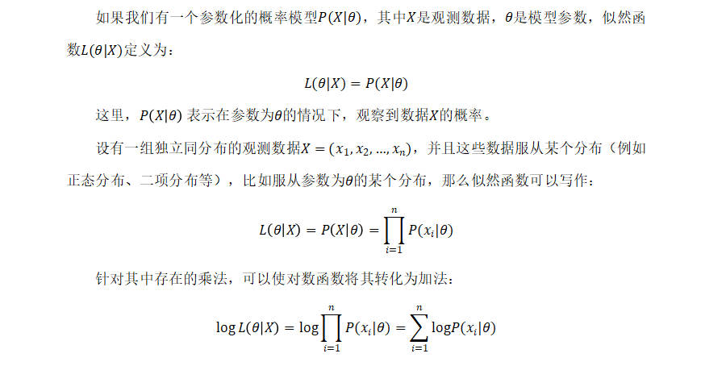
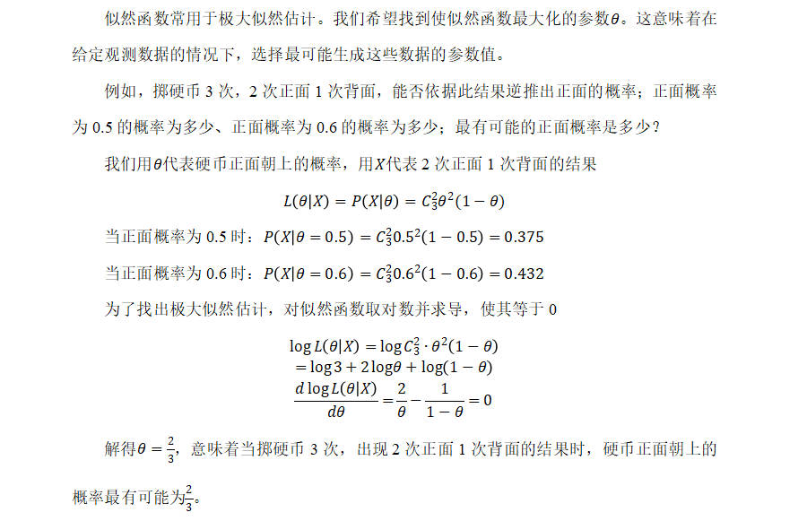

# 似然函数

## 似然函数的概念

- 概率用于在已知一些参数的情况下，预测接下来在观测上所得到的结果。而似然性则是用于在已知某些观测所得到的结果时，对有关事物之性质的参数进行估值。
- 似然函数是对参数的函数，其定义为在给定参数值的条件下，观察到某个特定数据的概率。似然函数是一个关于参数的函数，而不是关于数据的函数。

## 极大似然估计

- 似然函数常用于极大似然估计。我们希望找到使似然函数最大化的参数θ。这意味着在给定观测数据的情况下，选择最可能生成这些数据的参数值。

