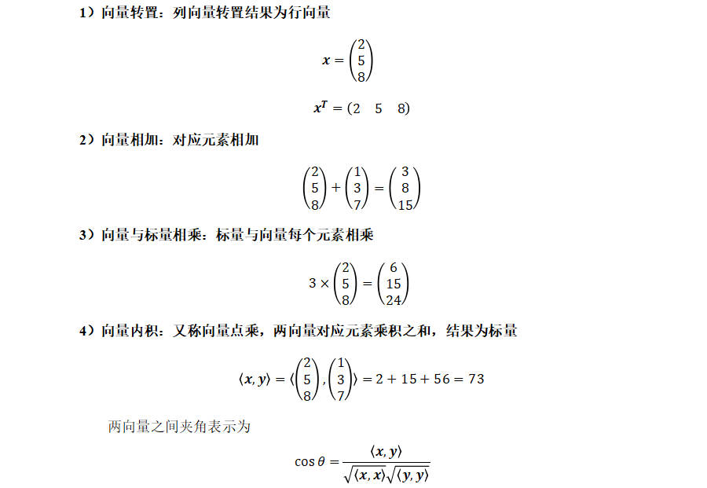
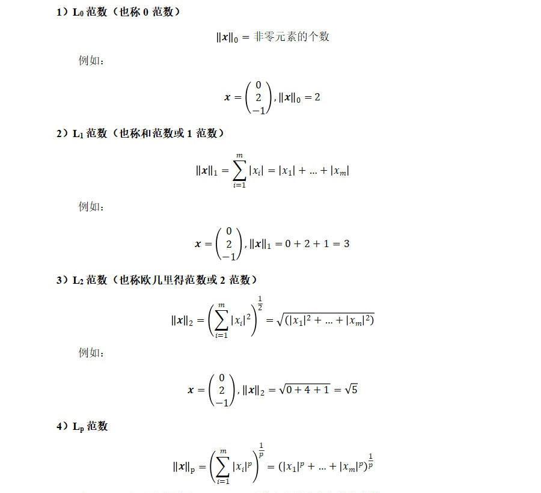

# 向量

```python
import numpy as np

# 定义向量
x = np.array([2, 5, 8])
print(x)
print(x.shape)
'''
[2 5 8]
(3,)
'''

# 向量转置
print(x.T)
print(x.T.shape)
'''
[2 5 8]
(3,)
'''

# 相加
y = np.array([1, 3, 7])
print(x + y)
'''
[ 3  8 15]
'''

# 向量与标量相乘
print(x * 3)
'''
[ 6 15 24]
'''

# 向量与向量相乘（对应位置元素相乘）
print(x * y)
'''
[ 2 15 56]
'''

# 向量点乘
np.dot(x, y)
print(x.dot(y))
'''
73
'''

print(x @ y)
'''
73
'''

# 计算范数
l0_norm = np.linalg.norm(x, ord=0)
print(l0_norm)
'''
3.0
'''

l2_norm = np.linalg.norm(x, ord=2)
print(l2_norm)
'''
9.643650760992955
'''

```


## 向量的概念

- 标量（Scalar）
  - 标量是一个单独的数，只有大小。
- 向量（Vector）
  - 向量由标量组成，有大小有方向。

## 向量运算



## 向量范数

- 范数（Norm）是具有长度概念的函数。
- 满足条件：非负性、齐次性、三角不等式

