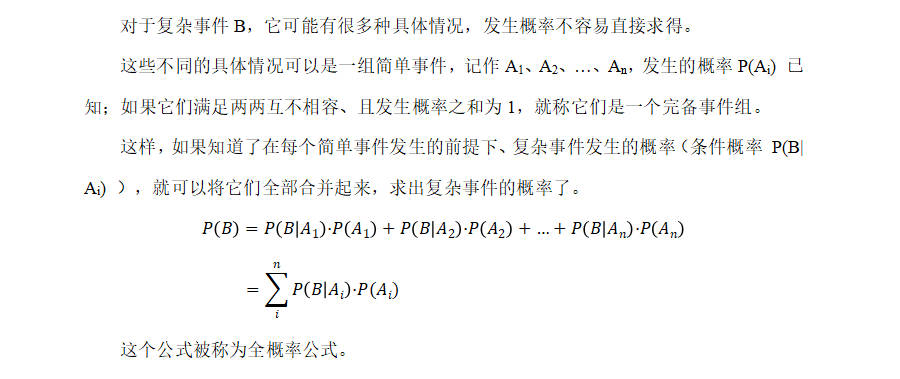
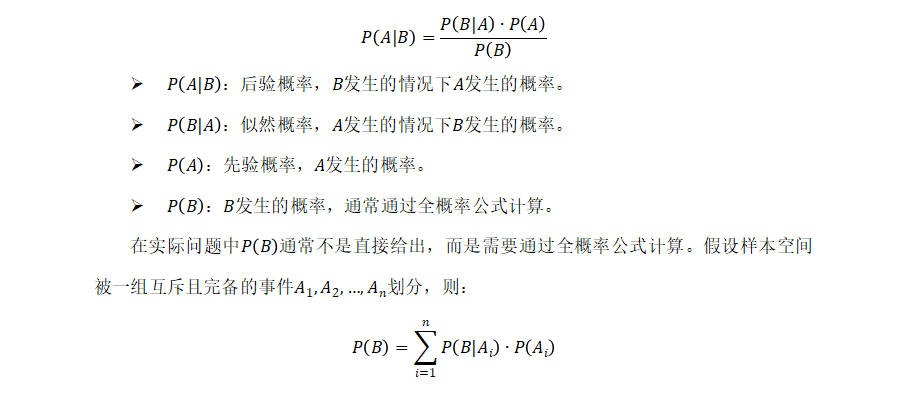
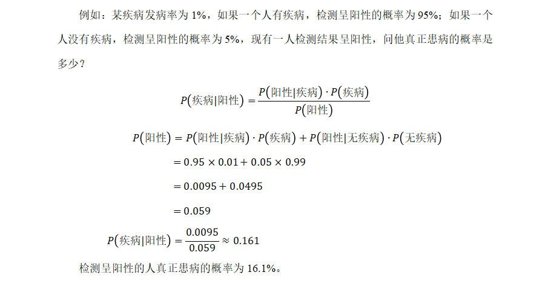

# 贝叶斯定理

- 贝叶斯定理（Bayes' Theorem）是概率论中的一个核心定理，用于描述在已有条件概率信息的基础上，如何更新或计算事件的概率。它以英国数学家托马斯·贝叶斯的名字命名。贝叶斯定理适合处理逆向概率问题，即从结果反推原因的概率。

## 全概率公式

## 贝叶斯公式

- 贝叶斯定理建立在条件概率的基础上，假设有两事件A、B，贝叶斯定理描述了在已知B发生的情况下，A发生的概率。

