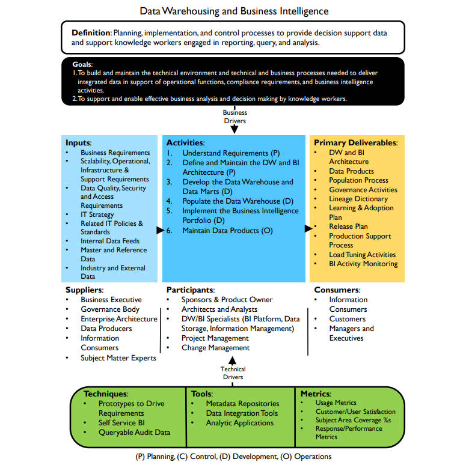

# **数据仓库和商业智能框架**

## 定义

- 规划、实施和控制流程，以提供决策支持数据，并支持知识工作者进行报告、查询和分析（Planning, implementation, and control processes to provide decision support data and support knowledge workers engaged in reporting, query, and analysis.）

## 目标

1. 构建和维护提供集成数据所需的技术环境以及技术和业务流程，以支持运营功能、合规性要求和商业智能活动（To build and maintain the technical environment and technical and business processes needed to deliver integrated data in support of operational functions, compliance requirements, and business intelligence activities.）

2. 支持知识工作者进行有效的业务分析和决策（To support and enable effective business analysis and decision making by knowledge workers.）

## 输入

- 业务需求（Business Requirements）
- 可扩展性、运营、基础设施和支持要求（Scalability, Operational, Infrastructure & Support Requirements）
- 数据质量、安全和访问要求（Data Quality, Security and Access Requirements）
- IT战略（IT Strategy）
- 相关IT政策和标准（Related IT Policies & Standards）
- 内部数据（Internal Data Feeds）
- 主数据和参考数据（Master and Reference Data）
- 行业及外部数据（Industry and External Data）

## 提供者

- 企业主管（Business Executive）
- 治理机构（Governance Body）
- 企业架构（Enterprise Architecture）
- 数据生产者（Data Producers）
- 信息消费者（Information Consumers）
- 主题专家（Subject Matter Experts）

## 活动

## 参与者

## 交付

## 消费者

## 技术

## 工具

## 指标