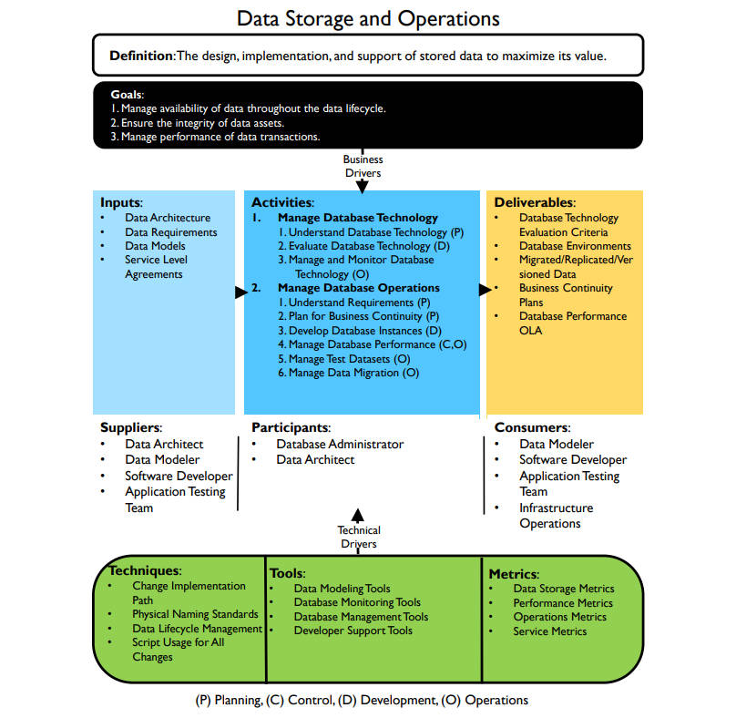

# 数据存储和操作框架

## 定义

- 存储数据的设计、实施和支持以最大化其价值（The design, implementation, and support of stored data to maximize its value.）

## 目标

1. 在整个数据生命周期中管理数据的可用性（Manage availability of data throughout the data lifecycle.）
2. 确保数据资产的完整性（Ensure the integrity of data assets.）
3. 管理数据事务的性能（Manage performance of data transactions.）

## 输入

- 数据架构（Data Architecture）
- 数据需求（Data Requirements）
- 数据模型（Data Models）
- 服务级别协议（Service Level Agreements）

## 提供者

- 数据架构师（Data Architect）
- 数据建模师（Data Modeler）
- 软件开发人员（Software Developer）
- 应用测试团队（Application Testing Team）

## 活动

1. 管理数据技术（Manage Database Technology）
   1. 【规划】了解数据库技术（Understand Database Technology）
   2. 【开发】评估数据库技术（Evaluate Database Technology）
   3. 【运营】管理和监控数据库技术（Manage and Monitor Database Technology）
2. 管理数据库操作（Manage Database Operations）
   1. 【规划】了解学区（Understand Requirements）
   2. 【规划】规划业务连续性（Plan for Business Continuity）
   3. 【开发】开发数据库实例（Develop Database Instances）
   4. 【控制，运营】管理数据库性能（Manage Database Performance）
   5. 【运营】管理测试数据集（Manage Test Datasets）
   6. 【运营】管理数据迁移（Manage Data Migration）

## 参与者

- 数据库管理员（Database Administrator）
- 数据架构师（Data Architect）

## 交付

- 数据库技术评价标准（Database Technology Evaluation Criteria）
- 数据库环境（Database Environments）
- 迁移/复制/版本化数据（Migrated/Replicated/Versioned Data）
- 业务连续性计划（Business Continuity Plans）
- 数据库性能在线分析（Database Performance OLA）

## 消费者

- 数据建模师（Data Modeler）
- 软件开发人员（Software Developer）
- 应用测试团队（Application Testing Team）
- 基础设施运营人员（Infrastructure Operations）

## 技术

- 变更实施路径（Change Implementation Path）
- 物理命名标准（Physical Naming Standards）
- 数据生命周期管理（Data Lifecycle Management）
- 所有变更的脚本化（Script Usage for All Changes）

## 工具

- 数据建模工具（Data Modeling Tools）
- 数据库监控工具（Database Monitoring Tools）
- 数据库管理工具（Database Management Tools）
- 开发者支持工具（Developer Support Tools）

## 指标

- 数据存储指标（Data Storage Metrics）
- 性能指标（Performance Metrics）
- 运营指标（Operations Metrics）
- 服务指标（Service Metrics）