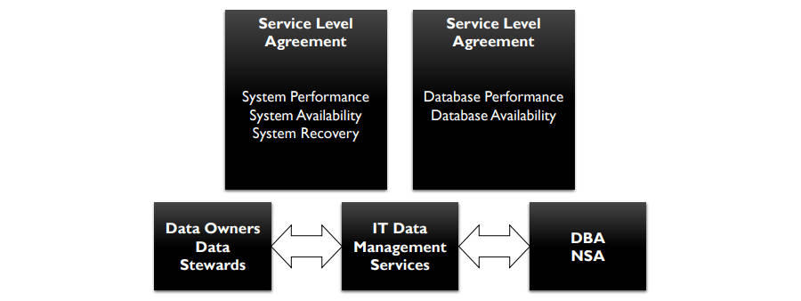

# **数据存储和操作活动**

## 管理数据库技术（Manage Database Technology）

- 数据库技术应遵循与管理任何技术相关的原则和标准，技术管理的主要参考模型是信息技术设施库（ITIL，Information Technology Infrastructure Library），一种技术管理流程模型

### 了解数据库技术特点（Understand Database Technology Characteristics）

- 最重要的是了解技术如何工作以及其如何在特定业务环境中提供价值，数据库管理员和其他数据服务团队一起与业务用户和管理员合作以了解业务的数据和信息需求，数据库管理员和数据库架构师将其对可用工具的了解与业务需求相结合，以建议最佳的技术应用来满足组织需求
- 数据专业人员必须首先了解候选数据库技术的特征，然后才能确定推荐哪种解决方案，如不具备事务功能（如提交和回滚）的数据库技术不适合支持销售点流程（Point-of-Sale processes）的操作情况
- 单一类型的数据库架构或DBMS往往不可以满足所有需求，大多数组织都安装了多个数据库工具，以执行一系列功能，从性能调整到备份，再到滚利数据库本身

### 评估数据库技术（Evaluate Database Technology）

- 选择DBMS软件的考虑因素
  - 产品架构和复杂度
  - 体积（volume）和速度（velocity）限制，包括流速（streaming rate）
  - 应用类型（application profile），如事务处理、商业智能和个人画像（personal profiles）
  - 特殊功能，如时间计算支持（temporal calculation support）
  - 硬件平台和操作系统支持
  - 软件工具的可用性
  - 性能检测（performance benchmarks），包括实时统计（real-time statistics）
  - 可扩展性（scalability）
  - 软件、内存和存储要求
  - 弹性（resiliency），包括错误处理和报告
- 与技术本身无关，而与采购组织与工具供应商有关的因素
  - 组织对技术风险的偏好
  - 提供经过训练的技术专业人员
  - 拥有成本（cost of ownership），如许可、维护和计算资源（licensing, maintenance, and computing resources）
  - 供应商声誉（vendor reputation）
  - 供应商支持策略和发布时间表（release schedule）
  - 客户参考（customer references）
- 产品的费用，包括管理、许可和支持，不应超过产品对企业的价值，理想情况下该技术应尽可能用户友好、自我监控（self-monitoring）和自我管理（self-administering），如果不是则可能需要引入具有使用该工具经验的员工
- 最好从小型试验项目（small pilot project）或概念证明（POF，proof-of-concept）开始，以便在全面生产实施前了解真正的成本和收益

### 管理和监控数据库技术（Manage and Monitor Database Technology）

- 数据库管理员通常作为二级技术支持，与帮助台和技术供应商支持合作以了解、分析和解决用户问题，有效了解和使用任何技术的关键是培训，组织应确保为参与实施、支持和使用数据和数据库技术的每个人指定培训计划和预算，培训计划应包括适当级别的交叉培训（cross-training），以更好地支持应用程序开发，尤其是敏捷开发，数据库管理员应具备应用程序开发技能的相关知识，如数据建模、用例分析和应用程序数据访问
- 数据库管理员应负责确保数据库定期备份并执行恢复测试，如果数据需要与一个或多个数据库中的其他数据合并，则需与其他利益相关者合作，以确保能够正确有效地整合数据
- 当业务需要新技术时，数据库管理员与业务用户和应用开发人员合作，以确保最有效地使用该技术，探索该技术的新应用，并解决其使用过程中出现的任何问题，然后数据库管理员在预生产环境和生产环境中部署新技术产品，创建并记录流程和程序，以便以最少的工作和费用来管理产品

## 管理数据库（Manage Databases）

- 由数据库管理员和网络存储管理员提供的数据库支持是数据管理的核心，数据库位于托管存储区域（managed storage areas），托管存储可以小到个人计算机上的磁盘驱动器（由操作系统管理），也可以道道存储区域网络或SAN上的RAID阵列，备份介质也属于托管存储
- 数据库管理员通过分配存储结构、维护物理数据库（包括物理数据模型和数据的物理布局，如对特定文件或磁盘区域的分配）以及在服务器上建立DBMS环境来管理各种数据存储应用程序

### 了解需求（Understand Requirements）

#### 确定存储需求（Define Storage Requirements）

- 数据库管理员负责建立用于DBMS应用程序的存储系统和用于支持NoSQL的文件存储系统，网络存储管理员和数据库管理员在建立文件存储系统方面共同发挥着至关重要的作用，数据在正常业务操作期间进入存储介质，并根据需要可以永久或暂时保留（stay permanently or temporarily），重要的是在时间需要该控空间前做好天津额外空间的规划，在紧急情况（emergency）下进行任何形式的维护都是有风险的
- 所有项目都应有运营第一年的初始容量估计（initial capacity estimate），以及接下来几年的增长量估计（growth projection），对容量和增长量的估计包括数据本身的空间以及索引、日志和任何冗余映像（如镜像）的空间
- 数据存储需求必须考虑与数据保留相关的法规，出于法律原因，组织需要在设定的期限内保留一些数据，某些情况下还需要在规定的时间段后清除数据，最好在设计时与数据所有者讨论数据保留需求，并就如何在其生命周期内处理数据达成一致
- 数据库管理员与应用程序开发人与和其他操作人员（包括服务器和存储管理员）合作以实施批准的数据保留计划

#### 识别使用模式（Identify Usage Patterns）

- 基本的数据库使用模式
  - 基于事务
  - 基于大数据集的写入或检索
  - 基于时间（月末压力大、周末压力小等）
  - 基于位置（人口越多的地区事务越多）
  - 基于优先级（某些部门或批次ID有更高的优先级）
- 一些系统具有基本模式的组合，数据库管理员需要能够预测使用模式的起伏（ebbs and flows），并有适当的流程来处理高峰（peaks）（如查询管理或优先级管理）以及利用低谷（valley）（如将需要大量资源的作业延迟到低谷）

#### 确定访问需求（Define Access Requirements）

- 数据访问包括与存储、检索或操作数据库或其他存储库中的数据相关的活动，数据访问是访问不同数据文件的授权
- 存在多种用于从数据库或其他存储库访问数据的标准语言、方法和格式
  - 用于ACID类型系统：SQL、ODBC、JDBC、XQJ、ADO.NET、XML、X Query、X Path和Web Services
  - 用于BASE类型系统：C、C++、REST、XML和Java
  - 一些标准支持将数据从非结构化（如HTML或自由文本文件）转换为结构化（如XML或SQL）

### 规划业务连续性（Plan for Business Continuity）

- 组织需要为应对影响其系统和数据使用能力的灾难和不利事件（disaster or adverse event）规划业务连续性，数据库管理员必须确保所有数据库和数据库服务器都有恢复计划，所有备份应保存在安全的异地位置
- 可能导致数据丢失或损坏的情况
  - 物理服务器丢失
  - 一个或多个磁盘存储设备丢失
  - 数据库丢失，包括DBMS主数据库、临时存储数据库、事务日志等
  - 数据库索引或数据页损坏
  - 数据库或日志文件系统丢失
  - 数据库或事务日志备份文件丢失
- 应对每个数据库进行关键性评估，以便确定优先级
  - 对业务运营至关重要的数据库需要立即恢复
  - 在主要系统（primary systems）启动并运行之前，不对不重要的数据库进行恢复
  - 一些数据库可能不需要恢复，如加载时刷新的副本
- 管理层和组织的业务连续性小组（如果有）应审查并批准数据恢复计划，数据库管理员小组应定期审查计划的准确性和全面性，为了应对灾难，在安全的异地位置（off-site location）保存一份计划副本以及安装和配置DBMS所需的所有软件、说明和安全码（如管理员密码）

#### 进行备份（Make Backups）

- 备份数据库并适时备份数据库事务日志，系统的服务水平协议（SLA，Service Level Agreement）应指定备份频率，除增量备份（incremental backup），定期对每个数据库进行完整备份（complete backup）
- 平衡数据的重要性与保护数据的成本，对于大型数据库，频繁的备份会消耗大量的磁盘存储和服务器资源
- 数据库应保存在托管存储区域（managed storage area），最好是存储区域网络或SAN上的RAID阵列，每日备份到单独的存储介质
- 对于OLTP数据库，事务日志备份的频率取决于更新频率和涉及的数据量，对于频繁更新的数据库，更频繁的日志转储（log dumps）不仅可用提供更好的保护，还可以减少备份对服务器资源和应用程序的影响
- 备份文件应保存在与数据库不同的文件系统上，并且备份到服务水平协议中指定的某个单独的存储介质中，每日备份的副本应存储在安全的异地设施（secure off-site facility）中
- 大多数DBMS支持数据库的热备份（hot backup），即在应用程序运行时进行备份，当更新发生在传输过程中时，其将提取滚动至完成，或在备份重新加载时回滚，另一种方法是在数据库离线时进行冷备份（cold backup）

#### 恢复数据（Recover Data）

- 大多数备份软件都包含从备份中读取到系统的选项，数据库管理员与基础设施团队合作，重新安装备份的介质并进行恢复
- 文件系统数据库中的数据可能比关系数据库管理系统中的数据更容易恢复，关系数据库管理系统可能有需要在数据恢复期间更新的目录信息（catalog information），特别是如果恢复是从日志而不是从完整备份（full backup）进行的时
- 定期测试数据恢复至关重要，这样能减少灾难或紧急情况（disaster or emergency）下的意外情况，可以在具有相同基础架构和配置的非生产系统副本上执行测试，如果系统具有故障转移，则可在次要系统上进行

### 开发数据库实例（Develop Database Instances）

- 数据库管理员负责创建数据库实例
  - 安装和更新DBMS软件
    - 数据库管理员安装DBMS软件的新版本，并在供应商指定的所有环境（从开发到生产）中应用DBMS供应商提供的维护补丁（），补丁应经过数据库管理员专家、安全专家和管理人员检查（vet）和确定优先级（prioritize），这是一项防止弱点（vulnerabilit）受到攻击并确保集中式和非集中式安装中持续数据完整性（ongoing data integrity）的关键活动
  - 维护多种环境安装，包括不同的DBMS版本
    - 数据库管理员可用在沙箱、开发、测试、用户验收测试、系统验收测试、质量保证、预生产、热修复、灾难恢复、生产环境（sandbox, development, testing, user acceptance testing, system acceptance testing, quality assurance, pre-production, hot-fix, disaster recovery, production environments）中安装和维护DBMS软件的多个实例，并通过与应用程序和系统版本控制和变更相关的环境管理来管理DBMS软件版本的迁移（migration）
  - 安装和管理相关数据技术
    - 数据库管理员可能会参与安装数据集成软件和第三方数据管理工具

#### 管理物理存储环境（ Manage the Physical Storage Environment）

- 存储环境管理需要遵循传统的软件配置管理（SCM，Software Configuration Management）流程或信息技术基础设施库（ITIL，Information Technology Infrastructure Library）方法来记录对数据库配置、结构、约束、权限、阈值（configuration, structures, constraints, permissions, thresholds）等的修改
- 作为标准配置管理流程的一部分，数据库管理员需要更新物理数据模型以反映对存储对象的更改，通过敏捷开发和极限编程方法（extreme programming methods），物理数据模型的更新在防止设计或开发错误方面发挥着重要作用
- 数据库管理员需要应用SCM流程来跟踪更改并验证开发、测试和生产环境中的数据库是否具有每个版本中包含的所有增强功能（enhancements），即使是外观上的（cosmetic）或仅在虚拟化数据层中
- 确保SCM过程完整所需的流程
  - 配置识别（Configuration identification）
    - 数据库管理员与数据专员、数据架构师和数据建模师合作，确定定义最终用户配置的各个方面的属性，这些属性被记录在配置文档中并作为基线，一旦属性被作为基线，就需要正式的配置变更控制流程来变更属性
  - 配置变更控制（Configuration change control）
    - 更改配置项并重新设定基线所需的一组流程和批准阶段（approval stages）
  - 配置状态记账（Configuration status accounting）
    - 指在任何时间点记录和报告与每个配置项关联的配置基线的能力
  - 配置审计（Configuration audits）
    - 发生在交付时和进行更改时，物理配置审计确保配置项按照其详细设计文档的要求安装，功能配置审计确保配置项的性能属性得到实现
- 为了在整个数据生命周期中保持数据完整性和可追溯性，数据库管理员将物理数据库属性的更改传达给建模人员、开发人员和元数据管理人员
- 为了确定数据复制需求、数据迁移量和数据恢复检查点，数据库管理员需要维护数据量、容量预测和查询性能的指标，以及物理对象的统计数据，更大的数据库也会有对象分区，必须随着时间的推移对齐进行监控和维护，以确保对象保持所需的数据分布

#### 管理数据库访问控制（Manage Database Access Controls）

- 数据库管理员需要监督的功能
  - 受控环境（Controlled environment）
    - 数据库管理员与网络存储管理员合作管理数据资产的受控环境，包括网络角色和权限管理、24*7监控和网络监控监控、防火墙管理、补丁管理和微软基线安全分析器（MBSA，Microsoft Baseline Security Analyzer）集成
  - 物理安全（Physical security）
    - 数据资产的物理安全通过基于简单网络管理协议（SNMP，Simple Network Management Protocol）的监控、数据审计日志、灾难管理和数据库备份计划进行管理，数据库管理员配置和监控这些协议，监控对于安全协议尤其重要
  - 监控（Monitorin）
    - 通过对关键服务器硬件和软件的持续监控来保持数据库系统可用
  - 控制（Controls）
    - 数据库管理员通过访问控制、数据库审计、入侵检测（intrusion detection）和漏洞评估工具（vulnerability assessment tools）维护信息安全

#### 创建存储容器（Create Storage Containers）

- 所有数据都必须存储在物理驱动器上并进行组织以便于进行加载、查询和检索，存储容器本身可能包含存储对象，并且每个级别都必须与对象级别相适应，如关系数据库具有包含表的模式，而非关系数据库具有包含文件的文件系统

#### 实施物理数据模型（Implement Physical Data Models）

- 数据库管理员负责创建基于物理数据模型的完整物理数据存储环境，物理数据模型包括存储对象、索引对象，以及执行数据质量规则、链接数据库对象和实现数据库性能所需的任何封装代码对象（encapsulated code objects）
- 根据组织的不同，可能由数据建模人员提供数据模型，数据库管理员在存储中实施数据模型的物理布局，在其他组织中，数据库管理员可能采用物理模型的骨架（skeleton）并添加所有特定于数据库的实现细节，包括索引、约束、分区或集群、容量估计和存储分配细节
- 对于作为应用程序的一部分提供的第三方数据库结构，大多数数据建模工具都允许对商业现成品（COTS，）或企业资源规划（ERP，）系统数据库进行逆向工厂，只要建模工具可用读取存储工具目录，这些可用于开发物理模型，数据库管理员或数据建模师仍需要审查并更新基于应用程序的约束或关系的物理模型，并非所有约束和关系都被安装在数据库目录，特别是需要数据库抽象的旧应用程序
- 维护良好的物理模型对提供数据即服务（Data-as-a-Service）是必要的

#### 加载数据（Load Data）

- 数据库管理员负责加载数据到刚创建的空数据库
- 大多数组织还从外部第三方来源获取一些数据，一些收购需要法律协议，数据库管理员在加载数据前需要了解这些限制
- 除了安装或其他一次性情况外，尽量避免人工执行加载，确保数据加载是自动的和有计划的
- 一种数据获取（data acquisition）的管理方法是由数据分析师负责数据订阅服务（data subscription services），数据分析师在逻辑数据模型和数据字典中记录外部数据源，再由开发人员设计和创建脚本或程序读取数据并将其加载到数据库中，数据库管理员负责实施必要的流程来将数据加载到数据库或使其可供应用程序使用

#### 管理数据复制（Manage Data Replication）

- 数据复制相关的决策
  - 主动或被动复制（active or passive replication）
  - 来自分布式数据系统的分布式并发控制（distributed concurrency control）
  - 在变更数据控制流程下通过时间戳或版本号识别数据更新的适当方法
- 对于小型系统或数据对象，完整的刷新可能满足并发要求，对于大部分数据不会更改的较大对象，将更改合并到数据对象中比为每次更改完全复制所有数据更有效，对大部分数据发生更改的大型对象，进行刷新可能比承担如此多的更新开销更少

### 管理数据库性能（Manage Database Performance）

- 数据库性能取决于两个相互依赖的方法（interdependent facets）：可用性和速度，性能包括确保空间的可用性、查询优化以及使数据库能够以高效方式返回数据的其他因素，没有可用性就无法衡量性能
- 数据库管理员和网络存储管理员负责管理数据库性能
- 管理数据库性能的渠道
  - 设置和调整操作系统与应用程序参数
  - 管理数据库连接，数据库管理员和网络存储管理员根据基于组织的标注和协议制定的策略，为需要数据库连接的IT和业务用户提供技术指导和支持
  - 与系统程序员和网络管理员合作以调整操作系统、网络和事务处理中间件（transaction processing middleware）
  - 提供合适的存储并使数据库能够与存储设备和存储管理软件一起使用，存储管理软件通过将数据迁移到更便宜的存储设备，来优化不同存储技术的使用以经济高效地存储较旧的、不常引用的数据，从而提高核心数据的检索速度，数据库管理员与存储管理员一起设置和监控存储管理流程
  - 提供容量增长研究（volumetric growth studies）以支持存储获取以及保留、调整、归档、备份、清除和灾难恢复等一般数据生命周期管理活动
  - 与系统管理员合作，提供已部署数据资产的操作工作负载和基准（operating workloads and benchmarks），以支持SLA管理、计费计算（charge-back calculations）、服务器容量和规划范围内的生命周期轮换（lifecycle rotation ）

#### 设置数据库性能服务水平（Set Database Performance Service Levels）

- 系统性能、数据可用性和恢复期望、团队响应问题的期望通常通过IT数据管理服务组织和数据所有者之间的服务水平协议（SLA，Service Level Agreements）进行管理

- 通常SLA将确定预计数据库可供使用的时间范围，SLA会为一些应用程序事务（复杂查询和更新的混合）确定指定的最大允许执行时间，如果数据库无法按约定提供，或如果流程执行时间违反了SLA，数据所有者将要求数据库管理员确定原因并修复问题

#### 管理数据库可用性（Manage Database Availability)

- 可用性是系统或数据库可用于生产线工作的时间百分比，随着组织对数据使用的增多，会增加可用性要求，以及不可用数据的风险和成本，为了满足更高的要求，维护窗口将缩小（shrink）
- 影响可用性的因素
  - 可管理性（Manageability）
    - 创建和维护环境的能力
  - 可恢复性（Recoverability）
    - 中断后重新建立服务，以及纠正由意外（unforeseen）事件或组件故障引起的错误的能力
  - 可靠性（Reliability）
    - 在规定时间按指定水平提供服务的能力
  - 服务性（Serviceability）
    - 识别问题存在、诊断（diagnose）其原因并修复/解决问题的能力
- 可能妨碍可用性的因素
  - 计划停机（Planned outages）
    - 维护
    - 升级
  - 非计划停机（Unplanned outages）
    - 服务器硬件丢失
    - 磁盘硬件故障
    - 操作系统故障
    - DBMS软件故障
    - 数据中心站点（data center site）丢失
    - 网络故障
  - 应用问题（Application problems）
    - 安全和授权问题
    - 严重（severe）性能问题
    - 恢复失败
  - 数据问题（Data problems）
    - 数据损坏（由于bug、设计问题或用户错误）
    - 数据库对象丢失
    - 数据丢失
    - 数据复制失败
  - 人为错误（Human error）
- 确保数据可用性的工具和方法
  - 运行数据库备份工具
  - 运行数据库重组工具（database reorganization utilities）
  - 运行统计数据收集工具（statistics gathering utilities）
  - 运行完整性检查工具
  - 对工具执行进行自动化
  - 利用表空间聚类和分区（clustering and partitioning0
  - 跨镜像数据库复制数据以确保高可用性

#### 管理数据库执行（Manage Database Execution）

- 数据库管理员负责建立和监控数据库执行、数据更改日志的使用以及重复环境的同步，日志的大小和位置需要空间，某些情况下可用视为基于文件的数据库来处理，数据库管理员还必须管理使用日志的其他应用程序，以确保在所需的日志级别使用正确的日志，记录的详细信息越多，所需的空间和处理就越多，可能对性能产生不利影响（adversely affect）

#### 维护数据库性能服务水平（Maintain Database Performance Service Levels）

- 数据库管理员通过监控性能和快速有效地响应问题，主动和被动地（proactively and reactively）优化数据库性能，大多数DBMS都提供监控性能的能力，允许数据库管理员生产分析报告，大多数服务器操作系统都具有类似的监控和报告功能，数据库管理员应定期对DBMS和服务器进行活动和性能报告，包括在高负载时间，并且应将报告与之前的报告进行比较，以确定任何负面趋势并将其保存以帮助分析随着时间的推移出现的问题
- 事务性能与批处理性能（Transaction Performance vs. Batch Performance）
  - 数据移动可能同在线事务实时发生，然而许多数据移动和转换活动是通过批处理程序进行的，这些批处理作业必须在操作计划的指定窗口内完成，数据库管理员和数据集成专家监控批处理数据作业的性能、记录异常的完成时间和错误、确定错误的根本原因并解决这些问题
- 问题修复（ Issue Remediation）
  - 出现性能问题时，数据库管理员、网络存储管理员和服务器管理团队应使用DBMS的监控和管理工具来确定问题的来源
  - 数据库性能不佳的常见原因
    - 内存的分配和争用（Memory allocation or contention）
      - 为数据分配缓冲区（buffer）或缓存（cache）
    - 锁和阻塞（Locking and blocking）
      - 某些情况下，在数据库中允许的进程会所i的那个数据库资源（如表或数据页），并阻塞需要这些资源的另一个进程，数据库管理员可用终止阻塞进程
      - 某些情况下，两个进程可能会死锁，每个进程都锁定了另一个进程所需的资源，大多数DBMS会在一段时间后自动终止其中一个进程，这些类型的问题通常是数据库或应用程序中编码不当的结果
    - 不准确的数据库统计（Inaccurate database statistics）
      - 大多数RDBMS都有一个内置的查询优化器，其依赖于存储的有关数据和索引的统计信息来决定如何最有效地执行给定的查询，这些统计信息应该经常更新，尤其是在活跃的数据库中，否则会导致查询性能不佳
    - 编码不当（Poor coding）
      - 数据库性能不佳的最常见原因是SQL编码不当，查询编码人员需要基本了解SQL查询优化器的工作原理，并以最大限度利用优化器功能的方式编写SQL代码，一些系统允许将复杂的SQL封装在存储过程中，这些存储过程可用被预编码和预优化，而不是嵌入到应用程序代码或脚本文件中
    - 低效的复杂表连接（Inefficient complex table joins）
      - 使用视图预定义复杂表连接，并且避免在数据库函数中使用复杂的SQL（如表连接），与存储过程不同，这些对查询优化器是不透明的
    - 索引不足（Insufficient indexing）
      - 创建复杂查询和涉及大型表的查询所必需的索引，在频繁更新的表上创建太多索引可能减慢更新处理速度
    - 应用程序活动（Application activity）
      - 理想情况下，应用程序应在与DBMS分开的服务器上运行以避免争夺资源。配置和调整数据库服务器以获得最佳性能。
      - 新的DBMS允许将应用程序对象（如Java和.NET类）封装在数据库对象中并在DBMS中执行，此功能在某些情况下非常有用，但在数据库服务器上执行应用程序代码可能会影响数据库进程的互操作性、应用程序架构和性能
    - 服务器过载（Overloaded servers）
      - 